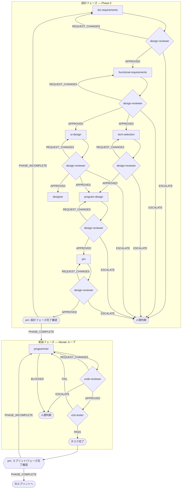

# Solar SaaS — 太陽光卸・二次店営業管理 SaaS

太陽光パネルの卸業者と、その営業活動を担う二次店事業者が共同で利用する **マルチテナント SaaS**。催事営業を主軸に、場所提供元との交渉 → イベント候補管理 → 二次店希望提出 → 開催体制決定 → 自社要員シフト → 顧客・アポ → マエカク → 商談・クロージング → 契約・契約明細スナップショット → 粗利・インセンティブ確定 → 月次クローズまでを一気通貫で扱う。

開発自体も Claude Code subagent のハーネスで自動化している。

詳細な業務要件は `docs/01-business-requirements.md`、機能要件は `docs/02-functional-requirements.md`、技術選定は `docs/03-tech-selection.md` を参照。

## Mental model

このリポジトリには **Claude Code subagent（開発時のハーネス）のみ** が存在する。本プロジェクトは AI ランタイムエージェントを内蔵しない通常の業務管理 Web アプリで、`packages/agents/` のようなランタイムエージェント層は持たない。

「プログラマーエージェントを呼んで」と言われたら `Agent(subagent_type=programmer, ...)` の Claude Code subagent を意味する。

## Harness agents — roles

10 個のハーネスエージェントは「設計フェーズ」と「実装フェーズ」に二分される。

### 設計フェーズ (Phase 0)

| # | エージェント | 役割 | 入力 | 出力 |
|---|---|---|---|---|
| 1 | `biz-requirements` | 業務要件定義 — 誰が何のために何を得るか | `product-proposal.md`, `CLAUDE.md` | `docs/01-business-requirements.md` |
| 2 | `functional-requirements` | 機能要件定義 — 各機能の入出力・受入基準・非機能要件 | `docs/01` | `docs/02-functional-requirements.md` |
| 3 | `tech-selection` | 技術選定 — CLAUDE.md の確定スタックを肉付け＋未決領域を選定 | `docs/01`, `docs/02` | `docs/03-tech-selection.md` |
| 4 | `ui-design` | 画面設計 — 画面一覧・遷移・各画面のセクション/コンポーネント | `docs/01`, `docs/02` | `docs/04-ui-design.md` |
| 5 | `designer` | ワイヤーフレーム作成 (ASCII/mermaid) | `docs/04` | `docs/wireframes/{S-xxx}-*.md` |
| 6 | `program-design` | プログラム設計 — DB/API/ジョブ/エージェント仕様/シーケンス | `docs/01..04` | `docs/05-program-design.md` |
| 7 | `pm` | 開発計画とスプリント分解 (タスク粒度まで) | `docs/01..05` | `docs/dev-plan.md`, `docs/sprints/SP-NN-*.md` |
| 7r | `design-reviewer` | 設計ドキュメントレビュー (read-only) — 上流要件との整合性・文書構造・網羅性・セキュリティ要件を機械的に検証 | レビュー対象ドキュメント + 上流ドキュメント + `product-proposal.md` | `## APPROVED`/`## REQUEST_CHANGES`/`## ESCALATE` |

### 実装フェーズ (Phase 1+)

| # | エージェント | 役割 | 入力 | 出力 |
|---|---|---|---|---|
| 8 | `programmer` | コード実装 (1 タスク = 1 起動) | タスク ID または指示 + `docs/05` | コード変更 + `## DONE`/`## BLOCKED` |
| 9 | `code-reviewer` | コードレビュー (要件・設計・型・テスト・セキュリティ) | programmer の変更 + `docs/05` | `## APPROVED`/`## REQUEST_CHANGES`/`## ESCALATE` |
| 10 | `e2e-tester` | Playwright で E2E テスト作成・実行 | タスクが触る機能 + `docs/02`/`docs/05` | `## DONE` (= PASS) / `## BLOCKED` (= FAIL) |

## Harness execution flow



設計フェーズは **上流から順に各ドキュメントを 1 つずつ生成し、生成のたびに `/design-iterate` で design-reviewer による反復レビュー → 元エージェントによる修正を APPROVED まで回してから次段へ進む**。後段エージェントは必ず前段ドキュメント（APPROVED 済み版）を読む契約。
実装フェーズは **タスクごとに `/iterate` を起動** し、内部で programmer → code-reviewer → e2e-tester の三段ループを APPROVED+PASS まで回す。

### フェーズ/スプリント完了確認

各フェーズ（設計フェーズ全体、各実装スプリント、Phase 1〜4 の各マイルストーン）の完了時、**`pm` エージェントを「完了確認モード」で起動**し、以下を機械的に検証する：

- 当該フェーズに紐づく全タスク (`docs/sprints/SP-NN-*.md` の `T-NN-MM`) が完了状態か
- 各タスクの受け入れ基準を満たす成果物（コード/ドキュメント/テスト）が存在するか
- 申し送り事項（前フェーズドキュメント末尾の「後続エージェントへの申し送り」）が後段で全て参照・対応されているか
- 次フェーズの前提条件（依存ドキュメント、DB マイグレーション、env 変数等）が揃っているか

PM は最後に `## PHASE_COMPLETE` または `## PHASE_INCOMPLETE: <未消化リスト>` を出力する。INCOMPLETE の場合、不足項目を担当エージェント（programmer / 該当設計エージェント）へ差し戻し、解消後に再確認する。

### `/design-iterate` の合否判定プロトコル（設計フェーズ）

設計フェーズの各ドキュメント（`docs/01..05`, `docs/dev-plan.md`, `docs/sprints/SP-*.md`）が生成された直後に `/design-iterate "<ドキュメントパス or 対象エージェント名>"` で起動。`design-reviewer` の 1 回呼び出しを 1 iteration とカウント、**最大 5 iterations**。

1. `design-reviewer` 実行（read-only）
   - 入力: 対象ドキュメント + 上流ドキュメント + `product-proposal.md` + `CLAUDE.md` + 対象エージェント定義 (`.claude/agents/<target>.md`)
   - チェック観点: 文書構造・網羅性 / 上流要件との整合性（特に `docs/01` 9 章のビジネスルール）/ 現実性・妥当性 / セキュリティ・コンプライアンス
   - 出力: `## APPROVED` / `## REQUEST_CHANGES`（Required Changes 列挙）/ `## ESCALATE: <理由>`
2. `## REQUEST_CHANGES` の場合
   - 元エージェント（`biz-requirements` / `functional-requirements` / `tech-selection` / `ui-design` / `program-design` / `pm`）を再起動し、Required Changes を **verbatim** で渡して改訂版を上書き保存させる
   - 元エージェントは「全指摘への対応サマリ（チェックリスト形式）」を返す
   - step 1 に戻る
3. `## APPROVED` → そのドキュメントは確定。次段の設計エージェントへ進む
4. `## ESCALATE: <理由>` → 上流ドキュメントの矛盾や CLAUDE.md 自体の問題なので、ループを停止し人間判断に委ねる

5 iteration 経過しても `## APPROVED` に到達しなければ、`## /design-iterate ESCALATED` を出力して人間判断に委ねる。

**運用ルール**:

- `design-reviewer` は read-only。ドキュメントの編集は元エージェントの責任
- レビュー時、product-proposal.md は **常に一次資料として必読**
- フィードバックは要約せず verbatim で次イテレーションに渡す
- 各 iteration の冒頭にステータスを出力: `Design Iteration N/5: design-reviewer (verdict: ...) → <target_agent> (revision: ...)`

### `/iterate` の合否判定プロトコル

`/iterate "<タスク ID または指示>"` で起動。programmer の 1 回呼び出しを 1 iteration とカウント、**最大 5 iterations**。

1. `programmer` 実行 → `## DONE` を待つ（`## BLOCKED` なら停止し人間に escalation）
2. `code-reviewer` 実行
   - `## APPROVED` → 次のステップへ
   - `## REQUEST_CHANGES` → フィードバックを次回 programmer に渡して step 1 へ戻る
   - `## ESCALATE` → 停止し人間に escalation
3. `e2e-tester` 実行
   - `## DONE` (= 全 PASS) → タスク完了
   - `## BLOCKED` (= FAIL or 環境問題) → 失敗詳細を次回 programmer に渡して step 1 へ戻る

5 iteration 経過しても完了しなければ、`## /iterate ESCALATED` を出力して人間判断に委ねる。

## Project layout

```
.claude/
  agents/              ← harness subagents (.md 定義)
  commands/            ← slash commands (/iterate, /design-iterate)
docs/                  ← 設計成果物 (01..05, wireframes/, dev-plan.md, sprints/)
apps/
  web/                 ← Next.js 15 (App Router) — UI + Server Actions + API routes
  worker/              ← graphile-worker 常駐プロセス — 月次集計・通知送信・再試行
packages/
  db/                  ← Prisma schema + Client + RLS extension + withTenant
  auth/                ← Auth.js v5 + argon2 + TOTP + パスワードリセット + 招待
  contracts/           ← Zod schemas / DTO / 純関数サービス（packages 横断共有）
  storage/             ← Cloudflare R2 (S3 互換) pre-signed URL クライアント
  email/               ← Resend クライアント + メールテンプレート (stub fallback)
  ui/                  ← shadcn/ui プリミティブ拡張（必要時のみ）
tests/
  e2e/                 ← Playwright specs（workers:1 + globalSetup 単一 seed 方針）
```

`pnpm` ワークスペース。各パッケージは `@solar/<name>` 命名。

## Tech stack (decided)

確定スタック詳細は `docs/03-tech-selection.md`。要約：

- **Framework:** Next.js 15 + App Router + Server Actions + TypeScript 5.6 strict
- **Hosting:** Railway (Web service + Worker service + Postgres)
- **DB:** PostgreSQL 16 via Prisma 6（`@solar/db`）
- **テナント分離:** Prisma Client extension（アプリ層）+ PostgreSQL RLS（DB 層）の **二重防御**。`relationship_id`（卸業者×二次店）を業務データの主要分離キー、`wholesaler_id` をマスタの分離キー
- **Job queue:** `graphile-worker`（PG-backed、Redis 不要）— 月次集計 / 通知再試行 / LINE 配信（Phase 2）
- **Auth:** **Auth.js v5** + Credentials Provider + argon2id + TOTP 2FA + バックアップコード + パスワードリセット + 招待トークン（卸業者は招待制、二次店はセルフサインアップ）。シングルユーザーではなく **マルチテナント SaaS**
- **Email:** Resend + React Email（テスト・dev は stub fallback）
- **Object storage:** Cloudflare R2 (S3 互換) — 契約書 PDF、施工写真、添付。15 分 pre-signed URL
- **UI:** Tailwind + shadcn/ui + react-hook-form + Zod + lucide-react + sonner
- **Observability:** Sentry + pino（AsyncLocalStorage で request_id 横断、PII redact）+ UptimeRobot（業務時間帯 8:00-22:00 JST 重点監視）
- **Testing:** Vitest（ユニット・統合）, Playwright（E2E、workers:1）

**本プロジェクトでは AI を使わない**（Anthropic SDK / OpenAI / Vercel AI SDK / docx / @react-pdf/renderer は導入しない）。

## Phased roadmap

詳細は `docs/dev-plan.md`。

- **Phase 0 (完了):** 設計フェーズ — `docs/01..05` + `docs/wireframes/` + `docs/dev-plan.md` + `docs/sprints/SP-01..07-*.md` 全 APPROVED
- **Phase 1 (MVP, 1〜2 か月):** F-001〜F-053 + F-055 + F-056 の **55 機能**（P0 52 + P1 3）を 7 スプリントで実装
  - SP-01 bootstrap（モノレポ / Auth + 2FA / RLS / Worker / 観測性 / シード）
  - SP-02 masters（マスタ管理 + SaaS 運営者）
  - SP-03 event-flow（場所提供元 → イベント候補 → 希望提出 → 開催体制 → シフト）
  - SP-04 execution（実施・報告・顧客・アポ・マエカク）
  - SP-05 deals-contracts（商談 → 契約 → 契約明細スナップショット → 粗利）
  - SP-06 incentives-monthly（インセンティブ確定 + キャンセル取消・負調整 + 月次クローズ）
  - SP-07 notifications-audit-e2e（通知・監査ログ・UC E2E）
- **Phase 2 (〜6 か月):** F-054 LINE 連携、F-057 CSV インポート、F-058 高度 BI、PWA 検討
- **Phase 3 (〜12 か月):** パイロット運用フィードバック反映、5〜10 卸業者展開
- **Phase 4 (12 か月以降):** 規模別プラン課金、施工業者向け画面、メーカー発注など

## Hard rules for any agent in this repo

1. **マルチテナント SaaS。** 複数の卸業者テナント + 二次店テナントが共存する。1 つの二次店が複数の卸業者と取引できる（多対多、`relationship_id` を分離キー）。**全 API クエリで `withTenant(ctx, ...)` を通し、RLS と Prisma extension の二重防御を破らない**。
2. **Japanese is the primary content language.** UI 文言・メール本文・通知テキストはすべて日本語、`apps/web/lib/i18n/labels.ts` に集約（コンポーネント内ハードコード禁止）。コード・コメントは英語可。
3. **Don't invent files outside the documented layout.** 新しいトップレベル概念が必要なら、まず `docs/05-program-design.md` への追記を提案してから実装する。
4. **契約明細スナップショット。** 契約成立時の `purchasePrice` / `dealerPrice` / `listPrice` を `ContractItem` の snapshot 列にコピー保持し、商品マスタ改定後も過去契約の粗利が変わらないようにする。
5. **仕入値は二次店に絶対表示しない。** API レスポンスから物理除外（DTO 層で destructure-and-rest、`Object.keys` に出さない）。
6. **個人情報マスキング。** 電話下 4 桁・住所市区町村まで・氏名は姓のみが MVP デフォルト。pino redact + Sentry beforeSend で監査ログ・エラー報告にも適用。`REVEAL_PII` は監査ログ記録。
7. **インセンティブ確定は契約成立時。** キャンセル期限（デフォルト 8 日、卸業者上書き可、特商法準拠）。期限内取消し / 期限後負調整。共同開催は案件ごと手動調整。
8. **Never commit secrets.** `.env.local` / `.env.production` は gitignored。`.env.example` のみコミット可。本番は Railway env vars。
9. **AI ランタイムは使わない。** Claude / OpenAI / 画像生成 API は導入しない。`token_usage` テーブルも不要。LLM 呼び出しを伴うコードは原則受け入れない。
