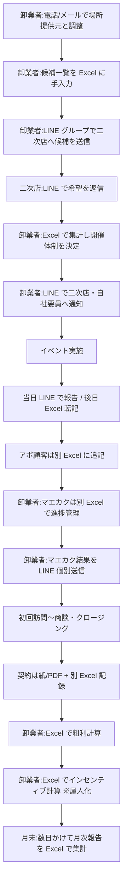
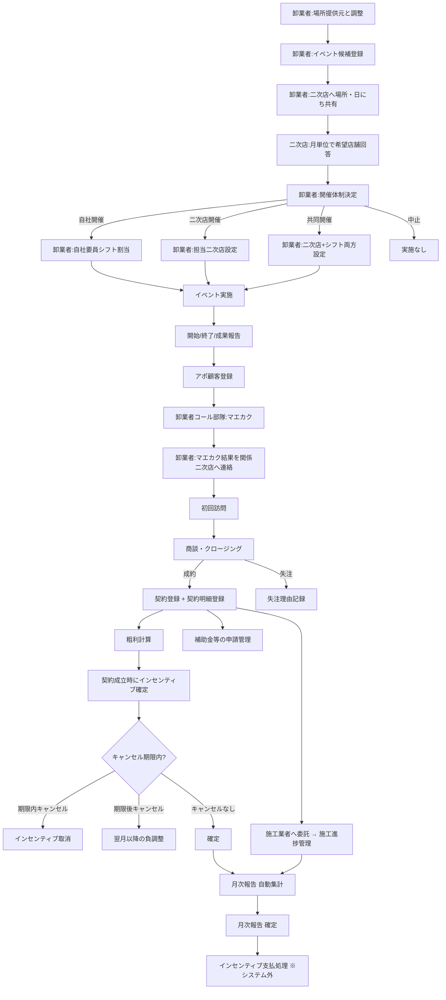

# 業務要件定義書 — 太陽光卸・二次店営業管理 SaaS

本ドキュメントは、太陽光パネルの卸業者と、その営業活動を担う二次店事業者が共同で利用する業務管理 SaaS の業務要件を定義する。`product-proposal.md` を一次資料とし、ヒアリングで確定した事項を反映している。後続の機能要件・技術選定・画面設計・プログラム設計はすべて本書を起点にする。

セクション構成はハーネスエージェント定義（`.claude/agents/biz-requirements.md`）の指定順に従う：背景・課題 → 対象ユーザー → ビジネスゴール → 業務スコープ → 業務フロー → KPI → 制約・前提 → ステークホルダー → ビジネスルール → リスク → Open Questions → 後続申し送り。

---

## 1. 背景・課題

太陽光パネルの卸業者と、その営業活動を担う二次店事業者の現場では、催事営業から契約・施工・インセンティブ計算までの一連の業務が **Excel と LINE で運用** されているのが現状である。

具体的に発生している痛みは以下のとおり。

- **業務記録が Excel に散在** している。場所提供元との交渉履歴、イベント候補一覧、二次店の希望、自社要員のシフト、顧客・アポ、商談、契約、粗利、インセンティブが、すべて別々のシートに分かれ、参照・転記コストが大きい。
- **コミュニケーションは LINE が中心** で、イベント開催の決定、マエカク結果の連絡、報告の依頼などがチャットに流れていく。誰が何を確認したか、何が未対応かが追跡できない。
- **粗利・インセンティブの計算が属人化** している。商品マスタ価格の改定、契約時点価格の固定、施工費・値引きの反映、二次店ごとのインセンティブ率の適用など、いずれも Excel 上で手作業で組まれているため、計算誤りや改ざんリスクが残る。
- **二次店との情報共有範囲のコントロールが手動** になっている。場所提供元との契約条件・他社二次店の希望状況・他社二次店の配属状況などを「うっかり共有してしまう」事故が起きうる。
- **業務量に対するスケーラビリティが乏しい**。二次店数や案件数が増えると現場の運用が破綻する。月次のクローズ作業に数日かかる卸業者も存在する。
- **多対多関係の管理が不可能**。実態として 1 つの二次店が複数の卸業者と取引するケースが一般的だが、Excel ベースの個別運用では二次店側にも卸業者側にも統合的なビューが存在しない。

これらをシステム化し、現場の業務効率を大幅に向上させることが本プロジェクトの主目的である。

---

## 2. 対象ユーザー

本システムは **マルチテナント SaaS** として提供する。テナント（=卸業者）は規模を問わず（小規模 〜 大規模）対象とする。

### 2.1 利用者ロール一覧

| 区分 | ロール | 主な利用シーン | 主要デバイス |
|---|---|---|---|
| 運営者（自社） | SaaS アドミン | テナント作成・プラン変更・請求状況確認 | PC |
| 卸業者 | 全体管理者 (`wholesaler_admin`) | 全機能、マスタ管理、インセンティブ確定 | PC 中心 |
| 卸業者 | 催事部隊 (`wholesaler_event_team`) | 場所取り、イベント候補、開催体制決定、シフト | PC + スマホ |
| 卸業者 | コール部隊 (`wholesaler_call_team`) | マエカク、二次店連絡 | PC + スマホ |
| 卸業者 | 直販部隊 (`wholesaler_direct_sales`) | 初回訪問、商談・クロージング、契約 | スマホ + PC |
| 卸業者 | 現場要員 (`wholesaler_field_staff`) | シフト確認、イベント報告、アポ登録 | スマホ |
| 二次店 | 二次店管理者 (`dealer_admin`) | 希望提出、配属確認、報告確認、成績確認 | PC + スマホ |
| 二次店 | 二次店担当 (`dealer_staff`) | イベント当日報告、アポ登録 | スマホ中心 |

### 2.2 ユーザー属性・規模感

- **卸業者**: 太陽光卸事業を営む小〜大規模事業者。社員数は数名〜数百名規模を想定。
- **二次店**: 卸業者の営業活動を受託する事業者。1 名規模の個人事業主から数十名規模の事業者まで幅広い。
- **デザインパートナー卸業者（コミット済み 1 社）**: MVP 段階で本番運用を開始する。具体的な業務独自ルールはパイロット導入時にヒアリングし、本書 9 章のビジネスルールへ追記する。

### 2.3 サインアップ設計

- **卸業者**: SaaS 運営者から **招待制**。テナント作成と全体管理者アカウント発行は運営側が行う。卸業者は配下の催事部隊・コール部隊・直販部隊・現場要員を **メール招待** で追加する。
- **二次店**: **セルフサインアップ可**。卸業者の招待コードを使って卸業者と接続する。**1 つの二次店アカウントが複数の卸業者と取引できる**（多対多）。
- **施工業者・場所提供元**: ログインユーザーではなく、卸業者が管理するマスタとして登録する。

### 2.4 二次店の業務スコープ

二次店 ↔ 卸業者の関係ごとに業務範囲を設定する。

- **アポ獲得まで**（トスアップのみ含む）
- **初回訪問まで**
- **商談・クロージングまで**

スコープは **二次店単位をデフォルト** として登録し、**イベントごとに上書き可能** とする。「マエカクのみ」「クロージングのみ」は扱わず、「商談・クロージング」は一体で管理する。

---

## 3. ビジネスゴール

### 3.1 主目的（最重要 KPI）

> **現状 Excel・LINE で属人運用されている全業務をシステム化し、卸業者・二次店双方の業務効率を大幅に向上させる。**

### 3.2 事業ゴール（SaaS として）

- **MVP リリース（1〜2 か月）**: パイロット卸業者 1 社（コミット済み）で全機能を本番運用に乗せる。
- **MVP 〜 6 か月**: パイロット運用の成果を見つつ、機能をリッチ化し UX を磨き込む。
- **6 〜 12 か月**: 小〜中規模の太陽光卸事業者を中心に **5〜10 社** へ展開。
- **12 か月以降**: 規模別プラン制での課金を確立し、太陽光事業を営む全規模の卸業者をターゲットとする。

### 3.3 定量的な成功指標（仮）

| 指標 | 目標 | 計測方法 |
|---|---|---|
| 月次報告作成リードタイム | Excel 集計比 **80% 削減** | 月初〜月次確定までの経過日数 |
| イベント開催体制決定までのリードタイム | 二次店希望提出から **3 営業日以内** | 希望受付終了 → 開催体制ステータス変更の経過時間 |
| インセンティブ計算の手作業時間 | **ほぼゼロ** | 契約登録から確定までのシステム外作業時間（運用ヒアリング） |
| 二次店からの希望提出回答率 | **80% 以上** | 期限内に回答した二次店 ÷ 招待した二次店 |
| Excel/LINE 依存業務の置換率 | パイロット社で **主要 7 業務すべて** | 場所取り・候補管理・希望収集・体制決定・シフト・報告・粗利集計 |

数値目標はパイロット卸業者と運用開始後に再調整する前提とする。

---

## 4. 業務スコープ

### 4.1 システム化する業務

太陽光卸事業の「**営業候補発掘から月次インセンティブ確定まで**」を一気通貫で扱う。

| 業務領域 | 対象 |
|---|---|
| 場所提供元対応 | 連絡履歴・契約条件・実施可否管理（カインズ・コメリ等） |
| イベント候補管理 | 場所・日程の確定とイベント候補登録 |
| 二次店向け候補共有 | 場所・日にち・回答期限のみ共有 |
| 二次店希望収集 | 月単位の希望店舗回答（同一店舗の複数二次店応募可） |
| 開催体制決定 | 自社開催 / 二次店開催 / 共同開催 / 中止 の決定 |
| 自社要員シフト管理 | 必要人数・割当・重複チェック |
| イベント当日報告 | 開始・終了・成果（声かけ数〜アポ数） |
| 顧客・アポ管理 | 営業由来の顧客 + アポイント |
| マエカク管理 | 卸業者コール部隊が実施 |
| マエカク結果連絡 | 関係二次店への結果配信 |
| 商談・クロージング管理 | 初回訪問〜契約見込みまで |
| 商品・価格マスタ管理 | パネル・蓄電池等の仕入値・卸値・希望販売価格、適用期間 |
| 契約・契約明細管理 | 契約時点価格の保持（スナップショット） |
| 粗利計算 | 契約単位 |
| インセンティブ計算 | 粗利ベース、案件粗利 / 卸粗利 / 手動指定 から選択 |
| 施工状況管理 | 施工業者・進捗の記録（追跡） |
| 補助金等申請状況管理 | 申請進捗の記録（追跡） |
| 月次報告 | 自社/二次店/共同 別の自動集計 + コメント入力 |
| 成績・インセンティブ確定 | 月次の確定処理 |
| 監査ログ | 主要操作の改ざん追跡 |
| 通知 | アプリ内通知 + メール（LINE は Phase 2） |

### 4.2 営業チャネル

催事営業を主軸としつつ、以下のチャネルからの顧客・アポも記録できる。

- 催事営業（主要）
- 飛び込み営業
- テレコール営業
- 紹介営業
- その他

催事以外のチャネルはイベント紐付けを不要とし、獲得チャネルだけ顧客に記録する。

### 4.3 人間が介在するチェックポイント

完全自動化せず、運用者の判断・確認を要するポイントを明示する。

| チェックポイント | 担当 | 内容 |
|---|---|---|
| 場所提供元との交渉確定 | 卸業者 催事部隊 | 実施可否ステータスを「確定」にする操作 |
| 開催体制決定 | 卸業者 催事部隊 / 全体管理者 | 二次店希望を見て自社/二次店/共同/中止を選ぶ |
| マエカク結果の二次店連絡 | 卸業者 コール部隊 | 通知の宛先と内容を最終確認 |
| 契約成立時の契約明細登録 | 卸業者 直販部隊 / 二次店（権限あり） | 商品・数量・実販売価格の入力 |
| 粗利の手動調整 | 卸業者 全体管理者 | 必要に応じて施工費・値引き等を補正 |
| 共同開催インセンティブ配分 | 卸業者 全体管理者 | 案件ごとに手動調整（MVP は固定ロジックなし） |
| 月次報告の確定 | 卸業者 全体管理者 | 自動集計値の最終承認 |
| インセンティブの確定取消・負調整 | 卸業者 全体管理者 | キャンセル発生時、期限内取消／期限後負調整 |

### 4.4 対象外（MVP〜短中期は明示的に扱わない）

ユーザーとの合意により以下は **本システムの責務外** とする。

| 領域 | 扱い |
|---|---|
| 自社要員の **勤怠・人件費管理** | シフトは「予定・報告」までで、賃金計算・打刻管理はやらない |
| 帳票発行・請求書発行 | インセンティブ金額の計算までは行うが、請求書 PDF 出力等は対象外 |
| 会計・税務連携 | freee・MFクラウド等の外部会計連携は持たない |
| 見積書・提案資料の生成 | 金額はテキストとして契約明細に保持するが、顧客向け資料 PDF 出力は対象外 |
| 在庫・メーカー発注管理 | 商品マスタは持つが発注フローは持たない |
| 高度な BI / PDF 帳票出力 | MVP ではダッシュボードの可視化までに留める |
| SMS 送信 | 通知は LINE 通知（Phase 2）+ メール + アプリ内通知のみ |

---

## 5. 業務フロー

### 5.1 現状フロー（Excel + LINE 運用）

問題点: 各ステップで参照シートが異なり、転記漏れ・計算誤り・情報漏洩リスクが恒常的に発生。誰が何を確認したかが追跡不能。

### 5.2 理想フロー（本システム導入後）

催事営業を主軸とした、もっとも長い経路を理想フローとして示す。

二次店スコープに応じて、L（初回訪問）以降の担当者が卸業者直販部隊か二次店かに切り替わる。

---

## 6. 主要 KPI / 成功指標（詳細）

3.3 の指標群を計測周期で再整理する。

| カテゴリ | 指標 | 計測タイミング |
|---|---|---|
| 効率化 | 月次報告作成リードタイム | 毎月 |
| 効率化 | 開催体制決定リードタイム | イベント候補ごと |
| 効率化 | インセンティブ計算の手作業時間 | 四半期で運用ヒアリング |
| 業務カバレッジ | Excel/LINE 依存業務の置換率 | パイロット運用 1 か月時点 |
| 利用浸透 | 月間アクティブユーザー数（卸業者・二次店別） | 月次 |
| 利用浸透 | 二次店からの希望提出回答率 | イベント候補ごと |
| 品質 | 監査ログ上の手動補正件数 | 月次（粗利・インセンティブの手動調整） |
| 品質 | 通知の到達率（メール / アプリ内） | 月次 |
| 事業 | 有償テナント数 | 月次 |
| 事業 | 月間契約数（テナント横断） | 月次 |
| 事業 | 月間アクティブ二次店数 | 月次 |

---

## 7. 制約・前提

### 7.1 期間・スコープ制約

- **MVP リリース: 1 〜 2 か月以内** に提案書のフル機能（提案書 13.1 MVP範囲）を本番投入する想定。
- 機能を絞らず広く作る方針のため、各機能のリッチさはミニマムから始める（一覧 + 検索 + ステータス更新 + 詳細閲覧の基本セット）。
- 設計フェーズ（Phase 0）で本書を含む 5 ドキュメントを完成させ、実装フェーズ（Phase 1+）でハーネスエージェント駆動の `/iterate` ループを回す。

### 7.2 デバイス・UI

- **レスポンシブ Web**（スマホ + PC 両対応）。
  - 二次店担当・自社現場要員はスマホ中心。
  - 卸業者本部・全体管理者は PC 中心。
- ネイティブアプリは提供しない。PWA 化は Phase 2 以降で検討。

### 7.3 通知

- MVP は **アプリ内通知 + メール** のみ。
- **LINE 通知連携（一方向送信）** は Phase 2 で実装。LINE 公式アカウントから「希望期限が近い」「イベント前日」等を配信し、リンクからアプリに遷移する形を想定。

### 7.4 セキュリティ

- **二段階認証 (2FA) を必須化** できる設定を持つ。MVP では全体管理者・SaaS アドミン向けに必須、その他は任意。
- **個人情報マスキング**: 監査ログ・通知本文・運営者画面では電話番号・住所などをマスクして表示する。
- **テナント間のデータ分離** を強制する（組織 ID ベースのクエリ条件を全 API で必須化）。
- **多対多テナント分離**: 二次店から見える情報は「卸業者-二次店 関係」単位でフィルタする。

### 7.5 課金・SaaS 運営

- **規模別プラン制（定額）** を採用する。プラン定義（小・中・大、料金、含まれる機能、二次店数上限等）は別途確定する。
- SaaS アドミン機能としては **テナント作成 / プラン変更 / 請求状況確認** までを実装する。請求書発行・決済は外部サービスまたはオフライン運用。
- MVP では課金処理を実装せず、パイロット卸業者は無償またはオフライン精算とする。

### 7.6 可用性 / SLA

- **業務時間帯（8:00〜22:00 JST）** の可用性を SLA 目標とする。深夜帯のメンテナンスは事前告知の上で許容する。
- 業務時間帯内のサポート問合せ対応もこの時間帯に揃える。

### 7.7 集計カレンダー

- 月次集計は **暦月（1 日〜月末）** で固定。
- 年度集計は **卸業者ごとに任意設定**（4 月始まり、1 月始まり等）。

### 7.8 データ移行

- 既存 Excel データの **CSV/Excel 一括インポートは MVP では実装しない**。
- パイロット卸業者の初期データは **手作業で投入** する前提。Phase 2 以降にマスタ系のインポートを実装する。

### 7.9 法令・コンプライアンス

- 太陽光販売特有の必須法令要件は **本書時点では未確定**。最低限、特定商取引法に基づくクーリングオフ期間（8 日）をデフォルトのキャンセル期限に採用する。
- 個人情報保護法に基づく顧客個人情報の取り扱い（マスキング、最小権限）はセキュリティ要件として担保する。

### 7.10 言語・地域

- 日本語のみ対応。
- 対象地域は日本国内。

---

## 8. ステークホルダー

| ステークホルダー | 関係 | 関心事 |
|---|---|---|
| SaaS 運営者（自社） | プロダクト提供者 | テナント増、ARR、不具合・サポート対応 |
| パイロット卸業者（コミット済み 1 社） | デザインパートナー兼初期顧客 | 自社業務へのフィット、移行コスト、運用開始までのリードタイム |
| 後続の卸業者（小〜大規模） | 将来顧客 | プラン価格、機能、自社業務との整合 |
| 二次店事業者 | 共同利用者 | スマホ操作性、自社向け情報のわかりやすさ、インセンティブ透明性、複数卸業者を横断したダッシュボード |
| 卸業者の自社要員（現場） | エンドユーザー | スマホでのシフト確認、報告のしやすさ |
| メーカー・施工業者・場所提供元 | システム外関係者 | データとしての管理対象（ログインは持たない） |
| 顧客（最終購入者） | システム外 | 個人情報保護 |

---

## 9. ビジネスルール（業務要件レベルの確定事項）

機能要件・プログラム設計が忠実に反映すべき確定ルール群。

### 9.1 開催体制とインセンティブ対象

| 開催体制 | 二次店インセンティブ |
|---|---|
| 自社開催 | 対象外 |
| 二次店開催 | 担当二次店が対象 |
| 自社・二次店共同開催 | 担当二次店が対象。配分は **案件ごと手動調整** |
| 中止 | 対象外 |

### 9.2 インセンティブ確定タイミング

- **契約成立時** にインセンティブが「確定（支払予定額）」となる。
- ただしキャンセル期限を設ける。
  - **デフォルト 8 日**（特定商取引法のクーリングオフ期間に準拠）。
  - **卸業者ごとに上書き設定可能**。
- 期限内のキャンセルは **インセンティブ取消し**、期限後のキャンセルは **負調整（翌月以降の支払額から減算）**。
- キャンセル案件は最終的にインセンティブ対象外として扱う。
- 粗利が 0 円以下の場合、インセンティブは原則 0 円。

### 9.3 価格・粗利の固定（契約明細スナップショット）

- 契約成立時点の **仕入値・二次店卸値・希望販売価格** を **契約明細にスナップショット保持** する。
- 商品マスタの価格改定（適用開始日・適用終了日で履歴管理）が、過去契約の粗利計算に影響しないようにする。
- スナップショットは契約明細レコード内で完結し、商品マスタへの参照を切り離して保持する。

### 9.4 情報開示制御

- **仕入値は卸業者内部情報** とし、二次店には絶対に表示しない。
- **二次店卸値・インセンティブ対象粗利** は、二次店ごとに必要範囲で開示できる。
- 二次店は **他社二次店の希望状況・配属状況・成果・インセンティブを閲覧不可**。
- 自社要員は **自分に割り当てられたイベント・自分が登録した顧客** のみ閲覧可。
- 場所提供元との契約条件（固定費・成果報酬率）は二次店に絶対表示しない。

### 9.5 多対多テナント

- 1 つの二次店アカウントが **複数の卸業者** と取引できる。
- 二次店から見える情報は、その卸業者との関係でフィルタされる。スコープ・インセンティブ率・割当イベント・成績は **卸業者ごとに独立** して管理する。
- 二次店ダッシュボードは「卸業者を切り替える」体験を提供する（または横断サマリを別途用意）。

### 9.6 二次店業務スコープ

- 二次店単位のデフォルトとして「アポ獲得まで」「初回訪問まで」「商談・クロージングまで」のいずれかを設定。
- イベントごとに **スコープ上書き可能**。
- スコープに応じて、初回訪問以降を二次店が担当するか、卸業者直販部隊が担当するかが切り替わる。

### 9.7 共同開催時のインセンティブ

- 共同開催イベントから生まれた契約は、二次店スコープに依らず **案件単位で手動調整**。MVP では計算ロジックは固定せず、調整 UI と監査ログを提供する。
- Phase 2 以降に運用パターンを観察して、規則化を検討する。

### 9.8 集計カレンダー

- 月次集計は **暦月（1 日〜月末）** で固定。
- 年度集計は **卸業者ごとに任意設定**（4 月始まり、1 月始まり等）。

---

## 10. リスク

| リスク | 影響 | 緩和策 |
|---|---|---|
| 1〜2 か月で全機能を構築するスケジュールリスク | MVP 品質低下、パイロット導入遅延 | 各機能はミニマム実装に統一。詳細リッチ化は Phase 2 で。並列開発を成立させるため契約境界（型・API）を早期に確定する |
| パイロット卸業者の業務が提案書から乖離している可能性 | 後戻り・要件追加 | パイロット導入時に独自ルールをヒアリングし、本書 9 章を追記改訂する |
| 多対多テナント（1 二次店 × N 卸業者）の設計が複雑化 | データ漏洩・実装難度 | テナント分離の単位を「卸業者-二次店 関係」に置き、データアクセスは関係 ID 経由でしか行わない設計とする |
| LINE 連携を期待されるが Phase 2 になる | パイロット運用での体験劣化 | MVP 期間中はメール + アプリ内通知で「同等の情報到達」を保証し、LINE は Phase 2 で追加と約束する |
| 共同開催インセンティブの手動調整が運用負荷になる | 月次クローズが遅れる | 監査ログと自動下書き値（提案書の標準計算）を提示し、調整作業を最小化する |
| 規模別プランの定義が未確定 | 課金開始の遅延 | MVP では課金処理を実装せず、運用はオフラインで進めながらプラン定義を確定 |
| 個人情報の取扱いミス | 法令違反 / 信用失墜 | 監査ログ・マスキング・ロールベース閲覧制御を全 API レイヤで強制 |
| キャンセル後の負調整ロジックが業務ヒアリング不足 | 計算誤り | パイロットの実例を 1〜2 件運用してから本実装。MVP では「期限内取消」のみ自動、「負調整」は手動入力 + 監査ログとする |

---

## 11. Open Questions（後続フェーズで確定する事項）

以下は本書時点で未確定の事項。機能要件 / 技術選定 / 画面設計のいずれかのフェーズで確定する。

1. **規模別プランの定義**: 各プラン（小・中・大）の料金、含まれる機能、二次店数上限、ユーザー数上限。
2. **パイロット卸業者の独自業務ルール**: ヒアリングし、必要なら本書 9 章に追記する。
3. **キャンセル後の負調整 UI / 処理仕様**: 期限後キャンセルの「負調整」を翌月インセンティブからどう減算するかの UI と計算ロジック。MVP では手動入力 + 監査ログ起点。
4. **2FA の実装方式**: TOTP（Authenticator）/ SMS / メールワンタイム のいずれを採用するか（技術選定で確定）。
5. **個人情報マスキングの具体仕様**: マスクする桁数、復号権限を持つロール、運営者画面での扱い。
6. **共同開催インセンティブの規則化**: パイロット運用 2〜3 か月後に観察し、Phase 2 で計算ルールを定義するかを判断。
7. **施工業者・補助金申請の外部連携**: 現状は「ステータス追跡のみ」だが、Phase 2 で施工業者向け簡易画面を出すかどうか。
8. **CSV/Excel インポート機能**: Phase 2 で実装する範囲（顧客・二次店・商品マスタ・契約履歴）。
9. **法令遵拠の追加要件**: 太陽光販売特有の業界規制を追加調査するかどうか。
10. **データ保持期間**: 監査ログ、顧客個人情報、契約データの保持期間と削除ポリシー。
11. **二次店横断ビュー**: 二次店ユーザーが複数卸業者を横断したダッシュボードを必要とするか、卸業者ごとの切替で十分か。
12. **通知到達率の計測手段**: メール到達率の取得方法（送信プロバイダのイベント Webhook 連携）。

---

## 12. 後続エージェントへの申し送り

- `functional-requirements`（機能要件定義）には、提案書 5〜10 章 + 本書 9 章のビジネスルールを忠実に反映すること。特に以下は **見落としてはならない要件** である：
  - 契約明細スナップショット（9.3）
  - キャンセル期限デフォルト 8 日・卸業者上書き可（9.2）
  - 期限内取消し / 期限後負調整（9.2）
  - 共同開催の手動調整（9.7）
  - 多対多テナント（9.5）
  - 二次店スコープのイベント上書き（9.6）
  - 情報開示制御（仕入値非開示・他社二次店情報非開示）（9.4）
- `tech-selection`（技術選定）には、CLAUDE.md の確定スタック（Next.js 15 + Prisma + PostgreSQL）に加え、**LINE Messaging API（Phase 2）**、**2FA 実装方式**、**個人情報マスキング**、**メール送信プロバイダ**、**多対多 RLS／クエリ強制** の実現方式を肉付けすること。
- `ui-design`（画面設計）には、ロール別主要デバイス（2.1 の表）と、提案書 7 章の画面一覧を起点に、レスポンシブ前提で設計してもらうこと。スマホ画面は二次店担当・現場要員・コール部隊のフローを最優先。
- `program-design`（プログラム設計）では、テナント分離の単位を「卸業者-二次店 関係」とした多対多データモデルを設計すること。CLAUDE.md（A2P 起源）で言及される `accounts` テーブルは本プロジェクトでは「卸業者テナント」を主オブジェクトとして再定義し、二次店 ↔ 卸業者の関係エンティティを別途用意すること。
- `pm`（開発計画）では、MVP 1〜2 か月達成のため、機能ごとのミニマム定義を共有しスプリント粒度に分解すること。

---

## 13. 変更履歴

| 日付 | 変更内容 | 変更者 |
|---|---|---|
| 2026-05-23 (初版) | 提案書とユーザー Q&A を基にした初版作成 | biz-requirements |
| 2026-05-23 (改訂 v2) | エージェント定義の指定セクション順（背景→ユーザー→ゴール→スコープ→フロー→KPI→制約→ステークホルダー）に再編。現状フロー（5.1）を追加し理想フロー（5.2）と対比可能にした。4.3 に「人間が介在するチェックポイント」を新設。2.2 にユーザー属性とデザインパートナー卸業者の言及を追加。リスクに「個人情報取扱いミス」「キャンセル負調整ヒアリング不足」を追加。Open Questions に「二次店横断ビュー」「通知到達率計測手段」を追加。理想フローにキャンセル期限分岐（期限内取消／期限後負調整）を追加。ユーザー確定 16 項目は全て維持。 | biz-requirements |
