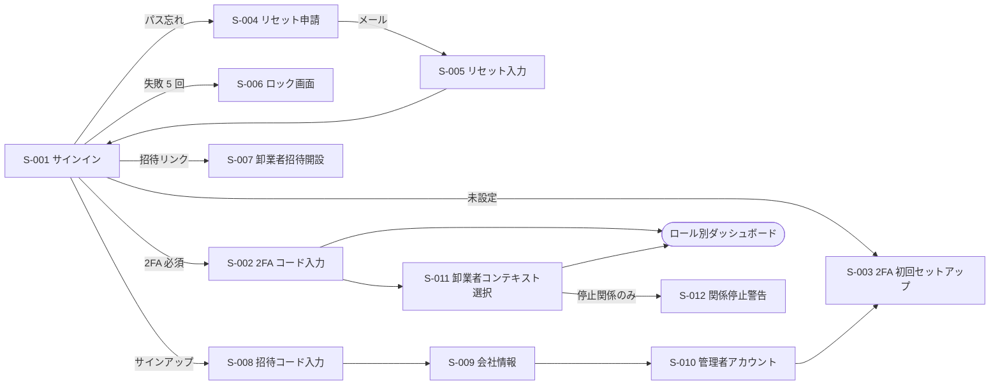
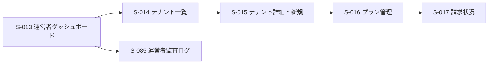
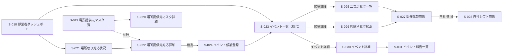
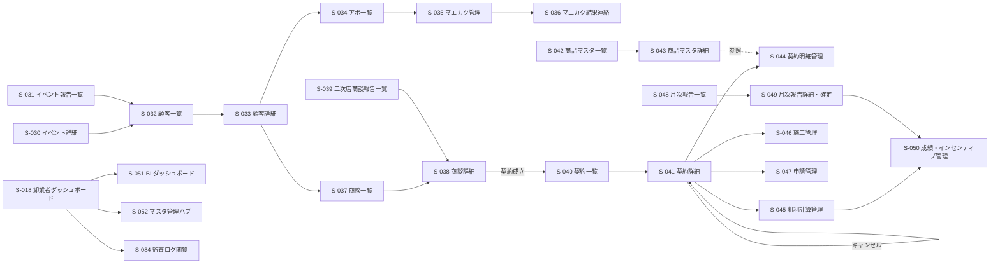
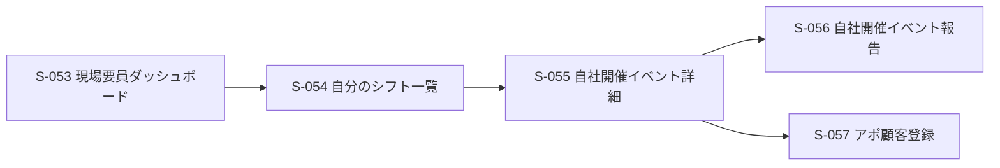
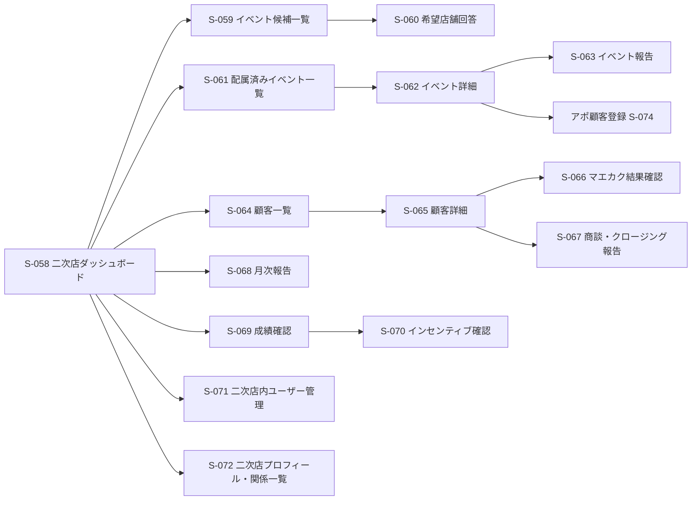
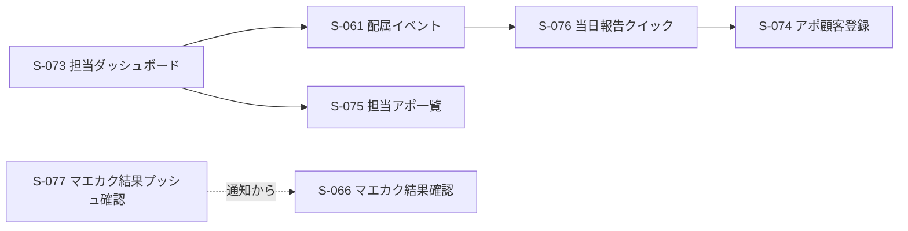
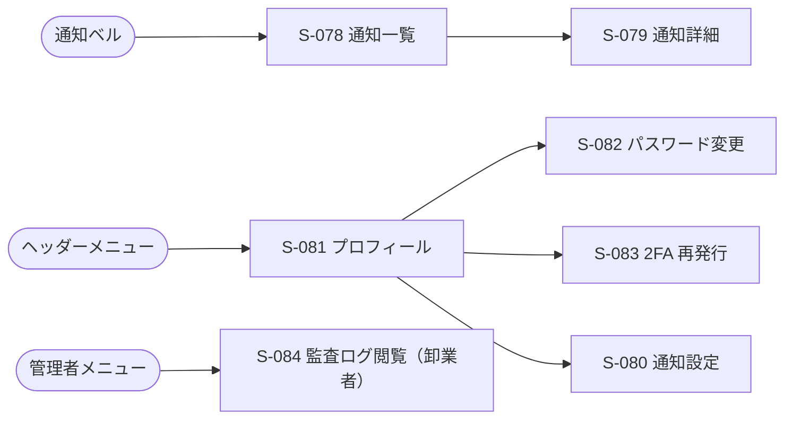

# 画面設計書 — 太陽光卸・二次店営業管理 SaaS

本書は `docs/01-business-requirements.md`（業務要件）と `docs/02-functional-requirements.md`（機能要件 F-001〜F-058）、および `product-proposal.md` §7 画面一覧（S-101〜S-130 / S-201〜S-214 / S-301〜S-304）を起点に、本 SaaS の画面構成・遷移・各画面のセクション/コンポーネントを定義する。

- 画面 ID は本書独自連番 `S-001`〜（欠番なし）。提案書側 ID は「提案書 ID」列に併記する。
- ビジュアル詳細（色コード・ピクセル値）は記述しない。shadcn/ui の意味的トークン（`primary` / `secondary` / `muted` / `destructive` / `accent`）で表現する。
- レスポンシブ前提。スマホ向け画面は二次店担当・自社現場要員・コール部隊のフローを最優先。
- 関連機能 ID 列は `docs/02-functional-requirements.md` の `F-xxx` を参照する。
- ワイヤーフレーム（ASCII / mermaid）は別エージェント `designer` が `docs/wireframes/{S-xxx}-*.md` に出力する責務であり、本書では扱わない。

---

## 1. 画面一覧

画面は次の 7 ブロックに整理する。

| ブロック | レンジ | 対象ロール |
|---|---|---|
| A. 認証・オンボーディング共通 | S-001〜S-012 | 全ロール |
| B. SaaS 運営者 | S-013〜S-017 | `saas_admin` |
| C. 卸業者本部（PC 中心） | S-018〜S-052 | `wholesaler_admin` / `wholesaler_event_team` / `wholesaler_call_team` / `wholesaler_direct_sales` |
| D. 卸業者現場要員（スマホ中心） | S-053〜S-057 | `wholesaler_field_staff` |
| E. 二次店本部（PC + スマホ） | S-058〜S-072 | `dealer_admin` |
| F. 二次店担当（スマホ中心） | S-073〜S-077 | `dealer_staff` |
| G. 共通（通知・監査・プロフィール等） | S-078〜S-085 | 全ロール |

### 1.1 A. 認証・オンボーディング共通（S-001〜S-012）

| 画面 ID | 画面名 | 提案書 ID | 対応ロール | 関連機能 ID | フェーズ | 主要デバイス |
|---|---|---|---|---|---|---|
| S-001 | サインイン | - | 全ロール | F-001 | Phase 1 | 両方 |
| S-002 | 2FA コード入力 | - | 全ロール | F-001, F-002 | Phase 1 | 両方 |
| S-003 | 2FA 初回セットアップ（QR + バックアップコード） | - | 全ロール（必須ロールは強制） | F-002 | Phase 1 | PC 中心 |
| S-004 | パスワードリセット申請 | - | 全ロール | F-003 | Phase 1 | 両方 |
| S-005 | パスワードリセット入力（リンク到着先） | - | 全ロール | F-003 | Phase 1 | 両方 |
| S-006 | 連続失敗ロック画面 | - | 全ロール | F-001 | Phase 1 | 両方 |
| S-007 | 招待メール経由のアカウント開設（卸業者ユーザー） | - | 卸業者新規 | F-006 | Phase 1 | 両方 |
| S-008 | 招待コード入力（二次店セルフサインアップ：コード入力） | - | 新規二次店 | F-007 | Phase 1 | 両方 |
| S-009 | 二次店セルフサインアップ：会社情報入力 | - | 新規二次店 | F-007 | Phase 1 | 両方 |
| S-010 | 二次店セルフサインアップ：管理者アカウント作成 | - | 新規二次店 | F-007, F-002 | Phase 1 | 両方 |
| S-011 | 卸業者コンテキスト選択（多対多の二次店ログイン直後） | - | `dealer_admin` / `dealer_staff` | F-001, F-009 | Phase 1 | 両方 |
| S-012 | テナント関係停止中の警告画面 | - | `dealer_admin` / `dealer_staff` | F-009 | Phase 1 | 両方 |

### 1.2 B. SaaS 運営者（S-013〜S-017）

| 画面 ID | 画面名 | 提案書 ID | 対応ロール | 関連機能 ID | フェーズ | 主要デバイス |
|---|---|---|---|---|---|---|
| S-013 | 運営者ダッシュボード | - | `saas_admin` | F-004, F-005, F-055 | Phase 1 | PC |
| S-014 | 卸業者テナント一覧 | - | `saas_admin` | F-004, F-005 | Phase 1 | PC |
| S-015 | 卸業者テナント新規作成・詳細 | - | `saas_admin` | F-004, F-005 | Phase 1 | PC |
| S-016 | プラン管理（プラン定義 / 適用） | - | `saas_admin` | F-005 | Phase 1 | PC |
| S-017 | 請求状況一覧（オフライン記録） | - | `saas_admin` | F-005 | Phase 1 | PC |

### 1.3 C. 卸業者本部（S-018〜S-052）

| 画面 ID | 画面名 | 提案書 ID | 対応ロール | 関連機能 ID | フェーズ | 主要デバイス |
|---|---|---|---|---|---|---|
| S-018 | 卸業者ダッシュボード（ホーム） | - | 卸業者全ロール | F-022, F-034, F-048, F-052, F-056 | Phase 1 | PC |
| S-019 | 場所提供元マスタ一覧 | - | `wholesaler_admin` / `wholesaler_event_team` | F-011 | Phase 1 | PC |
| S-020 | 場所提供元マスタ詳細・編集 | - | 同上 | F-011 | Phase 1 | PC |
| S-021 | 場所提供元対応一覧 | S-101 | `wholesaler_admin` / `wholesaler_event_team` | F-017 | Phase 1 | PC |
| S-022 | 場所提供元対応詳細・対応履歴 | S-102 | 同上 | F-017 | Phase 1 | PC |
| S-023 | イベント一覧（統合ビュー：週次カレンダー + テーブル） | S-103 | `wholesaler_admin` / `wholesaler_event_team` | F-018, F-019, F-027 | Phase 1 | PC |
| S-024 | イベント候補登録・編集 | S-104 | 同上 | F-018, F-019 | Phase 1 | PC |
| S-086 | レーン一覧（月単位の開催日ドットグリッド） | - | `wholesaler_admin` / `wholesaler_event_team` | F-059 | Phase 1 | PC |
| S-087 | レーン登録（ポップアップ） | - | 同上 | F-059 | Phase 1 | PC |
| S-088 | レーン詳細 | - | 同上 | F-059 | Phase 1 | PC |
| S-089 | 二次店希望一覧（アコーディオン：二次店別レーン希望） | - | `wholesaler_admin` / `wholesaler_event_team` | F-060 | Phase 1 | PC |
| S-025 | 二次店希望一覧（二次店別ビュー） | S-105 | `wholesaler_admin` / `wholesaler_event_team` | F-022 | Phase 1 | PC |
| S-026 | 店舗別希望状況（店舗別ビュー） | S-106 | 同上 | F-022 | Phase 1 | PC |
| S-027 | イベント開催体制管理 | S-107 | `wholesaler_admin` / `wholesaler_event_team` | F-023, F-024 | Phase 1 | PC |
| S-028 | 自社シフト管理（イベント別） | S-108 | 同上 | F-025 | Phase 1 | PC |
| S-029 | （S-023 に統合）配属済みイベント一覧 → 廃止 | S-109 | — | — | — | — |
| S-030 | イベント詳細（卸業者ビュー） | S-110 | 卸業者全ロール | F-024, F-027, F-028, F-029, F-030 | Phase 1 | PC + スマホ |
| S-031 | イベント報告一覧 | S-111 | `wholesaler_admin` / `wholesaler_event_team` | F-028, F-029, F-030 | Phase 1 | PC |
| S-032 | 顧客一覧 | S-112 | 全営業ロール（権限フィルタ） | F-031, F-032 | Phase 1 | PC + スマホ |
| S-033 | 顧客詳細（顧客 + アポ + 商談履歴統合） | S-113 | 全営業ロール | F-031, F-033, F-038 | Phase 1 | PC + スマホ |
| S-034 | アポ一覧 | S-114 | `wholesaler_admin` / `wholesaler_call_team` / `wholesaler_direct_sales` | F-033, F-034 | Phase 1 | PC |
| S-035 | マエカク管理（コール部隊キュー） | S-115 | `wholesaler_admin` / `wholesaler_call_team` | F-034, F-035 | Phase 1 | PC + スマホ |
| S-036 | マエカク結果連絡管理 | S-116 | `wholesaler_admin` / `wholesaler_call_team` | F-036 | Phase 1 | PC |
| S-037 | 商談・クロージング一覧 | S-117 | `wholesaler_admin` / `wholesaler_direct_sales` | F-038, F-039 | Phase 1 | PC |
| S-038 | 商談・クロージング詳細 | S-118 | 同上 | F-038 | Phase 1 | PC + スマホ |
| S-039 | 二次店商談・クロージング報告一覧 | S-119 | `wholesaler_admin` / `wholesaler_direct_sales` | F-039 | Phase 1 | PC |
| S-040 | 契約一覧 | S-120 | `wholesaler_admin` / `wholesaler_direct_sales` | F-040, F-043 | Phase 1 | PC |
| S-041 | 契約詳細（契約 + 明細 + 粗利 + インセンティブ統合） | S-121 | 同上 | F-040, F-041, F-042, F-043, F-046 | Phase 1 | PC |
| S-042 | 商品・価格マスタ一覧 | S-122 | `wholesaler_admin` | F-012 | Phase 1 | PC |
| S-043 | 商品・価格マスタ詳細・履歴 | S-122 | `wholesaler_admin` | F-012 | Phase 1 | PC |
| S-044 | 契約明細管理（契約内サブ画面の独立ビュー） | S-123 | `wholesaler_admin` / `wholesaler_direct_sales` | F-041 | Phase 1 | PC |
| S-045 | 粗利計算管理 | S-124 | `wholesaler_admin` / `wholesaler_direct_sales` | F-042, F-047 | Phase 1 | PC |
| S-046 | 施工管理一覧・詳細 | S-125 | `wholesaler_admin` / `wholesaler_direct_sales` | F-044 | Phase 1 | PC |
| S-047 | 申請管理一覧・詳細 | S-126 | `wholesaler_admin` / `wholesaler_direct_sales` | F-045 | Phase 1 | PC |
| S-048 | 月次報告一覧 | S-127 | `wholesaler_admin` / `wholesaler_event_team` | F-048, F-049, F-050 | Phase 1 | PC |
| S-049 | 月次報告詳細・確定 | S-127 | `wholesaler_admin` | F-048, F-049, F-050 | Phase 1 | PC |
| S-050 | 成績・インセンティブ管理 | S-128 | `wholesaler_admin` | F-046, F-047, F-051 | Phase 1 | PC |
| S-051 | BI ダッシュボード | S-129 | `wholesaler_admin` / `wholesaler_event_team` / `wholesaler_direct_sales` | F-056 | Phase 1 | PC |
| S-052 | マスタ管理ハブ（二次店関係 / 施工業者 / インセンティブ率 / キャンセル期限 / 年度開始月） | S-130 | `wholesaler_admin` | F-009, F-010, F-013, F-014, F-015, F-016 | Phase 1 | PC |

### 1.4 D. 卸業者現場要員（S-053〜S-057）

| 画面 ID | 画面名 | 提案書 ID | 対応ロール | 関連機能 ID | フェーズ | 主要デバイス |
|---|---|---|---|---|---|---|
| S-053 | 現場要員ダッシュボード | - | `wholesaler_field_staff` | F-026, F-027 | Phase 1 | スマホ |
| S-054 | 自分のシフト一覧 | S-301 | `wholesaler_field_staff` | F-026 | Phase 1 | スマホ |
| S-055 | 自社開催イベント詳細（現場ビュー） | S-302 | `wholesaler_field_staff` | F-027 | Phase 1 | スマホ |
| S-056 | 自社開催イベント報告（開始・終了・成果） | S-303 | `wholesaler_field_staff` | F-028, F-029, F-030 | Phase 1 | スマホ |
| S-057 | アポ顧客登録（現場フォーム） | S-304 | `wholesaler_field_staff` | F-031, F-033 | Phase 1 | スマホ |

### 1.5 E. 二次店本部（S-058〜S-072）

| 画面 ID | 画面名 | 提案書 ID | 対応ロール | 関連機能 ID | フェーズ | 主要デバイス |
|---|---|---|---|---|---|---|
| S-058 | 二次店ダッシュボード | S-201 | `dealer_admin` / `dealer_staff` | F-020, F-027, F-048, F-051, F-052 | Phase 1 | PC + スマホ |
| S-059 | イベント候補一覧（二次店ビュー） | S-202 | `dealer_admin` / `dealer_staff` | F-020 | Phase 1 | PC + スマホ |
| S-060 | 希望店舗回答 | S-203 | `dealer_admin` | F-021 | Phase 1 | PC + スマホ |
| S-061 | 配属済みイベント一覧（二次店ビュー） | S-204 | `dealer_admin` / `dealer_staff` | F-027 | Phase 1 | PC + スマホ |
| S-062 | イベント詳細（二次店ビュー） | S-205 | `dealer_admin` / `dealer_staff` | F-024, F-027 | Phase 1 | PC + スマホ |
| S-063 | イベント報告（二次店フォーム） | S-206 | `dealer_admin` / `dealer_staff` | F-028, F-029, F-030 | Phase 1 | スマホ中心 |
| S-064 | 顧客一覧（二次店ビュー） | S-208 | `dealer_admin` / `dealer_staff` | F-032 | Phase 1 | PC + スマホ |
| S-065 | 顧客詳細（二次店ビュー） | S-209 | `dealer_admin` / `dealer_staff` | F-031, F-033, F-038 | Phase 1 | PC + スマホ |
| S-066 | マエカク結果確認 | S-210 | `dealer_admin` / `dealer_staff` | F-037 | Phase 1 | PC + スマホ |
| S-067 | 商談・クロージング報告（二次店、スコープ依存） | S-211 | `dealer_admin` / `dealer_staff`（権限あり） | F-038 | Phase 1 | PC + スマホ |
| S-068 | 月次報告（二次店確認 + コメント入力） | S-212 | `dealer_admin` | F-048, F-049 | Phase 1 | PC + スマホ |
| S-069 | 成績確認（二次店） | S-213 | `dealer_admin` / `dealer_staff` | F-048, F-051 | Phase 1 | PC + スマホ |
| S-070 | インセンティブ確認 | S-214 | `dealer_admin` / `dealer_staff` | F-046, F-051 | Phase 1 | PC + スマホ |
| S-071 | 二次店内ユーザー管理 | - | `dealer_admin` | F-008 | Phase 1 | PC |
| S-072 | 二次店プロフィール・卸業者関係一覧 | - | `dealer_admin` | F-007, F-009 | Phase 1 | PC |

### 1.6 F. 二次店担当（S-073〜S-077）

| 画面 ID | 画面名 | 提案書 ID | 対応ロール | 関連機能 ID | フェーズ | 主要デバイス |
|---|---|---|---|---|---|---|
| S-073 | 二次店担当ダッシュボード | S-201 | `dealer_staff` | F-027, F-034, F-052 | Phase 1 | スマホ |
| S-074 | アポ顧客登録（二次店、現場フォーム） | S-207 | `dealer_staff` / `dealer_admin` | F-031, F-033 | Phase 1 | スマホ |
| S-075 | 担当アポ一覧（二次店） | - | `dealer_staff` | F-034 | Phase 1 | スマホ |
| S-076 | 当日イベント報告（クイック） | S-206 | `dealer_staff` | F-028, F-029, F-030 | Phase 1 | スマホ |
| S-077 | マエカク結果プッシュ確認（通知から導線） | S-210 | `dealer_staff` | F-037 | Phase 1 | スマホ |

### 1.7 G. 共通（S-078〜S-085）

| 画面 ID | 画面名 | 提案書 ID | 対応ロール | 関連機能 ID | フェーズ | 主要デバイス |
|---|---|---|---|---|---|---|
| S-078 | 通知一覧（インボックス） | - | 全ロール | F-052 | Phase 1 | PC + スマホ |
| S-079 | 通知詳細 / 既読・全既読操作 | - | 全ロール | F-052 | Phase 1 | PC + スマホ |
| S-080 | 通知設定（チャネル別 ON/OFF） | - | 全ロール | F-052, F-053, F-054 | Phase 1（LINE は Phase 2） | PC + スマホ |
| S-081 | プロフィール編集 | - | 全ロール | F-001, F-006, F-008 | Phase 1 | PC + スマホ |
| S-082 | パスワード変更 | - | 全ロール | F-001 | Phase 1 | PC + スマホ |
| S-083 | 2FA 再発行・バックアップコード再生成 | - | 全ロール | F-002 | Phase 1 | PC |
| S-084 | 監査ログ閲覧（卸業者） | - | `wholesaler_admin` | F-055 | Phase 1 | PC |
| S-085 | 監査ログ閲覧（運営者） | - | `saas_admin` | F-055 | Phase 1 | PC |

---

## 2. 画面遷移図

### 2.1 認証共通

### 2.2 SaaS 運営者

### 2.3 卸業者本部（場所取り → 開催体制 → 実施 → 報告）

### 2.4 卸業者本部（アポ → マエカク → 商談 → 契約 → 月次）

### 2.5 卸業者現場要員（スマホ）

### 2.6 二次店本部（PC + スマホ）

### 2.7 二次店担当（スマホ中心）

### 2.8 共通（通知・プロフィール・監査）

---

## 3. 共通レイアウト

### 3.1 グローバル構造

PC / タブレット時の標準レイアウト:

- **ヘッダー（固定 / 上部）**
  - 左: ロゴ + テナント名（卸業者名）
  - 中央: グローバル検索（顧客・イベント・契約のクイック検索、PC のみ）
  - 右: テナント切替 UI（二次店ユーザーのみ）、通知ベル、ヘルプ、アバター（プロフィールメニュー）
  - 業務時間外（22:00〜8:00 JST）はヘッダーに「業務時間外（メンテナンス可能性）」のステータスチップを表示
- **サイドバー（固定 / 左、折りたたみ可）**
  - ロール別ナビゲーション項目（後述）
  - 下部に環境表示（本番 / ステージング）、バージョン
- **メインエリア**
  - パンくず → ページタイトル → アクションボタン → ページ本文
- **フッター（任意）**
  - 著作権、利用規約、サポート問合せリンク

### 3.2 モバイル時レイアウト

- ヘッダー: ハンバーガー + テナント名 + 通知ベル + アバター
- サイドバー: ハンバーガー展開でドロワー化
- **下部タブバー**（ロール別 4〜5 項目に絞る）
  - 二次店担当 (`dealer_staff`): `配属イベント` / `アポ` / `顧客` / `通知` / `その他`
  - 自社現場要員 (`wholesaler_field_staff`): `シフト` / `今日のイベント` / `アポ登録` / `通知` / `その他`
  - 二次店管理者 (`dealer_admin`): `ダッシュボード` / `候補/希望` / `顧客` / `成績` / `その他`
  - コール部隊 (`wholesaler_call_team`): `マエカクキュー` / `アポ` / `顧客` / `通知` / `その他`

### 3.3 サイドバー項目（ロール別）

| ロール | サイドバー項目 |
|---|---|
| `saas_admin` | ダッシュボード / テナント / プラン / 請求状況 / 監査ログ |
| `wholesaler_admin` | ダッシュボード / レーンイベント一覧 / 単発イベント一覧 / 場所取り対応状況 / 二次店希望一覧 / 顧客 / アポ / マエカク / 商談 / 契約 / 月次報告 / インセンティブ / BIツール / マスタ / メンバー / 取引先 / 監査ログ |
| `wholesaler_event_team` | ダッシュボード / レーンイベント一覧 / 単発イベント一覧 / 場所取り対応状況 / 二次店希望一覧 / 月次報告 / BI |
| `wholesaler_call_team` | ダッシュボード / マエカクキュー / アポ / 顧客 / マエカク結果連絡 |
| `wholesaler_direct_sales` | ダッシュボード / 顧客 / アポ / 商談 / 契約 / 粗利 / 施工 / 申請 |
| `wholesaler_field_staff` | ダッシュボード / シフト / イベント / アポ登録 |
| `dealer_admin` | ダッシュボード / イベント候補 / 希望店舗回答 / 配属イベント / 顧客 / マエカク結果 / 商談 / 月次報告 / 成績 / インセンティブ / メンバー / プロフィール |
| `dealer_staff` | ダッシュボード / 配属イベント / アポ / 顧客 / マエカク結果 |

### 3.4 通知ベル

- 未読件数バッジを表示
- クリックでドロップダウン（最新 10 件）→ クリックで個別画面遷移 or `S-078` 通知一覧へ
- 二次店ユーザーは「現在の卸業者コンテキスト」の通知のみ表示。コンテキスト切替で表示も切り替わる
- LINE 通知の連携状況（Phase 2）はベル横にチップで提示

### 3.5 2FA バナー

- 必須ロールで 2FA 未設定の場合、全画面上部に dismiss 不可の警告バナーを常時表示。リンクから `S-003` へ誘導
- 任意ロールで未設定の場合、ダッシュボードのみに dismiss 可能なバナーを表示

### 3.6 テナント切替 UI（二次店ユーザー専用）

- ヘッダー右側に「現在の卸業者コンテキスト名」をドロップダウン化
- クリックで取引中の卸業者一覧を表示（関係ステータスが「有効」のもの）
- 切替時はセッション内 `current_relationship_id` を更新し、全画面のデータが該当卸業者だけにフィルタされる
- 停止された関係は薄表示 + クリック不可、ホバーで「停止中 / 既存確定インセンティブは保持」表示
- 多対多が 1 社のみの場合はドロップダウンを非表示にしテナント名だけ表示

### 3.7 個人情報マスキング表示パターン

- 卸業者本部 / 二次店本部の顧客系画面では電話番号は `下 4 桁のみ`、住所は `市区町村まで` をデフォルト表示
- 各レコードに「フル表示」ボタン（鍵アイコン）を併設し、権限ありユーザー（`wholesaler_admin` 等、F-031 / Open Q5 で確定）のみ押下可能
- フル表示操作は監査ログに記録される（F-055）
- 運営者画面（`saas_admin`）では常にマスク表示で固定（ボタンなし）

### 3.8 ローディング・空状態・エラー共通

- ローディング: skeleton（一覧 / カード / グラフごとに用意）
- 空状態: アイコン + 説明文 + 主要アクションボタン（「新規登録」「マスタへ移動」など）
- エラー: トースト（瞬時系） + インラインバナー（永続系）。バナーは詳細展開可
- 409（楽観ロック・期限超過等）はモーダルで明示的に通知し、再読込ボタンを置く

---

## 4. 画面詳細

各画面は以下のテンプレートで記述する。

- 目的（業務要件 §／機能 ID）
- 主要コンテンツセクション
- 主要コンポーネント（入出力）
- ユーザー操作とその結果（API → 状態遷移）
- 空状態 / ローディング / エラー
- 関連画面（前後遷移）
- 権限制御

### 4.1 A. 認証・オンボーディング

#### S-001 サインイン

- **目的**: 全ロールのログイン入口（docs/01 §8.4、F-001）
- **セクション**: ロゴ → メール入力 → パスワード入力 → サインインボタン → 「招待コード入力（新規二次店）」「パスワードを忘れた方」リンク
- **コンポーネント**:
  - `EmailInput`（必須、書式チェック）
  - `PasswordInput`（必須、目アイコンで表示切替）
  - `SubmitButton`（loading 状態）
  - `LinkRow`（リセット / 招待コード入力 / 卸業者招待開設）
- **操作 → 結果**:
  - 送信 → `POST /api/auth/sign-in` → 成功時: 2FA 必須なら S-002、未設定必須ロールなら S-003、その他は S-011（多対多）または各ロールのダッシュボードへ
  - 5 回失敗 → S-006 へ強制遷移
- **状態**:
  - ローディング: ボタン内スピナー
  - エラー: 「メールまたはパスワードが正しくありません」のインライン
  - 空: なし
- **関連画面**: S-002 / S-003 / S-004 / S-006 / S-007 / S-008 / S-011
- **権限**: 全ロール

#### S-002 2FA コード入力

- **目的**: F-001 / F-002
- **セクション**: 案内文 → 6 桁コード入力 → 「バックアップコードを使用」リンク → 検証ボタン
- **コンポーネント**: `OtpInput`（6 桁、自動フォーカス遷移）、`SubmitButton`、`LinkButton`
- **操作 → 結果**: 検証 → `POST /api/auth/verify-totp` → 成功で S-011 またはダッシュボード
- **状態**: エラー時は誤コード／期限切れの旨を出す、3 回連続失敗で再ログインを要求
- **関連画面**: S-001 / S-011
- **権限**: 全ロール

#### S-003 2FA 初回セットアップ

- **目的**: F-002 — 必須ロール（`saas_admin` / `wholesaler_admin`）は強制
- **セクション**: QR コード表示 → 検証コード入力 → バックアップコード一覧（ダウンロード可） → 完了ボタン
- **コンポーネント**: `QrCodeView`、`OtpInput`、`BackupCodeList`（コピー / ダウンロード）、`PrimaryButton`
- **操作 → 結果**: コード検証成功で 2FA 設定完了 → ダッシュボードへ。バックアップコードは 8 個生成し、ダウンロード必須メッセージを表示
- **状態**: バックアップコード未確認のまま離脱しようとすると確認ダイアログ
- **関連画面**: S-001 / S-011
- **権限**: 全ロール（必須ロールは強制経路）

#### S-004 パスワードリセット申請

- **目的**: F-003
- **セクション**: 案内 → メール入力 → 送信ボタン → 「サインインに戻る」
- **コンポーネント**: `EmailInput`、`SubmitButton`
- **操作 → 結果**: 送信 → 受領確認画面（メール到達有無に関わらず同一文面）
- **状態**: 連続申請は 10 分間に 3 回までスロットル
- **関連画面**: S-001 / S-005
- **権限**: 全ロール

#### S-005 パスワードリセット入力

- **目的**: F-003
- **セクション**: 新パスワード入力 × 2 → 強度メーター → 送信
- **コンポーネント**: `PasswordInput`、`PasswordStrengthMeter`、`SubmitButton`
- **操作 → 結果**: 送信 → リセット → S-001 へ。期限切れは「リンクが無効です」のエラー画面
- **状態**: リンクは 30 分有効、1 回限り
- **関連画面**: S-001
- **権限**: 全ロール

#### S-006 連続失敗ロック画面

- F-001 / 全ロール。`Alert`（destructive）+ `SupportLink`、「15 分後に再試行してください」案内とサポート連絡先のみ。

#### S-007 招待メール経由のアカウント開設（卸業者ユーザー）

- **目的**: F-006
- **セクション**: 招待詳細表示（テナント名 / 招待者 / ロール） → 氏名・パスワード入力 → 2FA 必須案内 → 開設ボタン
- **コンポーネント**: `InvitationSummary`、`NameInput`、`PasswordInput`、`PrimaryButton`
- **操作 → 結果**: 開設 → S-003（必須ロール時）or S-002（任意）or ダッシュボードへ
- **状態**: 招待期限切れは再発行依頼リンク
- **関連画面**: S-003 / S-001
- **権限**: 新規卸業者ユーザー

#### S-008 招待コード入力（新規二次店）

- **目的**: F-007
- **セクション**: 案内 → 招待コード入力 → 検証ボタン
- **コンポーネント**: `TextInput`、`SubmitButton`
- **操作 → 結果**: 検証成功 → S-009。無効 / 上限到達 / 期限切れの場合はエラー表示
- **関連画面**: S-009 / S-001
- **権限**: 新規二次店

#### S-009 二次店セルフサインアップ：会社情報入力

- **目的**: F-007
- **セクション**: 二次店名、代表者氏名、連絡先電話、住所、業務スコープ確認（表示のみ、卸業者が設定済）
- **コンポーネント**: `TextInput`、`AddressInput`、`ScopeReadOnly`、`PrimaryButton`
- **操作 → 結果**: 次へで S-010
- **関連画面**: S-010
- **権限**: 新規二次店

#### S-010 二次店セルフサインアップ：管理者アカウント作成

- **目的**: F-007、続けて F-002 2FA セットアップへ
- **セクション**: 管理者メール、パスワード、規約同意チェックボックス
- **コンポーネント**: `EmailInput`、`PasswordInput`、`Checkbox`、`PrimaryButton`
- **操作 → 結果**: 作成 → S-003 へ（2FA 任意でも初回推奨）
- **関連画面**: S-003
- **権限**: 新規二次店管理者

#### S-011 卸業者コンテキスト選択

- **目的**: F-001 / F-009 — 多対多テナントの初期コンテキスト決定
- **セクション**: 関係している卸業者カード一覧（卸業者名 / 自社スコープ / 直近アクティビティ）
- **コンポーネント**: `TenantCardList`、各カードに `BadgeStatus`（有効 / 停止）、`PrimaryButton`「選択」
- **操作 → 結果**: 選択 → セッション `current_relationship_id` を設定 → S-058 / S-073
- **状態**: 関係 1 件のみなら自動スキップ。停止関係しかない場合は S-012 へ
- **関連画面**: S-058 / S-073 / S-012
- **権限**: `dealer_admin` / `dealer_staff`

#### S-012 テナント関係停止中の警告画面

- F-009 / `dealer_admin` / `dealer_staff`。`Alert`（warning）+ `Button`「過去のインセンティブを確認」（S-070 への限定遷移）。「関係停止のため業務操作不可、既存確定インセンティブは保持」を案内。

### 4.2 B. SaaS 運営者

#### S-013 運営者ダッシュボード

- F-004 / F-005 / F-055 / `saas_admin`。主要指標カード（テナント数、アクティブテナント、未払い件数）→ 直近の監査ログ → 最近作成テナント。`StatCardGroup` + `AuditLogPreview`（最新 10 件、マスク表示固定）+ `TenantTable`（最近 5 件）。各カード → S-014、監査ログ「すべて表示」→ S-085。空: テナント未作成時はチュートリアルカード。

#### S-014 卸業者テナント一覧

- F-004 / F-005 / `saas_admin`。フィルタ（プラン / ステータス / 作成期間）→ テーブル。`TenantTable` 列: テナント名、プラン、ステータス、作成日、最終アクティブ、操作。`Button`「新規テナント」→ S-015。行クリック → S-015 詳細、新規 → S-015 作成モード。空: 「テナント未作成」+ 新規 CTA。

#### S-015 卸業者テナント新規作成・詳細

- **目的**: F-004 / F-005
- **セクション**: 基本情報フォーム（テナント名、プラン、ステータス）→ 全体管理者の初期メール → 招待状態 → プラン変更履歴
- **コンポーネント**:
  - `Form`（卸業者名、プラン `Select`、全体管理者メール）
  - `ResendInviteButton`（招待メール再発行）
  - `PlanHistoryTable`
- **操作 → 結果**:
  - 作成 → `POST /api/saas/tenants` → 招待メール送信、招待コード発行
  - 編集 → `PATCH /api/saas/tenants/{id}` → 監査ログ
- **状態**: 既存 admin メールで重複作成は 409 → モーダル「同一メールで既に管理者があります」
- **関連画面**: S-014 / S-016 / S-017
- **権限**: `saas_admin`

#### S-016 プラン管理

- F-005 / `saas_admin`。プラン一覧（小 / 中 / 大、二次店数上限、ユーザー上限、料金）→ 編集 / 新規。`PlanTable` + `PlanEditorDrawer`。編集 → `PATCH /api/saas/plans/{id}`、適用は S-015 経由。

#### S-017 請求状況一覧（オフライン記録）

- F-005 / `saas_admin`。フィルタ（年月 / ステータス）→ 一覧（テナント名 / プラン / 請求月 / 請求金額 / ステータス / メモ）。`BillingTable` + `StatusBadge`（請求中 / 入金待ち / 入金済 / 督促）+ `MemoEditDrawer`。行クリックで `BillingEditDrawer` → ステータス更新 + 監査ログ。空: 「請求記録なし」。関連: S-015。

### 4.3 C. 卸業者本部

#### S-018 卸業者ダッシュボード

- **目的**: 卸業者向けハブ（F-022 / F-034 / F-048 / F-052 / F-056）
- **セクション**:
  - 上段: 当月 KPI（契約数 / 粗利 / インセンティブ見込み）
  - アラート: 希望未提出二次店、開催体制未決定、マエカク未対応、共同開催インセンティブ未調整、粗利未計算、月次未確定
  - 中段: 直近イベント（カレンダー） + 直近通知
  - 下段: BI スパークライン（売上 / 粗利 / 契約数）→ S-051 へ
- **コンポーネント**:
  - `KpiCardGroup`、`AlertList`（リンク付き、行クリックで各画面へ）、`MiniCalendar`、`NotificationPreview`、`SparklineGroup`
- **操作 → 結果**: 各アラート行 → 対象画面（例：希望未提出 → S-025、未調整インセンティブ → S-045 / S-050）
- **状態**: ローディング: 各セクション skeleton、空: 「データなし」+ CTA
- **関連画面**: 多数（S-021 / S-023 / S-025 / S-027 / S-035 / S-045 / S-048 / S-051）
- **権限**: 卸業者全ロール（表示項目はロールでフィルタ）

#### S-019 場所提供元マスタ一覧

- F-011 / `wholesaler_admin` / `wholesaler_event_team`（二次店は閲覧不可）。検索（名称 / エリア） → 一覧 → 新規ボタン。`MasterTable` 列: 名称、担当者、エリア、契約形態、固定費、成果報酬率、最終更新、有効フラグ。`Button`「新規」→ S-020。空: 「場所提供元未登録」+ 新規 CTA。

#### S-020 場所提供元マスタ詳細・編集

- F-011 / `wholesaler_admin` / `wholesaler_event_team`。基本情報 / 連絡先 / 住所 / 契約条件 / 備考 / 変更履歴。`Form` + `AddressInput` + `ContractTypeSelect` + `HistoryTimeline`。保存 → `PATCH /api/master/venue-providers/{id}` → 監査ログ。名称・住所必須。

#### S-021 場所提供元対応一覧

- **目的**: F-017 — docs/01 §4.1
- **セクション**:
  - 上段フィルタ: ステータス、エリア、担当者、次回アクション期日
  - 中段: 対応一覧テーブル
  - 右上: 「新規対応起票」ボタン
- **コンポーネント**:
  - `NegotiationTable` 列: 場所提供元名、店舗名、エリア、ステータス、次回アクション、担当、最終更新
  - `StatusBadge`（未連絡 / 調整中 / 条件確認中 / 実施可 / 確定 / 実施不可 / 中止）
- **操作 → 結果**: 行 → S-022。新規 → S-022 新規。一括ステータス変更 → 確認モーダル → `PATCH /api/venue-negotiations/bulk`
- **状態**: 空: チュートリアルカード「最初の場所提供元と調整を始めましょう」
- **関連画面**: S-022 / S-024
- **権限**: `wholesaler_admin` / `wholesaler_event_team`。二次店は閲覧不可（メニュー自体非表示）

#### S-022 場所提供元対応詳細・対応履歴

- **目的**: F-017
- **セクション**:
  - 場所提供元概要（マスタ連携） / 実施候補日リスト（追加可能）/ 確定日 / 契約条件 / 条件メモ
  - ステータスタイムライン
  - 対応履歴（コメント + 添付）
  - 右上: 「イベント候補として登録」ボタン（`確定` ステータスでのみ活性）
- **コンポーネント**:
  - `EntityHeader`、`StatusTimeline`、`CommentThread`、`Form`、`PrimaryButton`「イベント候補化」
- **操作 → 結果**:
  - ステータス更新 → `PATCH /api/venue-negotiations/{id}` → 監査ログ
  - イベント候補化 → S-024 に遷移、フォームに場所提供元・確定日が事前入力
- **状態**: 確定前は「イベント候補化」ボタンに「ステータスを確定にしてください」ツールチップ
- **関連画面**: S-024 / S-019
- **権限**: 同上

#### S-023 イベント一覧（統合ビュー）

- **目的**: F-018 / F-019 / F-027 — イベント候補と開催決定済みイベントを統合表示
- **URL**: `/events`（旧 S-029「配属済みイベント一覧」を統合）
- **サイドバー**: 「イベント管理」 > 「イベント一覧」
- **セクション**:
  1. **週次カレンダー**: 週単位の日別イベント件数表示。前週/次週ボタンで週切替。日曜・土曜はハイライト。
  2. **選択週のイベント一覧テーブル**: 当該週に `scheduledDate` が含まれる EventCandidate（未決定）+ Event（決定済み）を統合表示。
- **テーブル列**: 開催日時 / 催事種別（候補ステータス or 開催体制） / イベント名 / エリア / 会場（VenueProvider 名） / アポ予定/実績 / ステータス / 作成日
- **コンポーネント**:
  - `WeeklyCalendar`（クライアントコンポーネント：週ナビゲーション + 日別件数バッジ）
  - `Badge`（ステータス表示）、`Button`「イベント登録」→ S-024
- **操作 → 結果**:
  - 候補行クリック → `/event-candidates/{id}`（S-024 編集モード）
  - イベント行クリック → `/events/{id}`（S-030 イベント詳細）
  - 「イベント登録」→ `/event-candidates/new`（S-024 新規登録）
- **状態**: 空: 「選択した週にイベントはありません」
- **関連画面**: S-024 / S-025 / S-026 / S-027 / S-030
- **権限**: `wholesaler_admin` / `wholesaler_event_team`（全ロール閲覧可）

#### S-024 イベント候補登録・編集

- **目的**: F-018 / F-019
- **セクション**:
  - 場所・日程フォーム / 場所提供元参照 / 内部メモ
  - 共有設定: 共有対象二次店（関係一覧 + チェックボックス、デフォルト全選択）
  - 回答期限設定
  - 履歴タブ
- **コンポーネント**:
  - `Form`、`DatePicker`、`VenueProviderPicker`、`TextArea`（卸業者内部メモ）、`DealerVisibilityList`（チェックボックス、`Tag` で関係スコープを表示）
  - `Button`「下書き保存」/「希望受付中で公開」
- **操作 → 結果**:
  - 下書き保存 → `POST /api/event-candidates`
  - 公開 → `POST /api/event-candidates/{id}/publish`
- **バリデーション**: 対象年月・実施予定日・場所名必須。回答期限が実施予定日より後の場合は警告
- **状態**: 公開後の編集はサブセット（内部メモ・追加共有）のみ
- **関連画面**: S-023 / S-022 / S-025
- **権限**: `wholesaler_admin` / `wholesaler_event_team`

#### S-086 レーン一覧

- **目的**: F-059 — 懇意の場所提供元と月単位で複数開催日を契約するレーンイベントを一覧表示
- **サイドバー**: 「イベント管理」 > 「レーンイベント一覧」（単発イベントは「単発イベント一覧」）
- **セクション**:
  - ヘッダー: タイトル「レーン一覧」+ 右上「レーン登録」ボタン（ポップアップ S-087 を開く）
  - フィルタバー: 対象月（input type=month、デフォルト当月）/ 場所提供元プルダウン / クリア。CSV 出力はプレースホルダ（Phase 2）
  - テーブル: レーン名（+場所提供元サブテキスト・ステータスバッジ）/ 対象月の各日の開催有無ドットグリッド（1 日〜末日、土日は色付け）/ エリア / 開催回数 / 登録日時 / 詳細
- **コンポーネント**: `Card`、`Input`、`Button`、`Badge`、`select`、開催日ドットグリッド（自作）
- **操作 → 結果**: 行クリック → `/line-events/{id}`（S-088）。フィルタ変更 → URL searchParams 更新で再取得
- **状態**: 該当レーンなしは空表示
- **関連画面**: S-087 / S-088
- **権限**: `wholesaler_admin` / `wholesaler_event_team`（二次店は閲覧不可）

#### S-087 レーン登録（ポップアップ）

- **目的**: F-059 — 月単位の複数開催日を持つレーンを登録
- **セクション**:
  - 基本フォーム: レーン名（必須）/ 場所提供元（任意）/ エリア（任意）/ 対象月（必須）/ ステータス（確認中・確定・中止、デフォルト確認中）
  - 開催日選択: 対象月の全日をカレンダー型チェックボックスグリッドで表示し複数選択（最低 1 日必須）
  - 契約条件: 契約形態（固定費型→日当たり報酬額 / 成果報酬型→報酬率% / その他）+ メモ
- **コンポーネント**: `Dialog`、`Form`、`Input`、`select`、カレンダーチェックボックスグリッド、`Button`「登録」
- **操作 → 結果**: 登録 → `createLineEventAction` → toast → ダイアログ閉じ → `/line-events/{id}` へ遷移
- **バリデーション**: レーン名・対象月・開催日（1 日以上）必須
- **関連画面**: S-086 / S-088
- **権限**: `wholesaler_admin` / `wholesaler_event_team`

#### S-088 レーン詳細

- **目的**: F-059 — 登録済みレーンの内容を表示（MVP は表示のみ、編集は後続）
- **セクション**:
  - パンくず「レーンイベント一覧 / {レーン名}」+ ヘッダー（レーン名・ステータスバッジ）
  - 基本情報（場所提供元・エリア・対象月・開催回数）
  - 契約条件（契約形態・固定費 or 成果報酬率・メモ）
  - 開催日カレンダー（対象月の各日、開催日をハイライト）
- **コンポーネント**: `Breadcrumb`、`Card`、`Badge`、開催日カレンダーグリッド
- **関連画面**: S-086 / S-087
- **権限**: `wholesaler_admin` / `wholesaler_event_team`

#### S-089 二次店希望一覧（アコーディオン）

- **目的**: F-060 — 二次店が月単位で提出したレーン希望（優先順位付き）を、二次店ごとにアコーディオンで一望する卸業者ビュー
- **サイドバー**: 「イベント管理」 > 「二次店希望一覧」（レーン/単発/場所取りに続く 4 番目）
- **セクション**:
  - ヘッダー: タイトル「二次店希望一覧」+ サブタイトル + 右上「CSV出力」ボタン（Phase 2、現状 disabled プレースホルダ）
  - フィルタバー: 対象月（`input[type=month]`、デフォルト当月）/ 二次店プルダウン（すべての二次店）/ クリア
  - アコーディオンリスト: 各行 = 1 二次店の当月希望提出。ヘッダーに二次店名 + 提出日時 + 開閉シェブロン
  - 展開時: 優先順位カード（第一希望 / 第二希望 / 第三希望… priority 昇順）を横並び。各カードに希望レーンの「レーン名」「場所提供元名」「開催日チップ（M/DD(曜)）」を表示。最下部に備考 (comment)
- **コンポーネント**: `Card`、`Badge`、開閉アコーディオン（`useState`）、開催日チップ（曜日色分け）
- **操作 → 結果**: 行クリック → 展開/折りたたみ。フィルタ変更 → URL searchParams 更新で再取得
- **状態**: 該当提出が無い場合は空表示。二次店ロールはメニュー非表示 + URL 直叩き 403
- **関連画面**: S-086（レーン一覧）/ S-027（開催体制決定の材料）
- **権限**: `wholesaler_admin` / `wholesaler_event_team`

#### S-025 二次店希望一覧（二次店別ビュー）

- **目的**: F-022
- **セクション**:
  - 月選択 / 候補選択（任意）
  - 二次店別テーブル: 二次店名、希望提出ステータス、希望店舗数、優先順位、提出日時、未提出ハイライト
- **コンポーネント**:
  - `PreferenceByDealerTable`、`StatusBadge`（提出済 / 未提出 / 期限切れ）
  - `Button`「未提出にリマインド」→ 通知配信
- **操作 → 結果**:
  - 行展開で希望店舗詳細を見る
  - リマインド → `POST /api/dealer-preferences/remind`
- **状態**: 期限超過の未提出は destructive ハイライト + 通知バナー
- **関連画面**: S-026 / S-027
- **権限**: `wholesaler_admin` / `wholesaler_event_team`

#### S-026 店舗別希望状況

- F-022 / `wholesaler_admin` / `wholesaler_event_team`。月選択 → 店舗別テーブル。`PreferenceByStoreTable` 列: 店舗名、希望二次店数、希望二次店一覧、優先順位、対応可能人数合計。行展開で希望者の二次店カード一覧 + 並び替え。「開催体制決定へ」ボタン → S-027 にコンテキスト渡し。関連: S-025 / S-027。

#### S-027 イベント開催体制管理

- **目的**: F-023 / F-024（イベント単位の二次店スコープ上書き）
- **セクション**:
  - 上段: イベント候補概要（場所、日付、必要人数推奨値、希望二次店リスト）
  - 中段: 体制決定フォーム
    - 開催体制 `Select`（自社開催 / 二次店開催 / 共同開催 / 中止）
    - 担当二次店（`DealerPicker`、共同/二次店開催時必須）
    - 必要人数（自社/共同時）
    - イベント単位スコープ上書き（`ScopeOverrideSelect`、各担当二次店ごと）
    - 決定理由・備考
  - 下段: 決定履歴（誰がいつ何を変更したか）
- **コンポーネント**:
  - `ModeRadioGroup`、`DealerPicker`、`NumberInput`、`ScopeOverrideSelect`、`HistoryTimeline`
  - `PrimaryButton`「決定して通知」
- **操作 → 結果**:
  - 決定 → `POST /api/events` → イベント生成（中止以外）→ 自社要員 / 二次店通知（F-052 / F-053）→ S-028（自社・共同時のシフト割当）or S-029
  - 既決定の変更は `PATCH /api/events/{id}` → 変更履歴 + 監査ログ
- **バリデーション**: 二次店開催で担当二次店未設定 / 共同開催で担当二次店または必要人数未設定 → 400
- **状態**: 中止選択時は「イベントは作成されません」のヒント
- **関連画面**: S-026 / S-028 / S-029 / S-030
- **権限**: `wholesaler_admin` / `wholesaler_event_team`

#### S-028 自社シフト管理（イベント別）

- **目的**: F-025
- **セクション**:
  - 上段: イベント概要 + 充足度メーター（必要人数 vs 割当人数）
  - 中段: シフト割当テーブル（ユーザー、役割、開始予定、終了予定、実績、ステータス、備考）
  - 右上: 「シフト追加」ボタン
  - 下段: 警告（重複割当、未充足）
- **コンポーネント**:
  - `ShiftTable`、`UserPicker`、`RoleSelect`、`TimePicker`、`FillBar`、`WarningBanner`
- **操作 → 結果**:
  - 追加 → `POST /api/event-shifts` → 重複時 409
  - 必要人数未充足はバッジ + 通知（F-052）
- **バリデーション**: 開始 ≥ 終了 → 400、同一ユーザー × 時間帯重複 → 409
- **状態**: 完了済みイベント（過去日）は読み取り専用
- **関連画面**: S-027 / S-030
- **権限**: `wholesaler_admin` / `wholesaler_event_team`

#### S-029 ~~配属済みイベント一覧~~ → S-023 に統合（廃止）

> **注**: S-029 は S-023「イベント一覧（統合ビュー）」に統合され廃止。EventCandidate（候補）と Event（開催済み）を週次カレンダー＋テーブルで一元表示する。詳細は S-023 を参照。

#### S-030 イベント詳細（卸業者ビュー）

- **目的**: F-024 / F-027 / F-028 / F-029 / F-030
- **セクション**:
  - 上段: イベント概要 + 体制 + 担当二次店 + 自社シフトサマリ + スコープ上書き表示
  - タブ:
    - `報告` — 開始 / 終了 / 成果報告（卸業者・二次店別表示）
    - `シフト` — シフト一覧（編集ボタンで S-028 へ）
    - `関連顧客 / アポ`
    - `変更履歴`
- **コンポーネント**:
  - `EntityHeader`、`TabBar`、`ReportTimeline`、`ShiftTable`、`CustomerLinkList`、`HistoryTimeline`
- **操作 → 結果**:
  - 当日 → 報告タブでクイック報告（スマホ表示崩れ防止）
  - 「スコープ上書き編集」→ S-027 にコンテキスト渡し
- **状態**: 開始報告未提出 + 当日 → 警告バナー
- **関連画面**: S-027 / S-028 / S-031 / S-032
- **権限**: 卸業者全ロール（権限フィルタ）

#### S-031 イベント報告一覧

- F-028 / F-029 / F-030 / `wholesaler_admin` / `wholesaler_event_team`。月切替 / フィルタ（体制 / 報告種別 / 報告者組織） → 一覧。`ReportTable` 列: 実施日、店舗、体制、開始 / 終了 / 成果のチェック、声かけ数、アポ取得数、報告者。`Sparkline`（成果サマリ）。行クリック → S-030。未報告は warning ハイライト。

#### S-032 顧客一覧

- **目的**: F-031 / F-032
- **セクション**: 検索（氏名 / 電話下 4 / 住所部分） → フィルタ（ステータス / チャネル / 期間 / 登録元） → 一覧
- **コンポーネント**:
  - `CustomerTable` 列: 氏名、フリガナ、電話（マスク）、住所（市区町村）、ステータス、チャネル、登録元、登録日、最終接触
  - 各行の鍵アイコンで `RevealPiiButton`（権限ありユーザーのみ、押下は監査ログ）
  - `Pagination`（50 件 / ページ）
- **操作 → 結果**:
  - 新規 → S-033 新規モード（または S-057 / S-074 のスマホ版）
  - 行 → S-033
- **状態**: 二次店ビューは自社関与分のみ。空: 「顧客未登録」+ CTA
- **関連画面**: S-033
- **権限**: 全営業ロール（権限フィルタ）

#### S-033 顧客詳細

- **目的**: F-031 / F-033 / F-038 統合
- **セクション**:
  - 上段: 顧客基本情報（マスク + RevealPii）、住宅・電気料金情報、獲得チャネル、登録元
  - タブ:
    - `アポ` — アポ一覧 + 新規アポボタン
    - `マエカク` — マエカク履歴（卸業者のみ、二次店は不可視）
    - `商談` — 商談一覧
    - `契約` — 契約一覧
    - `履歴` — 変更履歴
- **コンポーネント**:
  - `CustomerHeaderCard`、`TabBar`、`AppointmentList`、`PreCallList`、`DealList`、`ContractList`、`HistoryTimeline`
  - `MergeCandidateBanner`（同一電話番号の既存顧客があれば表示）
- **操作 → 結果**:
  - 編集 → `PATCH /api/customers/{id}`
  - 新規アポ → S-034 ドロワーまたは S-033 内モーダル
  - 商談ステータス変更 → S-038 へ
- **状態**: マスク表示固定、フル表示は権限あり時のみ
- **関連画面**: S-034 / S-035 / S-038 / S-040
- **権限**: 全営業ロール（権限フィルタ）

#### S-034 アポ一覧

- **目的**: F-033 / F-034
- **セクション**: 期間・ステータス・担当者・組織フィルタ → 一覧 → コール部隊向けキュータブ
- **コンポーネント**:
  - `AppointmentTable` 列: 顧客（マスク）、訪問予定日時、訪問場所、アポ取得者、組織、ステータス、マエカク状態
  - `StatusBadge`、`QueueBadge`（マエカク待ち）
- **操作 → 結果**:
  - 行 → S-033 / S-035
  - 「マエカク開始」→ S-035
- **状態**: 訪問 24 時間以内でマエカク未対応は赤帯
- **関連画面**: S-033 / S-035
- **権限**: `wholesaler_admin` / `wholesaler_call_team` / `wholesaler_direct_sales`

#### S-035 マエカク管理（コール部隊キュー）

- **目的**: F-034 / F-035
- **セクション**:
  - 上段: 当日 / 未対応キュー
  - 詳細パネル: 対象アポ概要（顧客マスク、訪問予定）、コール記録フォーム
- **コンポーネント**:
  - `PreCallQueueList`、`PreCallForm`（コール日時、結果 `Select`、本人確認、訪問日時確認、注意事項、次回アクション）
  - `ResultSelect`（承認 / 不在 / 折り返し待ち / キャンセル / 日程変更）
  - `Button`「保存して次へ」「保存して結果連絡」
- **操作 → 結果**:
  - 保存 → `POST /api/pre-calls` → アポ・顧客ステータス自動更新（F-035）
  - 「結果連絡」→ S-036 へ
- **状態**: 二次店ロールは閲覧不可（メニュー非表示）。スマホでもキューを操作可能
- **関連画面**: S-034 / S-036 / S-033
- **権限**: `wholesaler_admin` / `wholesaler_call_team`

#### S-036 マエカク結果連絡管理

- **目的**: F-036
- **セクション**: 未連絡 / 連絡済 / 確認済 タブ → 一覧 + 詳細パネル（連絡相手二次店、注意事項、次回アクション）
- **コンポーネント**:
  - `NotificationQueueTable` 列: 顧客（マスク）、対象二次店、連絡ステータス、最終操作日時
  - `Button`「連絡する」→ 確認モーダル → 通知配信
- **操作 → 結果**:
  - 連絡 → `POST /api/pre-call-notifications/{id}/send` → アプリ内通知 + メール
  - 二次店が「確認済み」操作したら自動でステータス更新
- **状態**: 24 時間以内に連絡未済は warning。確定後 24 時間ルール（F-036）
- **関連画面**: S-035
- **権限**: `wholesaler_admin` / `wholesaler_call_team`

#### S-037 商談・クロージング一覧

- **目的**: F-038 / F-039
- **セクション**: フィルタ（ステータス / 担当 / 担当二次店 / 期間） → 一覧 + 集計バッジ
- **コンポーネント**:
  - `DealTable` 列: 顧客（マスク）、担当種別、担当者、担当二次店、ステータス、提案金額、粗利見込み、次回アクション、最終更新
  - `StatusBadge`、`KpiBadgeGroup`（契約見込み件数、失注件数）
- **操作 → 結果**: 行 → S-038
- **状態**: 「アポ獲得まで」スコープの二次店ビューでは編集アイコンが灰色（閲覧のみ）
- **関連画面**: S-038
- **権限**: `wholesaler_admin` / `wholesaler_direct_sales`

#### S-038 商談・クロージング詳細

- **目的**: F-038
- **セクション**:
  - 上段: 顧客サマリ + アポサマリ + スコープ判定（関係デフォルト / イベント上書きの表示）
  - 中段: ステータスタイムライン + 編集フォーム（提案商品、提案金額、粗利見込み、契約予定日、失注理由、次回アクション）
  - 下段: 履歴
- **コンポーネント**:
  - `EntityHeader`、`ScopeChip`、`StatusStepper`、`Form`、`HistoryTimeline`
  - `PrimaryButton`「契約に進む」（ステータス契約予定時に活性 → S-040）
- **操作 → 結果**:
  - ステータス更新 → `PATCH /api/deals/{id}`
  - 「契約に進む」→ S-040 新規契約フォーム（事前入力）
- **状態**: スコープが「アポ獲得まで」の二次店ロールは編集不可、閲覧のみ
- **関連画面**: S-040 / S-033
- **権限**: `wholesaler_direct_sales` / `dealer_admin` / `dealer_staff`（スコープ次第）

#### S-039 二次店商談・クロージング報告一覧

- F-039 / `wholesaler_admin` / `wholesaler_direct_sales`。フィルタ（対象月 / 二次店 / ステータス）→ 一覧。`DealReportTable` + `StatusBadge` + `Button`「商談詳細へ」→ S-038。契約ステータスに上げられた行は強調。

#### S-040 契約一覧

- **目的**: F-040 / F-043
- **セクション**: フィルタ（期間 / ステータス / 担当二次店 / 開催体制 / キャンセル）→ 一覧 → 新規ボタン
- **コンポーネント**:
  - `ContractTable` 列: 契約日、顧客（マスク）、契約金額、担当二次店、開催体制（自社/二次店/共同）、ステータス、cancel_deadline、粗利計算状態、インセンティブ確定状態
  - `StatusBadge`、`DeadlineCountdown`、`Button`「新規契約」
- **操作 → 結果**: 行 → S-041
- **状態**: cancel_deadline まで 3 日以内は警告、超過後キャンセルは destructive
- **関連画面**: S-041
- **権限**: `wholesaler_admin` / `wholesaler_direct_sales`

#### S-041 契約詳細

- **目的**: F-040 / F-041 / F-042 / F-043 / F-046 統合
- **セクション**:
  - 上段: 契約概要（顧客、契約日、cancel_deadline、契約金額、契約書ファイル）
  - タブ:
    - `明細` — 契約明細テーブル（スナップショット値、契約後の商品マスタ改定は反映されない明示）→ 編集ボタンで S-044 へ
    - `粗利` — 粗利計算サマリ + 「粗利を計算 / 調整」→ S-045
    - `インセンティブ` — 関係ごとの率スナップショット、確定額、状態（下書き / 確定 / 取消 / 負調整）。共同開催の場合は手動調整 CTA
    - `施工` — 施工サマリ（リンク → S-046）
    - `申請` — 申請サマリ（リンク → S-047）
    - `履歴`
  - 右上: `Button`「キャンセル処理」→ キャンセルモーダル（期限内 / 期限後を自動判定）
- **コンポーネント**:
  - `ContractHeaderCard`、`ContractItemTable`、`GrossProfitCard`、`IncentiveCard`、`HistoryTimeline`
  - `CancelModal` — キャンセル日、理由、期限内 / 期限後の自動表示、確認 → API
  - `SnapshotChip`（「契約時点の価格」「契約時点の率」が固定であることを明示）
- **操作 → 結果**:
  - 明細追加 → `POST /api/contract-items`（契約日時点で有効な商品マスタのみ選択可、価格自動コピー）
  - 粗利計算 → `POST /api/gross-profits`（自動計算 + 手動調整は監査ログ）
  - キャンセル → `POST /api/contracts/{id}/cancel` → 期限内取消し or 負調整レコード作成（F-043）
- **状態**:
  - 月次確定後の手動調整は 409 → モーダルで「月次がロックされています」
  - cancel_deadline 超過の場合「期限超過 — 負調整として処理されます」の確認モーダル
- **関連画面**: S-040 / S-044 / S-045 / S-046 / S-047 / S-050
- **権限**: `wholesaler_admin` / `wholesaler_direct_sales` / 権限付き二次店（閲覧のみ、仕入値非表示）

#### S-042 商品・価格マスタ一覧

- **目的**: F-012
- **セクション**: 検索（商品名 / 型番 / メーカー）/ カテゴリタブ → 一覧 → 新規ボタン
- **コンポーネント**:
  - `ProductTable` 列: カテゴリ、メーカー、商品名、型番、容量、単位、仕入値、二次店卸値、希望販売価格、適用開始 / 終了、有効フラグ
  - `EffectivePeriodChip`、`StatusBadge`
- **操作 → 結果**: 行 → S-043
- **状態**: 期限切れは灰色表示
- **関連画面**: S-043
- **権限**: `wholesaler_admin`（二次店ロールは仕入値カラムが API 上から消える）

#### S-043 商品・価格マスタ詳細・履歴

- **目的**: F-012
- **セクション**: 基本情報フォーム / 価格情報 / 適用期間 / 価格履歴タイムライン
- **コンポーネント**: `Form`、`PriceFields`、`DateRangePicker`、`PriceHistoryTimeline`
- **操作 → 結果**:
  - 新規価格レコード追加 → 既存レコードを直接上書きせず新規挿入（F-012）
  - 適用終了日 ≤ 開始日は 400
- **状態**: 過去契約の明細にはこのマスタが反映されない旨を案内
- **関連画面**: S-042
- **権限**: `wholesaler_admin`

#### S-044 契約明細管理

- **目的**: F-041
- **セクション**: 契約サマリ → 明細テーブル → 商品追加フォーム（商品マスタピッカー）→ 集計（仕入値合計 / 卸値合計 / 販売価格合計）
- **コンポーネント**:
  - `ContractSummaryHeader`、`ContractItemTable`、`ProductPicker`、`SnapshotDisplay`（スナップショット値を読み取り専用で表示）
  - `Button`「明細を追加」、明細ごとに削除・編集
- **操作 → 結果**:
  - 追加 → 契約日時点の有効商品レコードから snapshot をコピー
  - 編集 → snapshot を直接編集（要権限、監査ログ）
- **バリデーション**: 数量 ≥ 1、契約日時点で有効でない商品は選択不可
- **状態**: 明細 0 件のとき粗利計算ボタンは非活性
- **関連画面**: S-041 / S-045
- **権限**: `wholesaler_admin` / `wholesaler_direct_sales`（二次店は仕入値カラム非表示）

#### S-045 粗利計算管理

- **目的**: F-042 / F-047
- **セクション**:
  - 上段: 契約サマリ
  - フォーム: 実販売価格、施工費、その他原価、値引き額、インセンティブ対象粗利種別（案件粗利 / 卸粗利 / 手動指定）、手動指定額
  - 計算結果カード: 商品仕入値合計、二次店卸値合計、案件粗利、粗利率、インセンティブ対象粗利
  - 共同開催の場合: 二次店別インセンティブ手動調整セクション（下書き値 → 確定額）
  - 履歴
- **コンポーネント**:
  - `Form`、`CalcResultCard`、`IncentiveAdjustmentTable`、`HistoryTimeline`
  - 二次店別調整: `IncentiveAdjustmentRow`（二次店名、下書き、確定額、調整理由）
- **操作 → 結果**:
  - 保存 → `PUT /api/gross-profits/{contractId}` → 粗利・インセンティブ再計算
  - 共同開催調整 → `POST /api/incentive-adjustments`（手動調整は監査ログ）
- **バリデーション**: 実販売価格未入力 → 粗利未計算状態のまま
- **状態**: 粗利 ≤ 0 は警告 + インセンティブ 0 円表示
- **関連画面**: S-041 / S-050
- **権限**: `wholesaler_admin` / `wholesaler_direct_sales`

#### S-046 施工管理一覧・詳細

- F-044 / `wholesaler_admin` / `wholesaler_direct_sales`。フィルタ（ステータス / 施工業者 / 期間）→ 一覧 → 詳細パネル（契約、施工業者、現地調査日、施工予定日、施工完了日、施工費用、添付）。`ConstructionTable` + `InstallerPicker` + `StatusBadge` + `FileUploader`。ステータス更新 → `PATCH /api/constructions/{id}`、施工費用更新時は粗利（F-042）自動再計算。施工予定日 7 日前以内は通知バッジ。関連: S-041。

#### S-047 申請管理一覧・詳細

- F-045 / `wholesaler_admin` / `wholesaler_direct_sales`。フィルタ（種別 / ステータス / 期限）→ 一覧 → 詳細。`ApplicationTable` + `StatusBadge` + `FileUploader`。ステータス更新 → `PATCH /api/applications/{id}`。申請期限 14 日前以内は通知バッジ。関連: S-041。

#### S-048 月次報告一覧

- **目的**: F-048 / F-049 / F-050。対象月は暦月（1 日〜月末）で集計（docs/01 §9.8）
- **セクション**: 年月切替 → 月次サマリカード → 二次店別 / 体制別タブ
- **コンポーネント**:
  - `MonthlySummaryCards`（自社 / 二次店 / 共同 / 全体）
  - `ReportByDealerTable`、`ReportByModeTable`
  - `Button`「月次確定」→ S-049
- **操作 → 結果**: 行 → S-049
- **状態**: 未確定の月は warning chip、確定済みは lock アイコン
- **関連画面**: S-049 / S-050
- **権限**: `wholesaler_admin` / `wholesaler_event_team`

#### S-049 月次報告詳細・確定

- **目的**: F-048 / F-049 / F-050
- **セクション**:
  - 上段: 自動集計値（実施イベント数 / 対応店舗数 / 稼働日数 / 声かけ / アポ / 有効アポ / マエカク通過 / 初回訪問 / 商談 / 契約 / 契約金額 / 粗利 / インセンティブ見込み）
  - 二次店別タブ（二次店ごとのコメント + ステータス：下書き / 提出済 / 確認済 / 確定）
  - 卸業者コメント入力
  - 確定ボタン
- **コンポーネント**:
  - `AggregateGrid`、`DealerCommentList`、`TextArea`、`PrimaryButton`「月次確定」
  - `LockBanner`（確定済みは編集不可）
- **操作 → 結果**:
  - 確認 → 二次店コメントを「確認済み」に
  - 確定 → `POST /api/monthly-reports/{month}/finalize` → 集計値スナップショット保存、当該月の手動調整ロック
  - アンロックは `wholesaler_admin` のみ、監査ログ
- **状態**: 共同開催インセンティブ未調整がある場合は確定ボタン非活性 + 該当 CTA
- **関連画面**: S-048 / S-050 / S-045
- **権限**: `wholesaler_admin`（確定）/ `wholesaler_event_team`（閲覧）

#### S-050 成績・インセンティブ管理

- **目的**: F-046 / F-047 / F-051
- **セクション**:
  - 年月切替 / 二次店別フィルタ
  - 二次店別インセンティブテーブル（確定額 / 下書き / 負調整 / 取消、対応契約一覧）
  - 共同開催未調整キュー
  - 一括確定ボタン
- **コンポーネント**:
  - `IncentiveByDealerTable`、`IncentiveStatusBadge`、`NegativeAdjustmentList`、`Button`「未調整を一括処理」→ S-045
- **操作 → 結果**:
  - 行展開で対象契約リスト
  - 「契約詳細」→ S-041
- **状態**: 月次確定済みのインセンティブはロック表示
- **関連画面**: S-041 / S-045 / S-049
- **権限**: `wholesaler_admin`

#### S-051 BI ダッシュボード

- F-056 / `wholesaler_admin` / `wholesaler_event_team` / `wholesaler_direct_sales`。期間 / 体制 / 二次店フィルタ → KPI カード + 時系列グラフ + ランキング。`KpiCardGroup` + `LineChart`（売上 / 粗利 / 契約数）+ `BarChart`（二次店別 / 体制別）+ `RankingList`。ドリルダウン → 関連一覧画面。二次店ロールには表示しない（卸業者本部のみ）。

#### S-052 マスタ管理ハブ

- **目的**: F-009 / F-010 / F-013 / F-014 / F-015 / F-016
- **セクション**: タブ別ナビ
  - `二次店関係` — 関係一覧 / 招待コード発行 / スコープデフォルト編集 / 関係停止
  - `施工業者`
  - `インセンティブ率` — 関係×期間別
  - `キャンセル期限` — 卸業者単位（デフォルト 8 日、変更履歴）
  - `年度開始月` — 卸業者単位。設定は表示順だけに影響し、月次集計境界は暦月（1 日〜月末）で固定（docs/01 §9.8）
- **コンポーネント**:
  - `RelationshipTable`、`InviteCodeGenerator`、`ScopeDefaultEditor`、`IncentiveRateMatrix`、`SettingForm`、`HistoryTimeline`
- **操作 → 結果**:
  - 関係停止 → 確認モーダル → `PATCH /api/relationships/{id}/disable` → 当該二次店の希望提出・配属・新規契約閲覧を遮断（既存確定インセンティブは保持）
  - インセンティブ率変更 → 契約には反映されないことを明示
  - キャンセル期限変更 → 既存契約の cancel_deadline は変更されないことを明示
- **状態**: 関係停止後の二次店ログインは S-012 へ
- **関連画面**: S-082 / S-084
- **権限**: `wholesaler_admin`

### 4.4 D. 卸業者現場要員（スマホ）

#### S-053 現場要員ダッシュボード

- F-026 / F-027 / `wholesaler_field_staff`（スマホ最優先）。当日シフト（最上段固定）/ 直近シフト（今週）/ 当日未提出報告タスク / 通知サマリ。`TodayShiftCard` + `UpcomingShiftList` + `ReportTaskList` + `NotificationPreview`。タップ → S-055。当日シフトなし時は「次回のシフト」を表示。

#### S-054 自分のシフト一覧

- F-026 / `wholesaler_field_staff`。期間タブ（今日 / 今週 / カスタム）→ 一覧。`ShiftList` + `DateRangePicker`。タップ → S-055。他人のシフトは表示されない。

#### S-055 自社開催イベント詳細（現場ビュー）

- F-027 / `wholesaler_field_staff`（自分が担当する場合のみ）。イベント概要 / 場所（地図リンク） / 自分の役割 / 他の自社要員 / 共同開催二次店の連絡先（あれば）。`EventHeader` + `MapLink` + `StaffListMini` + `Button`「報告」「アポ顧客登録」。報告 → S-056、アポ登録 → S-057。

#### S-056 自社開催イベント報告

- **目的**: F-028 / F-029 / F-030
- **セクション**: 報告タブ（開始 / 終了 / 成果） → 各報告フォーム
- **コンポーネント**:
  - 開始: `ReportForm`（現地到着、設営完了、コメント、添付画像最大 5 枚）
  - 終了: `ReportForm`（撤収完了、コメント、添付）
  - 成果: `ReportForm`（声かけ数、アンケート数、アポ数、有効アポ数、無効アポ数、コメント）
- **操作 → 結果**: 保存 → `POST /api/event-reports` → 卸業者本部に通知
- **バリデーション**: 数値非負、有効 + 無効 ≤ アポ取得数
- **状態**: 開始未報告時は終了報告に警告（後続報告は可能）
- **関連画面**: S-055
- **権限**: `wholesaler_field_staff`

#### S-057 アポ顧客登録（現場フォーム）

- **目的**: F-031 / F-033（スマホ最優先）
- **セクション**: 顧客最小フォーム（氏名 / フリガナ / 電話 / 住所 / 住宅種別 / 太陽光導入状況 / 獲得チャネル：自動「催事」 / 獲得イベント：自動）→ アポ情報（訪問予定日時 / 訪問場所 / アポ種別） → 保存
- **コンポーネント**: `MobileCustomerForm`、`AddressInput`、`DateTimePicker`、`SubmitButton`
- **操作 → 結果**: 保存 → `POST /api/customers` + `POST /api/appointments` → 顧客一覧と同期
- **バリデーション**: 氏名・電話・訪問予定日時必須、電話重複時は「既存顧客にアポを追加しますか？」のマージ提案
- **状態**: ネットワーク不安定時はローカル下書き保存（保存ボタンに retry）
- **関連画面**: S-055
- **権限**: `wholesaler_field_staff`

### 4.5 E. 二次店本部

#### S-058 二次店ダッシュボード

- **目的**: F-020 / F-027 / F-048 / F-051 / F-052
- **セクション**:
  - 現在のテナント（卸業者）切替 UI（ヘッダー）
  - 当月成績サマリ（自社分のみ）
  - 配属済みイベント（直近）
  - 希望提出期限の近い候補
  - 通知サマリ
- **コンポーネント**: `TenantSwitcher`、`KpiCardGroup`（自社分のみ）、`EventListMini`、`PreferenceDeadlineList`、`NotificationPreview`
- **操作 → 結果**: 各カードから対応画面へ
- **状態**: 関係停止中の表示は S-012 経由
- **関連画面**: S-059 / S-060 / S-061 / S-068 / S-069 / S-070
- **権限**: `dealer_admin` / `dealer_staff`

#### S-059 イベント候補一覧（二次店ビュー）

- **目的**: F-020
- **セクション**: 月切替 → 候補カード一覧（場所・日にち・エリア・回答期限のみ）
- **コンポーネント**: `EventCandidateCardList`、`DeadlineBadge`
- **操作 → 結果**: 「希望を提出」→ S-060。他社の希望状況・配属状況・場所提供元契約情報は一切表示しない（F-020 受入基準）
- **状態**: 関係終了済み卸業者の候補は非表示
- **関連画面**: S-060
- **権限**: `dealer_admin` / `dealer_staff`（提出は `dealer_admin` 中心）

#### S-060 希望店舗回答

- **目的**: F-021
- **セクション**: 月選択 → 候補リスト + チェックボックス → 各候補に優先順位（任意）、対応可能日（任意）、対応可能人数（任意）、コメント（任意）
- **コンポーネント**: `PreferenceForm`、`PriorityInput`、`AvailabilityFields`、`SubmitButton`
- **操作 → 結果**: 提出 → `POST /api/dealer-preferences` → 卸業者へ通知。期限後の編集は 409
- **バリデーション**: 1 件以上必須
- **状態**: 提出済みでも期限内であれば再編集可能
- **関連画面**: S-059
- **権限**: `dealer_admin`（`dealer_staff` は補助）

#### S-061 配属済みイベント一覧（二次店ビュー）

- F-027 / `dealer_admin` / `dealer_staff`。月切替 / フィルタ（ステータス / 体制）→ 一覧。`EventList` + `StatusBadge` + `RoleScopeChip`（イベント単位スコープ）。タップ → S-062。自社が担当 / 共同開催に参加するイベントのみ表示。

#### S-062 イベント詳細（二次店ビュー）

- **目的**: F-024 / F-027
- **セクション**: イベント概要（場所・日付・体制） / 自社の役割 / 当該イベントのスコープ表示（上書きがあればその値）/ 共同開催の場合は卸業者連絡先（マスクなし、業務用）/ 報告タブ
- **コンポーネント**: `EventHeader`、`ScopeChip`、`ContactList`、`TabBar`、`ReportTimeline`
- **操作 → 結果**: 「報告」→ S-063、「アポ顧客登録」→ S-074
- **状態**: 場所提供元の契約条件（固定費・成果報酬率）は表示しない
- **関連画面**: S-063 / S-074
- **権限**: `dealer_admin` / `dealer_staff`

#### S-063 イベント報告（二次店フォーム）

- F-028 / F-029 / F-030 / `dealer_admin` / `dealer_staff`。開始 / 終了 / 成果 タブ → S-056 と同等のフォーム。`ReportForm` + `FileUploader`。保存 → 卸業者本部に通知。スマホ最適化（タブ切替 + 入力欄縦並び）。関連: S-062。

#### S-064 顧客一覧（二次店ビュー）

- F-032 / `dealer_admin` / `dealer_staff`。検索 / フィルタ → 一覧（自社関与のみ）。`CustomerTable`（仕入値カラム非表示、マスク表示）+ `Pagination`。行 → S-065。他社二次店の登録顧客は不可視。

#### S-065 顧客詳細（二次店ビュー）

- **目的**: F-031 / F-033 / F-038
- **セクション**: 顧客基本（マスク） / アポ / マエカク結果（自社案件のみ） / 商談 / 契約サマリ（仕入値なし、契約金額・インセンティブ対象粗利・インセンティブ額のみ）
- **コンポーネント**: `CustomerHeaderCard`、`TabBar`、`AppointmentList`、`PreCallNotificationList`、`DealList`、`ContractSummaryMini`
- **操作 → 結果**: 編集（自社関与分のみ） → `PATCH /api/customers/{id}`
- **状態**: マエカク履歴本体は閲覧不可、結果連絡のみ閲覧
- **関連画面**: S-066 / S-067
- **権限**: `dealer_admin` / `dealer_staff`

#### S-066 マエカク結果確認

- F-037 / `dealer_admin` / `dealer_staff`。フィルタ（期間 / 自社案件） → 一覧（マエカク結果、訪問了承、注意事項、次回アクション）。`PreCallNotificationList` + `Button`「確認済みにする」。確認 → `POST /api/pre-call-notifications/{id}/confirm` → 確認時刻記録。他社案件は不可視。関連: S-065。

#### S-067 商談・クロージング報告（二次店）

- F-038 / `dealer_admin` / `dealer_staff`（スコープ次第）。商談一覧 → 詳細編集（スコープ「商談・クロージングまで」または「初回訪問まで」のときのみ編集可、「アポ獲得まで」は閲覧のみ）。`DealList` + `DealForm` + `StatusStepper` + `ScopeChip`。編集 → `PATCH /api/deals/{id}`、契約ステータス昇格時は契約金額必須・卸業者へ通知。関連: S-065。

#### S-068 月次報告（二次店）

- **目的**: F-048 / F-049。対象月は暦月（1 日〜月末）で集計（docs/01 §9.8）
- **セクション**: 年月切替 → 自社の集計値（自社関与分のみ）→ コメント入力（成果 / 課題 / 翌月施策） → 提出ボタン
- **コンポーネント**: `AggregateGridSelf`、`TextArea`、`StatusBadge`（下書き / 提出済 / 確認済 / 確定）、`SubmitButton`
- **操作 → 結果**: 提出 → `POST /api/monthly-reports/{month}/dealer/{relationshipId}/submit` → 卸業者に通知
- **状態**: 確定後はコメント編集不可（lock）
- **関連画面**: S-069
- **権限**: `dealer_admin`

#### S-069 成績確認（二次店）

- **目的**: F-048 / F-051
- **セクション**: 年月切替 → 月次集計（自社関与分のみ、仕入値非表示）→ 内訳（自社案件 / 共同開催）
- **コンポーネント**: `AggregateGridSelf`、`KpiCardGroup`、`Chart`
- **操作 → 結果**: 各カードからインセンティブ確認 S-070 へ
- **状態**: 当該卸業者コンテキストのみ。テナント切替で他社の成績に切り替え可能
- **関連画面**: S-070
- **権限**: `dealer_admin` / `dealer_staff`（権限次第）

#### S-070 インセンティブ確認

- **目的**: F-046 / F-051
- **セクション**: 年月切替 → 確定インセンティブ一覧（契約日 / 対象案件 / インセンティブ対象粗利 / 率 / 額 / ステータス：下書き / 確定 / 取消 / 負調整）
- **コンポーネント**:
  - `IncentiveTable`（仕入値・施工費・その他原価は非表示。インセンティブ対象粗利・率・額のみ）
  - `StatusBadge`（下書き / 確定 / 取消 / 負調整）、`TotalCard`（支払予定額 = 確定 − 負調整）
- **操作 → 結果**: 行展開で案件詳細（契約金額・契約日・キャンセル状態）
- **状態**: 共同開催で手動調整待ち（下書き）案件は warning chip。関係停止中は過去確定分のみ閲覧可能（S-012 経由でこの画面のみ到達可）
- **関連画面**: S-065 / S-069
- **権限**: `dealer_admin` / `dealer_staff`（権限次第）

#### S-071 二次店内ユーザー管理

- F-008 / `dealer_admin`。ユーザー一覧 → 招待ボタン → ステータス切替。`UserTable` + `RoleSelect`（`dealer_admin` / `dealer_staff`）+ `InviteDrawer` + `StatusToggle`。招待 → `POST /api/dealer/users/invite`、停止 → 即時ログイン不可。

#### S-072 二次店プロフィール・卸業者関係一覧

- F-007 / F-009 / `dealer_admin`。二次店基本情報 / 関係している卸業者一覧（卸業者名、関係ステータス、デフォルトスコープ、開始日）。`Form` + `RelationshipList` + `StatusBadge`。編集 → `PATCH /api/dealer/profile`。関係停止中の卸業者はグレー、過去インセンティブ確認リンク。関連: S-070。

### 4.6 F. 二次店担当（スマホ中心）

#### S-073 二次店担当ダッシュボード

- F-027 / F-034 / F-052 / `dealer_staff`。当日 / 直近の配属イベント → 自分が登録したアポの直近ステータス → 通知サマリ。`EventCardList` + `MyAppointmentList` + `NotificationPreview`。タップ → S-061 / S-075 / S-066。

#### S-074 アポ顧客登録（二次店、現場フォーム）

- **目的**: F-031 / F-033
- **セクション**: S-057 と同等の最小フォーム（チャネル：催事 / 飛び込み / テレコール / 紹介 / その他）
- **コンポーネント**: `MobileCustomerForm`、`ChannelSelect`、`EventPicker`（催事チャネル時必須）
- **操作 → 結果**: 保存 → 顧客 + アポ生成 → 卸業者側マエカクキュー入り
- **バリデーション**: 催事チャネルは獲得イベント必須（F-031 受入基準）
- **関連画面**: S-062 / S-075
- **権限**: `dealer_staff` / `dealer_admin`

#### S-075 担当アポ一覧（二次店）

- F-034 / `dealer_staff`。自分が登録したアポ一覧 → ステータス / 期間フィルタ。`AppointmentList` + `StatusBadge`。タップ → S-065。

#### S-076 当日イベント報告（クイック）

- F-028 / F-029 / F-030 / `dealer_staff`。スマホ最優先ショートカット：当日担当イベントが 1 件なら直接 S-063 へ、複数あれば選択リスト。`TodayEventPicker` + `QuickReportShortcut`。関連: S-063。

#### S-077 マエカク結果プッシュ確認

- F-037 / `dealer_staff` / `dealer_admin`。通知タップで該当マエカク結果カード単体表示 → 「確認しました」ボタン。`PreCallNotificationCard` + `Button`。確認 → S-066 / S-065 へ。

### 4.7 G. 共通

#### S-078 通知一覧（インボックス）

- F-052 / 全ロール。タブ（未読 / 既読 / 全件） → フィルタ（種別） → 一覧 → 全既読ボタン。`NotificationList` + `TypeFilter` + `Button`「全既読」。行クリック → 対応画面へ遷移し既読化。既読 / 未読のスタイル差別化、空：「通知はありません」。

#### S-079 通知詳細

- F-052 / 全ロール。通知内容 + 対応リンク + 関連オブジェクトプレビュー。`NotificationDetailCard` + `Button`「関連画面を開く」。

#### S-080 通知設定

- F-052 / F-053 / F-054 / 全ロール。通知種別ごとに アプリ内 / メール / LINE（Phase 2）の ON/OFF。`NotificationPreferenceTable` + `SwitchInput` + `LineLinkButton`（Phase 2）。保存 → `PATCH /api/notification-preferences`。LINE 未連携時はリンクボタン表示。

#### S-081 プロフィール編集

- F-001 / F-006 / F-008 / 全ロール。氏名、メール、表示言語（日本語固定）、ロール表示（読み取り専用）。`Form` + `RoleReadOnly`。

#### S-082 パスワード変更

- F-001 / 全ロール。現パスワード → 新パスワード × 2 → 強度メーター。`PasswordInput` + `PasswordStrengthMeter`。

#### S-083 2FA 再発行・バックアップコード再生成

- F-002 / 全ロール。現パスワード再認証 → QR 再発行 / バックアップコード再生成。`ReauthForm` + `QrCodeView` + `BackupCodeList`。再発行 → 旧コード即時無効化、監査ログ。

#### S-084 監査ログ閲覧（卸業者）

- **目的**: F-055
- **セクション**: フィルタ（ユーザー / 操作対象 / 操作種別 / 期間） → 一覧 → 行展開で before / after JSON
- **コンポーネント**:
  - `AuditLogTable` 列: 日時、ユーザー、対象、操作種別、変更前後（マスク）
  - `AuditLogDrawer`（before / after の差分表示）
  - `Button`「90 日以前を含む」（アーカイブ表示切替）
- **操作 → 結果**: 編集・削除不可（追記専用）
- **状態**: 電話番号・住所はマスク表示
- **関連画面**: 各種詳細画面（リンク可能なら）
- **権限**: `wholesaler_admin`

#### S-085 監査ログ閲覧（運営者）

- F-055 / `saas_admin`。全テナント横断 → フィルタ → 一覧。`AuditLogTable`（個人情報は常時マスク固定、RevealPii ボタンなし）。

---

## 5. コンポーネントカタログ

横断利用される UI 部品。Phase 1 実装時に shadcn/ui のプリミティブをベースに構築する。詳細な props は `docs/05-program-design.md` に委譲。

| カテゴリ | 部品名 | 用途・要点 |
|---|---|---|
| 表示 | `StatusBadge` | 汎用ステータス（default / warning / destructive / success） |
| 表示 | `RoleScopeChip` | 二次店業務スコープ表示（アポ / 初回訪問 / 商談まで、isOverride 付） |
| 表示 | `SnapshotChip` | 「契約時点の価格 / 率」固定値の明示 |
| 表示 | `IncentiveStatusBadge` | インセンティブ状態（下書き / 確定 / 取消 / 負調整） |
| 表示 | `DeadlineCountdown` | cancel_deadline 残日数（warningThresholdDays） |
| 表示 | `MaskedPiiField` / `RevealPiiButton` | マスク電話・住所表示と権限付きフル表示（押下は監査ログ） |
| 表示 | `TenantSwitcher` | 二次店向け卸業者コンテキスト切替 |
| 表示 | `KpiCard` / `Sparkline` | 単一 KPI 表示・小型時系列グラフ |
| 表示 | `StatusTimeline` / `HistoryTimeline` | ステータス遷移・変更履歴 |
| 表示 | `EmptyState` / `LoadingSkeleton` / `ErrorBanner` / `ErrorToast` | 空・ローディング・エラー共通 |
| 表示 | `LockBanner` | 確定済み月次ロック表示 |
| 表示 | `ScopeReadOnly` / `FillBar` | スコープ読み取り表示・シフト充足度バー |
| 入力 | `Form` | react-hook-form ベース汎用フォーム |
| 入力 | `EmailInput` / `PasswordInput` / `OtpInput` | 認証系入力（6 桁 OTP、目アイコン） |
| 入力 | `AddressInput` | 郵便番号 / 住所（自動取得は Phase 2） |
| 入力 | `DatePicker` / `DateTimePicker` / `DateRangePicker` | 日付系 |
| 入力 | `PriceFields` | 仕入値 / 卸値 / 希望販売価格（二次店は仕入値非表示） |
| 入力 | `ProductPicker` | 契約日時点で有効な商品マスタに限定 |
| 入力 | `DealerPicker` / `VenueProviderPicker` / `InstallerPicker` / `UserPicker` | 業務系ピッカー（関係有効・アクティブで絞る） |
| 入力 | `RoleSelect` / `ScopeOverrideSelect` / `ModeRadioGroup` | ロール・スコープ上書き・開催体制ラジオ |
| 入力 | `IncentiveAdjustmentTable` | 共同開催の二次店別調整（下書き → 確定） |
| 入力 | `FileUploader` | 画像・契約書（10MB/ファイル、契約 50MB） |
| 入力 | `PasswordStrengthMeter` / `SwitchInput` | パスワード強度・ON/OFF |
| リスト | `DataTable` / `MobileListCard` | ベーステーブル / スマホ向けカード |
| リスト | `AppointmentList` / `DealList` / `ContractTable` / `IncentiveTable` | 業務派生テーブル |
| リスト | `EventCandidateCardList` / `PreCallQueueList` / `AuditLogTable` | 候補カード / コール部隊キュー / 監査ログ |
| オーバーレイ | `Modal` / `Drawer` / `Sheet` / `Tooltip` / `Toast` / `Popover` | 標準オーバーレイ群 |
| オーバーレイ | `CancelModal` | キャンセル処理（期限内 / 期限後自動判定） |
| オーバーレイ | `MergeCandidateModal` | 同一電話番号顧客のマージ提案 |
| ナビ | `AppHeader` / `AppSidebar` / `MobileTabBar` / `Breadcrumb` / `TabBar` / `NotificationBell` | 共通ナビゲーション群 |

---

## 6. デザイン原則

### 6.1 トーン

- **業務ツール志向**: 装飾を抑え、情報密度を重視する。BtoB の営業現場で 1 日中使われることを前提とする
- **静かな配色**: shadcn/ui の neutral ベースを採用し、色は意味（成功 / 警告 / 危険）にのみ使う
- **明確な状態表示**: ステータス・期限・未対応はバッジで明示する。曖昧な表現を避ける

### 6.2 密度

- **PC**: 一覧画面は 50 件 / ページ、テーブル行高は中密度（プリセット `comfortable`）。サイドナビは折り畳み可能
- **スマホ**: カード型リストを採用し、1 タップで主要アクションに到達できるよう設計
- **タブレット**: 640px〜1024px はテーブルとカードの中間（カラム数を減らした responsive table）

### 6.3 配色方針（shadcn/ui トークン）

| 用途 | トークン |
|---|---|
| 主要アクション・選択中 | `primary` |
| 注意 / 期限間近 | `warning`（カスタム） |
| 危険 / キャンセル / エラー | `destructive` |
| 成功 / 確定 | `success`（カスタム） |
| 二次的アクション | `secondary` |
| 補助情報・グレーアウト | `muted` |
| 強調背景 | `accent` |

- ダークモードは Phase 2 で対応。MVP はライトのみ
- コントラスト比 WCAG 2.1 AA 準拠

### 6.4 レスポンシブのブレークポイント

| ブレークポイント | 想定デバイス |
|---|---|
| `sm` (≥ 640px) | 大きめスマホ・縦タブレット |
| `md` (≥ 768px) | タブレット |
| `lg` (≥ 1024px) | 小型 PC・横タブレット |
| `xl` (≥ 1280px) | 標準 PC |
| `2xl` (≥ 1536px) | 大型ディスプレイ |

- 主要ブレークポイントは `md` (タブレット切替) と `lg` (PC 切替)
- スマホ最優先動線（S-053〜S-057、S-073〜S-077、S-063、S-066、S-076、S-077）は 375px で完結する設計

### 6.5 スマホ最優先動線

以下のフローはスマホで完結することを設計上保証する：

| フロー | 該当画面 | 主要ロール |
|---|---|---|
| 当日シフト確認 → 開始報告 → 終了報告 → 成果報告 → アポ登録 | S-053 → S-054 → S-055 → S-056 → S-057 | `wholesaler_field_staff` |
| 配属イベント確認 → 当日報告 → アポ登録 | S-073 → S-076 → S-063 → S-074 | `dealer_staff` |
| マエカク結果プッシュ通知 → 確認 | 通知ベル → S-077 → S-066 | `dealer_staff` / `dealer_admin` |
| コール部隊：マエカクキュー処理 | S-035 → S-036 | `wholesaler_call_team` |
| 二次店管理者の月次コメント入力 | S-058 → S-068 | `dealer_admin` |

### 6.6 アクセシビリティ

- WCAG 2.1 AA: コントラスト、フォーカス表示、aria-label
- すべてのフォーム要素は label と関連付けて screen reader 対応
- キーボードショートカット（PC、卸業者本部の一覧画面）: `/` で検索フォーカス、`n` で新規、`j/k` で行移動（Phase 2 で本格対応）
- 添付画像の代替テキスト入力（任意）

### 6.7 情報開示の原則

- 仕入値は二次店 API レスポンスから物理的に削除（UI 側で隠すのみではない）
- 場所提供元の固定費・成果報酬率は二次店画面で一切表示しない
- 個人情報は権限ありユーザー以外には常にマスク。フル表示操作は監査ログ
- 監査ログ表示・メール本文は常にマスク

### 6.8 国際化・通貨

- 日本語固定（多言語は Phase 4 以降）
- 通貨は JPY 固定。金額表示は `1,234,567 円` 形式
- 日付は `YYYY-MM-DD（曜）` 形式、時刻は `HH:mm` 24 時間

---

## 7. 機能 ID × 画面 ID 逆引き

機能要件側の網羅性確認用。すべての P0/P1 機能に対応画面を割り当てている。書式: `F-xxx 機能名: 主画面 | 関連画面`。

- F-001 サインイン: S-001 | S-002, S-006, S-082
- F-002 2FA: S-002, S-003, S-083 | S-001, S-007, S-010
- F-003 パスワードリセット: S-004, S-005 | S-001
- F-004 卸業者テナント作成: S-015 | S-013, S-014
- F-005 プラン管理・請求: S-016, S-017 | S-013, S-014, S-015
- F-006 卸業者内ユーザー招待: S-007, S-081 | S-052
- F-007 二次店セルフサインアップ: S-008, S-009, S-010 | S-072
- F-008 二次店内ユーザー管理: S-071 | S-081
- F-009 卸業者-二次店 関係管理: S-052 | S-011, S-012, S-072
- F-010 二次店スコープデフォルト: S-052 | S-027
- F-011 場所提供元マスタ: S-019, S-020 | S-022
- F-012 商品・価格マスタ: S-042, S-043 | S-044
- F-013 施工業者マスタ: S-052 | S-046
- F-014 インセンティブ率マスタ: S-052 | S-041, S-050
- F-015 キャンセル期限設定: S-052 | S-041
- F-016 年度開始月: S-052 | S-048
- F-017 場所提供元対応: S-021, S-022 | -
- F-018 イベント候補登録: S-023, S-024 | -
- F-019 イベント候補共有: S-024 | S-023
- F-020 二次店向け候補閲覧: S-059 | S-058
- F-021 二次店希望回答: S-060 | S-059
- F-022 二次店希望状況確認: S-025, S-026 | S-018
- F-023 開催体制決定: S-027 | -
- F-024 イベント単位スコープ上書き: S-027 | S-030, S-062
- F-025 自社シフト割当: S-028 | S-030
- F-026 自分のシフト確認: S-054 | S-053
- F-027 配属済みイベント: S-029, S-030, S-055, S-061, S-062 | S-053, S-058, S-073
- F-028/029/030 イベント開始・終了・成果報告: S-056, S-063, S-076 | S-030, S-031
- F-031 顧客登録: S-032, S-033, S-057, S-074 | S-065
- F-032 顧客一覧: S-032, S-064 | -
- F-033 アポ登録: S-033, S-057, S-074 | S-034, S-075
- F-034 アポ一覧: S-034, S-075 | S-035
- F-035 マエカク管理: S-035 | -
- F-036 マエカク結果連絡: S-036 | S-035
- F-037 マエカク結果確認: S-066, S-077 | S-065, S-073
- F-038 商談・クロージング: S-037, S-038, S-067 | S-033, S-065
- F-039 二次店商談報告確認: S-039 | S-038
- F-040 契約登録: S-040, S-041 | S-038
- F-041 契約明細登録: S-044 | S-041
- F-042 粗利計算: S-045 | S-041
- F-043 契約キャンセル: S-041 | S-050
- F-044 施工状況: S-046 | S-041
- F-045 補助金申請: S-047 | S-041
- F-046 インセンティブ計算: S-050 | S-041, S-070
- F-047 共同開催手動調整: S-045 | S-050
- F-048 月次集計: S-048, S-049, S-068, S-069 | S-018, S-058
- F-049 二次店月次コメント: S-068 | S-049
- F-050 月次確定・ロック: S-049 | S-048
- F-051 二次店成績・インセンティブ確認: S-069, S-070 | S-058
- F-052 アプリ内通知: S-078, S-079 | 全画面のベル
- F-053 メール通知: S-080 | （配信のみ）
- F-054 LINE 通知（Phase 2）: S-080 | （配信のみ）
- F-055 監査ログ: S-084, S-085 | 全マスキング画面
- F-056 BI ダッシュボード: S-051 | S-018
- F-057 CSV インポート（Phase 2）: Phase 2 で追加画面 | S-052
- F-058 高度な BI（Phase 2 以降）: Phase 2 以降 | S-051

---

## 8. 後続エージェントへの申し送り

- `designer`（ワイヤーフレーム作成）には、本書の画面 ID 順序を維持して `docs/wireframes/{S-xxx}-*.md` を作成してもらう。優先順位は次の通り：
  1. 認証共通（S-001〜S-012）
  2. 卸業者本部の中核業務（S-021〜S-027、S-040〜S-045、S-048〜S-050）
  3. スマホ最優先（S-053〜S-057、S-073〜S-077、S-063、S-066）
  4. 共通（S-078〜S-085）
- `program-design`（プログラム設計）には、本書のコンポーネントカタログを基に API レスポンス DTO を逆算し、二次店ロールに対しては仕入値カラムを物理的に削除する API レイヤを設計してもらう。`TenantSwitcher` の状態管理（セッション `current_relationship_id`）も併せて設計対象。
- `pm`（開発計画）には、本書の画面 ID 単位でスプリント分解してもらう。1 画面 = 1〜2 タスクが目安。スマホ最優先動線（6.5）は Sprint 序盤に組み込む。
- すべての画面詳細で「マスキング表示 + RevealPii」「テナント切替」「スコープ上書き」「契約明細スナップショット」「キャンセル期限内取消／期限後負調整」「共同開催の手動調整」を明示しているため、実装時の認知漏れを防ぐ。

---

## 9. 変更履歴

| 日付 | 変更内容 | 変更者 |
|---|---|---|
| 2026-05-23 (初版) | docs/01 / docs/02 / product-proposal §7 を基にした初版作成。S-001〜S-085 を定義し、F-001〜F-058 とのマッピングを完成。 | ui-design |
