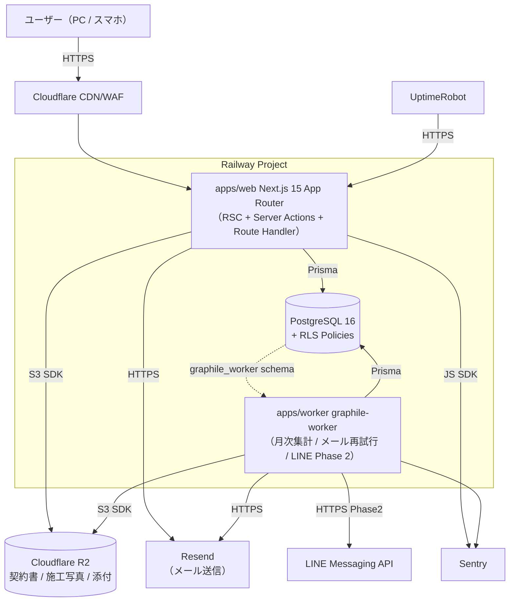
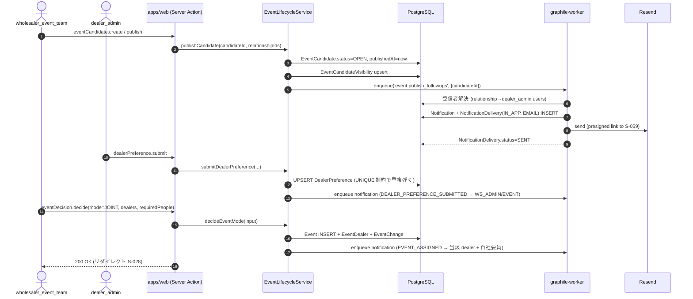
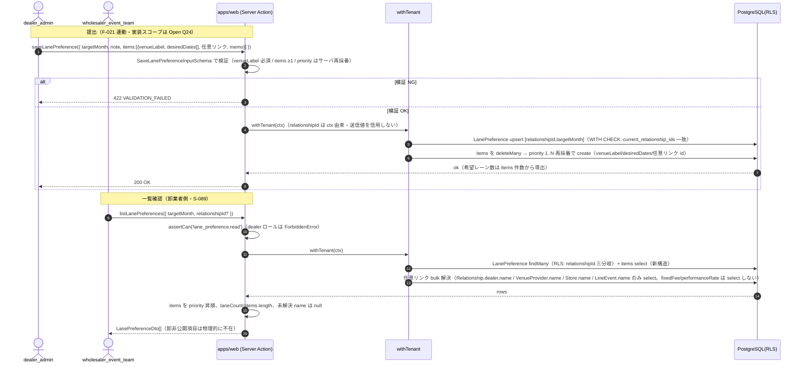
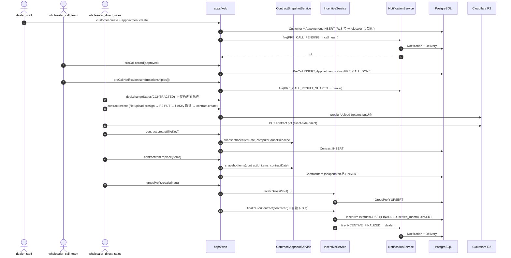
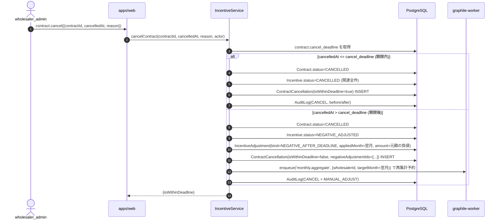
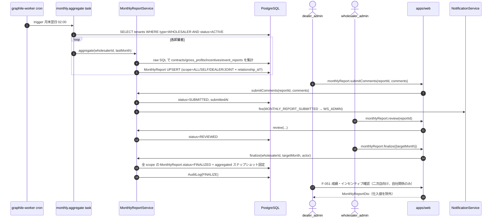
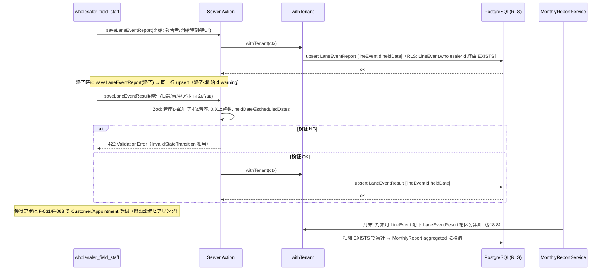

# プログラム設計書 — 太陽光卸・二次店営業管理 SaaS

本書は `docs/01-business-requirements.md`（業務要件 v2）/ `docs/02-functional-requirements.md`（機能要件 F-001〜F-058）/ `docs/03-tech-selection.md`（技術選定）/ `docs/04-ui-design.md`（画面 S-001〜S-085）を統合し、`programmer` エージェントが「再設計せずに実装できる」レベルの具体性で本 SaaS の実装ブループリントを定める。

> **読み替えメモ**: `.claude/agents/program-design.md` および `CLAUDE.md` は元 A2P（AI 駆動の出版ツール）向けに書かれている。本プロジェクトは「太陽光卸・二次店営業管理 SaaS」（マルチテナント、業務管理アプリ、AI 非使用）であるため、A2P 固有要素（Marketer/Writer 等のランタイム AI エージェント・token_usage・OpenAI 等）は **本書では採用しない**。§6 は AI エージェント仕様の代わりに **ドメインサービス層仕様** として記述する。R2 はファイル保存層として継承する。

---

## 0. 用語・略号

| 略号 | 内容 |
|---|---|
| `WS` | Wholesaler（卸業者テナント） |
| `DL` | Dealer（二次店テナント） |
| `REL` | Relationship（卸業者×二次店 関係。**主たるテナント分離キー**） |
| `RLS` | PostgreSQL Row-Level Security |
| RHF | react-hook-form |
| SA | Next.js Server Action |
| RH | Route Handler |
| PII | 個人情報（電話・住所・氏名等） |

---

## 1. アーキテクチャ概観

### 1.1 全体構成図



### 1.2 レイヤ責務

| レイヤ | 場所 | 責務 |
|---|---|---|
| Presentation | `apps/web/app/**` | RSC によるサーバ描画、Client Component の状態管理、shadcn/ui コンポジション |
| Action / RH | `apps/web/app/**/actions.ts` / `app/api/**/route.ts` | リクエスト受理、Zod バリデーション、認可、サービス層呼び出し、レスポンス整形（DTO 変換 + マスキング） |
| Domain Service | `apps/web/lib/**` + `packages/contracts/services/` | ビジネスロジック（粗利・インセンティブ・スコープ判定・スナップショット）。**純関数 + Prisma 依存に分離** |
| Persistence | `packages/db/prisma/` + テナント拡張 | Prisma Client。`$extends` でテナント条件を自動付与 |
| Storage | `packages/storage/` | R2 への pre-signed URL 発行・ダウンロード |
| Auth | `packages/auth/` | Auth.js v5 設定、TOTP、パスワード hash、招待トークン |
| Background | `apps/worker/jobs/**` | graphile-worker タスク本体。crontab 定義含む |
| Shared | `packages/contracts/` | Zod スキーマ・TS 型・列挙体・計算ロジックを Web/Worker 双方で共有 |
| UI Kit | `packages/ui/` | shadcn コンポーネント再利用、テーマトークン |

### 1.3 Phase ごとの差分

| Phase | 期間 | 増分 |
|---|---|---|
| Phase 1 (MVP, 〜2 か月) | 現在 | 本書のすべての構成（F-001〜F-053, F-055, F-056）を実装 |
| Phase 2 (〜6 か月) | 後続 | LINE 通知ジョブ (`notification.send_line`)、CSV インポートジョブ (`import.csv.*`)、PWA、BI 強化、画像サムネイル (`media.generate_thumbnail`) を追加。ジョブ層・通知ルータが拡張ポイント |
| Phase 3 | 後続 | 施工業者向け簡易画面、補助金 API 連携 |
| Phase 4 | 後続 | Stripe 課金、PDF 帳票（`@react-pdf/renderer`）、マルチクラウド |

Phase 2 以降は本書で「拡張ポイント」を明示する場所（通知ルータ / ジョブ登録 / Feature Flag）に追加するだけで取り込める設計とする。

---

## 2. モノレポ構成

### 2.1 ディレクトリツリー

```text
solar-saas/
├── .claude/                            # ハーネスエージェント（実装には含まれない）
├── docs/                               # 設計成果物（01〜05 + sprints + wireframes）
├── apps/
│   ├── web/                            # Next.js 15 (App Router)
│   │   ├── app/
│   │   │   ├── (auth)/                 # サインイン・2FA・パスワードリセット系
│   │   │   │   ├── login/page.tsx                 # S-001
│   │   │   │   ├── mfa/page.tsx                   # S-002, S-003
│   │   │   │   ├── reset/page.tsx                 # S-004, S-005
│   │   │   │   └── locked/page.tsx                # S-006
│   │   │   ├── (onboarding)/
│   │   │   │   ├── invite/[token]/page.tsx        # S-007
│   │   │   │   ├── signup/code/page.tsx           # S-008
│   │   │   │   ├── signup/company/page.tsx        # S-009
│   │   │   │   ├── signup/admin/page.tsx          # S-010
│   │   │   │   └── select-context/page.tsx        # S-011, S-012
│   │   │   ├── (saas-admin)/                      # B. 運営者 (S-013〜S-017, S-085)
│   │   │   ├── (wholesaler)/                      # C. 卸業者本部 (S-018〜S-052)
│   │   │   ├── (field)/                           # D. 現場要員 (S-053〜S-057)
│   │   │   ├── (dealer)/                          # E/F. 二次店 (S-058〜S-077)
│   │   │   ├── (common)/                          # G. 共通 (S-078〜S-084)
│   │   │   └── api/                               # Route Handler（プレサインド・Webhook 等）
│   │   │       ├── auth/[...nextauth]/route.ts    # Auth.js v5 ハンドラ
│   │   │       ├── files/presign/route.ts         # R2 pre-signed URL 発行
│   │   │       ├── files/download/[key]/route.ts  # ダウンロード（権限チェック付）
│   │   │       ├── webhooks/resend/route.ts       # メールイベント Webhook
│   │   │       └── health/route.ts                # ヘルスチェック
│   │   ├── components/                            # 画面共通の React コンポーネント
│   │   │   ├── layout/                            # AppShell, Sidebar, Header
│   │   │   ├── tables/                            # TanStack Table ラッパ
│   │   │   ├── forms/                             # RHF + zod resolver の共通ラッパ
│   │   │   ├── charts/                            # Recharts ラッパ
│   │   │   └── data/                              # サーバ取得 + Suspense 境界
│   │   ├── lib/
│   │   │   ├── auth/                              # auth.ts (Auth.js v5), totp.ts, password.ts, invite.ts
│   │   │   ├── permissions/                       # assertCan, RBAC マトリクス
│   │   │   ├── tenancy/                           # getTenantContext, RLS session helper
│   │   │   ├── masking/                           # maskPhone, maskAddress, maskName
│   │   │   ├── validators/                        # 共有 Zod schema（contracts へ再エクスポート）
│   │   │   ├── notifications/                     # NotificationService 実装
│   │   │   ├── audit/                             # recordAudit, AuditLogger
│   │   │   ├── domain/                            # 計算サービス（commission, gross-profit, scope, snapshot 等）
│   │   │   └── jobs/                              # ジョブを enqueue するクライアントラッパ
│   │   ├── middleware.ts                          # 認証・テナント・2FA ガード
│   │   ├── next.config.mjs
│   │   └── tests/                                 # Vitest unit / integration（web 内）
│   └── worker/                                    # graphile-worker プロセス
│       ├── src/
│       │   ├── index.ts                           # runner 起動
│       │   ├── crontab.ts                         # cron 定義
│       │   └── tasks/
│       │       ├── monthly.aggregate.ts
│       │       ├── monthly.finalize.ts
│       │       ├── incentive.calculate.ts
│       │       ├── incentive.cancel_or_negative_adjust.ts
│       │       ├── notification.send_email.ts
│       │       ├── notification.send_inapp.ts
│       │       ├── notification.send_line.ts      # Phase 2（feature flag）
│       │       ├── audit_log.flush.ts
│       │       ├── reminder.dispatch.ts           # 期限近接通知
│       │       └── media.generate_thumbnail.ts    # Phase 2
│       └── tests/
├── packages/
│   ├── db/                                        # Prisma スキーマ + Client
│   │   ├── prisma/
│   │   │   ├── schema.prisma
│   │   │   ├── migrations/
│   │   │   └── seed.ts
│   │   └── src/
│   │       ├── client.ts                          # PrismaClient + extensions 適用済みのシングルトン
│   │       ├── extensions/
│   │       │   ├── tenancy.ts                     # テナント条件強制注入
│   │       │   ├── soft-mask.ts                   # （非マスク権限なら通過）
│   │       │   └── audit.ts                       # ミューテーション after で recordAudit
│   │       └── rls.ts                             # SET LOCAL ヘルパ
│   ├── contracts/                                 # Web / Worker 共有
│   │   ├── src/
│   │   │   ├── schemas/                           # Zod スキーマ群（API 入出力）
│   │   │   ├── types/                             # 派生 TypeScript 型
│   │   │   ├── enums/                             # ステータス列挙
│   │   │   ├── services/                          # 純関数の計算ロジック（DB 非依存）
│   │   │   │   ├── gross-profit.ts
│   │   │   │   ├── incentive.ts
│   │   │   │   └── month-range.ts
│   │   │   └── jobs/                              # ジョブ payload zod スキーマ
│   │   └── package.json
│   ├── storage/                                   # R2 (S3 互換) クライアント
│   │   └── src/
│   │       ├── r2-client.ts
│   │       ├── presign.ts
│   │       └── keys.ts                            # キー設計を関数で集約
│   ├── auth/                                      # Auth.js v5 設定共有（web / worker から参照）
│   │   └── src/
│   │       ├── config.ts
│   │       ├── providers.ts
│   │       └── session.ts
│   ├── email/                                     # React Email + Resend クライアント
│   │   └── src/
│   │       ├── client.ts
│   │       └── templates/                         # *.tsx
│   └── ui/                                        # shadcn コンポーネント・テーマ・トークン
│       └── src/
├── tests/
│   └── e2e/                                       # Playwright spec（UC-01〜UC-05 を最低カバー）
├── .env.example
├── package.json                                   # pnpm workspaces
├── pnpm-workspace.yaml
├── turbo.json                                     # （任意）turborepo
└── tsconfig.base.json
```

CLAUDE.md / 提案書 §15 の推奨構成をモノレポ向けに展開している（提案書の `src/app/<feature>/` は `apps/web/app/(wholesaler)/<feature>/` 等にマップ）。

### 2.2 各パッケージの責務

| パッケージ | 公開する主な型・関数 | 依存 |
|---|---|---|
| `@solar/db` | `prisma`（拡張済み Client）、`withTenantContext(ctx, fn)`、`setRlsContext(tx, ctx)` | Prisma |
| `@solar/contracts` | `*Schema`（zod）、`*Dto` 型、`computeGrossProfit()`、`computeIncentive()`、`expandMonthRange()` | zod のみ（**DB 非依存**） |
| `@solar/storage` | `presignUpload({key, contentType, maxBytes})`、`presignDownload({key, ttlSec})`、`buildKey.*()` | `@aws-sdk/client-s3` |
| `@solar/auth` | `authConfig`、`getSession()`、`requireRole(role[])` | next-auth, argon2, otpauth |
| `@solar/email` | `sendEmail(template, props)`、テンプレート集 | resend, react-email |
| `@solar/ui` | `Button`, `Sheet`, `DataTable`, テーマ | tailwind, radix |
| `apps/web` | UI + API。サービス層 (`lib/domain/`) を経由してのみ DB を触る | 上記すべて |
| `apps/worker` | graphile-worker タスク。Web と同サービスを共有する | `@solar/contracts`, `@solar/db`, `@solar/email`, `@solar/storage` |

サービス層を **`packages/contracts/services/` の純関数** と **`apps/web/lib/domain/` の Prisma 依存ラッパ** に二分する。これにより Worker からは純関数を直接呼べ、Web ではトランザクション・監査ログを巻き取った形で呼べる。

---

## 3. DB スキーマ (Prisma)

### 3.1 共通方針

- **PK**: 基本 `id String @id @default(cuid())`。`audit_logs` 等は単調増加性を優先して BigInt も検討。
- **タイムスタンプ**: 全テーブル `createdAt DateTime @default(now())` / `updatedAt DateTime @updatedAt`。
- **テナント分離キー**:
  - 卸業者内マスタ → `wholesalerId`
  - 業務トランザクション（希望提出・契約・インセンティブ等）→ `relationshipId`（NULL 許容のものは「自社開催由来」を示す）
  - 二次店内マスタ → `dealerId`
- **金額・率**: `Decimal(14,2)`（金額）/ `Decimal(5,2)`（％ 0〜100、小数第 2 位まで）。**Float 禁止**。
- **ステータス**: すべて Prisma `enum` で型化。
- **ソフトデリート**: マスタ系（`venue_providers`, `installers`, `products`）は `isActive` で論理停止。トランザクション系は物理削除しない（監査要件 §11）。

### 3.2 認証・テナント

```prisma
enum TenantType { WHOLESALER DEALER }
enum TenantPlan { PILOT SMALL MEDIUM LARGE }
enum TenantStatus { ACTIVE SUSPENDED }
enum PiiMaskingMode { MASKED FULL PARTIAL }
//
// PiiMaskingMode の値 — `WholesalerSettings.piiMaskingMode` で参照（docs/03 §4.3 MVP デフォルトに対応）。
// 実際の文字列／表示制御は `MaskingService`（§6.5）と `ViewerContext` の組合せで決定する。
//
// | 値        | 意味                                                                                                  | 主な利用シーン                          |
// |-----------|-------------------------------------------------------------------------------------------------------|------------------------------------------|
// | MASKED    | 二次店メンバ向けに常時マスク。電話は下 4 桁のみ（例: `****-****-1234`）、住所は市区町村まで、氏名は姓のみ | 二次店ロール（DEALER_*）の既定動作        |
// | FULL      | 卸業者管理者向けデフォルト非マスク（フル表示）                                                          | 卸業者管理者（WHOLESALER_ADMIN 等）の既定 |
// | PARTIAL   | 電話下 4 桁のみ可視・住所と氏名はマスクの中間モード（卸業者がコール業務委託先に部分公開する用途）        | 卸業者運用ポリシーで任意指定              |

model Tenant {
  id            String        @id @default(cuid())
  type          TenantType
  name          String
  plan          TenantPlan?   // dealer は null
  status        TenantStatus  @default(ACTIVE)
  createdAt     DateTime      @default(now())
  updatedAt     DateTime      @updatedAt

  users         User[]
  wholesalerSetting   WholesalerSettings?
  asWholesaler  Relationship[] @relation("Wholesaler")
  asDealer      Relationship[] @relation("Dealer")
  inviteCodes   InviteCode[]

  @@index([type, status])
}

model WholesalerSettings {
  wholesalerId            String   @id
  cancelDeadlineDays      Int      @default(8)              // F-015
  fiscalYearStartMonth    Int      @default(4)              // F-016 (1..12)
  defaultIncentiveType    IncentiveTargetType @default(PROJECT_PROFIT)
  piiMaskingMode          PiiMaskingMode @default(MASKED)   // OQ-2 デフォルト
  createdAt               DateTime @default(now())
  updatedAt               DateTime @updatedAt

  tenant      Tenant @relation(fields: [wholesalerId], references: [id], onDelete: Cascade)
}

enum UserStatus { ACTIVE SUSPENDED INVITED }

model User {
  id              String      @id @default(cuid())
  tenantId        String
  email           String      @unique
  passwordHash    String?     // 招待中は null
  name            String
  status          UserStatus  @default(INVITED)
  twoFactorRequired Boolean   @default(false)
  sessionVersion  Int         @default(0)                   // 強制ログアウト時にインクリメント
  lastLoginAt     DateTime?
  createdAt       DateTime    @default(now())
  updatedAt       DateTime    @updatedAt

  tenant          Tenant      @relation(fields: [tenantId], references: [id], onDelete: Cascade)
  roles           UserRole[]
  totpSecret      TotpSecret?
  backupCodes     BackupCode[]
  loginAttempts   LoginAttempt[]
  sessions        Session[]
  notifications   Notification[]

  @@index([tenantId, status])
  @@index([email])
}

enum AppRole {
  SAAS_ADMIN
  WHOLESALER_ADMIN
  WHOLESALER_EVENT_TEAM
  WHOLESALER_CALL_TEAM
  WHOLESALER_DIRECT_SALES
  WHOLESALER_FIELD_STAFF
  DEALER_ADMIN
  DEALER_STAFF
}

model UserRole {
  userId      String
  role        AppRole
  assignedAt  DateTime @default(now())
  assignedBy  String?

  user        User @relation(fields: [userId], references: [id], onDelete: Cascade)

  @@id([userId, role])
  @@index([role])
}

enum RelationshipStatus { ACTIVE SUSPENDED }
enum DealerScope { APPOINTMENT_ONLY FIRST_VISIT FULL_CLOSING }

model Relationship {
  id            String      @id @default(cuid())
  wholesalerId  String
  dealerId      String
  status        RelationshipStatus @default(ACTIVE)
  defaultScope  DealerScope @default(FULL_CLOSING)
  note          String?
  createdAt     DateTime    @default(now())
  updatedAt     DateTime    @updatedAt

  wholesaler    Tenant @relation("Wholesaler", fields: [wholesalerId], references: [id])
  dealer        Tenant @relation("Dealer", fields: [dealerId], references: [id])
  incentiveRates IncentiveRate[]

  @@unique([wholesalerId, dealerId])
  @@index([wholesalerId, status])
  @@index([dealerId, status])
}

model InviteCode {
  id           String   @id @default(cuid())
  wholesalerId String
  codeHash     String   @unique                              // 平文は表示直後に破棄
  expiresAt    DateTime
  maxUses      Int      @default(1)
  usedCount    Int      @default(0)
  createdBy    String
  revokedAt    DateTime?
  createdAt    DateTime @default(now())

  wholesaler   Tenant @relation(fields: [wholesalerId], references: [id])

  @@index([wholesalerId, expiresAt])
}

model UserInvitation {
  id          String   @id @default(cuid())
  tenantId    String
  email       String
  role        AppRole
  tokenHash   String   @unique
  expiresAt   DateTime
  acceptedAt  DateTime?
  invitedBy   String
  createdAt   DateTime @default(now())

  @@index([tenantId, email])
}

model TotpSecret {
  userId      String   @id
  secretEnc   String                                          // KMS不要なら env 暗号化キーで symmetric encrypt
  activatedAt DateTime?
  createdAt   DateTime @default(now())

  user        User @relation(fields: [userId], references: [id], onDelete: Cascade)
}

model BackupCode {
  id          String   @id @default(cuid())
  userId      String
  codeHash    String                                          // argon2
  usedAt      DateTime?
  createdAt   DateTime @default(now())

  user        User @relation(fields: [userId], references: [id], onDelete: Cascade)

  @@unique([userId, codeHash])
}

model LoginAttempt {
  id          String   @id @default(cuid())
  userId      String?
  email       String
  ip          String
  success     Boolean
  reason      String?
  createdAt   DateTime @default(now())

  user        User? @relation(fields: [userId], references: [id])

  @@index([email, createdAt])
  @@index([ip, createdAt])
}

// Auth.js v5 セッション格納用（JWT 検証補助）
model Session {
  id             String   @id @default(cuid())
  userId         String
  sessionToken   String   @unique
  sessionVersion Int
  expiresAt      DateTime
  lastSeenAt     DateTime @default(now())
  createdAt      DateTime @default(now())

  user           User     @relation(fields: [userId], references: [id], onDelete: Cascade)

  @@index([userId])
}
```

### 3.3 マスタ

```prisma
enum VenueContractType { FIXED PERFORMANCE OTHER }

model VenueProvider {
  id              String   @id @default(cuid())
  wholesalerId    String
  name            String
  contactName     String?
  phone           String?
  email           String?
  postalCode      String?
  address         String?
  area            String?
  contractType    VenueContractType?
  fixedFee        Decimal? @db.Decimal(14,2)
  performanceRate Decimal? @db.Decimal(5,2)
  note            String?
  isActive        Boolean  @default(true)
  createdAt       DateTime @default(now())
  updatedAt       DateTime @updatedAt

  @@index([wholesalerId, isActive])
}

enum ProductCategory { PANEL BATTERY POWER_CONDITIONER MOUNT OTHER_PART SET }

model Product {
  id              String   @id @default(cuid())
  wholesalerId    String
  category        ProductCategory
  maker           String
  name            String
  modelNo         String?
  capacity        Decimal? @db.Decimal(10,2)
  unit            String
  purchasePrice   Decimal  @db.Decimal(14,2)
  dealerPrice     Decimal  @db.Decimal(14,2)
  listPrice       Decimal  @db.Decimal(14,2)
  effectiveFrom   DateTime
  effectiveTo     DateTime?
  isActive        Boolean  @default(true)
  note            String?
  createdAt       DateTime @default(now())
  updatedAt       DateTime @updatedAt
  createdBy       String

  priceHistory    ProductPriceHistory[]

  @@index([wholesalerId, category, isActive])
  @@index([wholesalerId, effectiveFrom, effectiveTo])
}

model ProductPriceHistory {
  id               String   @id @default(cuid())
  productId        String
  before           Json
  after            Json
  changedBy        String
  changedAt        DateTime @default(now())

  product          Product @relation(fields: [productId], references: [id])

  @@index([productId, changedAt])
}

model Installer {
  id            String   @id @default(cuid())
  wholesalerId  String
  name          String
  contactName   String?
  phone         String?
  email         String?
  area          String?
  isActive      Boolean  @default(true)
  createdAt     DateTime @default(now())
  updatedAt     DateTime @updatedAt

  @@index([wholesalerId, isActive])
}

enum IncentiveTargetType { PROJECT_PROFIT WHOLESALE_PROFIT MANUAL }

model IncentiveRate {
  id              String   @id @default(cuid())
  relationshipId  String
  targetType      IncentiveTargetType
  rate            Decimal  @db.Decimal(5,2)                  // % 0..100
  effectiveFrom   DateTime
  effectiveTo     DateTime?
  note            String?
  createdAt       DateTime @default(now())
  updatedAt       DateTime @updatedAt
  createdBy       String

  relationship    Relationship @relation(fields: [relationshipId], references: [id])

  @@index([relationshipId, effectiveFrom, effectiveTo])
}
```

### 3.4 場所取り・イベント

```prisma
enum VenueNegotiationStatus {
  NOT_CONTACTED CONTACTING CONDITION_REVIEW FEASIBLE INFEASIBLE FIXED CANCELLED
}

model VenueNegotiation {
  id                String   @id @default(cuid())
  wholesalerId      String
  venueProviderId   String
  candidateDates    Json                                       // ISO 日付配列
  decidedDate       DateTime?
  contractType      VenueContractType?
  fixedFee          Decimal? @db.Decimal(14,2)
  performanceRate   Decimal? @db.Decimal(5,2)
  conditionNote     String?
  status            VenueNegotiationStatus @default(NOT_CONTACTED)
  nextAction        String?
  assigneeId        String?
  note              String?
  createdAt         DateTime @default(now())
  updatedAt         DateTime @updatedAt

  venueProvider     VenueProvider @relation(fields: [venueProviderId], references: [id])

  @@index([wholesalerId, status])
}

enum EventCandidateStatus { DRAFT OPEN CLOSED DECIDED CANCELLED }

model EventCandidate {
  id                  String   @id @default(cuid())
  wholesalerId        String
  venueProviderId     String?
  venueNegotiationId  String?
  targetMonth         String                                   // 'YYYY-MM' 文字列
  scheduledDate       DateTime
  storeName           String
  address             String?
  area                String?
  deadlineAt          DateTime
  contractType        VenueContractType?
  fixedFee            Decimal? @db.Decimal(14,2)
  performanceRate     Decimal? @db.Decimal(5,2)
  internalNote        String?
  status              EventCandidateStatus @default(DRAFT)
  publishedAt         DateTime?
  createdBy           String
  createdAt           DateTime @default(now())
  updatedAt           DateTime @updatedAt

  visibilities        EventCandidateVisibility[]
  preferences         DealerPreference[]
  event               Event?

  @@index([wholesalerId, targetMonth, status])
  @@index([wholesalerId, scheduledDate])
}

model EventCandidateVisibility {
  eventCandidateId  String
  relationshipId    String
  isVisible         Boolean  @default(true)
  notifiedAt        DateTime?

  eventCandidate    EventCandidate @relation(fields: [eventCandidateId], references: [id], onDelete: Cascade)
  relationship      Relationship   @relation(fields: [relationshipId], references: [id])

  @@id([eventCandidateId, relationshipId])
  @@index([relationshipId, isVisible])
}

// F-059 レーンイベント — 懇意の場所提供元と月単位で複数開催日を契約するイベント。
// 単発の EventCandidate（1日1件・場所取り型）と異なり、1 行が対象月内の複数開催日
// (scheduledDates) を保持する。仕入値は扱わず、場所提供元との契約条件のみ持つ。
enum LineEventStatus { DRAFT CONFIRMED CANCELLED }  // 確認中 / 確定 / 中止

model LineEvent {
  id              String             @id @default(cuid())
  wholesalerId    String
  venueProviderId String?
  name            String                                       // レーン名
  targetMonth     String                                       // 'YYYY-MM' 文字列
  area            String?
  scheduledDates  Json                                         // 'YYYY-MM-DD' 配列（月内の開催日）
  contractType    VenueContractType?
  fixedFee        Decimal? @db.Decimal(14,2)                   // FIXED: 日当たり報酬額
  performanceRate Decimal? @db.Decimal(5,2)                    // PERFORMANCE: 成果報酬率%
  contractNote    String?
  status          LineEventStatus    @default(DRAFT)
  createdBy       String
  createdAt       DateTime           @default(now())
  updatedAt       DateTime           @updatedAt

  @@index([wholesalerId, targetMonth])
  @@index([wholesalerId, status])
}

// F-060 二次店レーン希望 — 二次店が月単位で「希望するレーン（＝希望場所 × 希望開催日）」を
// 希望順位付きで複数件提出する（ボトムアップ）。旧仕様（卸業者が作成した確定レーン
// (LineEvent)を二次店が優先順位付けするトップダウン）から構造改訂（§3.4.1 / §19）。
// MVP は卸業者の一覧確認 (S-089) を中心に実装し、二次店側の提出フォームのスコープは
// Open Q24（pm/iterate 判断）。
model LanePreference {
  id             String   @id @default(cuid())
  wholesalerId   String
  relationshipId String                                         // 提出二次店との関係
  targetMonth    String                                         // 'YYYY-MM'
  note           String?                                        // 特記事項（旧 comment を改称・維持）
  submittedAt    DateTime @default(now())
  submittedBy    String

  items LanePreferenceItem[]

  @@unique([relationshipId, targetMonth])                       // 二次店×月で一意（再提出は更新扱い）
  @@index([wholesalerId, targetMonth])
}

// レーン希望の各明細（希望順位付き）。priority=1 が希望①。
// venueLabel が一次ソース（必須）。venueProviderId / storeId / lineEventId は
// マスタ・確定レーンへの任意リンク（FK を張らず id で柔リンク）— loader 層で
// findMany → Map で名称を結合する（VenueProvider 解決と同方針 / §3.4.1）。
model LanePreferenceItem {
  id               String @id @default(cuid())
  lanePreferenceId String
  priority         Int                                          // 1=希望①, 2=希望②, ...（表示順を兼ねる）
  venueLabel       String                                       // 希望場所ラベル（必須・一次ソース。例「カインズ 大宮店」）
  venueProviderId  String?                                      // 場所提供元マスタへの任意リンク（FK なし）
  storeId          String?                                      // 店舗マスタへの任意リンク（FK なし）
  lineEventId      String?                                      // 確定レーン(LineEvent)への任意リンク（旧必須→NULL 許容に降格）
  desiredDates     Json?                                        // 希望開催日 'YYYY-MM-DD' 配列（週単位の複数希望日。§3.4.1）
  memo             String?                                      // レーン別メモ（任意）

  lanePreference LanePreference @relation(fields: [lanePreferenceId], references: [id], onDelete: Cascade)

  @@index([lanePreferenceId])
}

model DealerPreference {
  id                String   @id @default(cuid())
  eventCandidateId  String
  relationshipId    String
  targetMonth       String
  priority          Int?
  availableDates    Json?                                      // ISO 配列
  availablePeople   Int?
  comment           String?
  submittedAt       DateTime @default(now())
  submittedBy       String

  eventCandidate    EventCandidate @relation(fields: [eventCandidateId], references: [id])
  relationship      Relationship   @relation(fields: [relationshipId], references: [id])

  @@unique([eventCandidateId, relationshipId])
  @@index([relationshipId, targetMonth])
}

enum EventMode { SELF DEALER JOINT CANCELLED }
enum EventStatus { PLANNED ONGOING CLOSED CANCELLED }

model Event {
  id                  String      @id @default(cuid())
  wholesalerId        String
  eventCandidateId    String      @unique
  mode                EventMode
  requiredPeople      Int?
  decidedBy           String
  decidedAt           DateTime    @default(now())
  status              EventStatus @default(PLANNED)
  note                String?
  createdAt           DateTime    @default(now())
  updatedAt           DateTime    @updatedAt

  eventCandidate      EventCandidate @relation(fields: [eventCandidateId], references: [id])
  dealers             EventDealer[]
  shifts              EventShift[]
  reports             EventReport[]
  changes             EventChange[]
  appointments        Appointment[]

  @@index([wholesalerId, status])
}

model EventDealer {
  eventId         String
  relationshipId  String
  scopeOverride   DealerScope?                                 // null なら関係デフォルト適用
  assignedBy      String
  assignedAt      DateTime @default(now())

  event           Event @relation(fields: [eventId], references: [id], onDelete: Cascade)
  relationship    Relationship @relation(fields: [relationshipId], references: [id])

  @@id([eventId, relationshipId])
  @@index([relationshipId])
}

enum ShiftRole { LEAD CATCH RECEPTION PITCH OTHER }
enum ShiftStatus { ASSIGNED CHECKED_IN CHECKED_OUT NO_SHOW }

model EventShift {
  id            String      @id @default(cuid())
  eventId       String
  userId        String
  role          ShiftRole
  startPlanned  DateTime
  endPlanned    DateTime
  startActual   DateTime?
  endActual     DateTime?
  status        ShiftStatus @default(ASSIGNED)
  note          String?
  createdAt     DateTime    @default(now())
  updatedAt     DateTime    @updatedAt

  event         Event @relation(fields: [eventId], references: [id], onDelete: Cascade)

  @@index([eventId])
  @@index([userId, startPlanned, endPlanned])                  // 重複検出
}

enum EventReportType { START END RESULT }

model EventReport {
  id              String   @id @default(cuid())
  eventId         String
  type            EventReportType
  reporterUserId  String
  reporterOrgType TenantType
  payload         Json                                         // 種別ごとに異なる
  createdAt       DateTime @default(now())

  event           Event @relation(fields: [eventId], references: [id], onDelete: Cascade)

  @@index([eventId, type])
}

model EventChange {
  id            String   @id @default(cuid())
  eventId       String
  before        Json
  after         Json
  changedBy     String
  changedAt     DateTime @default(now())

  event         Event @relation(fields: [eventId], references: [id], onDelete: Cascade)

  @@index([eventId, changedAt])
}
```

#### 3.4.1 `LanePreference` 構造改訂の設計判断（F-060）

docs/02 F-060 の構造改訂（トップダウン → ボトムアップ）と §9 申し送りを反映する。要点と設計判断は以下。

**(1) `comment` → `note` 改称**: 提出ヘッダの自由記述を「特記事項 (`note`)」に改称（業務語との一致）。バックフィルで旧 `comment` 値を `note` にコピーする（§3.4.3 / migration A）。

**(2) `venueLabel` を一次ソース・必須化**: 希望場所はマスタ（場所提供元 / 店舗）リンクを必須とせず、表示用ラベル文字列 `venueLabel` を一次ソースとして **NOT NULL** で保持する。二次店はマスタ未登録の場所も自由記述で提出できる（docs/02 申し送り 25）。卸業者が後からマスタへ寄せても `venueLabel` は破棄せず、突合用に併存する。

**(3) 任意リンク（`venueProviderId` / `storeId` / `lineEventId`）は FK を張らない柔リンク**:

- 既存 `LineEvent.venueProviderId`（解決を loader の `findMany` → `Map` で行う）と同方針。理由:
  - **NULL 許容かつマスタ未登録を許す**ため、参照整合性 FK を要求すると「未登録の希望場所を保存できない」業務要件（自由記述許容）と矛盾する。
  - マスタ行の物理削除/差し替えに対し希望明細を孤児化させず、ラベル文字列で意味を保持できる（突合は best-effort）。
  - RLS の相関 EXISTS が `LanePreference` 親 1 経路で完結し、`venueProvider` / `store` / `lineEvent` への FK 連鎖（別テナント参照リスク）を持ち込まない。
- 解決は loader 層で `venueProviderId` / `storeId` / `lineEventId` を集約 → 各マスタを `findMany`（`withTenant` 内）→ `Map` で名称結合（§3.4.4 / data.ts）。

**(4) 希望開催日 `desiredDates` の保持方式（Open Q26 確定）**:

- **確定: `Json?`（`'YYYY-MM-DD'` 文字列のフラット配列）** を採用する。週単位の「希望日帯」（例 7/7~8・7/12~13・7/14~15）は、各帯を構成する日付をフラット配列に展開して保持する（MVP は連続日を日付列挙で表現。UI 側で隣接日をチップにグルーピング）。
- **採用理由**:
  - 既存 `LineEvent.scheduledDates`（`Json`, `'YYYY-MM-DD'` 配列）と**方式を統一**し、loader / DTO / 表示ロジックを共通化できる（バックフィル時の互換も容易）。
  - レーン日程は「日の集合」が本質で、`{from,to}` 範囲は連続 2 日帯の特殊形にすぎない。日付配列で全帯を表現でき、MVP の集計（希望日件数・重複検出）も配列で済む。
  - スキーマ追加が 1 列で完結し、子テーブル 1 つ分の RLS / FK / マイグレーションを節約する。
- **子テーブル案（`lane_preference_dates`）との比較**: 子テーブルは (a) 日帯に開催枠属性（午前/午後等）を後付けする拡張余地と (b) 日付単位の集計クエリ最適化に優れるが、MVP には属性も大量集計も不要で、追加テーブル分の RLS（親 `LanePreference.wholesalerId` 経由 EXISTS）・FK・マイグレーション・loader join のコストが見合わない。**週帯を `{from,to}` 構造や枠属性付きで持つ業務要件が確定したら Phase 2 で子テーブルへ昇格**する（§3.4.5 TBD）。`LineEvent.scheduledDates` と同列の方式で揃えることを優先。

**(5) 「希望レーン数」は導出**: 冗長カラムを持たず `LanePreferenceItem` の件数から算出（docs/02 申し送り 27）。一覧バッジ・集計は常に `items.length`。

##### 3.4.2 RLS（変更なし）

`LanePreference` / `LanePreferenceItem` の RLS は**現行方針を踏襲し変更しない**（§3.9 / 既存 migration `20260528050000_lane_preference`）。

- `LanePreference`: `relationshipId` ベースの三分岐（saas_admin 全件 / 卸業者ロールは `Relationship.wholesalerId` 経由 EXISTS / 二次店ロールは `current_relationship_ids` GUC 一致）。
- `LanePreferenceItem`: 親 `LanePreference` 経由の相関 EXISTS で可視性を継承（既存方針）。新規列追加・`lineEventId` の NULL 許容化は RLS 述語に影響しない（分離キーは `LanePreference.relationshipId` / `wholesalerId` のままで、`venueProviderId` / `storeId` / `lineEventId` は分離キーに使わない）。
- 任意リンク先（`VenueProvider` / `Store` / `LineEvent`）の名称解決は loader が **同一 `withTenant` トランザクション内**で `findMany` するため、各マスタの自テナント RLS が二重に効く（別テナントの id を偶発リンクしても名称は解決されず `null` になる＝漏えいなし）。

##### 3.4.3 マイグレーション計画（非破壊・2 段階: migration A / B）

既存連番（`20260605010000_lane_event_reports_f064` / §18.6）の後に採番。

| 段階 | マイグレーション | 内容 | 破壊性 |
|---|---|---|---|
| A | `20260606000000_lane_preference_bottomup` | 列追加（`venueLabel` を **NULL 許容で**追加 / `venueProviderId` / `storeId` / `desiredDates` / `memo` / `note`）+ `lineEventId` を `DROP NOT NULL` + 既存データのバックフィル（`note ← comment`、各 `LanePreferenceItem` は旧必須 `lineEventId` → `LineEvent` から `venueLabel`（名称）/ `desiredDates`（`scheduledDates`）を埋める）+ `venueLabel` を **NOT NULL 化**（バックフィル済み前提） | 非破壊（既存行を更新で埋めるのみ） |
| B | `20260606010000_lane_preference_drop_comment` | 旧 `comment` 列を **DROP**（A で `note` へコピー済み・参照削除完了後に実行） | 列 drop（A で値退避済みのため情報損失なし） |

**migration A の SQL 要点**（`20260606000000_lane_preference_bottomup/migration.sql`、方針）:

```sql
-- 1) 親ヘッダ: note 追加 + comment 値をコピー（comment は B で drop するまで残置）
ALTER TABLE "LanePreference" ADD COLUMN "note" TEXT;
UPDATE "LanePreference" SET "note" = "comment" WHERE "comment" IS NOT NULL;

-- 2) 明細: 新規列を NULL 許容で追加（venueLabel も一旦 NULL 許容）
ALTER TABLE "LanePreferenceItem" ADD COLUMN "venueLabel"      TEXT;
ALTER TABLE "LanePreferenceItem" ADD COLUMN "venueProviderId" TEXT;
ALTER TABLE "LanePreferenceItem" ADD COLUMN "storeId"         TEXT;
ALTER TABLE "LanePreferenceItem" ADD COLUMN "desiredDates"    JSONB;
ALTER TABLE "LanePreferenceItem" ADD COLUMN "memo"            TEXT;

-- 3) lineEventId を NULL 許容へ降格（任意リンク化）
ALTER TABLE "LanePreferenceItem" ALTER COLUMN "lineEventId" DROP NOT NULL;

-- 4) 既存明細を確定レーン(LineEvent)からバックフィル
--    venueLabel ← LineEvent.name、desiredDates ← LineEvent.scheduledDates
UPDATE "LanePreferenceItem" li
SET "venueLabel"   = COALESCE(le."name", '（未設定）'),
    "venueProviderId" = le."venueProviderId",
    "desiredDates" = le."scheduledDates"
FROM "LineEvent" le
WHERE li."lineEventId" = le."id";

-- 5) リンク先 LineEvent が無い既存明細の保険（理論上 NOT NULL FK だったので無いはず）
UPDATE "LanePreferenceItem" SET "venueLabel" = '（未設定）' WHERE "venueLabel" IS NULL;

-- 6) バックフィル完了 → venueLabel を NOT NULL 化
ALTER TABLE "LanePreferenceItem" ALTER COLUMN "venueLabel" SET NOT NULL;
```

**migration B の SQL 要点**（`20260606010000_lane_preference_drop_comment/migration.sql`、方針）:

```sql
-- A で note へ退避済み・全参照を note へ移行完了後に実行
ALTER TABLE "LanePreference" DROP COLUMN "comment";
```

注意:
- **適用順序（A 内）**: ADD COLUMN（NULL 許容）→ UPDATE バックフィル → DROP NOT NULL（lineEventId）→ SET NOT NULL（venueLabel）。NOT NULL 化は必ずバックフィル後。
- **冪等性**: バックフィル UPDATE は再実行安全（同値代入）。`venueLabel` の NOT NULL 化前に必ず保険 UPDATE（手順 5）で NULL を潰す。
- **RLS 変更なし**: 列追加・NULL 許容化は RLS 述語に影響しないため `20260528050000_lane_preference` のポリシーを再作成しない。
- **comment 残置 → drop の二段**: A で `note` を正にしつつ `comment` を残置（ローダ/アクション/シードの全参照を `note` へ移行）。移行完了確認後に B で `comment` を drop（ロールバック余地確保）。pm/iterate の判断で A と B を別 PR に分割可。
- **seed 整合**: `packages/db/prisma/seed.ts`（既存 LanePreference 投入箇所）を新構造（`note` / `venueLabel` / `desiredDates`）へ更新する（programmer タスク）。

##### 3.4.4 DTO / contracts（新設）

`packages/contracts/src/dto/lane-preference.ts` に zod schema / DTO を新設する（現状 data.ts 内 Row 型のみで contracts に集約されていない）。

```typescript
// packages/contracts/src/dto/lane-preference.ts
import { z } from "zod";

// 希望開催日: 'YYYY-MM-DD' 配列（§3.4.1-(4)）。LineEvent.scheduledDates と同方式。
export const DesiredDatesSchema = z.array(z.string().regex(/^\d{4}-\d{2}-\d{2}$/));
export type DesiredDates = z.infer<typeof DesiredDatesSchema>;

// 卸非公開項目（固定費/成果報酬率 等）は希望明細が保持しない＝物理的に存在しない。
// destructure-and-rest の対象キー集合（将来 venueProvider の契約条件等を結合しても
// DTO へ漏らさないためのガード。Object.keys に出さない / CLAUDE.md #5・F-060 受入）。
export const DEALER_OMITTED_LANE_PREFERENCE_KEYS = [
  "fixedFee",          // 場所提供元固定費（LineEvent / VenueProvider 由来。希望明細には載せない）
  "performanceRate",   // 場所提供元成果報酬率
  "purchasePrice",     // 仕入値（理論上ここに現れないが防御的に列挙）
] as const;

// 明細 DTO（一覧確認ビュー用。任意リンク名は loader が解決して name を埋める）。
export const LanePreferenceItemDtoSchema = z.object({
  priority: z.number().int().positive(),       // 1=希望①
  venueLabel: z.string(),                       // 一次ソース（必須）
  venueProviderId: z.string().nullable(),
  venueProviderName: z.string().nullable(),     // loader 解決値（任意リンク・自テナント RLS 通過時のみ）
  storeId: z.string().nullable(),
  storeName: z.string().nullable(),             // loader 解決値
  lineEventId: z.string().nullable(),
  lineName: z.string().nullable(),              // loader 解決値（確定レーン突合時）
  desiredDates: DesiredDatesSchema,             // 既定 [] にフォールバック
  memo: z.string().nullable(),
});
export type LanePreferenceItemDto = z.infer<typeof LanePreferenceItemDtoSchema>;

export const LanePreferenceDtoSchema = z.object({
  id: z.string(),
  relationshipId: z.string(),
  dealerName: z.string(),
  targetMonth: z.string().regex(/^\d{4}-(0[1-9]|1[0-2])$/),
  note: z.string().nullable(),                  // 旧 comment
  laneCount: z.number().int().nonnegative(),    // 導出: items.length（§3.4.1-(5)）
  submittedAt: z.string(),                      // ISO
  items: z.array(LanePreferenceItemDtoSchema),  // priority 昇順
});
export type LanePreferenceDto = z.infer<typeof LanePreferenceDtoSchema>;

// 二次店提出フォーム入力（§3.4.5 saveLanePreference の payload）。
export const LanePreferenceItemInputSchema = z.object({
  venueLabel: z.string().min(1),                // 必須
  venueProviderId: z.string().nullable().optional(),
  storeId: z.string().nullable().optional(),
  lineEventId: z.string().nullable().optional(),
  desiredDates: DesiredDatesSchema.default([]),
  memo: z.string().nullable().optional(),
  // priority はフォーム行順で自動採番（クライアント送信値は無視 or 検証で上書き）。
});
export const SaveLanePreferenceInputSchema = z.object({
  targetMonth: z.string().regex(/^\d{4}-(0[1-9]|1[0-2])$/),
  note: z.string().nullable().optional(),
  items: z.array(LanePreferenceItemInputSchema).min(1),  // 希望レーン ≥ 1 件
});
export type SaveLanePreferenceInput = z.infer<typeof SaveLanePreferenceInputSchema>;
```

- **data.ts Row 型との関係**: 既存 `LanePreferenceRow` / `LanePreferenceItemRow`（data.ts 内）は本 DTO（`LanePreferenceDto` / `LanePreferenceItemDto`）に**置換**する。loader は contracts の型を import し、data.ts では re-export のみ残す（重複型定義を排除）。
- **物理除外（destructure-and-rest）**: 希望明細は二次店由来の希望情報のみで、卸非公開項目（固定費/成果報酬率/仕入値）は**スキーマ上そもそも保持しない**。任意リンク先 `LineEvent` / `VenueProvider` を loader で結合する際は、`name` だけを `select` し `fixedFee` / `performanceRate` を **`select` に含めない**（Object.keys に出さない / CLAUDE.md #5）。`DEALER_OMITTED_LANE_PREFERENCE_KEYS` は将来結合拡張時のリグレッション防止用ガード集合。
- **ラベル文言**: 「希望①/②」「希望場所」「希望開催日」「特記事項」等の表示文言は `apps/web/lib/i18n/labels.ts` に集約（CLAUDE.md #2）。DTO はキー/値のみで日本語ラベルを持たない。

##### 3.4.5 ローダ / アクション

**読み取り `listLanePreferences(filter)`**（`apps/web/app/(wholesaler)/lane-preferences/data.ts` 改訂）:

```typescript
export async function listLanePreferences(
  filter: { targetMonth?: string; relationshipId?: string } = {},
): Promise<LanePreferenceDto[]>;
```

- 三段イディオム（`auth()` → `assertCan('lane_preference.read')` → `withTenant`）は不変。
- `select` を新構造へ: `note`、`items: { priority, venueLabel, venueProviderId, storeId, lineEventId, desiredDates, memo }`。旧 `comment` 参照を `note` に変更。
- 任意リンク解決（同一 `withTenant` tx 内、bulk findMany → Map）:
  - `relationshipId` → `Relationship.dealer.name`（既存）
  - `venueProviderId`（非 null のみ集約）→ `VenueProvider.name`
  - `storeId`（非 null のみ）→ `Store.name`
  - `lineEventId`（非 null のみ）→ `LineEvent.name`（**`fixedFee` / `performanceRate` / `scheduledDates` は `select` しない**＝卸非公開・不要）
- 各明細を `priority` 昇順にソート、`desiredDates` は `(Json as string[]) ?? []`、未リンク（id が null か解決失敗）の name は `null`。
- `laneCount = items.length` を DTO に詰める（導出）。

**書き込み `saveLanePreference(input)`**（二次店提出。F-021 連動。実装スコープは Open Q24 = pm/iterate 判断）:

```typescript
// apps/web/app/(dealer)/lane-preferences/actions.ts （設計のみ・実装スコープは pm/iterate 判断）
export async function saveLanePreference(
  input: SaveLanePreferenceInput,           // §3.4.4 zod で検証
): Promise<{ ok: true; id: string } | { ok: false; error: string }>;
```

- `auth()` → `assertCan('lane_preference.write')`（dealer_admin） → `withTenant(ctx, ...)` 必須。
- **upsert（対象月 × relationship 一意）**: `LanePreference.upsert({ where: { relationshipId_targetMonth: { relationshipId, targetMonth } }, ... })`。`relationshipId` は ctx から導出（クライアント送信値を信用しない）、`wholesalerId` は当該 `Relationship.wholesalerId` から解決。再提出は更新扱い（既存 `items` を `deleteMany` → 再 create、または差分更新）。
- **priority 採番**: フォーム行順で `1..N` を**サーバ側で再採番**（クライアント送信の priority は無視）。
- `venueLabel` 必須を zod で担保。任意リンク id はそのまま保存（FK なし・存在検証は best-effort、未登録ラベルを許容）。
- RLS の WITH CHECK が `relationshipId` を `current_relationship_ids` で検証するため、他社 relationship への書き込みは DB 層でも拒否（二重防御）。

---

### 3.5 顧客・アポ・マエカク

```prisma
enum CustomerStatus {
  NEW PRE_CALL_WAIT PRE_CALL_DONE VISIT_PLANNED IN_NEGOTIATION CONTRACTED LOST IN_CONSTRUCTION COMPLETED
}
enum AcquisitionChannel { EVENT WALK_IN TELE REFERRAL OTHER }

model Customer {
  id                    String   @id @default(cuid())
  wholesalerId          String
  ownerRelationshipId   String?                                // null = 自社直接
  name                  String
  kana                  String?
  phone                 String
  email                 String?
  postalCode            String?
  address               String?
  housingType           String?
  pvInstalled           Boolean?
  batteryInstalled      Boolean?
  electricBill          String?
  household             String?
  channel               AcquisitionChannel
  sourceEventId         String?
  registeredByUserId    String
  registeredByOrgType   TenantType
  registeredByRelationshipId String?
  status                CustomerStatus @default(NEW)
  note                  String?
  createdAt             DateTime @default(now())
  updatedAt             DateTime @updatedAt

  appointments          Appointment[]
  deals                 Deal[]
  contracts             Contract[]
  sourceEvent           Event? @relation(fields: [sourceEventId], references: [id])

  @@index([wholesalerId, phone])
  @@index([wholesalerId, status, createdAt])
  @@index([ownerRelationshipId])
}

enum AppointmentStatus { UNCONFIRMED PRE_CALL_DONE VISITED ABSENT CANCELLED RESCHEDULED }

model Appointment {
  id                    String   @id @default(cuid())
  customerId            String
  eventId               String?
  scheduledAt           DateTime
  location              String?
  acquiredByUserId      String
  acquiredOrgType       TenantType
  acquiredRelationshipId String?
  appointmentType       String?
  status                AppointmentStatus @default(UNCONFIRMED)
  note                  String?
  createdAt             DateTime @default(now())
  updatedAt             DateTime @updatedAt

  customer              Customer @relation(fields: [customerId], references: [id])
  event                 Event?   @relation(fields: [eventId], references: [id])
  preCall               PreCall?

  @@index([customerId])
  @@index([status, scheduledAt])
  @@index([acquiredRelationshipId])
}

enum PreCallResult { APPROVED ABSENT CALLBACK CANCELLED RESCHEDULED }

model PreCall {
  id                    String   @id @default(cuid())
  appointmentId         String   @unique
  calledAt              DateTime
  visitConfirmedAt      DateTime?
  visitConfirmedLocation String?
  personConfirmed       Boolean  @default(false)
  result                PreCallResult
  cancelRequested       Boolean  @default(false)
  rescheduleRequested   Boolean  @default(false)
  note                  String?
  nextAction            String?
  calledByUserId        String
  createdAt             DateTime @default(now())
  updatedAt             DateTime @updatedAt

  appointment           Appointment @relation(fields: [appointmentId], references: [id])
  notifications         PreCallNotification[]

  @@index([calledAt])
}

enum PreCallNotificationStatus { PENDING SENT ACKNOWLEDGED }

model PreCallNotification {
  id              String   @id @default(cuid())
  preCallId       String
  relationshipId  String
  status          PreCallNotificationStatus @default(PENDING)
  notifiedAt      DateTime?
  acknowledgedAt  DateTime?
  note            String?

  preCall         PreCall @relation(fields: [preCallId], references: [id])
  relationship    Relationship @relation(fields: [relationshipId], references: [id])

  @@index([relationshipId, status])
}
```

### 3.6 商談・契約・粗利・インセンティブ

```prisma
enum DealStatus {
  VISIT_PLANNED VISITED PROPOSING QUOTED CONSIDERING LIKELY_CONTRACT CONTRACTED LOST
}

model Deal {
  id                    String   @id @default(cuid())
  customerId            String
  ownerType             TenantType
  ownerUserId           String
  ownerRelationshipId   String?
  firstVisitAt          DateTime?
  status                DealStatus @default(VISIT_PLANNED)
  proposedProduct       String?
  proposedAmount        Decimal? @db.Decimal(14,2)
  expectedProfit        Decimal? @db.Decimal(14,2)
  expectedContractDate  DateTime?
  lostReason            String?
  nextAction            String?
  note                  String?
  createdAt             DateTime @default(now())
  updatedAt             DateTime @updatedAt

  customer              Customer @relation(fields: [customerId], references: [id])
  contract              Contract?

  @@index([customerId])
  @@index([status, createdAt])
  @@index([ownerRelationshipId])
}

enum ContractStatus { CONTRACTED CONSTRUCTING DONE CANCELLED }

model Contract {
  id                            String   @id @default(cuid())
  wholesalerId                  String
  dealId                        String   @unique
  customerId                    String
  ownerRelationshipId           String?                         // null = 自社開催由来
  eventModeAtContract           EventMode?                      // SELF/DEALER/JOINT/null
  contractDate                  DateTime
  contractAmount                Decimal  @db.Decimal(14,2)
  maker                         String?
  panelCapacity                 Decimal? @db.Decimal(10,2)
  hasBattery                    Boolean  @default(false)
  hasSubsidy                    Boolean  @default(false)
  fileKey                       String?                         // R2 のキー
  cancelDeadline                DateTime                        // F-040: 契約日 + wholesaler.cancelDeadlineDays
  incentiveRateSnapshot         Decimal? @db.Decimal(5,2)
  incentiveTargetTypeSnapshot   IncentiveTargetType?
  isSelfHosted                  Boolean  @default(false)        // 二次店インセンティブ対象外フラグ
  status                        ContractStatus @default(CONTRACTED)
  createdBy                     String
  createdAt                     DateTime @default(now())
  updatedAt                     DateTime @updatedAt

  deal              Deal @relation(fields: [dealId], references: [id])
  customer          Customer @relation(fields: [customerId], references: [id])
  items             ContractItem[]
  grossProfit       GrossProfit?
  incentives        Incentive[]
  cancellation      ContractCancellation?
  constructions     Construction[]
  applications      Application[]

  @@index([wholesalerId, status, contractDate])
  @@index([ownerRelationshipId, status])
}

model ContractItem {
  id                       String   @id @default(cuid())
  contractId               String
  productId                String                                 // 商品マスタへの参照は履歴目的のみ
  productName              String                                 // スナップショット
  maker                    String
  modelNo                  String?
  qty                      Decimal  @db.Decimal(10,2)
  unit                     String
  snapshotPurchasePrice    Decimal  @db.Decimal(14,2)
  snapshotDealerPrice      Decimal  @db.Decimal(14,2)
  snapshotListPrice        Decimal  @db.Decimal(14,2)
  createdAt                DateTime @default(now())

  contract                 Contract @relation(fields: [contractId], references: [id], onDelete: Cascade)

  @@index([contractId])
}

model GrossProfit {
  id                        String   @id @default(cuid())
  contractId                String   @unique
  salesPrice                Decimal  @db.Decimal(14,2)
  purchaseTotal             Decimal  @db.Decimal(14,2)
  dealerTotal               Decimal  @db.Decimal(14,2)
  constructionFee           Decimal  @db.Decimal(14,2)            @default(0)
  otherCost                 Decimal  @db.Decimal(14,2)            @default(0)
  discount                  Decimal  @db.Decimal(14,2)            @default(0)
  projectProfit             Decimal  @db.Decimal(14,2)
  wholesaleProfit           Decimal  @db.Decimal(14,2)
  profitRate                Decimal  @db.Decimal(5,4)
  incentiveTargetProfit     Decimal  @db.Decimal(14,2)
  incentiveTargetType       IncentiveTargetType
  manualAdjustedBy          String?
  manualAdjustedAt          DateTime?
  manualAdjustmentReason    String?
  createdAt                 DateTime @default(now())
  updatedAt                 DateTime @updatedAt

  contract                  Contract @relation(fields: [contractId], references: [id], onDelete: Cascade)
}

enum IncentiveStatus { DRAFT FINALIZED CANCELLED NEGATIVE_ADJUSTED }

model Incentive {
  id                  String   @id @default(cuid())
  contractId          String
  relationshipId      String
  targetProfit        Decimal  @db.Decimal(14,2)
  rate                Decimal  @db.Decimal(5,2)
  amount              Decimal  @db.Decimal(14,2)
  status              IncentiveStatus @default(DRAFT)
  settledMonth        String                                       // 'YYYY-MM' = 契約日が属する暦月
  finalizedAt         DateTime?
  cancelledAt         DateTime?
  note                String?
  createdAt           DateTime @default(now())
  updatedAt           DateTime @updatedAt

  contract            Contract @relation(fields: [contractId], references: [id])
  relationship        Relationship @relation(fields: [relationshipId], references: [id])
  adjustments         IncentiveAdjustment[]

  @@unique([contractId, relationshipId])
  @@index([relationshipId, settledMonth, status])
}

enum IncentiveAdjustmentKind { MANUAL JOINT_DISTRIBUTION NEGATIVE_AFTER_DEADLINE }

model IncentiveAdjustment {
  id              String   @id @default(cuid())
  incentiveId     String
  kind            IncentiveAdjustmentKind
  beforeAmount    Decimal  @db.Decimal(14,2)
  afterAmount     Decimal  @db.Decimal(14,2)
  reason          String
  adjustedBy      String
  adjustedAt      DateTime @default(now())
  appliedMonth    String?                                          // 'YYYY-MM' 負調整の反映月

  incentive       Incentive @relation(fields: [incentiveId], references: [id], onDelete: Cascade)

  @@index([incentiveId])
  @@index([appliedMonth])
}

model ContractCancellation {
  id                      String   @id @default(cuid())
  contractId              String   @unique
  cancelledAt             DateTime
  reason                  String?
  isWithinDeadline        Boolean
  negativeAdjustmentIds   String[]                                  // IncentiveAdjustment[] への参照
  recordedBy              String
  createdAt               DateTime @default(now())

  contract                Contract @relation(fields: [contractId], references: [id])
}

enum ConstructionStatus { REQUEST_PENDING REQUESTED SURVEYED CONSTRUCTING DONE PAUSED }

model Construction {
  id              String   @id @default(cuid())
  contractId      String
  installerId     String?
  surveyDate      DateTime?
  plannedDate     DateTime?
  completedDate   DateTime?
  status          ConstructionStatus @default(REQUEST_PENDING)
  fee             Decimal? @db.Decimal(14,2)
  note            String?
  fileKeys        String[]
  createdAt       DateTime @default(now())
  updatedAt       DateTime @updatedAt

  contract        Contract @relation(fields: [contractId], references: [id])
  installer       Installer? @relation(fields: [installerId], references: [id])

  @@index([contractId])
  @@index([plannedDate])
}

enum ApplicationStatus { DRAFT SUBMITTED APPROVED REJECTED CANCELLED }

model Application {
  id              String   @id @default(cuid())
  contractId      String
  type            String
  agency          String?
  plannedDate     DateTime?
  submittedDate   DateTime?
  approvedDate    DateTime?
  status          ApplicationStatus @default(DRAFT)
  expectedAmount  Decimal? @db.Decimal(14,2)
  grantedAmount   Decimal? @db.Decimal(14,2)
  note            String?
  fileKeys        String[]
  createdAt       DateTime @default(now())
  updatedAt       DateTime @updatedAt

  contract        Contract @relation(fields: [contractId], references: [id])

  @@index([contractId])
}
```

### 3.7 月次・通知・監査

```prisma
enum MonthlyReportStatus { DRAFT SUBMITTED REVIEWED FINALIZED }
enum MonthlyScope { ALL SELF DEALER JOINT }

model MonthlyReport {
  id              String   @id @default(cuid())
  wholesalerId    String
  targetMonth     String                                          // 'YYYY-MM'
  scope           MonthlyScope
  relationshipId  String?                                         // scope=DEALER のみ
  aggregated      Json                                            // 集計値スナップショット
  comments        Json?                                           // 成果・課題・翌月施策
  status          MonthlyReportStatus @default(DRAFT)
  submittedAt     DateTime?
  reviewedAt      DateTime?
  finalizedAt     DateTime?
  finalizedBy     String?
  createdAt       DateTime @default(now())
  updatedAt       DateTime @updatedAt

  @@unique([wholesalerId, targetMonth, scope, relationshipId])
  @@index([wholesalerId, targetMonth])
}

enum NotificationType {
  DEALER_PREFERENCE_SUBMITTED
  DEALER_PREFERENCE_MISSING
  EVENT_DECISION_PENDING
  EVENT_SHIFT_SHORTAGE
  EVENT_START_REPORTED
  EVENT_END_REPORTED
  EVENT_RESULT_REPORTED
  CUSTOMER_NEW
  PRE_CALL_PENDING
  PRE_CALL_NOTIFICATION_PENDING
  PRE_CALL_RESULT_SHARED
  DEAL_STATUS_TO_CONTRACT
  MONTHLY_REPORT_SUBMITTED
  MONTHLY_REPORT_REVIEW_PENDING
  GROSS_PROFIT_PENDING
  INCENTIVE_PENDING
  INCENTIVE_FINALIZED
  CONSTRUCTION_UPCOMING
  APPLICATION_DEADLINE
  EVENT_PUBLISHED
  EVENT_PREFERENCE_DEADLINE
  EVENT_ASSIGNED
  EVENT_DAY_BEFORE
  CONTRACT_CONTRACTED
  SHIFT_ASSIGNED
  SHIFT_CHANGED
  REPORT_PENDING
}

model Notification {
  id              String   @id @default(cuid())
  recipientUserId String
  tenantId        String                                          // 受信者テナント、フィルタ用
  type            NotificationType
  title           String
  body            String
  payload         Json
  readAt          DateTime?
  createdAt       DateTime @default(now())

  user            User @relation(fields: [recipientUserId], references: [id], onDelete: Cascade)
  deliveries      NotificationDelivery[]

  @@index([recipientUserId, readAt, createdAt])
}

enum DeliveryChannel { IN_APP EMAIL LINE }
enum DeliveryStatus { PENDING SENT FAILED CANCELLED }

model NotificationDelivery {
  id              String   @id @default(cuid())
  notificationId  String
  channel         DeliveryChannel
  status          DeliveryStatus @default(PENDING)
  attemptedCount  Int       @default(0)
  lastError       String?
  sentAt          DateTime?
  createdAt       DateTime  @default(now())
  updatedAt       DateTime  @updatedAt

  notification    Notification @relation(fields: [notificationId], references: [id], onDelete: Cascade)

  @@index([status, channel])
}

enum AuditAction {
  CREATE UPDATE DELETE
  STATUS_CHANGE
  PUBLISH UNPUBLISH
  CANCEL
  FINALIZE UNLOCK
  MANUAL_ADJUST
  REVEAL_PII
  ROLE_CHANGE
  RELATION_SUSPEND RELATION_RESUME
}

model AuditLog {
  id              BigInt   @id @default(autoincrement())
  actorUserId     String?
  tenantId        String
  targetType      String
  targetId        String
  action          AuditAction
  before          Json?
  after           Json?
  ip              String?
  userAgent       String?
  createdAt       DateTime @default(now())

  @@index([tenantId, createdAt])
  @@index([targetType, targetId])
  @@index([actorUserId, createdAt])
}
```

### 3.8 主要インデックス（再掲・追加）

| テーブル | インデックス | 目的 |
|---|---|---|
| `Customer` | `(wholesalerId, phone)` | F-031 重複チェック |
| `Customer` | `(wholesalerId, status, createdAt)` | F-032 顧客一覧 |
| `Contract` | `(wholesalerId, status, contractDate)` | F-040, F-048 月次集計 |
| `Incentive` | `(relationshipId, settledMonth, status)` | F-046, F-048, F-051 |
| `EventShift` | `(userId, startPlanned, endPlanned)` | F-025 重複検出 |
| `Notification` | `(recipientUserId, readAt, createdAt)` | F-052 一覧 |
| `AuditLog` | `(tenantId, createdAt)` / `(targetType, targetId)` | F-055 |
| `DealerPreference` | `(eventCandidateId, relationshipId)` UNIQUE | F-021 重複防止 |

### 3.9 RLS ポリシー（PostgreSQL 直書き）

Prisma 標準にない RLS は `prisma/migrations/<n>_rls.sql` でマイグレーションに含める。

| テーブル | ポリシー |
|---|---|
| 全テーブル（共通） | `ENABLE ROW LEVEL SECURITY`、`FORCE ROW LEVEL SECURITY` |
| `wholesaler_id` 列を持つ全テーブル | `USING (wholesaler_id = current_setting('app.current_wholesaler_id', true)::text OR current_setting('app.is_saas_admin', true)::text = 'true')` |
| `relationship_id` 列を持つテーブル | `USING (relationship_id = ANY(string_to_array(current_setting('app.current_relationship_ids', true), ','))` （二次店ロール時）または `wholesaler_id` 条件（卸業者ロール時） |
| `users` / `user_roles` / `sessions` | `USING (tenant_id = current_setting('app.current_tenant_id', true)::text)` |
| `audit_logs` | `INSERT` のみ許可（`UPDATE`/`DELETE` は `saas_admin` ロールでも禁止） |
| `app_admin` ロール（マイグレーション用） | RLS バイパス（`BYPASSRLS`） |

リクエスト処理冒頭で **`SET LOCAL`** を発行する（§4.4 にヘルパ）：

```sql
SET LOCAL app.current_tenant_id = $1;
SET LOCAL app.current_wholesaler_id = $2;
SET LOCAL app.current_relationship_ids = $3;  -- 'rel1,rel2'
SET LOCAL app.is_saas_admin = $4;             -- 'true' or 'false'
```

---

## 4. API 仕様

### 4.1 配置方針

- **画面遷移を伴うフォーム送信** → **Server Action** (`apps/web/app/**/actions.ts`)
- **外部からの呼び出し / Webhook / ファイル系** → **Route Handler** (`apps/web/app/api/**/route.ts`)
- 全 Server Action / Route Handler は冒頭で `getSession()` → `assertCan()` → `getTenantContext()` の三段を踏む。
- 入力は `@solar/contracts/schemas/*` の Zod スキーマで検証。出力 DTO は Zod から派生した型で固定。

### 4.2 共通レスポンス型

```typescript
type Ok<T>  = { ok: true;  data: T };
type Err    = { ok: false; error: { code: string; message: string; details?: unknown } };
type ApiResult<T> = Ok<T> | Err;
```

エラーコード一覧は §9.1。

### 4.3 認証・テナント・ユーザー (F-001〜F-010)

| Method | Path / Action | Auth | Schema (req → res) | 関連 |
|---|---|---|---|---|
| POST | `/api/auth/[...nextauth]` | - | Auth.js v5 標準 | F-001 |
| SA | `loginAction(input)` | - | `LoginInputSchema` → `LoginResultSchema` | F-001 |
| SA | `verifyTotpAction(input)` | pending2FA | `{code:string}` → `{ok:true}` | F-002 |
| SA | `setupTotpAction()` | session | `{}` → `{qrcodeDataUrl, secretMasked, backupCodes:string[]}` | F-002 / S-003 |
| SA | `regenerateBackupCodesAction()` | session | `{password:string}` → `{codes:string[]}` | S-083 |
| SA | `requestPasswordResetAction(input)` | - | `{email}` → `{ok:true}` | F-003 |
| SA | `resetPasswordAction(input)` | reset-token | `{token, newPassword}` → `{ok:true}` | F-003 |
| SA | `createTenantAction(input)` | SAAS_ADMIN | `CreateTenantSchema` → `{tenantId, inviteUrl}` | F-004 |
| SA | `updatePlanAction(input)` | SAAS_ADMIN | `{tenantId, plan, billingStatus}` → `{ok}` | F-005 |
| SA | `inviteUserAction(input)` | WHOLESALER_ADMIN / DEALER_ADMIN | `InviteUserSchema` → `{invitationId}` | F-006 / F-008 |
| SA | `acceptUserInviteAction(input)` | invite-token | `{token, name, password, totpEnable}` → `{ok}` | F-006 |
| SA | `signupDealerAction(input)` | - | `SignupDealerSchema` → `{tenantId, relationshipId}` | F-007 |
| SA | `revokeUserAction(input)` | admin | `{userId}` → `{ok}` | F-006 / F-008 |
| SA | `createRelationshipAction(input)` | WHOLESALER_ADMIN | `{dealerIdentifier, defaultScope}` → `{relationshipId}` | F-009 |
| SA | `suspendRelationshipAction(input)` | WHOLESALER_ADMIN | `{relationshipId}` → `{ok}` | F-009 |
| SA | `updateDealerDefaultScopeAction(input)` | WHOLESALER_ADMIN | `{relationshipId, defaultScope, appliedFrom}` → `{ok}` | F-010 |
| SA | `selectWholesalerContextAction(input)` | DEALER | `{relationshipId}` → `{ok}` | S-011 |

### 4.4 マスタ (F-011〜F-016)

| Method | Path / Action | Auth | Schema | 関連 |
|---|---|---|---|---|
| SA | `venueProvider.create/update/disable` | WHOLESALER_ADMIN/EVENT | `VenueProviderSchema` | F-011 |
| SA | `product.create/update/retire` | WHOLESALER_ADMIN | `ProductSchema`（`effectiveFrom < effectiveTo` を refine で強制） | F-012 |
| SA | `installer.create/update/disable` | WHOLESALER_ADMIN | `InstallerSchema` | F-013 |
| SA | `incentiveRate.create/update` | WHOLESALER_ADMIN | `IncentiveRateSchema` | F-014 |
| SA | `wholesalerSettings.update` | WHOLESALER_ADMIN | `WholesalerSettingsSchema` | F-015 / F-016 |
| GET | `/api/products/active?asOf=...` | wholesaler ロール | `?asOf=ISO` → `Product[]` | F-041（契約日時点で有効） |

### 4.5 場所取り・イベント・希望 (F-017〜F-024)

| Method | Path / Action | Auth | Schema | 関連 |
|---|---|---|---|---|
| SA | `venueNegotiation.{create,update,changeStatus,promoteToCandidate}` | WS_ADMIN/EVENT | `VenueNegotiationSchema` | F-017 |
| SA | `eventCandidate.{create,update,publish,close,cancel}` | WS_ADMIN/EVENT | `EventCandidateSchema` | F-018 / F-019 |
| SA | `eventCandidate.updateVisibility(input)` | WS_ADMIN/EVENT | `{eventCandidateId, relationshipIds:string[], visible:boolean}` | F-019 |
| GET | `/api/event-candidates/visible?targetMonth=YYYY-MM` | DEALER | → `EventCandidateDealerViewDto[]` （**仕入値・固定費・成果報酬率・他社二次店情報を含まない**） | F-020 |
| SA | `dealerPreference.{submit,update,withdraw}` | DEALER_ADMIN | `DealerPreferenceSchema`（**`withdraw` は `EventCandidate.status === 'OPEN'` かつ `deadlineAt > now()` のときのみ許容**。CLOSED 以降は卸業者が集計・配属確定済みのため不可 → `InvalidStateTransitionError`(422)、期限超過は `DealerPreferenceClosedError`(409, DEADLINE_PASSED)） | F-021 |
| GET | `/api/dealer-preferences?eventCandidateId=...` | WS_ADMIN/EVENT | → `DealerPreferenceSummary` | F-022 |
| SA | `eventDecision.decide(input)` | WS_ADMIN/EVENT | `EventDecisionSchema`（mode 別に refine） | F-023 |
| SA | `eventDecision.changeMode(input)` | WS_ADMIN/EVENT | （履歴を `EventChange` に保存） | F-023 |
| SA | `event.updateScopeOverride(input)` | WS_ADMIN/EVENT | `{eventId, relationshipId, scope, reason}` | F-024 |

### 4.6 シフト・イベント実施 (F-025〜F-030)

| Method | Path / Action | Auth | Schema | 関連 |
|---|---|---|---|---|
| SA | `shift.{assign,update,unassign}` | WS_ADMIN/EVENT | `ShiftSchema` (end > start を refine、`user×時間帯` 重複は DB UNIQUE + アプリ事前チェック) | F-025 |
| GET | `/api/me/shifts?from=&to=` | FIELD_STAFF/その他 | → `MyShift[]` | F-026 |
| GET | `/api/events?status=&from=&to=` | 全ロール（権限フィルタ） | → `EventListDto[]` | F-027 |
| GET | `/api/events/[id]` | 関係ロール | → `EventDetailDto` | F-027 |
| SA | `eventReport.start/end/result(input)` | 報告可能ロール | `EventReportSchema` | F-028/F-029/F-030 |
| POST | `/api/files/presign` | session | `{kind:"event_report"|"contract"|"construction"|"application"|"avatar", contextId, contentType, sizeBytes}` → `{key, putUrl, headers, expiresIn}` | F-028/F-040 等 |

### 4.7 顧客・アポ・マエカク (F-031〜F-037)

| Method | Path / Action | Auth | Schema | 関連 |
|---|---|---|---|---|
| SA | `customer.create/update` | 全営業 | `CustomerSchema`（`channel === EVENT` のとき `sourceEventId` 必須を refine） | F-031 |
| GET | `/api/customers?query=&status=&channel=&page=` | 全営業（権限フィルタ） | → `PagedCustomerDto`（電話・住所はロールに応じてマスク済み） | F-032 |
| GET | `/api/customers/[id]` | 同上 | → `CustomerDetailDto` | F-031/F-032 |
| SA | `customer.revealPii(input)` | WS_ADMIN | `{customerId, reason}` → `{phone, address}`（**REVEAL_PII** 監査ログ必須） | F-055 / OQ-2 |
| SA | `appointment.create/update/cancel` | 全営業 | `AppointmentSchema` | F-033 |
| GET | `/api/appointments?status=&page=` | 全営業 | → `PagedAppointmentDto` | F-034 |
| SA | `preCall.record(input)` | CALL_TEAM/WS_ADMIN | `PreCallSchema` | F-035 |
| SA | `preCallNotification.send/acknowledge(input)` | CALL_TEAM / DEALER | `PreCallNotificationSchema` | F-036 / F-037 |

### 4.8 商談・契約・粗利・インセンティブ (F-038〜F-047)

| Method | Path / Action | Auth | Schema | 関連 |
|---|---|---|---|---|
| SA | `deal.create/update/changeStatus` | DIRECT_SALES / DEALER（スコープ次第） | `DealSchema` | F-038 |
| GET | `/api/deals?status=&page=` | 同上 | → `PagedDealDto` | F-038 / F-039 |
| SA | `contract.create(input)` | DIRECT_SALES/WS_ADMIN/権限付き DEALER | `ContractCreateSchema` | F-040 |
| SA | `contract.update(input)` | 同上 | `ContractUpdateSchema` | F-040 |
| SA | `contractItem.replace(input)` | 同上 | `{contractId, items:ContractItemInput[]}`（**契約日時点で適用中の商品マスタからスナップショット**） | F-041 |
| SA | `grossProfit.recalc(input)` | 同上 | `{contractId, salesPrice, constructionFee, otherCost, discount, incentiveTargetType, manualValue?, reason?}` | F-042 |
| SA | `contract.cancel(input)` | WS_ADMIN | `{contractId, cancelledAt, reason}` → `{isWithinDeadline:boolean, negativeAdjustmentIds:string[]}` | F-043 |
| SA | `construction.create/update/changeStatus` | DIRECT_SALES/WS_ADMIN | `ConstructionSchema` | F-044 |
| SA | `application.create/update/changeStatus` | DIRECT_SALES/WS_ADMIN | `ApplicationSchema` | F-045 |
| SA | `incentive.recompute(input)` | WS_ADMIN | `{contractId}` → `Incentive[]` | F-046 |
| SA | `incentive.adjustJoint(input)` | WS_ADMIN | `{contractId, distributions:{relationshipId, amount, reason}[]}` | F-047 |

### 4.9 月次・通知・監査 (F-048〜F-058)

| Method | Path / Action | Auth | Schema | 関連 |
|---|---|---|---|---|
| GET | `/api/monthly-reports?targetMonth=YYYY-MM&scope=` | WS / DEALER（自社のみ） | → `MonthlyReportDto` | F-048 / F-051 |
| SA | `monthlyReport.runAggregate(input)` | WS_ADMIN | `{targetMonth}` → `{ok:true, reportIds:string[]}` | F-048 |
| SA | `monthlyReport.submitComment(input)` | DEALER_ADMIN | `{reportId, comments}` | F-049 |
| SA | `monthlyReport.review(input)` | WS_ADMIN | `{reportId}` | F-049 |
| SA | `monthlyReport.finalize(input)` | WS_ADMIN | `{wholesalerId, targetMonth, scopes:string[]}` | F-050 |
| SA | `monthlyReport.unlock(input)` | WS_ADMIN | `{reportId, reason}`（監査ログ） | F-050 / OQ-13 |
| GET | `/api/notifications?unreadOnly=&page=` | session | → `PagedNotificationDto` | F-052 |
| SA | `notification.markRead(input)` | session | `{ids?:string[], all?:true}` | F-052 |
| SA | `notification.updatePreferences(input)` | session | `{channels:{inApp,email,line}, types:NotificationType[]}` | S-080 |
| POST | `/api/webhooks/resend` | shared secret | Resend イベント JSON → 200 | F-053（再送・バウンス記録） |
| GET | `/api/audit-logs?actor=&action=&from=&to=&page=` | WS_ADMIN / SAAS_ADMIN | → `PagedAuditLogDto`（PII マスク済み） | F-055 |
| GET | `/api/bi/summary?from=&to=` | WS / DEALER（権限フィルタ） | → `BISummaryDto` | F-056 |
| POST | `/api/imports/csv` | WS_ADMIN | `multipart/form-data`（Phase 2） | F-057 |

### 4.10 認証要否マトリクス（要約）

| 対象 | 認証 | 2FA | 主たるロール |
|---|---|---|---|
| `/api/auth/*` | - | - | - |
| `(auth)`, `(onboarding)` | 部分的 | 段階対応 | 全ロール |
| `(saas-admin)/**` | 必須 | 必須 | SAAS_ADMIN |
| `(wholesaler)/**` | 必須 | WS_ADMIN は必須 | wholesaler_* |
| `(field)/**` | 必須 | 任意 | FIELD_STAFF |
| `(dealer)/**` | 必須 | DEALER_ADMIN は推奨（強制ではない） | dealer_* |
| `(common)/**` | 必須 | - | 全ロール |
| `/api/files/*` | 必須 | - | session のロールに応じてキー所有権検証 |
| `/api/webhooks/*` | 共有シークレット | - | システム |
| `/api/health` | - | - | システム |

---

## 5. ジョブ仕様（graphile-worker）

### 5.1 共通

- パッケージ: `graphile-worker ^0.16`（提案書・技術選定 §4.5）
- 配置: `apps/worker/src/tasks/*.ts`、cron は `apps/worker/src/crontab.ts`
- payload 検証: `@solar/contracts/jobs/*` の Zod スキーマで検証
- 再試行: `max_attempts` を payload ベースではなく **タスクごとに固定値**で設定（`addJob(name, payload, { maxAttempts })`）
- 冪等性: ジョブは **冪等性キー**（例: `monthly-aggregate-WS123-2026-05`）を `job_key` に設定し、二重発行を防止
- ログ: 各タスクは pino で `taskName / jobId / wholesalerId / durationMs` を出力

### 5.2 タスク一覧

| タスク名 | payload (Zod) | 実行内容 | max_attempts | リトライ間隔 | 想定実行時間 | 失敗時の挙動 |
|---|---|---|---|---|---|---|
| `monthly.aggregate` | `{wholesalerId, targetMonth, scopes?: MonthlyScope[]}` | F-048。`MonthlyReport` を全 scope × 関係単位で UPSERT。集計は `gross_profits` / `incentives` / `event_reports` を SQL 集約 | 3 | 1m → 5m → 30m | 100 二次店 / 1,000 契約で < 5s | 失敗時 `monthly_reports.status=DRAFT` のまま、`notification.send_inapp` で WS_ADMIN に通知 |
| `monthly.finalize` | `{wholesalerId, targetMonth}` | F-050。集計値スナップショットを `MonthlyReport.aggregated` に固定し `status=FINALIZED` に。当該月の手動調整ロック | 1 | - | < 2s | エラー時はロールバック、`AuditLog`(FINALIZE) を残さない |
| `incentive.calculate` | `{contractId}` | F-046。粗利・スコープ・関係率スナップショットを使い `Incentive` を UPSERT。共同開催は `status=DRAFT` で留める | 3 | 30s, 2m, 10m | < 200ms | `IncentiveCalculationError` をログし、`notification.send_inapp` を WS_ADMIN に発火、ジョブ自体は再試行 |
| `incentive.cancel_or_negative_adjust` | `{contractId, cancelledAt}` | F-043。`ContractCancellation` 作成、期限内なら関連 `Incentive.status=CANCELLED`、期限後なら `IncentiveAdjustment(kind=NEGATIVE_AFTER_DEADLINE, appliedMonth=翌月)` を生成 | 3 | 1m, 5m, 30m | < 200ms | 同上 |
| `notification.send_email` | `{deliveryId}` | F-053。`NotificationDelivery(channel=EMAIL)` を取り、Resend に送信。本文は React Email テンプレートをサーバ側でレンダリング | 3 | 1m, 5m, 30m | < 2s | 失敗時 `delivery.status=FAILED` + `last_error` 保存。30 分内 3 回失敗で WS_ADMIN へ通知 |
| `notification.send_inapp` | `{notificationId}` | F-052。実体は `Notification` 既に INSERT 済みなので、`NotificationDelivery(channel=IN_APP)` を `SENT` にする + 既読集計のキャッシュ無効化。バッチ済みなら no-op | 1 | - | < 50ms | エラー時はリトライなし、ログのみ |
| `notification.send_line` (Phase 2) | `{deliveryId}` | F-054。LINE Messaging API へ送信。Feature flag `FEATURE_LINE_NOTIFICATIONS=true` のときのみ enqueue | 3 | 1m, 5m, 30m | < 1s | 同 email |
| `audit_log.flush` | `{batchId}` | F-055。Web 側で in-memory バッチした `AuditLog` を一括 INSERT（メモリ pressure 防止用、MVP では未使用、Phase 2 で導入判断） | 3 | 30s, 2m | < 500ms | - |
| `reminder.dispatch` (cron) | - | 期限近接通知の発火: ① 希望提出期限 24h 前 (F-021)、② 配属イベント前日 (F-027)、③ 施工予定 7 日前 (F-044)、④ 申請期限 14 日前 (F-045)、⑤ マエカク未対応 (24h)、⑥ 月次未提出 | 1（cron） | - | < 30s | 失敗ログのみ |
| `media.generate_thumbnail` (Phase 2) | `{key}` | sharp でサムネ生成、`{key}.thumb.jpg` を R2 に保存 | 3 | 1m, 5m, 30m | < 3s | - |
| `event.publish_followups` | `{eventCandidateId}` | F-019。公開直後に対象二次店全員へ in-app + email を発火 | 3 | 30s, 2m | < 1s | - |

### 5.3 cron 定義（`crontab.ts`）

```text
# 月末翌日 2:00 JST に全テナント月次集計
0 2 1 * *    monthly.aggregate_all_tenants ?run_at_for_last_month=true
# 5 分おきにリマインダ
*/5 * * * *  reminder.dispatch
# 毎日 0:30 JST に LoginAttempt の古いレコードを掃除
30 0 * * *   security.purge_login_attempts ?retention_days=30
# 毎日 1:00 JST に Notification の既読 30 日超を物理削除
0 1 * * *    notification.purge ?retention_days=30
```

### 5.4 ジョブ enqueue API

Web 側から enqueue するときは `apps/web/lib/jobs/queue.ts` の薄ラッパを経由：

```typescript
export async function enqueue<T extends keyof JobPayloads>(
  taskName: T,
  payload: JobPayloads[T],
  opts?: { jobKey?: string; runAt?: Date; maxAttempts?: number }
): Promise<void>
```

冪等性キー (jobKey) の命名規約：

| ジョブ | jobKey |
|---|---|
| `monthly.aggregate` | `monthly.aggregate:{wholesalerId}:{targetMonth}` |
| `incentive.calculate` | `incentive.calculate:{contractId}` |
| `notification.send_email` | `notification.send_email:{deliveryId}` |
| `reminder.dispatch` | — (cron) |

---

## 6. ドメインサービス層仕様

A2P 由来の「ランタイム AI エージェント仕様（Marketer/Writer 等）」は本プロジェクトでは **不要** であり、代わりに業務ロジックを担う **ドメインサービス** を定義する。サービスは
（A）**純関数（`packages/contracts/services/`）** … Worker・テストから直接呼べる
（B）**Prisma 依存ラッパ（`apps/web/lib/domain/`）** … Server Action から呼び、トランザクション・監査ログ・通知発火を巻き取る
の二層で構成する。

### 6.1 `IncentiveService`

- **責務**: 粗利計算 (F-042) → インセンティブ確定 (F-046) → 共同開催調整 (F-047) → キャンセル時取消／負調整 (F-043)
- **依存**: `Contract`, `ContractItem`, `GrossProfit`, `Incentive`, `IncentiveRate`, `WholesalerSettings`, `Relationship`

```typescript
// (A) 純関数 — packages/contracts/services/incentive.ts
export type GrossProfitInput = {
  items: { qty: number; snapshotPurchasePrice: number; snapshotDealerPrice: number; snapshotListPrice: number }[];
  salesPrice: number; constructionFee: number; otherCost: number; discount: number;
  incentiveTargetType: 'PROJECT_PROFIT' | 'WHOLESALE_PROFIT' | 'MANUAL';
  manualValue?: number;
};
export function computeGrossProfit(input: GrossProfitInput): {
  purchaseTotal: number; dealerTotal: number; projectProfit: number;
  wholesaleProfit: number; profitRate: number; incentiveTargetProfit: number;
};

export function computeIncentiveAmount(input: {
  incentiveTargetProfit: number;   // gross profit を経て決まる
  rate: number;                    // %
  isSelfHosted: boolean;           // 自社開催のみ案件は 0
  isCancelled: boolean;
}): number;

// (B) Prisma 依存 — apps/web/lib/domain/incentive.ts
export class IncentiveService {
  recalcGrossProfit(contractId: string, input: GrossProfitRecalcInput, actor: ActorContext): Promise<GrossProfit>;
  finalizeForContract(contractId: string, actor: ActorContext): Promise<Incentive[]>;     // 契約成立時
  adjustJoint(contractId: string, distributions: JointDistribution[], actor: ActorContext): Promise<Incentive[]>;
  cancelContract(contractId: string, cancelledAt: Date, reason: string, actor: ActorContext): Promise<{
    isWithinDeadline: boolean;
    cancelledIncentives: Incentive[];
    negativeAdjustments: IncentiveAdjustment[];
  }>;
  applyNegativeAdjustmentsForMonth(wholesalerId: string, targetMonth: string): Promise<void>;
}
```

エラー：
- `IncentiveCalculationError`（粗利未確定で計算試行、率未設定で警告など）
- `IncentiveLockedError`（月次確定済みの月に対する書込）

### 6.2 `ContractSnapshotService`

- **責務**: F-041 契約明細スナップショット、F-040 インセンティブ率・キャンセル期限スナップショット
- **依存**: `Product`, `IncentiveRate`, `WholesalerSettings`

```typescript
export class ContractSnapshotService {
  // 契約日時点で適用中の Product を取得し、明細にコピーする
  snapshotItems(contractId: string, items: { productId: string; qty: number }[], contractDate: Date): Promise<ContractItem[]>;

  // 関係 + 契約日時点のインセンティブ率を契約にコピー
  snapshotIncentiveRate(contractId: string, relationshipId: string | null, contractDate: Date): Promise<{
    rate: number | null; targetType: IncentiveTargetType | null;
  }>;

  // 契約日 + wholesaler_settings.cancel_deadline_days を計算
  computeCancelDeadline(wholesalerId: string, contractDate: Date): Promise<Date>;
}
```

### 6.3 `EventLifecycleService`

- **責務**: 場所提供元対応 → イベント候補 → 公開 → 希望収集 → 開催体制決定 → シフト → 報告
- **依存**: `VenueNegotiation`, `EventCandidate`, `EventCandidateVisibility`, `DealerPreference`, `Event`, `EventDealer`, `EventShift`, `EventReport`, `EventChange`

```typescript
export class EventLifecycleService {
  promoteNegotiationToCandidate(input: PromoteInput, actor: ActorContext): Promise<EventCandidate>;
  publishCandidate(candidateId: string, relationshipIds: string[] | 'all', actor: ActorContext): Promise<void>;
  submitDealerPreference(input: DealerPreferenceInput, actor: ActorContext): Promise<DealerPreference>;
  decideEventMode(input: EventDecisionInput, actor: ActorContext): Promise<Event>;  // mode 別 refine
  assignShift(input: ShiftAssignInput, actor: ActorContext): Promise<EventShift>;
  recordReport(input: EventReportInput, actor: ActorContext): Promise<EventReport>;
}
```

- 重複シフト検出は事前 `findFirst` + DB UNIQUE 制約の二重チェック。
- 公開時に `enqueue('event.publish_followups', ...)`。

### 6.4 `DealerScopeService`

- **責務**: F-024 イベント単位スコープ上書きの解決。商談アクション許可判定。
- **依存**: `Relationship`, `EventDealer`

```typescript
export class DealerScopeService {
  resolveScope(input: { relationshipId: string; eventId?: string }): Promise<DealerScope>;
  canDealerCloseDeal(scope: DealerScope, action: 'visit'|'pitch'|'close'): boolean;   // 純関数
}
```

### 6.5 `MaskingService` (`apps/web/lib/masking/`)

- **責務**: F-031 顧客 PII の表示マスク、F-055 監査ログ表示マスク、F-053 メール本文マスク
- **依存**: なし（純関数群）

```typescript
export function maskPhone(phone: string, viewer: ViewerContext): string;       // '****-****-1234' or 'full' depending on viewer
export function maskAddress(address: string, viewer: ViewerContext): string;   // 都道府県+市区町村まで
export function maskName(name: string, viewer: ViewerContext): string;         // 姓のみ
export function maskBirthDate(birthDate: Date | null, viewer: ViewerContext): string; // 年代のみ（例 '40代'）。FULL 閲覧時は 'YYYY-MM-DD'。null は '未設定'
export function revealPii(customerId: string, viewer: ViewerContext, reason: string): Promise<{phone:string;address:string;name:string}>;  // AuditLog(REVEAL_PII)
```

ViewerContext は `{role: AppRole, tenantType: TenantType, isSelfTenant: boolean}` で構成。

`MaskingService` は `WholesalerSettings.piiMaskingMode`（§3.2 `PiiMaskingMode` enum）を読み出し、`ViewerContext.role` と組み合わせて表示形態を決定する。基本ルール — SAAS_ADMIN は常時マスク、DEALER_* は `MASKED`／`PARTIAL` 設定値に従い、WHOLESALER_ADMIN は `FULL` がデフォルトで `MASKED` 設定時のみ電話下 4 桁・住所市区町村・姓のみへ縮約（docs/03 §4.3 MVP デフォルトに準拠）。`revealPii()` は設定にかかわらず `AuditLog(REVEAL_PII)` を残してフル開示を可能にする。

### 6.6 `TenantContextService` (`apps/web/lib/tenancy/`)

- **責務**: リクエストからテナント情報を抽出し、Prisma 拡張 + RLS に注入。
- **依存**: Auth.js セッション、`Relationship`

```typescript
export type TenantContext = {
  userId: string;
  tenantId: string;
  tenantType: TenantType;
  roles: AppRole[];
  wholesalerId: string | null;        // wholesaler ロールなら自テナント、dealer なら現在選択中の卸業者
  relationshipIds: string[];          // dealer の場合のみ非空
  isSaasAdmin: boolean;
};

export function getTenantContext(): Promise<TenantContext>;                    // Server Action / Route Handler 冒頭で
export function withTenant<T>(ctx: TenantContext, fn: (tx: PrismaClient) => Promise<T>): Promise<T>;
// withTenant 内では `SET LOCAL app.* = ...` を発行してから fn を実行
```

### 6.7 `NotificationService` (`apps/web/lib/notifications/`)

- **責務**: 通知種別 → 受信者解決 → in-app/email/line の各 delivery 作成 → ジョブ enqueue
- **依存**: `Notification`, `NotificationDelivery`, `UserRole`, `Relationship`

```typescript
export class NotificationService {
  fire(input: {
    type: NotificationType;
    audience: AudienceQuery;          // { role?: AppRole[], userIds?: string[], relationshipIds?: string[], wholesalerId?: string }
    title: string;
    body: string;
    payload?: unknown;
    channels?: DeliveryChannel[];     // 省略時はユーザー設定 + type デフォルト
    dedupKey?: string;                // 重複排除（1 時間以内）
  }): Promise<{notificationIds: string[]}>;
}
```

通知マトリクス（提案書 §9）：

| type | 受信者 | デフォルトチャネル |
|---|---|---|
| `DEALER_PREFERENCE_SUBMITTED` | 当該卸業者の WS_ADMIN/EVENT | in_app + email |
| `EVENT_PUBLISHED` | 公開対象の DEALER | in_app + email |
| `EVENT_ASSIGNED` | 該当 relationship の dealer + 該当シフトの user | in_app + email |
| `EVENT_DAY_BEFORE` | 上記同 | in_app + email |
| `PRE_CALL_RESULT_SHARED` | 関係 dealer | in_app + email |
| `INCENTIVE_FINALIZED` | 関係 dealer | in_app + email |
| `SHIFT_ASSIGNED` | 自社要員 | in_app + email |
| ...（提案書 §9 全種を実装、Phase 2 で LINE を追加） |  |  |

### 6.8 `MonthlyReportService` (`apps/web/lib/domain/monthly-report.ts`)

- **責務**: F-048 集計、F-049 提出、F-050 確定。raw SQL で集計（Prisma `$queryRawTyped`）。
- **依存**: `Contract`, `GrossProfit`, `Incentive`, `EventReport`, `MonthlyReport`

```typescript
export class MonthlyReportService {
  aggregate(wholesalerId: string, targetMonth: string): Promise<MonthlyReport[]>;     // ALL/SELF/DEALER/JOINT
  submitComments(reportId: string, comments: CommentsInput, actor: ActorContext): Promise<MonthlyReport>;
  review(reportId: string, actor: ActorContext): Promise<MonthlyReport>;
  finalize(wholesalerId: string, targetMonth: string, actor: ActorContext): Promise<MonthlyReport[]>;
  unlock(reportId: string, reason: string, actor: ActorContext): Promise<MonthlyReport>;
}
```

raw SQL のスケルトン（例: 契約集計）：

```sql
SELECT
  c.id, c.contract_amount, gp.project_profit,
  (CASE WHEN c.is_self_hosted THEN 'SELF'
        WHEN c.event_mode_at_contract = 'JOINT' THEN 'JOINT'
        ELSE 'DEALER' END) as scope
FROM contracts c
LEFT JOIN gross_profits gp ON gp.contract_id = c.id
WHERE c.wholesaler_id = $1
  AND to_char(c.contract_date, 'YYYY-MM') = $2
  AND c.status <> 'CANCELLED';
```

### 6.9 `AuditService` (`apps/web/lib/audit/`)

```typescript
export async function recordAudit(input: {
  actor: ActorContext; targetType: string; targetId: string;
  action: AuditAction; before?: unknown; after?: unknown;
}): Promise<void>;
```

`Prisma extension`（`packages/db/src/extensions/audit.ts`）で主要モデルの `update/delete/create` に before/after を取得して呼び出す。

### 6.10 `AuthService` / `InviteService` / `TotpService`

- `packages/auth/` 配下に集約。Auth.js v5 の Credentials Provider 内で `verifyPassword(email, password) → User|null` を呼ぶ。
- `InviteService.issueWholesalerInvite()` / `InviteService.issueDealerInviteCode()` で招待トークン or 招待コードを発行（DB に hash 保存）。
- `TotpService.setup(userId)` / `verify(userId, code)` / `regenerateBackupCodes(userId)`。

#### `AuthService.verifyPassword(email, password)` の処理ステップ（F-001 失敗 5 回 / 15 分ロック仕様, docs/02 §2.1 / §5.3）

1. **失敗回数 COUNT**: `LoginAttempt` から `email` = 入力メール **かつ** `createdAt >= now() - INTERVAL '15 minutes'` **かつ** `success = false` の行数を集計する（`@@index([email, createdAt])` を利用）。
2. **ロック判定**: 件数 >= 5 件なら `UnauthorizedError(code='LOCKED_TEMPORARILY', httpStatus=401, details={ lockedUntil })` を throw する。`lockedUntil` は「最古の失敗 `createdAt` + 15 分」を計算して返却し、UI（S-001）でカウントダウン表示に用いる。この時点では argon2 照合を**行わない**（タイミング攻撃緩和とコスト削減）。
3. **パスワード照合**: 件数が 0..4 件のとき、`User.passwordHash` を引いて argon2id で `password` を照合。ユーザーが存在しない場合も `success=false` 経路で記録（タイミング差を抑えるためダミー hash と比較する）。
4. **試行ログ INSERT**: 成否いずれの場合も `LoginAttempt` に `{ userId, email, ip, success, reason }` を INSERT する。成功時は `User.lastLoginAt` を更新。失敗が 5 件目に到達したらアラート用に `AuditLog(LOGIN_LOCKED)` を残す（§6.9）。

### 6.11 `StorageService`

`packages/storage/` の薄ラッパ。§8 のキー設計を関数で集約。

```typescript
export const buildKey = {
  contractPdf: (wholesalerId:string, contractId:string) => `${wholesalerId}/contracts/${contractId}/contract.pdf`,
  contractAttachment: (wholesalerId:string, contractId:string, uuid:string, ext:string) => `${wholesalerId}/contracts/${contractId}/attachments/${uuid}.${ext}`,
  constructionPhoto: (wholesalerId:string, constructionId:string, uuid:string, ext:string) => `${wholesalerId}/constructions/${constructionId}/photos/${uuid}.${ext}`,
  applicationFile: (wholesalerId:string, applicationId:string, uuid:string, ext:string) => `${wholesalerId}/applications/${applicationId}/${uuid}.${ext}`,
  eventReportPhoto: (wholesalerId:string, eventId:string, uuid:string, ext:string) => `${wholesalerId}/events/${eventId}/reports/${uuid}.${ext}`,
  avatar: (userId:string, ext:string) => `users/${userId}/avatar.${ext}`,
};

export async function presignUpload(input: {key:string; contentType:string; maxBytes:number; ttlSec?:number}): Promise<{putUrl:string; headers:Record<string,string>; expiresIn:number}>;
export async function presignDownload(input: {key:string; ttlSec?:number; ownershipCheck:(ctx:TenantContext)=>Promise<boolean>}): Promise<{getUrl:string; expiresIn:number}>;
```

---

## 7. 業務フローのシーケンス

docs/01 §5.2 理想フローをサービス層・DB 書込・通知・R2 まで含めて表現する。

### 7.1 イベント候補登録 → 二次店希望提出 → 開催体制決定 → 通知（UC-01 抜粋）



### 7.1.1 二次店レーン希望 提出 → 卸業者一覧確認（F-060・ボトムアップ構造）

二次店が希望場所 × 希望開催日を自由記述で複数件提出（`venueLabel` 必須・確定レーン任意リンク）、卸業者が一覧確認する流れ。提出フォームの実装スコープは Open Q24（pm/iterate 判断）。



### 7.2 アポ獲得 → マエカク → 結果連絡 → 商談 → 契約成立 → 粗利 → インセンティブ確定（UC-02, UC-03）



### 7.3 契約キャンセル（期限内取消 vs 期限後負調整）（UC-04）



### 7.4 月次クローズ（自動集計 → 確定 → 二次店確認）（UC-05）



---

## 8. ファイルストレージ規約（R2）

### 8.1 バケット構成

- 本番: `solar-saas-prod`
- ステージング: `solar-saas-stg`
- リージョン: Auto（Phase 2 で APAC 固定を検討、OQ-4）

### 8.2 キー設計

| 用途 | キーパターン | サイズ上限 | 保存期間 |
|---|---|---|---|
| 契約書 PDF | `{wholesalerId}/contracts/{contractId}/contract.pdf` | 10 MB | 7 年（docs/02 §5.7） |
| 契約添付（その他） | `{wholesalerId}/contracts/{contractId}/attachments/{uuid}.{ext}` | 10 MB / 1 ファイル、契約全体 50 MB | 7 年 |
| 施工写真 | `{wholesalerId}/constructions/{constructionId}/photos/{uuid}.{ext}` | 10 MB | 契約と同期間 |
| 施工サムネ (Phase 2) | `{wholesalerId}/constructions/{constructionId}/photos/{uuid}.thumb.jpg` | < 200 KB | 同上 |
| 申請添付 | `{wholesalerId}/applications/{applicationId}/{uuid}.{ext}` | 10 MB | 7 年 |
| イベント報告写真 | `{wholesalerId}/events/{eventId}/reports/{uuid}.{ext}` | 10 MB / 1 枚、5 枚まで | 3 年 |
| ユーザーアバター | `users/{userId}/avatar.{ext}` | 2 MB | ユーザー削除まで |

### 8.3 プレサインド URL 発行方針

- **アップロード**: `POST /api/files/presign` でクライアント側に PUT URL を返す。
  - TTL: 15 分。
  - `Content-Type`, `Content-Length` をサーバが署名に含め、クライアントが偽装できないようにする。
  - サイズ上限はサーバ側で `kind` から決まる定数を `headers['x-amz-meta-max-bytes']` に埋め込み + クライアント検証 + R2 のオブジェクトサイズ制限。
- **ダウンロード**: `GET /api/files/download/[key]` で 1) RBAC → 2) リソース所有権 → 3) presign（TTL 5 分）してリダイレクト。所有権チェックは `MaskingService.revealPii` と同じ監査ログ対象（必要時のみ）。
- **削除**: 直接削除はせず、`Contract.fileKey` 等の参照解除でソフト削除扱い。R2 側のライフサイクル（バージョニング + 90 日後削除）は Phase 2 で設定。

### 8.4 セキュリティ

- バケットはプライベート。CDN 経由配信は MVP では行わない（presigned URL で十分）。
- `Public-Read` ACL は **絶対に付与しない**。
- 暗号化: R2 はストレージで自動 AES-256 暗号化（オプトイン不要）。

---

## 9. エラー処理方針

### 9.1 エラーコード一覧（API レイヤ）

| code | HTTP | 用途 | ユーザー向け文言（例） |
|---|---|---|---|
| `VALIDATION_FAILED` | 400 | Zod 検証エラー | "入力内容を確認してください" + フィールド別 |
| `BAD_REQUEST` | 400 | ドメインルール違反 | "リクエスト内容に問題があります" |
| `UNAUTHENTICATED` | 401 | セッションなし | "再ログインしてください" |
| `LOCKED_TEMPORARILY` | 401 | 連続ログイン失敗ロック（F-001: 15 分間に 5 回失敗） | "ログイン試行回数が上限に達しました。${lockedUntil} 以降に再試行してください" |
| `MFA_REQUIRED` | 401 | 2FA 未完了 | "二段階認証コードを入力してください" |
| `FORBIDDEN` | 403 | ロール権限不足 | "この操作を実行する権限がありません" |
| `TENANT_ISOLATION` | 403 | 他テナントデータへのアクセス | "この情報にアクセスできません" |
| `NOT_FOUND` | 404 | リソース未発見 | "対象が見つかりません" |
| `CONFLICT` | 409 | 状態競合（重複・期限超過編集等） | "他のユーザーが先に更新したか、編集期限を過ぎました" |
| `LOCKED` | 423 | 月次確定済み等のロック | "対象月は確定済みのため変更できません" |
| `INTERNAL` | 500 | 想定外 | "システムエラーが発生しました（${requestId}）" |
| `DEPENDENCY_UNAVAILABLE` | 503 | R2/Resend 等の外部依存停止 | "現在外部サービスに接続できません" |

### 9.2 例外型階層

```typescript
// apps/web/lib/errors.ts
export class AppError extends Error {
  code: string; httpStatus: number; details?: unknown;
  constructor(code: string, httpStatus: number, message: string, details?: unknown) { ... }
}
export class ValidationError    extends AppError {}    // VALIDATION_FAILED 400
export class BadRequestError    extends AppError {}    // BAD_REQUEST 400
export class UnauthorizedError  extends AppError {}    // UNAUTHENTICATED 401
export class MfaRequiredError   extends AppError {}    // MFA_REQUIRED 401
export class ForbiddenError     extends AppError {}    // FORBIDDEN 403
export class TenantIsolationError extends AppError {}  // TENANT_ISOLATION 403
export class NotFoundError      extends AppError {}    // NOT_FOUND 404
export class ConflictError      extends AppError {}    // CONFLICT 409
export class LockedError        extends AppError {}    // LOCKED 423

// ドメイン例外（lib/domain/errors.ts）
export class IncentiveCalculationError extends BadRequestError {}
export class IncentiveLockedError extends LockedError {}
export class ScopeViolationError extends ForbiddenError {}
export class SnapshotIntegrityError extends BadRequestError {}
export class ShiftConflictError extends ConflictError {}
export class DealerPreferenceClosedError extends ConflictError {}     // 期限超過編集
export class ContractCancelOutOfWindowError extends ConflictError {}  // 既にキャンセル済み 等
```

### 9.3 各層の取り扱い

**API 層 (Server Action / Route Handler)**

```typescript
export async function withErrorHandler<T>(fn: () => Promise<T>): Promise<ApiResult<T>> {
  try {
    return { ok: true, data: await fn() };
  } catch (e) {
    const requestId = getRequestId();
    if (e instanceof AppError) {
      logger.warn({ requestId, code: e.code, details: e.details }, e.message);
      return { ok: false, error: { code: e.code, message: e.message, details: e.details } };
    }
    Sentry.captureException(e, { tags: { requestId } });
    logger.error({ requestId, err: e }, 'unexpected');
    return { ok: false, error: { code: 'INTERNAL', message: `システムエラー (${requestId})` } };
  }
}
```

**Worker 層**

- 例外型を 2 種類に分けて再試行可否を決める：
  - `TransientError`（DB 接続瞬断、Resend 5xx、R2 503 等）→ `throw` してリトライさせる
  - `PermanentError`（payload 不正、削除済みリソース等）→ `worker.helpers.logger.error` + `worker.helpers.completeWithoutRetry()`
- 最終失敗時は `NotificationService.fire({type:..., audience:{role:[WHOLESALER_ADMIN]}})` で内部通知。

**Domain 層**

- `IncentiveCalculationError` のような **ドメイン固有例外** を throw。サービスは Prisma エラー（P2002 UNIQUE 違反等）を **適切な AppError に変換** してから上に投げる。

### 9.4 ユーザー向けメッセージ vs 内部ログ

| レイヤ | ログ内容 | ユーザー表示 |
|---|---|---|
| internal log (pino) | requestId, userId（取得可能なら）, code, stack, payload（PII マスク済み） | - |
| Sentry | `INTERNAL` のみ、PII フィルタを `beforeSend` で適用 | - |
| API response | エラー code + 短い汎用メッセージ | バックエンド詳細（stack 等）は **絶対に返さない** |
| UI (sonner toast) | code から **画面側で文言マッピング** | 上記表の「ユーザー向け文言」 |

---

## 10. オブザーバビリティ

### 10.1 ログ (`pino`)

- 出力先: stdout（Railway logs に集約）→ Phase 2 で BetterStack へ。
- フォーマット: JSON。共通フィールド `time, level, msg, requestId, userId?, tenantId?, wholesalerId?, durationMs?`。
- マスキング: pino の `redact` で `phone`, `address`, `email`, `password`, `tokenHash`, `*.snapshotPurchasePrice`（二次店ログ生成時）等のパスをマスク。
- 業務イベント: `logger.child({event: 'incentive.finalized', contractId, amount})` で「ビジネスイベント」を構造化出力。

### 10.2 メトリクス（最低限）

| メトリクス | 計測方法 | 用途 |
|---|---|---|
| API レスポンスタイム p95 | Sentry Performance / pino `durationMs` | docs/02 §5.1 一覧 < 800ms 担保 |
| ジョブ実行時間 / 失敗率 | `graphile_worker.jobs` テーブル + worker ログ | 月次集計 SLA |
| 二次店希望提出率 | `(dealer_preferences submitted) / (event_candidate_visibilities)` | KPI 6.2 |
| 月次集計レコード件数 | `MonthlyReportService.aggregate` 完了時のログ | パフォーマンス劣化検知 |
| メール再試行回数 | `NotificationDelivery.attemptedCount` | F-053 |
| 通知到達率 | Resend webhook → `NotificationDelivery.sentAt` 更新 | docs/02 §5.4 |
| ログイン失敗率 | `LoginAttempt.success=false` ratio | セキュリティ |
| RLS 違反検出 | RLS 違反による 0 件返却を Postgres logs で監視（Phase 2） | テナント分離健全性 |

### 10.3 エラー追跡 (Sentry)

- フロント + サーバ + worker の 3 環境で `@sentry/nextjs` を初期化。
- `beforeSend` で PII（`phone`, `address`, `email`）を文字列置換マスキング。
- リリースタグは `git sha`。
- 5xx > 1%/分、ジョブ失敗連続 3 回 で Slack/Email 通知（運営チーム）。

### 10.4 外形監視

- UptimeRobot（無料）→ Phase 2 で Better Uptime。
- 監視対象: `/api/health`, ログインページ, 主要画面 (S-018, S-058)。
- 業務時間帯（08:00–22:00 JST）を重点監視。

### 10.5 監査ログ (F-055)

- §6.9 `recordAudit` を Server Action 完了直前で呼ぶ。Prisma extension で `update/delete` の before/after を自動取得。
- 表示時は `MaskingService` を必ず通す。

---

## 11. テスト戦略

### 11.1 ユニットテスト (Vitest)

- **対象**: `packages/contracts/services/*`（純関数）、`apps/web/lib/domain/*`（mock Prisma）、`apps/web/lib/masking/*`
- **粒度**: 関数単位 + 異常系（境界値・例外）。
- **必須カバレッジ**:
  - 粗利・インセンティブ計算（`computeGrossProfit`, `computeIncentiveAmount`）の正常系 + 「粗利 ≤ 0 で 0 円」「自社開催のみ 0 円」「キャンセル 0 円」（F-046）
  - `ContractSnapshotService.snapshotItems` が **契約日時点で有効な Product** を選ぶ（F-041）→ Product を後で改定しても再呼び出ししなければ明細不変
  - キャンセル期限判定（期限内 / 期限後の分岐、`cancelDeadline` 境界 ±1 日）（F-043）
  - `MaskingService.maskPhone(phone, viewer)` がロール別に正しい桁数を出力
  - `DealerScopeService.resolveScope` でイベント上書きが関係デフォルトより優先される（F-024）
- **モック**: `vitest-mock-extended` で PrismaClient をモック。`packages/contracts/services/` は Prisma 非依存なので mock 不要。
- **実行**: `pnpm test`。CI で必須。

### 11.2 統合テスト (Vitest + テスト DB)

- **対象**: Prisma 拡張（テナント条件強制注入）、RLS ポリシー、サービス層のトランザクション境界
- **DB**: Docker Compose で Postgres を起動、テスト前に `prisma migrate deploy` + シード。テストは `pnpm test:integration`。
- **必須テスト**:
  - 卸業者 A のセッションで卸業者 B の `Contract` を読もうとすると **0 件** が返る（RLS）
  - 二次店 X の関係外データを読もうとすると **0 件**（Prisma extension）
  - `Audit` ログが UPDATE/DELETE できない（RLS）
  - `incentive.calculate` が冪等性キーで二重発行されない

### 11.3 E2E テスト (Playwright)

- **対象**: UC-01〜UC-05 を最低カバー。
- **配置**: `tests/e2e/*.spec.ts`。
- **フィクスチャ**: `tests/e2e/fixtures/` に「卸業者 A + 二次店 X, Y, Z + WS_ADMIN/EVENT/CALL/DIRECT/FIELD のユーザー一式 + 商品マスタ 5 件」を Prisma seed で作成（`pnpm db:seed -- --scenario e2e`）。
- **必須シナリオ**:
  - **UC-01**: WS_EVENT が場所提供元 → イベント候補登録 → 公開 → DL_ADMIN が希望提出 → WS_EVENT が開催体制決定（共同）→ シフト割当 → 当日報告 → 成果報告
  - **UC-02**: DL_STAFF が顧客 + アポ登録 → CT がマエカク → 結果連絡 → DSL が商談 → 契約 → 粗利 → インセンティブ確定
  - **UC-03**: 商品マスタ価格を後で改定しても、契約明細が不変であることを画面で確認
  - **UC-04A**: 期限内キャンセル → インセンティブが取消されたことを成績画面で確認
  - **UC-04B**: 期限後キャンセル → 翌月の月次集計で負調整が反映されることを確認
  - **UC-05**: 月次集計バッチ起動 → DL_ADMIN がコメント提出 → WS_ADMIN が確定 → DL が成績画面で確認（仕入値非表示）
- **テナント分離 / マスキング テスト**:
  - 二次店 X でログインしたまま二次店 Y の `relationshipId` を URL 直叩きしても 403/404
  - DL ロールの API レスポンスに `purchasePrice` が **含まれない** ことをアサート
  - 顧客一覧で電話番号が `****-****-1234` 形式で表示される
- **共同開催の手動調整**:
  - 共同開催由来の契約で `IncentiveAdjustment(kind=JOINT_DISTRIBUTION)` が記録され、月次確定に進めることを確認
- **シフト重複検出**:
  - 同一ユーザー × 重複時間帯で 409 エラーが返ることを確認
- **キャンセル負調整**:
  - 期限後キャンセル → `IncentiveAdjustment.kind=NEGATIVE_AFTER_DEADLINE` + `appliedMonth=翌月` → 翌月の `MonthlyReport.aggregated` に減算が反映

### 11.4 セキュリティテスト

- Phase 2 で `@axe-core/playwright` を導入し WCAG 自動チェック。
- MVP 中: Playwright スペックで「ロール別に隠れるべき要素が DOM に存在しない」ことをアサート（例: 二次店画面に `data-testid="purchase-price"` が存在しない）。

### 11.5 パフォーマンステスト

- MVP では k6 / Artillery は導入しない。Phase 2 で月次集計 5 秒 SLA を検証（docs/02 §5.1）。

---

## 12. 環境変数追補

`docs/03-tech-selection.md §7` のリストを基本とし、本書追加分のみ列挙：

```dotenv
# RLS
DB_RLS_ENABLED=true
DB_APP_ROLE_NAME=app_user          # RLS 対象ロール
DB_MIGRATION_ROLE_NAME=app_admin   # BYPASSRLS で migrate を流すロール

# Webhook
WEBHOOK_RESEND_SECRET=...

# PII Encryption（TOTP secret 暗号化）
PII_ENCRYPTION_KEY=base64:...      # 32 bytes, AES-256-GCM

# Phase 2 flags
FEATURE_MEDIA_THUMBNAIL=false
```

---

## 13. ロール × API 対応マトリクス（抜粋）

機能 ID と画面 ID のトレーサビリティ：

| 機能 | 画面 | 主要 Action/RH | ロール |
|---|---|---|---|
| F-001/F-002/F-003 | S-001〜S-006, S-082, S-083 | `loginAction`, `verifyTotpAction`, `requestPasswordResetAction` | 全 |
| F-004/F-005 | S-013〜S-017 | `createTenantAction`, `updatePlanAction` | SAAS_ADMIN |
| F-006〜F-010 | S-007〜S-012, S-071, S-072, S-052 | `inviteUserAction` 他 | WS_ADMIN / DEALER_ADMIN |
| F-011 | S-019, S-020 | `venueProvider.*` | WS_ADMIN/EVENT |
| F-012 | S-042, S-043 | `product.*` | WS_ADMIN |
| F-013/F-014/F-015/F-016 | S-052 | `installer.*`, `incentiveRate.*`, `wholesalerSettings.update` | WS_ADMIN |
| F-017 | S-021, S-022 | `venueNegotiation.*` | WS_ADMIN/EVENT |
| F-018/F-019 | S-023, S-024 | `eventCandidate.*` | WS_ADMIN/EVENT |
| F-020 | S-059, S-058 | `GET /api/event-candidates/visible` | DEALER |
| F-021 | S-060 | `dealerPreference.submit` | DEALER_ADMIN |
| F-022 | S-025, S-026 | `GET /api/dealer-preferences` | WS_ADMIN/EVENT |
| F-023 | S-027 | `eventDecision.decide` | WS_ADMIN/EVENT |
| F-024 | S-030, S-062 | `event.updateScopeOverride` | WS_ADMIN/EVENT |
| F-025 | S-028 | `shift.*` | WS_ADMIN/EVENT |
| F-026 | S-054, S-053 | `GET /api/me/shifts` | FIELD_STAFF 他 |
| F-027 | S-029, S-030, S-055, S-061, S-062, S-073 | `GET /api/events`, `[id]` | 全 |
| F-028/F-029/F-030 | S-030, S-031, S-056, S-063, S-076 | `eventReport.{start,end,result}` | 報告ロール |
| F-031/F-032 | S-032, S-033, S-064, S-065, S-074, S-057 | `customer.*`, `GET /api/customers` | 全営業 |
| F-033/F-034 | S-034, S-075 | `appointment.*` | 全営業 |
| F-035 | S-035 | `preCall.record` | CALL_TEAM / WS_ADMIN |
| F-036/F-037 | S-036, S-066, S-077 | `preCallNotification.*` | CALL_TEAM / DEALER |
| F-038 | S-037, S-038, S-067 | `deal.*` | DSL / DEALER（スコープ次第） |
| F-039 | S-039 | `GET /api/deals` | WS_ADMIN/DSL |
| F-040/F-041/F-042 | S-040, S-041, S-044, S-045 | `contract.*`, `contractItem.replace`, `grossProfit.recalc` | DSL / WS_ADMIN |
| F-043 | S-041 | `contract.cancel` | WS_ADMIN |
| F-044/F-045 | S-046, S-047 | `construction.*`, `application.*` | DSL / WS_ADMIN |
| F-046/F-047 | S-041, S-045, S-050 | `incentive.recompute`, `incentive.adjustJoint` | WS_ADMIN |
| F-048/F-049/F-050 | S-048, S-049, S-068 | `monthlyReport.*` | DEALER_ADMIN / WS_ADMIN |
| F-051 | S-069, S-070, S-050 | `GET /api/monthly-reports` | DEALER |
| F-052/F-053 | S-078, S-079, S-080 | `GET /api/notifications`, `notification.markRead` | 全 |
| F-054 | （Phase 2） | `notification.send_line` job | 全 |
| F-055 | S-084, S-085 | `GET /api/audit-logs` | WS_ADMIN / SAAS_ADMIN |
| F-056 | S-018, S-051, S-058 | `GET /api/bi/summary` | WS / DEALER（自社のみ） |
| F-057 | （Phase 2） | `POST /api/imports/csv` | WS_ADMIN |
| F-058 | （Phase 2 以降） | — | WS_ADMIN | docs/02 §2.8 で Phase 2 以降に実装。本書では具体化しない |

---

## 14. 実装順序の推奨（PM への申し送りの起点）

1. **Sprint 1 — 基盤**: Auth.js v5 + DB スキーマ初版 + RLS + テナント拡張 + 基本レイアウト + ヘルスチェック + Sentry + pino + graphile-worker 起動 + Resend / R2 接続確認 + シード（E2E フィクスチャ）。
2. **Sprint 2 — マスタ + 場所提供元 + イベント候補**: F-011/F-012/F-013/F-014/F-015/F-016/F-017/F-018/F-019。
3. **Sprint 3 — 希望収集 + 開催体制 + シフト**: F-020/F-021/F-022/F-023/F-024/F-025/F-026。
4. **Sprint 4 — イベント実施 + 顧客・アポ + マエカク**: F-027/F-028/F-029/F-030/F-031/F-032/F-033/F-034/F-035/F-036/F-037。
5. **Sprint 5 — 商談・契約・粗利**: F-038/F-039/F-040/F-041/F-042/F-044/F-045。
6. **Sprint 6 — インセンティブ + 月次 + ダッシュボード**: F-043/F-046/F-047/F-048/F-049/F-050/F-051/F-056。
7. **Sprint 7 — 通知 + 監査ログ + 仕上げ**: F-052/F-053/F-055 + UC-01〜UC-05 のE2E。

---

## 15. TBD

PM エージェントが優先度を判断する未確定事項。

1. **OQ-1（2FA 実装方式）**: TOTP 単一で MVP 投入を本書は前提とするが、`saas_admin` のみメールワンタイムも検討余地。
2. **OQ-3（負調整 UI）**: 期限後キャンセルの一覧画面（S-050 内のタブで十分か、独立画面が必要か）。
3. **OQ-6（共同開催の自動分配ロジック）**: MVP は手動。`IncentiveService.adjustJoint` のデフォルト下書きを「卸粗利 × 関係率」とするか「案件粗利 × 関係率 ÷ 担当数」とするか。
4. **OQ-13（月次アンロック権限）**: `WHOLESALER_ADMIN` 単独可とするか `SAAS_ADMIN` 共認が必要か。
5. **RLS と pgBouncer**: `transaction mode` の pgBouncer 下では `SET LOCAL` がトランザクション内のみ有効。Railway の標準が pgBouncer か直結かを検証次第、`DIRECT_URL` を使うかを確定する。
6. **NotificationService の dedupKey**: docs/02 Assumption 13「同一イベント × 同一受信者 × 同一種別の通知は 1 時間以内に重複しない」の dedupKey 命名を `${type}:${userId}:${targetId}` で固定するか、type 毎に許可する。
7. **`saas_admin` の RLS バイパス**: PostgreSQL ロールを分ける（`BYPASSRLS`）か、アプリ層で `is_saas_admin=true` を `SET LOCAL` するか。後者を本書は前提とするが、Phase 4 で複数の `saas_admin` を導入する段階で見直し。
8. **R2 リージョン**: Auto vs APAC 固定（OQ-4 から継続）。
9. **Auth.js v5 安定版リリース**: beta 採用のリスク残存。リリース時の追従コストを Sprint 後半で評価。
10. **暦月以外の集計**: docs/01 §7.8 では年度開始月の設定可だが、本書では月次表示順のみ反映する想定。BI ダッシュボード (F-056) で会計年度別の集計が必要か再確認。
11. **F-060 `desiredDates` の構造昇格（Open Q26 関連）**: MVP は `'YYYY-MM-DD'` フラット配列（`LineEvent.scheduledDates` と同方式・§3.4.1-(4)）。週帯を `{from,to}` 構造や開催枠属性（午前/午後等）付きで持つ業務要件が確定したら Phase 2 で子テーブル `lane_preference_dates` へ昇格を検討。
12. **F-060 二次店提出フォームの実装スコープ（Open Q24）**: 新構造の提出フォーム (`saveLanePreference`/§3.4.5) を MVP（F-021 の一部として薄実装）に含めるか Phase 2 に回すかは pm/iterate 判断。本書は設計のみ確定し、卸業者一覧確認 (S-089) を先行実装可能とする。
13. **F-060 旧 `comment` 列の drop タイミング（Open Q27 関連）**: migration A で `note` を正としつつ `comment` を残置、全参照移行確認後に migration B で drop。A と B を別 PR に分けるか同時かは pm 判断。再提出履歴（版）保持は監査ログ (F-055) に委ね、希望明細は最新のみ保持（上書き）を本書前提とする。

---

## 16. 詳細顧客・案件管理データモデル（拡張設計）

> 運用要望（顧客 1 件あたり約 90 項目の管理）に対応するためのデータモデル拡張設計。
> 本章は **F-061 顧客詳細 案件情報 統合ビュー（P0 閲覧）** と **F-062 案件情報 編集（P1）** を
> 完全に支える設計を確定する。F-061 は「既存集約を横断する読み取り集約ビュー」であり、
> 新規トップレベル概念・並行集約は作らない（CLAUDE.md #3）。データの正は §16.0 責務マトリクスに従い、
> ビューは値を二重保持しない。
> **重要な設計判断（design-reviewer 指摘反映）**: 契約・施工・申請・粗利・商談は既に
> §3.6 の `Deal` → `Contract` → `{ContractItem, GrossProfit, Construction, Application,
> Incentive}` が**正の源（source of truth）**として存在する。本拡張は**新たな並行集約
> （旧案 `CustomerProject`）を作らず、既存モデルを「正」として列を追加（extend）し、未収容の
> 領域（顧客個人属性 / ローン・入金 / 設備スペック明細 / 一部工程の追加日時・ステータス）にのみ
> 新しい子テーブルを足す**。これにより契約日・契約金額・施工日・申請ステータス等の**二重管理を排除**する。
>
> MVP デモ反復で `Customer` に暫定追加した列（`inflowRoute` / `tossUpUserId` / `closingUserId` /
> `maekakuStatus` / `nextAction` / `nextAppointmentAt` / `contractAmount` / `constructionVendor` /
> `CustomerActivity.amount` / `CustomerMessage` / `CustomerFile` / `CustomerQuote`(廃止済→商談ログ)）は
> 本設計に吸収・整理する（§16.6 移行）。

### 16.0 既存モデルとの責務マトリクス（最重要）

重複しうるフィールドの **source of truth を一意に確定**する。`Customer` は連絡先・個人属性のマスタ、
契約以降は既存 §3.6 を正とし、本拡張の新規子テーブルは「既存に無い運用情報」のみを担う。

| 概念 | source of truth（正） | 本拡張での扱い |
|---|---|---|
| 商談・提案金額・次回アクション | `Deal`（`proposedAmount` / `nextAction` / `status`） | 既存を使用。暫定 `Customer.nextAction` は `Deal.nextAction` へ寄せる |
| 契約・契約日・契約金額・契約書 | `Contract`（`contractDate` / `contractAmount` / `fileKey`） | 既存を使用。暫定 `Customer.contractAmount/contractExpectedDate` は `Contract` へ移設・廃止 |
| 契約明細の価格スナップショット・粗利 | `ContractItem`（`snapshot*`）/ `GrossProfit` | 既存を使用（CLAUDE.md #4）。**本拡張は金額・粗利を新規に持たない** |
| 設備の**スペック/保証**（容量・枚数・型番・各種保証・設置場所） | **新規 `ContractEquipment`**（`Contract` の子） | `ContractItem`（価格明細）とは別概念。`contractItemId?` で任意リンク |
| 施工（現調・予定・着工・完工・対応事業者） | `Construction`（`surveyDate`/`plannedDate`/`completedDate`/`installerId`） | 既存を**拡張**（着工日・売電開始日・候補日 Json・対応事業者名フォールバックを追加） |
| 認定/補助金申請 | `Application`（`status`/`submittedDate`/`approvedDate`/`type`/`agency`/`grantedAmount`） | 既存を使用。暫定 `Customer.subsidy*` は `Application` へ移設・廃止 |
| ローン・入金・支払 | **新規 `ContractPayment`**（`Contract` 1:1） | 既存に無いため新設 |
| 個人属性・連絡先・担当・流入経路・マエカク | `Customer`（**拡張**） | 連絡先構造化＋個人属性＋部署を追加。暫定列は維持/整理 |
| 商談ログ・チャット・関連ファイル | `CustomerActivity` / `CustomerMessage` / `CustomerFile`（**§3.5 へ正式追記が必要**） | デモで実装済。§3.5/§3.9 への正式記載は §16.7 で補う |

> **F-061 集約ビューの読み取り経路（最重要）**: 本ビューは上記の正テーブルを `Customer` を起点に
> 横断結合して **読むだけ**。`getProjectInfo(ctx, customerId)`（§16.10）が `withTenant(ctx, ...)`
> 経由で `Customer` → `Deal` → `Contract` →（`ContractItem`/`GrossProfit`/`Construction`/
> `Application`/`ContractPayment`/`ContractEquipment`）と `CustomerActivity` を取得する。新規子
> テーブル（`ContractEquipment`/`ContractPayment`）は親 `Contract.wholesalerId` 経由の相関 EXISTS
> で分離（§16.4）。F-062 の編集は同じ正テーブルへ書き戻し、ビューは再集計のみ。

### 16.1 設計方針

1. **既存集約を正とし「拡張」する。** 新たな並行案件モデルは作らない（責務重複の排除）。
2. **新設は 2 テーブルのみ**: `ContractEquipment`（設備スペック明細）/ `ContractPayment`（ローン・入金）。いずれも `Contract` の子。
3. **設備はカテゴリ判別子 + 共通列 + `attributes Json?`**。長尾属性（型番②・住設安心サポート・発電量保証・オプション付帯・三菱鍋型番）を Json に逃がす（§16.3 にキー定義／§16.4 にリスク）。
4. **金額・粗利は既存（`Contract`/`ContractItem`/`GrossProfit`）に一元化**。新規子テーブルは金額の正を持たない（CLAUDE.md #4／#5 仕入値非表示）。
5. **テナント分離**: `Contract` は `wholesalerId` を直接保持し、二次店スコープは `Contract.ownerRelationshipId`（既存）。新規子テーブルは **`Contract.wholesalerId` 経由の相関 EXISTS**（§16.4 に SQL）。`Customer` 拡張列は `Customer.wholesalerId`/`ownerRelationshipId`（既存）で従来どおり分離（CLAUDE.md #1）。
6. **担当呼称**: 「アポ獲得者＝`tossUpUserId`」「営業担当者＝`closingUserId`」に対応づけ、部署（`tossDept`/`belongDept`）を追加（§16.6 で最終確認）。

### 16.2 項目→保存先マッピング（全 約90 項目 / F-061 の 9 カテゴリ準拠）

**内訳: 既存で吸収 ≈ 22、既存モデル拡張 ≈ 20、新規 `ContractPayment` ≈ 8、新規 `ContractEquipment` ≈ 36（カテゴリ別共通列 + Json 長尾）= 約 90。未マッピング項目なし。** 各項目は §16.0 責務マトリクスの source of truth に 1 対 1 で対応する。`区分`: 既存 / 拡張(モデル) / 新規。

**カテゴリ 1: 基本情報（source = `Customer`）**

| 要望項目 | 保存先（1 対 1） | 区分 |
|---|---|---|
| お客様名 | `Customer.name` | 既存 |
| フリガナ | `Customer.kana` | 既存 |
| 生年月日 | `Customer.birthDate` | 拡張(Customer/16-A) |
| 年齢 | （算出: `Customer.birthDate` から表示時。DB 非保持） | 算出 |
| 郵便番号 | `Customer.postalCode` | 既存 |
| 都道府県 | `Customer.prefecture` | 拡張(Customer/16-A) |
| 市区町村 | `Customer.city` | 拡張(Customer/16-A) |
| 番地 | `Customer.addressLine` | 拡張(Customer/16-A) |
| 電話番号 | `Customer.phone` | 既存 |
| メールアドレス | `Customer.email` | 既存 |
| 築年日 | `Customer.buildYear` | 拡張(Customer/16-A) |

**カテゴリ 2: 体制（source = `Customer`）**

| 要望項目 | 保存先（1 対 1） | 区分 |
|---|---|---|
| アポ獲得者 | `Customer.tossUpUserId`（+ `tossUpRelationshipId`） | 既存(呼称) |
| 営業担当者 | `Customer.closingUserId`（+ `closingRelationshipId`） | 既存(呼称) |
| トス部署 | `Customer.tossDept` | 拡張(Customer/16-A) |
| 所属部署 | `Customer.belongDept` | 拡張(Customer/16-A) |

**カテゴリ 3: 契約・金額（source = `Deal` / `Contract` / `ContractPayment`）**

| 要望項目 | 保存先（1 対 1） | 区分 |
|---|---|---|
| ご契約日 | `Contract.contractDate` | 既存 |
| 契約書一式URL | `Contract.fileKey`（R2）優先、外部 URL は `Contract.docsUrl` | 既存/拡張(Contract/16-B) |
| ご提案金額（税込） | `Deal.proposedAmount`（契約後は `Contract.contractAmount` を併記表示） | 既存 |
| 支払い回数 | `ContractPayment.paymentCount` | 新規(16-C) |
| 支払いステータス | `ContractPayment.paymentStatus`（enum） | 新規(16-C) |
| 入金日 | `ContractPayment.depositDate` | 新規(16-C) |
| 代理店支払日 | `ContractPayment.dealerPayoutDate` | 新規(16-C) |

**カテゴリ 4: ローン・団信（source = `Contract` / `ContractPayment`）**

| 要望項目 | 保存先（1 対 1） | 区分 |
|---|---|---|
| ローン審査コール日時 | `Contract.loanReviewCallAt` | 拡張(Contract/16-B) |
| ローン会社 | `ContractPayment.loanCompany` | 新規(16-C) |
| 頭金 | `ContractPayment.downPayment` | 新規(16-C) |
| 団信契約有無 | `ContractPayment.creditLifeInsurance` | 新規(16-C) |
| ローン備考 | `ContractPayment.loanNote` | 新規(16-C) |
| ローン審査ステータス | `ContractPayment.loanReviewStatus`（CODE: not_reviewed/reviewing/completed/defect = 審査前/審査中/完了/不備在り。`LOAN_REVIEW_STATUS_VALUES` 単一参照） | 拡張(ContractPayment/batchC) |
| 架電ステータス | `Contract.callStatus`（enum） | 拡張(Contract/16-B) |

**カテゴリ 5: 工事・完工（source = `Construction`）**

> **Construction 1:N の行選択ルール（最重要）**: `Contract.constructions` は 1:N（§3.6 / 946 行）。
> F-061 集約ビューはカテゴリ 5 を **契約タブ（`Contract`）ごとに 1 行**で表示し、`getProjectInfo`（§16.10）は
> 各 `Contract` に紐づく `Construction` のうち **「代表 1 件」を `pickRepresentativeConstruction()` で選定**する。
> 選定順: ① `surveyDate`/`plannedDate`/`startedDate`/`completedDate` のいずれかが最新（= 進行中・直近の施工）の行、
> ② 同点時は `updatedAt` 降順、③ いずれの日付も null なら `createdAt` 降順の先頭。
> 複数 `Construction` を持つ契約（再施工・分割工事）は **代表行をカテゴリ 5 に、全 `Construction` 行を施工タブ（S-046）に展開**して欠落させない。
> `ProjectInfoDto.constructions`（§16.9）は全件配列を保持し、`representativeConstructionId` で代表行を指す。

| 要望項目 | 保存先（1 対 1） | 区分 |
|---|---|---|
| 現地調査日時(候補) | `Construction.surveyCandidates`（Json） | 拡張(Construction/16-B) |
| 工事日時(候補) | `Construction.constructionCandidates`（Json） | 拡張(Construction/16-B) |
| 現調日時 | `Construction.surveyDate` | 既存 |
| 着工日 | `Construction.startedDate` | 拡張(Construction/16-B) |
| 完工日 | `Construction.completedDate` | 既存 |
| サンキューコール日時 | `Contract.thankYouCallAt` | 拡張(Contract/16-B) |
| 完工ステータス | `Construction.status`（enum、既存 `ConstructionStatus`） | 既存 |
| 完工後ステータス | `Contract.postCompletionStatus`（enum） | 拡張(Contract/16-B) |
| 不備解消ステータス | `Contract.defectStatus`（enum） | 拡張(Contract/16-B) |
| 不備内容 | `Contract.defectDetail` | 拡張(Contract/16-B) |
| 対応事業者名 | `Construction.installerId`（マスタ）優先 / `Construction.vendorName`（フォールバック） | 既存/拡張(Construction/16-B) |

**カテゴリ 6: 認定・設備（source = `Application` / `Contract`）**

| 要望項目 | 保存先（1 対 1） | 区分 |
|---|---|---|
| 認定申請ステータス | `Application.status`（enum、既存 `ApplicationStatus`） | 既存 |
| 設備ID | `Contract.equipmentSerialId` | 拡張(Contract/16-B) |
| 売電開始日 | `Construction.powerSaleStartDate` | 拡張(Construction/16-B) |

**カテゴリ 7: 設備明細（source = `ContractEquipment`、`category` 判別。1 契約に複数行）**

| カテゴリ | 要望項目 | 保存先（列 or attributes キー） |
|---|---|---|
| PV | 契約有無 / メーカー / 型番 / 容量 / 枚数 | `contracted` / `manufacturer` / `model` / `capacity` / `quantity` |
| PV | 総合保証・発電量保証 / 延長保証 | `warrantyStandard` / `warrantyExtended`（発電量保証は `attributes.pvOutputWarranty`） |
| PV | パワコン設置場所(新設) / オプション付帯 | `installLocation`（種別 `attributes.pcsType="NEW"`） / `attributes.pvOption` |
| BT | 契約有無 / 設置場所 / メーカー / 型番 / 容量 | `contracted` / `installLocation` / `manufacturer` / `model` / `capacity` |
| BT | 自然災害保証(有償) / 延長保証 | `warrantyDisaster` / `warrantyExtended` |
| EQ | 契約有無 / 延長保証 / 導入状況 / 型番 | `contracted` / `warrantyExtended` / `introducedStatus`（enum 文字列） / `model` |
| IH | 契約有無 / 導入状況 / 型番 | `contracted` / `introducedStatus` / `model` |
| AC | 契約有無 / 住設安心サポート / 契約個数 / 型番①② | `contracted` / `attributes.acWarrantySupport` / `quantity` / `model` + `attributes.model2` |
| 付帯商材 | 契約有無 / 契約個数 / 契約詳細 / 型番①② / パワコン設置場所(交換) | `contracted` / `quantity` / `detail` / `model` + `attributes.model2` / `installLocation`（`attributes.pcsType="REPLACE"`） |
| プレゼント品 | 契約有無 / 個数 / 詳細 / 三菱鍋型番 | `contracted` / `quantity` / `detail` / `attributes.nabeModel` |

**カテゴリ 8: 商談ログ（source = `CustomerActivity`、§16.7）** — 時系列表示（F-038）。`category`/`amount`/`occurredAt`/`body` を読む。

**カテゴリ 9: 備考（source = `Customer.note`）**

**（概況・補助）** 電気料金 / 世帯 / 住居種別 / PV・BT 契約有無(概況) = `Customer.electricBill/household/housingType/pvInstalled/batteryInstalled`（既存。詳細スペックは `ContractEquipment`）。申請種別 / 申請日 / 交付決定日 / 交付額 = `Application.type/submittedDate/approvedDate/grantedAmount`（既存）。流入経路 / マエカク = `Customer.inflowRoute/maekakuStatus`（既存）。

### 16.3 Prisma スキーマ案（既存モデルへの追加 + 新規 2 テーブル）

```prisma
// ── Customer 追加列（連絡先構造化・個人属性・担当組織） ──
model Customer {
  // ...既存（§3.5）...
  prefecture   String?   // 都道府県
  city         String?   // 市区町村
  addressLine  String?   // 番地以降（現 address を移行分解。address は当面併存）
  birthDate    DateTime? // 生年月日（年齢は表示時に算出。DB に冗長保持しない）
  buildYear    DateTime? // 築年日
  tossDept     String?   // トス部署
  belongDept   String?   // 所属部署
  // 既存（暫定追加済・本設計に吸収）: inflowRoute, tossUpUserId, tossUpRelationshipId,
  //   closingUserId, closingRelationshipId, maekakuStatus, note
  // 移設・廃止予定（§16.6）: contractAmount→Deal/Contract, contractExpectedDate→Contract,
  //   construction*→Construction, subsidy*→Application, nextAction→Deal
}

// ── Contract 追加列（運用ステータス・コール・設備ID） ──
// 架電ステータス: 未架電 / 予定 / 完了 / 不在・折返し待ち / 不通
enum CallStatus           { NONE SCHEDULED DONE CALLBACK_WAIT NG }
// 不備解消ステータス: なし / 不備あり(未解消) / 解消済み
enum DefectStatus         { NONE OPEN RESOLVED }
// 完工後ステータス: 未着手 / 対応中 / 完了
enum PostCompletionStatus { NONE IN_PROGRESS DONE }

model Contract {
  // ...既存（§3.6）...
  docsUrl              String?            // 契約書一式 外部URL（R2 は既存 fileKey）
  equipmentSerialId    String?            // 設備ID
  loanReviewCallAt     DateTime?          // ローン審査コール日時
  thankYouCallAt       DateTime?          // サンキューコール日時
  callStatus           CallStatus          @default(NONE)
  defectStatus         DefectStatus        @default(NONE)
  defectDetail         String?            // 不備内容
  postCompletionStatus PostCompletionStatus @default(NONE)
  equipment            ContractEquipment[]
  payment              ContractPayment?
}

// ── Construction 追加列（着工・売電開始・候補日・対応事業者名） ──
model Construction {
  // ...既存（§3.6: surveyDate/plannedDate/completedDate/installerId/status/fee）...
  startedDate          DateTime?          // 着工日
  powerSaleStartDate   DateTime?          // 売電開始日
  surveyCandidates     Json?              // 現地調査日時（候補）
  constructionCandidates Json?            // 工事日時（候補）
  vendorName           String?            // 対応事業者名（installer 未登録時のフォールバック）
}

// ── 新規 1: 設備スペック明細（PV/BT/EQ/IH/AC/付帯/プレゼント） ──
enum EquipmentCategory { PV BT EQ IH AC ACCESSORY GIFT }
// 設備導入状況（EQ/IH 等）: 未導入 / 既設 / 新規導入
enum EquipmentIntroStatus { NONE EXISTING NEW }   // introducedStatus に文字列として格納（または enum 化、§16.8-3）

model ContractEquipment {
  id              String   @id @default(cuid())
  contractId      String
  contractItemId  String?                  // 価格明細(ContractItem)への任意リンク
  category        EquipmentCategory
  contracted      Boolean  @default(false) // 契約有無
  manufacturer    String?                  // メーカー
  model           String?                  // 型番①
  capacity        String?                  // 容量
  quantity        Int?                     // 枚数 / 個数
  installLocation String?                  // 設置場所（パワコン新設/交換は attributes.pcsType）
  introducedStatus String?                 // 導入状況（EQ/IH）
  warrantyStandard Boolean?                // 総合保証 / 標準保証
  warrantyExtended Boolean?                // 延長保証
  warrantyDisaster Boolean?                // 自然災害保証（有償）
  detail          String?                  // 契約詳細
  // attributes Json キー定義（カテゴリ別・任意）:
  //   model2: string         型番②
  //   pcsType: "NEW"|"REPLACE"   パワコン設置場所(新設/交換)
  //   pvOutputWarranty: bool 発電量保証(PV・BT総合保証)
  //   pvOption: string       PV オプション付帯
  //   acWarrantySupport: bool 住設安心サポート(AC)
  //   nabeModel: string      三菱鍋-型番
  attributes      Json?
  createdAt       DateTime @default(now())
  updatedAt       DateTime @updatedAt

  contract        Contract      @relation(fields: [contractId], references: [id], onDelete: Cascade)
  contractItem    ContractItem? @relation(fields: [contractItemId], references: [id], onDelete: SetNull)

  @@index([contractId, category])
}

// ── 新規 2: ローン・入金 ──
// 支払いステータス: 未入金 / 一部入金 / 入金済み
enum ContractPaymentStatus { UNPAID PARTIAL PAID }

model ContractPayment {
  id                  String   @id @default(cuid())
  contractId          String   @unique
  paymentStatus       ContractPaymentStatus @default(UNPAID)
  paymentCount        Int?        // 支払い回数
  loanCompany         String?     // ローン会社
  downPayment         Int?        // 頭金（円）
  creditLifeInsurance Boolean?    // 団体信用生命保険-契約有無
  loanNote            String?     // ローン-備考
  loanReviewStatus    String?     // ローン審査ステータス（not_reviewed/reviewing/completed/defect、batchC）
  depositDate         DateTime?   // 入金日
  dealerPayoutDate    DateTime?   // 代理店支払日
  createdAt           DateTime @default(now())
  updatedAt           DateTime @updatedAt

  contract            Contract @relation(fields: [contractId], references: [id], onDelete: Cascade)
}
```

> `ContractItem`（§3.6）に `equipment ContractEquipment[]` の逆リレーション宣言を追加（Prisma 双方向要件）。
>
> **enum の再利用（新規追加しない）**: 「完工ステータス」は既存 `Construction.status`（`ConstructionStatus`、§3.6）、「認定申請ステータス」は既存 `Application.status`（`ApplicationStatus`、§3.6）をそのまま F-061 に表示する（本章で別 enum を新設しない）。両者の選択肢が F-061 のバッジ表示に十分かは §16.8-4 で業務確定する。

### 16.4 RLS / インデックス / DTO

- **RLS（具体 SQL）**: `Contract` は `wholesalerId` を直接持つ（§3.9 の wholesaler 直カラムパターン適用済）。新規子テーブルは親 `Contract.wholesalerId` 経由の相関 EXISTS:

  ```sql
  -- ContractEquipment / ContractPayment 共通形（テーブル名を読み替え）
  ALTER TABLE "ContractEquipment" ENABLE ROW LEVEL SECURITY;
  ALTER TABLE "ContractEquipment" FORCE  ROW LEVEL SECURITY;
  CREATE POLICY "ContractEquipment_isolation" ON "ContractEquipment"
    AS PERMISSIVE FOR ALL TO PUBLIC
    USING (EXISTS (
      SELECT 1 FROM "Contract" c
      WHERE c."id" = "ContractEquipment"."contractId"
        AND (c."wholesalerId" = current_setting('app.current_wholesaler_id', true)::text
             OR current_setting('app.is_saas_admin', true)::text = 'true')))
    WITH CHECK (EXISTS ( /* 同上 */ ));
  ```

  二次店スコープは `Contract.ownerRelationshipId`（既存）でアプリ層 `DealerScopeService`（§6.4）が制御。`Construction`/`Application` 追加列は既存テーブルの既存ポリシーをそのまま継承（変更不要）。
- **インデックス**: `ContractEquipment(contractId, category)`、`ContractPayment(contractId)`（`@unique`）。検索要件確定後に `Contract(wholesalerId, callStatus)` 等の複合を追加。
- **DTO / マスキング（F-061 集約ビュー）**: F-061 のレスポンスは `ProjectInfoDto`（§16.10）に集約する。二次店ロールには **仕入値・仕入合計・その他原価・施工費内訳を DTO 層で物理除去**（destructure-and-rest、`Object.keys` に出さない／#5）。本ビューが表示する金額は二次店に対し「契約金額 / 提案金額 / インセンティブ対象粗利 / インセンティブ額」に限定。PII（氏名・電話・住所・生年月日）は `MaskingService`（§6.5）を必ず通す。`maskAddress` は都道府県+市区町村まで、`maskBirthDate(birthDate, viewer)` は年代のみ（例: `40代`）を新設し §6.5 に追加する。`wholesaler_admin` の非マスク閲覧は `revealPii()` 経由で `AuditLog(REVEAL_PII)` 記録（#6）。`saas_admin` は常時マスク。全クエリは `withTenant(ctx, ...)` 経由（#1 二重防御）、子テーブルは `Contract.wholesalerId` 経由相関 EXISTS。

### 16.5 トレーサビリティ（F / S）

| 拡張対象 | 関連機能 (docs/02) | 関連画面 |
|---|---|---|
| `Customer` 個人属性・担当・連絡先構造化 | F-031（顧客登録）/ F-032（顧客一覧・検索） | S-032/S-033, S-113 顧客詳細 |
| `Contract` 追加・`ContractEquipment` | F-040（契約）/ F-041（契約明細スナップショット）/ F-042（粗利） | S-040, S-041, S-044, S-045 |
| `Construction` 追加 | F-044（施工状況） | S-046 |
| `Application`（既存） | F-045（申請管理） | S-047 |
| `ContractPayment`（ローン・入金） | F-040 系の付随運用（入金管理） | S-041 / 顧客詳細 |
| 案件情報 統合ビュー（9 カテゴリ集約読み取り） | **F-061**（顧客詳細 案件情報 統合ビュー、P0） | **S-033 / S-113 顧客詳細「案件情報」セクション** |
| 案件情報 編集（運用情報・設備明細・ローン入金の CRUD） | **F-062**（案件情報 編集、P1） | S-113 顧客詳細（編集ダイアログ） / S-040, S-041, S-046, S-047 経路流用 |

> **顧客詳細タブ構成（追補）**: 顧客詳細（S-113）は業務フロー順（商談→契約→ローン→施工→申請→コール）でタブを並べる。
> カテゴリ 4「ローン・団信」とコール状況（バッチ B）は **専用タブ**（「ローン情報」「コール状況」）へ分離集約する。
> 「ローン情報」タブは顧客に紐づく全契約のローン・団信（`loanReviewStatus` 編集含む）を契約ごとに一覧（契約無しは空状態）。
> 「コール状況」タブは `ProjectCallsDto`（顧客単位・単一）を表示・編集（`EditCallStatusDialog`）。
> カテゴリ 5「工事・完工」の **施工コスト（`Construction.fee`）** は「施工状況」タブ（S-046）の専用セクション
> `ProjectConstructionList` で契約ごとに表示・編集（`EditConstructionDialog`。fee 含む工事項目一式を再利用、新規保存系を足さない）する。
> 契約/施工が無ければ空状態。`fee` は原価系のため `ProjectConstructionForDealerDto` で物理除外され、`getCustomerProjectInfoEditable`
> が二次店に `null` を返すため、二次店では値も編集トリガーも一切描画しない（CLAUDE.md #5）。
> これら 3 セクション（ローン・団信／コール状況／工事・完工）は案件情報統合ビュー（`CustomerProjectInfo` の embedded 表示）からは
> 抑制し重複を排す。非 embedded（単体表示）では従来通り 9 カテゴリを全表示する。
>
> **基本情報タブ 再構成（追補）**: 基本情報タブは情報階層を「担当者 → **現状情報** → **契約予定情報**」の 3 区分に見出し付きで分割する。
> - **現状情報**: 顧客情報カード（連絡先・属性・電気契約/設備）＋ 既存設備（`CustomerExistingEquipment` の現況・表示のみ）＋ メモ。
> - **契約予定情報**: 案件情報統合ビュー（`CustomerProjectInfo` embedded。契約プラン・金額・予定日など案件固有）。
> 顧客情報・メモは **ポップアップ（旧 `EditBasicInfoDialog`/`EditMemoDialog`）を廃止し、カード内インライン編集**に置換する
> （`status-panels` と同 idiom: 生値 state + dirty 追跡 + Save/キャンセル + `updateCustomerAction` + `router.refresh`）。
> 入力初期値はマスク前の生値（`getCustomerEditableValues`）、表示マスク（name/phone/address）は読み取り専用フォールバックにのみ適用する。
> `customer.update` 権限が無い場合（二次店・閲覧のみ）はインライン編集を描画せず読み取り専用 `InfoRow`（マスク済み）を表示する。
> 既存設備の編集は F-063 ヒアリング編集経路（`EditHearingDialog`）に集約し、基本情報タブの現状情報では表示のみとする。
>
> **契約予定情報の単一ソース化（追補）**: 契約予定情報（Contract モデル由来の契約・金額／設備明細／認定）は **契約状況タブ（S-044 相当）を単一の表示・編集面** とする。
> 契約状況タブは「概況（`ContractStatusPanel`。`Customer` 手動列 plan/amount/expectedDate。顧客一覧バッジ用の概況）」＋「案件詳細（`ProjectContractList`。`Contract` 1:N の契約・金額／設備明細／認定を `EditContractDialog`/`EditEquipmentDialog`/`EditApplicationDialog` で編集）」の 2 カードで構成する。
> `ProjectContractList` は `customer-project-info.tsx` から `export` 抽出した共有コンポーネントで、`getCustomerProjectInfo`（`ProjectInfoDto.contracts/applications/financials`）/ `getCustomerProjectInfoEditable` を再利用し別系統の保存ロジックを新設しない。
> 基本情報タブの「契約予定情報」は同コンポーネントを **`readOnly`（pull 表示）** で再利用し、編集トリガー（鉛筆）を一切描画しない（編集は契約状況タブに集約・二重編集 UI を排す）。`CustomerProjectInfo` embedded は `contractReadOnly` プロップで契約系セクションのみ読み取り専用化し、ヒアリング／概況は従来通り。
> 二次店・閲覧のみ（`editable=null`）では `readOnly` と同様に編集トリガーを描画しない。仕入値スナップショット（`ContractItem.snapshot*`）は読みも書きもしない（CLAUDE.md #4・#5）。
>
> **住所欄重複解消（追補・小）**: 顧客情報インライン編集（`BasicInfoInlineEdit`）は構造化住所（`postalCode`/`prefecture`/`city`/`addressLine`）入力を持つため、重複するフルテキスト `address` 入力欄を **編集 UI から除去**する（`page.tsx` の `basicInitial` と読み取り専用 `InfoRow` も同様）。
> DB カラム `Customer.address` 自体は保持し、顧客一覧検索（`address` contains）には影響させない（編集ローダの select は残置可）。

### 16.6 段階移行プラン

| 段階 | 内容 | F/区分 | マイグレーション / リスク対応 |
|---|---|---|---|
| 16-A | `Customer` 連絡先構造化（prefecture/city/addressLine/birthDate/buildYear/tossDept/belongDept） | F-031 基盤 / **実装済** | `Customer` ALTER。`address`→`addressLine` は当面**併存**（破壊的分解はしない）。年齢は非保持（算出）。**完了済（現行 schema.prisma に存在）** |
| 16-B | `Contract` 追加列 + `Construction` 追加列。暫定 `Customer.contractAmount/contractExpectedDate/constructionCompletedDate/subsidy*` を既存 `Contract`/`Construction`/`Application` へ移設。enum（`CallStatus`/`DefectStatus`/`PostCompletionStatus`）追加 | F-062 編集の前提 | **競合ルール**: 当該顧客に既存 `Contract` があればそれを正とし暫定列は破棄、無ければ暫定値から `Contract`(下書き) を生成。移行前にバックアップ、件数照合（暫定列 NOT NULL 件数 = 移行後件数）を実施。`Customer` 暫定列は移行確認後に DROP |
| 16-C | 新規 `ContractEquipment` / `ContractPayment` + enum（`EquipmentCategory`/`ContractPaymentStatus`）。`Customer.pvInstalled/batteryInstalled` を PV/BT 初期行（`contracted`）へ移行 | F-062 設備明細・ローン入金編集の前提 | CREATE TABLE + RLS（§16.4）+ 軽量移行 |
| 16-D | **F-061 集約読み取りローダ `getProjectInfo`（§16.10）+ 顧客詳細「案件情報」9 カテゴリ表示**。続けて F-062 編集 UI（運用情報・設備明細・ローン入金）と一覧/検索フィルタ拡張 | **F-061（P0 閲覧）/ F-062（P1 編集）** | UI + 読み取りローダ（DDL なし）。**F-061 閲覧は 16-B/16-C の列・テーブルが揃った時点で有効化**（未入力項目は「未設定」表示で欠落させない）。F-062 編集は各 source of truth へ書き戻し |

> 16-B は責務確定（§16.0）に依存。各段階は `/iterate` 単位。移行スクリプトは冪等・ロールバック可能に書く。**F-061（P0）は読み取り専用で DDL を伴わないため、16-B/16-C の列が揃えば 16-D の前半（`getProjectInfo` + 表示）として優先実装でき、F-062（P1 編集）と分離してリリース可能**。

### 16.7 既存子テーブルの正式記載（§3.5 / §3.9 への補追記が必要）

デモ反復で実装済だが APPROVED 済 §3.5/§3.9 に未記載のため、別タスクで正式追記する:

- `CustomerActivity`（商談ログ。`category` に `quote`/`tossup` 追加、`amount Int?` 追加）
- `CustomerMessage`（顧客チャット）
- `CustomerFile` / `CustomerTask`（関連ファイル / ToDo）
- いずれも RLS は `Customer.wholesalerId` 経由の相関 EXISTS（本 §16.4 と同形）。§3.9 にこの「親経由 EXISTS」テンプレートを正式に追記する。
- 廃止: `CustomerQuote`（見積は `CustomerActivity.category='quote'` + `amount` に統合済）。

### 16.8 未確定事項（要確認）

1. **1 顧客 : 契約数** — 増設・買い替えを別 `Contract` とするか（既存 `Deal:Contract = 1:1` の前提を複数契約に拡張するか）。
2. **担当呼称の統一** — 「アポ獲得者/営業担当者」を既存「トスアップ/クロージング担当」に寄せる前提で良いか（§16.1.6）。
3. **設備カテゴリ粒度** — `ACCESSORY`/`GIFT`/三菱鍋を enum で分けるか `attributes` 吸収か。
4. **ステータス enum 値** — 架電 / 不備 / 完工後 / 支払の実運用選択肢を業務側で確定。
5. **`ContractEquipment` と `ContractItem` の関係** — 価格明細(`ContractItem`)とスペック明細(`ContractEquipment`)を `contractItemId` で 1:1 リンクするか、独立運用とするか（粗利計算は `ContractItem` 側で完結する前提）。

### 16.9 `ProjectInfoDto`（F-061 集約ビューのレスポンス型）

F-061「顧客詳細 案件情報 統合ビュー」の `getProjectInfo`（§16.10）が返す型。**9 カテゴリ（§16.2）に対応する
ネスト構造**を持ち、設備明細はカテゴリ別配列、年齢は算出値（DB 非保持）として含める。

**仕入値・原価系フィールドの物理除外（CLAUDE.md #5 / F-061 受け入れ基準「二次店 JSON に仕入値非存在」）**:
二次店ロール（`DEALER_*`）向けレスポンスでは、下表の原価系フィールドを **DTO 層 destructure-and-rest で物理除去**し、
**`Object.keys(dto)` に一切現れない**こと（`null`/`undefined` で残さない＝シリアライズ後の JSON 文字列にキー名が出ない）。

| 物理除外フィールド | 所在 | 二次店での扱い |
|---|---|---|
| `snapshotPurchasePrice` | `contractItems[].`（仕入スナップショット） | キーごと削除 |
| `purchaseTotal` | `financials.`（仕入合計） | キーごと削除 |
| `dealerTotal` | `financials.`（代理店仕入合計） | キーごと削除 |
| `constructionFee` / `constructionFeeBreakdown` | `financials.` / `constructions[].fee` | キーごと削除 |
| `otherCost` | `financials.`（その他原価） | キーごと削除 |

二次店に表示可能な金額は **`contractAmount` / `proposedAmount` / `incentiveGrossProfit` / `incentiveAmount`** に限定（§16.4）。

```typescript
// 二次店レスポンスで物理除外するキーの共通集合（Object.keys に出さない）
export const DEALER_OMITTED_FINANCIAL_KEYS = [
  'snapshotPurchasePrice', 'purchaseTotal', 'dealerTotal',
  'constructionFee', 'constructionFeeBreakdown', 'otherCost',
] as const;

// ── 集約レスポンス（9 カテゴリ） ──
export type ProjectInfoDto = {
  // カテゴリ 1: 基本情報（PII は MaskingService 適用済み文字列）
  basic: {
    customerId: string;
    name: string;            // maskName 適用後
    kana: string | null;
    birthDate: string;       // maskBirthDate 適用後（'40代' / 'YYYY-MM-DD' / '未設定'）
    age: number | null;      // 算出値（FULL 閲覧者のみ数値、マスク時は null）
    postalCode: string | null;
    address: string;         // maskAddress 適用後（都道府県+市区町村まで or full）
    phone: string;           // maskPhone 適用後
    email: string | null;
    buildYear: string | null;
  };
  // カテゴリ 2: 体制
  organization: {
    tossUpUserName: string | null;   // アポ獲得者（表示名）
    closingUserName: string | null;  // 営業担当者（表示名）
    tossDept: string | null;
    belongDept: string | null;
  };
  // カテゴリ 3+4: 契約・金額・ローン・団信（契約タブごとに 1 件。1:N 対応）
  contracts: Array<{
    contractId: string;
    contractDate: string | null;
    docsUrl: string | null;          // fileKey は 15 分 pre-signed URL に解決済（§9）
    proposedAmount: number | null;
    contractAmount: number | null;
    // ローン・団信（ContractPayment）
    paymentCount: number | null;
    paymentStatus: 'UNPAID' | 'PARTIAL' | 'PAID' | null;
    depositDate: string | null;
    dealerPayoutDate: string | null;
    loanReviewCallAt: string | null;
    loanCompany: string | null;
    downPayment: number | null;
    creditLifeInsurance: boolean | null;
    loanNote: string | null;
    callStatus: 'NONE' | 'SCHEDULED' | 'DONE' | 'CALLBACK_WAIT' | 'NG';
    // カテゴリ 5 代表行 + 設備明細はこの contractId に紐づく
    representativeConstructionId: string | null;
    equipment: EquipmentByCategory;  // ↓カテゴリ 7
  }>;
  // カテゴリ 5: 工事・完工（全 Construction 行。代表行は各 contract.representativeConstructionId が指す）
  constructions: Array<{
    constructionId: string;
    contractId: string;
    surveyDate: string | null;
    surveyCandidates: unknown | null;
    constructionCandidates: unknown | null;
    startedDate: string | null;
    completedDate: string | null;
    powerSaleStartDate: string | null;
    status: string;                  // 既存 ConstructionStatus
    postCompletionStatus: 'NONE' | 'IN_PROGRESS' | 'DONE';
    defectStatus: 'NONE' | 'OPEN' | 'RESOLVED';
    defectDetail: string | null;
    vendorName: string | null;       // installer マスタ名 or フォールバック
    thankYouCallAt: string | null;
    // fee は二次店レスポンスで物理除外（DEALER_OMITTED_FINANCIAL_KEYS）
    fee?: number | null;             // wholesaler/saas のみ存在
  }>;
  // カテゴリ 6: 認定・設備
  applications: Array<{
    applicationId: string;
    status: string;                  // 既存 ApplicationStatus
    type: string | null;
    submittedDate: string | null;
    approvedDate: string | null;
    grantedAmount: number | null;
    equipmentSerialId: string | null;
  }>;
  // カテゴリ 8: 商談ログ（CustomerActivity、時系列）
  activities: Array<{
    activityId: string;
    category: string;                // 'quote' / 'tossup' 等
    amount: number | null;
    occurredAt: string;
    body: string | null;
  }>;
  // カテゴリ 9: 備考 + 概況
  note: string | null;
  overview: {
    electricBill: number | null;
    household: number | null;
    housingType: string | null;
    inflowRoute: string | null;
    maekakuStatus: string | null;
  };
  // 金額サマリ。二次店レスポンスでは purchaseTotal/dealerTotal/constructionFee/otherCost が
  // Object.keys に出ない（DEALER_OMITTED_FINANCIAL_KEYS）。
  financials: {
    contractAmount: number | null;
    proposedAmount: number | null;
    incentiveGrossProfit: number | null;  // インセンティブ対象粗利（二次店可視）
    incentiveAmount: number | null;        // インセンティブ額（二次店可視）
    purchaseTotal?: number;                // wholesaler/saas のみ存在
    dealerTotal?: number;                  // wholesaler/saas のみ存在
    constructionFee?: number;              // wholesaler/saas のみ存在
    constructionFeeBreakdown?: unknown;    // wholesaler/saas のみ存在
    otherCost?: number;                    // wholesaler/saas のみ存在
  };
};

// カテゴリ 7: 設備明細（ContractEquipment、category 判別。1 契約に複数行）
export type EquipmentByCategory = {
  PV: EquipmentItemDto[];
  BT: EquipmentItemDto[];
  EQ: EquipmentItemDto[];
  IH: EquipmentItemDto[];
  AC: EquipmentItemDto[];
  ACCESSORY: EquipmentItemDto[];
  GIFT: EquipmentItemDto[];
};

export type EquipmentItemDto = {
  id: string;
  contracted: boolean;
  manufacturer: string | null;
  model: string | null;
  capacity: string | null;
  quantity: number | null;
  installLocation: string | null;
  introducedStatus: string | null;
  warrantyStandard: boolean | null;
  warrantyExtended: boolean | null;
  warrantyDisaster: boolean | null;
  detail: string | null;
  attributes: Record<string, unknown> | null;  // §16.3 の長尾キー
  // snapshotPurchasePrice は二次店レスポンスで物理除外（contractItem 経由原価を出さない）
  snapshotPurchasePrice?: number | null;        // wholesaler/saas のみ存在
};
```

### 16.10 `getProjectInfo(ctx, customerId)`（F-061 集約読み取りローダ）

**責務**: F-061 集約ビューを `Customer` 起点に正テーブルを横断結合して **読むだけ**（§16.0 / 16-D）。書き込みは行わない。

```typescript
// apps/web/lib/customer/get-project-info.ts
export function getProjectInfo(
  ctx: TenantContext,
  customerId: string,
): Promise<ProjectInfoDto>;
```

**読み取り経路（`withTenant(ctx, ...)` 経由・二重防御 #1）**:

1. `withTenant(ctx, tx => ...)` の内側で `Customer`（`@id = customerId`）を起点に取得。RLS は
   `Customer.wholesalerId`、二次店スコープは `Customer.ownerRelationshipId`（既存）。
2. `Customer` → `Deal` →（`Contract`）の順にたどり、各 `Contract` 配下の
   `ContractItem` / `GrossProfit` / `Construction[]` / `Application` / `ContractPayment` / `ContractEquipment` を取得。
   新規子テーブル（`ContractEquipment` / `ContractPayment`）は親 `Contract.wholesalerId` 経由の相関 EXISTS（§16.4）で分離。
3. `CustomerActivity`（カテゴリ 8）は `Customer` 起点の相関 EXISTS（§16.7）で取得し `occurredAt` 降順。
4. `Construction[]`（1:N）は **`pickRepresentativeConstruction()`（§16.2 行選択ルール）で契約ごとに代表 1 件を選定**し、
   `contracts[].representativeConstructionId` に格納。全行は `constructions[]` 配列に保持して欠落させない。
5. 設備明細は `category` で `EquipmentByCategory` の 7 配列に振り分け（§16.2 カテゴリ 7）。
6. `age` は `Customer.birthDate` から実行時に算出（DB 非保持。§16.2 算出）。

**マスキング・スコープの適用順序（必須）**:

1. **`withTenant` で RLS/extension の二重防御を確立**（最外）。
2. **`DealerScopeService`（§6.4）で二次店スコープ判定** → `ViewerContext` を構築。
3. **DTO 整形時に `MaskingService`（§6.5）を適用**: `maskName` / `maskPhone` / `maskAddress` /
   `maskBirthDate`（年代のみ）を `basic.*` に適用。`age` はマスク時 `null`。
   `wholesaler_admin` の非マスク閲覧は `revealPii()` 経由で `AuditLog(REVEAL_PII)` 記録（#6）。`saas_admin` は常時マスク。
4. **二次店ロールでは原価系フィールドを destructure-and-rest で物理除去**（`DEALER_OMITTED_FINANCIAL_KEYS`、
   `Object.keys` に出さない／#5）。`financials.purchaseTotal/dealerTotal/constructionFee/otherCost` /
   `constructions[].fee` / `equipment.*[].snapshotPurchasePrice` を削除し、
   表示金額は `contractAmount` / `proposedAmount` / `incentiveGrossProfit` / `incentiveAmount` に限定（§16.4）。

> **損益計算セクション（`profitAndLoss[]`、契約単位 P&L）**: `getProjectInfo` は `GrossProfit`（`Contract` 1:1）が
> 存在する契約のみ `profitAndLoss[]` に集約する（`salesPrice` / `purchaseTotal` / `dealerTotal` / `constructionFee` /
> `otherCost` / `discount` / `projectProfit` / `wholesaleProfit` / `profitRate`）。**売上・仕入値・原価・粗利を含む
> 機密財務のため、`toProjectInfoDealerDto` がセクション丸ごと物理除外**（`profitAndLoss` キーを `Object.keys` に出さない／
> #4・#5）。UI の「損益計算」タブは卸業者/SaaS 限定で、二次店 DTO にはキー自体が無いためタブを描画しない二重ゲート。
> 未計算契約は配列に含めず（UI は「未計算」空状態）。`profitRate` は 0..1 を保持し UI 側で `%` 表示。

> エラー処理: `customerId` が現テナントスコープ外（RLS で 0 件）の場合は `NotFoundError`（§9 各層方針）を throw。
> F-062 編集（P1）は本ローダを使わず各 source of truth へ書き戻し、F-061 ビューは再集計のみ。

---

## 17. アポ取り顧客 住環境・家族属性ヒアリングデータモデル（F-063 拡張設計）

> レーンイベント等の催事でトスアップされたアポ取り顧客について、現場ヒアリングで取得した
> **住環境（既設設備の現況）・家族属性（年齢構成）・提案商材** を構造化して永続化する拡張設計。
> 本章は **F-063 アポ取り顧客 住環境・家族属性ヒアリング管理（P1）** を完全に支える。
> 設計方針は §16 を踏襲する。すなわち **F-063 は F-031 顧客登録・編集の入力範囲拡張**であり、
> 新規トップレベル概念・並行集約は作らない（CLAUDE.md #3）。顧客本人属性・家族属性・提案商材・
> 分離電話・マエカク希望日時は `Customer`（拡張）を、アポ取得日は `Appointment`（拡張）を、
> 既設設備の現況のみ新規子テーブル `CustomerExistingEquipment`（`Customer` の子）を source of truth とする。
>
> **重要な概念分離（design-reviewer 指摘の事前反映 / docs/02 F-063）**: 本章が扱う「既設設備」は
> **ヒアリング時点の顧客宅の現況**（ガス給湯機が付いている / エコキュート設置済み / 太陽光が乗っている）であり、
> **提案前のクロスセル判定材料**である。§16-C の `ContractEquipment` は **契約成立後に当社が販売・施工する
> 設備のスペック明細**（価格スナップショット連動）であり、目的・ライフサイクル・source of truth が異なる。
> 両者は **別概念として別テーブル**（既設設備は `Customer` 子、契約後設備は `Contract` 子）で管理し、
> データを混在・相互参照させない。F-061 統合ビューでも「既設（現況）」と「契約設備」を別カテゴリ表示する（§17.7）。

### 17.0 既存モデルとの責務マトリクス（最重要）

F-063 で追加・拡張する項目の **source of truth を一意に確定**する。§16.0 の責務マトリクスを拡張するものであり、
顧客本人属性は `Customer`（既存・拡張）、既設設備の現況のみ新規子テーブルを担う。

| 概念 | source of truth（正） | 本拡張での扱い |
|---|---|---|
| 顧客本人年齢 | （算出: `Customer.birthDate` から表示時。DB 非保持。§16.2 算出） | 既存を踏襲。**家族年齢とは別概念** |
| 家族年齢（ご主人 / 奥様 / お子様） | `Customer.husbandAge` / `wifeAge` / `childAge`（**拡張**） | **ヒアリング時点のスナップショット値を保持**（生年月日でなく年齢値。docs/02 Assumption 20）。本人年齢の算出とは異なる |
| 家族構成 | `Customer.household`（既存・自由記述） | 既存を流用（docs/02 Open Question 20: MVP は自由記述 + 代表 3 年齢） |
| 案内者（ご主人のみ / 奥様のみ / ご夫婦お揃い / その他） | `Customer.guideAttendee`（**拡張**、enum） | 新設。`faceToFace`（主権者同席フラグ）とは別概念・別列（§17.1.6） |
| 主権者同席フラグ（現状デモ層のみ） | `Customer.faceToFace`（**拡張**、Boolean?） | デモ層（`customer-report-data.ts` 等）から永続化。`guideAttendee` と別列 |
| ご提案商材 | `Customer.proposedProduct`（**拡張**、自由記述 + 任意で商品マスタ参照 `proposedProductId`） | 新設。`Deal.proposedProduct`（商談時の提案）とは別概念（トスアップ時の提案商材） |
| 固定電話 / 携帯電話 | `Customer.landlinePhone` / `mobilePhone`（**拡張**） | 現行 `Customer.phone` 単一を 2 系統に分離。`phone` は当面**併存**（後方互換、§17.6） |
| マエカク電話希望日時 | `Customer.maekakuPreferredAt`（**拡張**） | 現行 `maekakuStatus`（有無のみ）に加え希望日時を永続化。F-035 マエカクキューの並びに利用 |
| 既設設備の現況（ガス給湯機 / エコキュート / 太陽光） | **新規 `CustomerExistingEquipment`**（`Customer` の子） | `ContractEquipment`（契約後設備）とは別概念・別テーブル。混在禁止 |
| アポイント取得日 | `Appointment.acquiredAt`（**拡張**） | 現行 `Appointment.createdAt`（レコード作成日時）を近似運用していたものを明示項目化（§17.1.7） |

> **読み取り経路**: F-063 のヒアリング項目は F-031 顧客フォーム（編集ダイアログ）と F-061 統合ビューの
> 「ヒアリング（住環境・家族）」カテゴリ（§17.7）で読まれる。`getProjectInfo`（§16.10）と
> `getCustomerHearing`（§17.9）が `withTenant(ctx, ...)` 経由で `Customer` → `CustomerExistingEquipment[]`
> と `Appointment.acquiredAt` を取得する。新規子テーブルは親 `Customer.wholesalerId` 経由の相関 EXISTS で分離（§17.4）。

### 17.1 設計方針

1. **F-031 顧客モデルを正とし「拡張」する。** 新たな並行ヒアリングモデルは作らない（責務重複の排除、§16.1.1 と同方針）。
2. **新設は 1 テーブルのみ**: `CustomerExistingEquipment`（既設設備の現況）。`Customer` の子。`ContractEquipment` と**別テーブル**。
3. **家族年齢は値を保持**（生年月日から算出しない）。ヒアリング時点のスナップショットであり、`Customer.birthDate` から算出する本人年齢（§16.2）とは別概念（docs/02 Assumption 20）。`husbandAge` / `wifeAge` / `childAge` を `Int?` で持つ。
4. **既設設備は「カテゴリ判別子 + 有無 + 設置日 + メーカー + 容量 + 枚数 + `attributes Json?`」**。ガス給湯機は有無 3 値のみ、エコキュート・太陽光は詳細列を持つ（§17.3）。長尾属性は `attributes` に逃がす（§16.3 と同方針）。
5. **テナント分離**: 既設設備は親 `Customer.wholesalerId` 経由の相関 EXISTS（§17.4 に SQL、§16.4 と同パターン）。`Customer` 拡張列は `Customer.wholesalerId`/`ownerRelationshipId`（既存）で従来どおり分離。`Appointment.acquiredAt` は親 `Appointment`（`customer` 経由）の既存ポリシーを継承（変更不要）。
6. **`guideAttendee`（案内者）と `faceToFace`（主権者同席フラグ）は別概念・別列**。`guideAttendee` は「誰が案内ブースに来たか（ご主人のみ / 奥様のみ / ご夫婦お揃い / その他）」、`faceToFace` は「主権者が同席して話を聞いたか」を表す。docs/02 F-063 の明示に従い別列化する。`faceToFace` は現状 DB 未存在（デモ層 `customer-report-data.ts` のみ）であり、本拡張で `Boolean?` として永続化する。
7. **金額・粗利は持たない**。本機能は仕入値・原価を一切扱わず、該当フィールドが DTO に存在しない（CLAUDE.md #5）。既設設備の容量・枚数は**スペック値**であり価格ではない。

### 17.2 項目→保存先マッピング（docs/02 F-063 全項目 / 19 項目準拠）

各項目は §17.0 責務マトリクスの source of truth に 1 対 1 で対応する。`区分`: 既存 / 拡張(Customer/17-A) / 拡張(Appointment/17-A) / 新規(17-B)。
**既存再利用 ≈ 7、`Customer` 拡張 ≈ 8、`Appointment` 拡張 ≈ 1、新規 `CustomerExistingEquipment` ≈ 9（カテゴリ別共通列 + Json 長尾）。未マッピング項目なし。**

**A. 顧客本人・連絡先・体制（source = `Customer`、F-031 既存項目の再利用 + 構造化）**

| 要望項目 | 保存先（1 対 1） | 区分 |
|---|---|---|
| お客様名 / フリガナ | `Customer.name` / `Customer.kana` | 既存 |
| 郵便番号 / 都道府県 / 市区町村・番地 | `Customer.postalCode` / `prefecture` / `city` + `addressLine` | 既存（§16-A 構造化済） |
| トスアップ部署 | `Customer.tossDept` | 既存（§16-A） |
| 営業担当者（トスアップ / クロージング） | `Customer.tossUpUserId`（+`tossUpRelationshipId`） / `closingUserId`（+`closingRelationshipId`） | 既存（呼称、§16.1.6） |
| 家族構成 | `Customer.household` | 既存（自由記述、流用） |
| 固定電話 | `Customer.landlinePhone` | 拡張(Customer/17-A) |
| 携帯電話 | `Customer.mobilePhone` | 拡張(Customer/17-A) |

**B. 家族属性・案内者・提案商材・マエカク希望（source = `Customer`、新規ヒアリング項目）**

| 要望項目 | 保存先（1 対 1） | 区分 |
|---|---|---|
| ご主人年齢 | `Customer.husbandAge`（`Int?`、ヒアリング値） | 拡張(Customer/17-A) |
| 奥様年齢 | `Customer.wifeAge`（`Int?`） | 拡張(Customer/17-A) |
| お子様年齢 | `Customer.childAge`（`Int?`、代表 1 名。複数子は MVP 範囲外、Open Question 20） | 拡張(Customer/17-A) |
| 案内者 | `Customer.guideAttendee`（enum: `HUSBAND` / `WIFE` / `BOTH` / `OTHER`） | 拡張(Customer/17-A) |
| 主権者同席フラグ | `Customer.faceToFace`（`Boolean?`、`guideAttendee` と別概念・別列。§17.1.6） | 拡張(Customer/17-A) |
| ご提案商材（自由記述） | `Customer.proposedProduct`（`String?`） | 拡張(Customer/17-A) |
| ご提案商材（商品マスタ参照、任意） | `Customer.proposedProductId`（`String?` → `Product.id`） | 拡張(Customer/17-A) |
| マエカク電話希望日時 | `Customer.maekakuPreferredAt`（`DateTime?`） | 拡張(Customer/17-A) |

**C. 既設設備の現況（source = `CustomerExistingEquipment`、`category` 判別。1 顧客に複数行）**

> **`ContractEquipment`（契約後設備）と別概念・別テーブル**（§17 冒頭の重要分離 / docs/02 F-063）。
> ヒアリング時点の現況のみを保持し、契約・価格・粗利には一切連動しない。

| カテゴリ (`category`) | 要望項目 | 保存先（列 or attributes キー） | 区分 |
|---|---|---|---|
| `GAS_WATER_HEATER`（ガス給湯機） | 設置有無（あり / なし / 不明） | `installed`（enum `ExistingEquipmentPresence`: `YES` / `NO` / `UNKNOWN`） | 新規(17-B) |
| `ECO_CUTE`（エコキュート） | 設置有無 / 設置日 / メーカー | `installed` / `installDate` / `maker` | 新規(17-B) |
| `PV`（太陽光既設） | 設置有無 / 設置日 / メーカー / 容量[kW] / 枚数 | `installed` / `installDate` / `maker` / `capacityKw`(`Decimal?`) / `panelCount`(`Int?`) | 新規(17-B) |
| （拡張余地） | 長尾属性（機種・型番等） | `attributes`（Json?、`{ model?: string, note?: string }`） | 新規(17-B) |

> **クロスセル判定材料（docs/02 F-063 業務ルール）**: `GAS_WATER_HEATER` の `installed=YES` → エコキュート提案候補、
> `ECO_CUTE` の `installed=YES`（設置日・メーカー保持）→ 蓄電池/太陽光クロスセル、`PV` の `installed=YES`（容量・枚数保持）→
> 蓄電池/増設提案。判定は **材料保持のみ**で自動提案はしない（人間判断、docs/01 §4.3）。F-035 / F-038 でクロスセル候補バッジ表示（§17.8）。
> MVP のバッジ判定は **有無ベース**（経年判定は Phase 2、docs/02 Open Question 21）。

**D. アポ取得日（source = `Appointment`）**

| 要望項目 | 保存先（1 対 1） | 区分 |
|---|---|---|
| アポイント取得日 | `Appointment.acquiredAt`（`DateTime?`、明示項目。現行 `createdAt` 近似運用を項目化。§17.1.7） | 拡張(Appointment/17-A) |

### 17.3 Prisma スキーマ案（既存モデルへの追加 + 新規 1 テーブル）

```prisma
// ── Customer 追加列（連絡先分離・家族属性・案内者・提案商材・マエカク希望） ──
// 案内者: ご主人のみ / 奥様のみ / ご夫婦お揃い / その他
enum GuideAttendee { HUSBAND WIFE BOTH OTHER }

model Customer {
  // ...既存（§3.5 / §16.3）...
  landlinePhone     String?        // 固定電話（現 phone 単一を分離。phone は当面併存／§17.6）
  mobilePhone       String?        // 携帯電話
  husbandAge        Int?           // ご主人年齢（ヒアリング値。本人年齢算出とは別概念）
  wifeAge           Int?           // 奥様年齢
  childAge          Int?           // お子様年齢（代表 1 名。MVP）
  guideAttendee     GuideAttendee? // 案内者（faceToFace と別概念・別列）
  faceToFace        Boolean?       // 主権者同席フラグ（デモ層から永続化。guideAttendee と別列）
  proposedProduct   String?        // ご提案商材（自由記述・トスアップ時の提案）
  proposedProductId String?        // ご提案商材（商品マスタ参照、任意）
  maekakuPreferredAt DateTime?     // マエカク電話希望日時（maekakuStatus と併存）
  // household（家族構成・自由記述）は既存を流用

  existingEquipments CustomerExistingEquipment[]
  proposedProductRef Product? @relation("CustomerProposedProduct", fields: [proposedProductId], references: [id], onDelete: SetNull)
}

// ── Appointment 追加列（アポ取得日） ──
model Appointment {
  // ...既存（§3.5 / schema.prisma 1136 行）...
  acquiredAt DateTime?  // アポイント取得日（現 createdAt 近似運用を明示項目化／§17.1.7）
}

// ── 新規: 既設設備の現況（ヒアリング時点。ContractEquipment とは別概念・別テーブル） ──
// !! ContractEquipment（§16-C, 契約後の販売・施工設備のスペック明細）と混同しないこと。
//    本テーブルは提案前のクロスセル判定材料であり、契約・価格・粗利に一切連動しない。
enum ExistingEquipmentCategory { GAS_WATER_HEATER ECO_CUTE PV }
// 設置有無 3 値: あり / なし / 不明
enum ExistingEquipmentPresence { YES NO UNKNOWN }

model CustomerExistingEquipment {
  id          String                    @id @default(cuid())
  customerId  String
  category    ExistingEquipmentCategory
  installed   ExistingEquipmentPresence @default(UNKNOWN) // 設置有無
  installDate DateTime?                 // 設置日（ECO_CUTE/PV。未来日不可・§17.4）
  maker       String?                   // メーカー（ECO_CUTE/PV）
  capacityKw  Decimal? @db.Decimal(8, 2) // 容量[kW]（PV のみ。0 以上）
  panelCount  Int?                      // 枚数（PV のみ。0 以上）
  // attributes Json キー定義（任意）:
  //   model: string  機種・型番
  //   note: string   補足
  attributes  Json?
  createdAt   DateTime                  @default(now())
  updatedAt   DateTime                  @updatedAt

  customer    Customer @relation(fields: [customerId], references: [id], onDelete: Cascade)

  // 1 顧客 × 1 カテゴリ 1 行（ガス給湯機/エコキュート/太陽光は各 1 行）。
  @@unique([customerId, category])
  @@index([customerId])
}
```

> `Product`（§3.3）に `customersProposed Customer[] @relation("CustomerProposedProduct")` の逆リレーション宣言を追加（Prisma 双方向要件）。
>
> **enum の再利用 / 新設**: `GuideAttendee` / `ExistingEquipmentCategory` / `ExistingEquipmentPresence` を新設する。
> 既設設備カテゴリは `ContractEquipment` の `EquipmentCategory`（§16.3）と**別 enum**とする（値域・意味が異なり、混同を避けるため共有しない）。

### 17.4 RLS / インデックス / DTO

- **RLS（具体 SQL）**: `CustomerExistingEquipment` は親 `Customer.wholesalerId` 経由の相関 EXISTS（§16.4 と同パターン）:

  ```sql
  ALTER TABLE "CustomerExistingEquipment" ENABLE ROW LEVEL SECURITY;
  ALTER TABLE "CustomerExistingEquipment" FORCE  ROW LEVEL SECURITY;
  DROP POLICY IF EXISTS "CustomerExistingEquipment_isolation" ON "CustomerExistingEquipment";
  CREATE POLICY "CustomerExistingEquipment_isolation" ON "CustomerExistingEquipment"
    AS PERMISSIVE FOR ALL TO PUBLIC
    USING (EXISTS (
      SELECT 1 FROM "Customer" cu
      WHERE cu."id" = "CustomerExistingEquipment"."customerId"
        AND (cu."wholesalerId" = current_setting('app.current_wholesaler_id', true)::text
             OR current_setting('app.is_saas_admin', true)::text = 'true')))
    WITH CHECK (EXISTS ( /* 同上 */ ));
  ```

  二次店スコープは `Customer.ownerRelationshipId`（既存）でアプリ層 `DealerScopeService`（§6.4）が制御。`Customer`/`Appointment` 追加列は既存テーブルの既存ポリシーをそのまま継承（変更不要）。
- **入力バリデーション（Zod、`@solar/contracts`）**: `capacityKw` ≥ 0、`panelCount` ≥ 0（整数）、`installDate` は当日 or 過去日（未来日拒否、docs/02 受け入れ基準）。`husbandAge`/`wifeAge`/`childAge` は 0..120 の整数（任意）。`maekakuPreferredAt` は日時。`guideAttendee` は enum。
- **インデックス**: `CustomerExistingEquipment(customerId)` + `@@unique([customerId, category])`。`Appointment.acquiredAt` は検索要件確定後に `Appointment(acquiredRelationshipId, acquiredAt)` を追加検討。
- **DTO / マスキング（F-063）**: ヒアリング項目のレスポンスは `CustomerHearingDto`（§17.9）に集約する。**二次店ロール（`DEALER_*`）には既設設備の詳細（設置日・メーカー・容量・枚数）を DTO 層で物理除去**（destructure-and-rest、`Object.keys` に出さない／#5・docs/02 §9.4）。二次店には「有無＋大分類」（`category` + `installed`）まで。家族年齢は既定マスキングで「年代/未開示」、固定/携帯電話は下 4 桁マスク（§17.5）。

### 17.5 マスキング（`MaskingService` への追記 / §6.5 拡張）

CLAUDE.md #6 / docs/02 §5.3・F-063 個人情報マスキングに従い、新規 PII 項目（家族年齢・分離電話・既設設備詳細）を `MaskingService`（§6.5）に追加する。

```typescript
// apps/web/lib/masking/ への追記（§6.5 に統合）
// 家族年齢を年代に丸める。FULL 閲覧時は数値、マスク時は '40代' / '未開示'、null は '未設定'
export function maskFamilyAge(age: number | null, viewer: ViewerContext): string;
// 固定/携帯電話を下 4 桁マスク（既存 maskPhone を 2 系統に適用するラッパ）
export function maskLandlinePhone(phone: string | null, viewer: ViewerContext): string;
export function maskMobilePhone(phone: string | null, viewer: ViewerContext): string;
// 既設設備を二次店向けに「有無＋大分類」へ縮約（設置日/メーカー/容量/枚数を落とす）
export function maskExistingEquipmentForDealer(
  eq: ExistingEquipmentDto,
): Pick<ExistingEquipmentDto, 'category' | 'installed'>;
```

- **家族年齢（ご主人/奥様/お子様）・家族構成は PII**。既定マスキング下では年齢を具体値で出さず「年代」または「未開示」、家族構成（`household`）は概要に丸める。二次店ロール・`saas_admin` には年代まで。`wholesaler_admin` は `FULL` がデフォルト（§6.5 基本ルール）。
- **既設設備の現況**は機微度が低い住環境情報として既定では非マスク表示を許容するが、**設置日・メーカー・容量・枚数は二次店ロールに不可視**（卸業者ロール限定、docs/02 Assumption 22 / docs/01 §9.4）。二次店向けは `maskExistingEquipmentForDealer` で「有無＋大分類」へ縮約し、DTO 層で詳細キーを **destructure-and-rest 物理除去**（`Object.keys` に出さない／#5・§17.9）。
- **pino redact + Sentry beforeSend** のフィールドリストに新規 PII（`husbandAge` / `wifeAge` / `childAge` / `landlinePhone` / `mobilePhone`）を追加（§10.1）。監査ログ・エラー報告にもマスキングを適用。
- 非マスク表示（`REVEAL_PII`）は `revealPii()` 経由で `AuditLog(REVEAL_PII)` 記録（§6.9 / #6）。`saas_admin` は常時マスク。

### 17.6 段階移行プラン

| 段階 | 内容 | F/区分 | マイグレーション / リスク対応 |
|---|---|---|---|
| 17-A | `Customer` 追加列（`landlinePhone`/`mobilePhone`/`husbandAge`/`wifeAge`/`childAge`/`guideAttendee`/`faceToFace`/`proposedProduct`/`proposedProductId`/`maekakuPreferredAt`）+ enum `GuideAttendee` + `Appointment.acquiredAt` | F-063 / F-031 入力拡張 | `Customer`/`Appointment` ALTER（**追加列のみ・破壊的変更なし**）。電話は **`phone` を残しつつ `landlinePhone`/`mobilePhone` を追加**（後方互換）。移行時、`phone` の値は分類できないため **当面 `phone` を読み取りのフォールバックに使い、新規入力から 2 系統へ蓄積**（既存 `phone` の自動分解はしない）。`proposedProductId` FK は `Product` へ `ON DELETE SET NULL` |
| 17-B | 新規 `CustomerExistingEquipment` + enum（`ExistingEquipmentCategory`/`ExistingEquipmentPresence`）+ RLS（§17.4）。`Customer.pvInstalled=true` の顧客に **`category=PV, installed=YES` の初期行を軽量移行**（既設太陽光現況として。`ContractEquipment` には移行しない＝別概念） | F-063 既設設備ヒアリングの前提 | CREATE TYPE + CREATE TABLE + RLS。`@@unique([customerId, category])` のため移行は upsert で冪等化 |
| 17-C | **F-031 顧客フォームへ「住環境・家族ヒアリング」セクション追加**（入力 UI）+ `getCustomerHearing`（§17.9）読み取り + F-061 統合ビューの「ヒアリング（住環境・家族）」カテゴリ表示（§17.7）+ F-035/F-038 クロスセル候補バッジ（§17.8） | F-063（P1） | UI + ローダ（DDL なし）。各 source of truth へ書き戻し。既設設備（現況）と契約設備（`ContractEquipment`）を別カテゴリ表示 |

> 各段階は `/iterate` 単位。移行スクリプトは冪等・ロールバック可能に書く（§16.6 と同方針）。**17-A/17-B は追加列・追加テーブルのみで破壊的変更を避ける**（既存本番 DB への安全な追加、§17.10 と整合）。電話 2 系統分離は `phone` 併存で後方互換を保つ。

### 17.7 F-061 統合ビューへの「ヒアリング（住環境・家族）」カテゴリ追加

F-061 `ProjectInfoDto`（§16.9）に **「既設設備（現況）」を契約後設備（カテゴリ 7）と別カテゴリ**として追加表示する（docs/02 F-063 受け入れ基準）。既存 9 カテゴリは変更せず、追加カテゴリとして拡張する。

```typescript
// ProjectInfoDto への追加フィールド（§16.9 を拡張）
export type ProjectInfoDto = {
  // ...既存 9 カテゴリ（§16.9）...
  // 追加カテゴリ: ヒアリング（住環境・家族）。契約後設備 equipment（カテゴリ 7）とは別概念。
  hearing: {
    // 家族属性（PII。MaskingService 適用済み文字列）
    husbandAge: string | null;   // maskFamilyAge 適用後（'40代' / 数値 / '未開示'）
    wifeAge: string | null;
    childAge: string | null;
    household: string | null;    // 概要に丸め済（マスク時）
    guideAttendee: 'HUSBAND' | 'WIFE' | 'BOTH' | 'OTHER' | null;
    faceToFace: boolean | null;
    proposedProduct: string | null;
    landlinePhone: string;       // maskLandlinePhone 適用後
    mobilePhone: string;         // maskMobilePhone 適用後
    maekakuPreferredAt: string | null;
    acquiredAt: string | null;   // Appointment.acquiredAt（代表アポ）
    // 既設設備（現況）。ContractEquipment（契約後）と別カテゴリ。
    existingEquipments: ExistingEquipmentDto[];
  };
};

export type ExistingEquipmentDto = {
  id: string;
  category: 'GAS_WATER_HEATER' | 'ECO_CUTE' | 'PV';
  installed: 'YES' | 'NO' | 'UNKNOWN';
  // ↓ 二次店ロールでは物理除外（destructure-and-rest、Object.keys に出さない／#5・§17.5）
  installDate?: string | null;    // wholesaler/saas のみ存在
  maker?: string | null;          // wholesaler/saas のみ存在
  capacityKw?: number | null;     // wholesaler/saas のみ存在（PV）
  panelCount?: number | null;     // wholesaler/saas のみ存在（PV）
  attributes?: Record<string, unknown> | null;
};

// 二次店レスポンスで物理除外する既設設備詳細キー（Object.keys に出さない・§17.5）
export const DEALER_OMITTED_EXISTING_EQUIPMENT_KEYS = [
  'installDate', 'maker', 'capacityKw', 'panelCount', 'attributes',
] as const;
```

`getProjectInfo`（§16.10）は読み取り経路に `Customer.existingEquipments[]` と代表 `Appointment.acquiredAt` を追加し、DTO 整形時に §17.5 のマスキング・二次店物理除外を適用する（適用順序は §16.10 と同一）。

### 17.8 F-035 / F-038 クロスセル候補バッジ

`getCustomerHearing`（§17.9）の結果から、F-035 マエカク画面・F-038 商談画面で**クロスセル候補バッジ**を表示する。判定は純関数（`@solar/contracts/services`）:

```typescript
// packages/contracts/src/services/cross-sell.ts
export type CrossSellBadge = 'ECO_CUTE_SUGGEST' | 'BATTERY_SUGGEST' | 'PV_EXPAND_SUGGEST';
export function deriveCrossSellBadges(eqs: ExistingEquipmentDto[]): CrossSellBadge[];
// 判定（MVP・有無ベース。経年判定は Phase 2 / Open Question 21）:
//   GAS_WATER_HEATER.installed === 'YES' → 'ECO_CUTE_SUGGEST'（エコキュート提案）
//   ECO_CUTE.installed === 'YES'         → 'BATTERY_SUGGEST'（蓄電池/太陽光クロスセル）
//   PV.installed === 'YES'               → 'BATTERY_SUGGEST' + 'PV_EXPAND_SUGGEST'（蓄電池/増設）
```

バッジは判定**材料の可視化のみ**で自動提案・自動起票はしない（人間判断、docs/01 §4.3）。バッジ文言は `apps/web/lib/i18n/labels.ts` に集約（#2）。

### 17.9 ローダ / Server Action シグネチャ

**読み取り `getCustomerHearing(ctx, customerId)`**: F-063 ヒアリング項目を `Customer` 起点に取得（読むだけ）。

```typescript
// apps/web/lib/customer/get-customer-hearing.ts
export function getCustomerHearing(
  ctx: TenantContext,
  customerId: string,
): Promise<CustomerHearingDto>;

// CustomerHearingDto は ProjectInfoDto.hearing（§17.7）と同形（単体取得用）。
export type CustomerHearingDto = ProjectInfoDto['hearing'];
```

読み取り経路（`withTenant(ctx, ...)` 経由・二重防御 #1）:
1. `withTenant(ctx, tx => ...)` 内で `Customer`（`@id = customerId`）を取得。RLS は `Customer.wholesalerId`、二次店スコープは `Customer.ownerRelationshipId`。
2. `Customer.existingEquipments[]`（相関 EXISTS／§17.4）と代表 `Appointment.acquiredAt`（`customer` 経由）を取得。
3. `DealerScopeService`（§6.4）で `ViewerContext` 構築 → `MaskingService`（§17.5）で家族年齢・分離電話を整形。
4. **二次店ロールでは既設設備詳細を destructure-and-rest で物理除去**（`DEALER_OMITTED_EXISTING_EQUIPMENT_KEYS`、`Object.keys` に出さない／#5）。
5. スコープ外（RLS で 0 件）は `NotFoundError`（§9）を throw。

**書き込み `saveCustomerHearing(ctx, customerId, input)`**: F-031 顧客フォームのヒアリングセクション保存。Server Action。

```typescript
// apps/web/app/(wholesaler)/customers/actions.ts への追記
export async function saveCustomerHearing(
  ctx: TenantContext,
  customerId: string,
  input: CustomerHearingInput, // Zod 検証済（§17.4 バリデーション）
): Promise<{ ok: true } | { ok: false; error: string }>;
// 処理: withTenant 内で Customer 拡張列を update、CustomerExistingEquipment を
//       category 単位で upsert（@@unique([customerId, category])）、
//       acquiredAt は対象 Appointment へ反映。電話重複チェックは landline/mobile 両系統 + 既存 phone を対象（F-031）。
```

`CustomerHearingInput` の Zod スキーマは `@solar/contracts/src/schemas/customer.ts` に追加（既設設備配列・家族年齢・案内者・提案商材・分離電話・マエカク希望・アポ取得日）。

### 17.10 マイグレーション計画（17-A / 17-B）

§16-B/C と同様、CREATE TYPE / ALTER TABLE / CREATE TABLE + RLS で構成。**既存本番 DB への追加列・追加テーブルのみで破壊的変更を避ける**。適用順序・冪等性の注意:

> **実適用の採番**: 20260606000000/010000（lane preference）が local/prod に適用済みのため、本マイグレーションは順序維持のため **`20260607000000_customer_hearing_f063`** で採番・適用済み（下記スニペットの 20260605000000 は方針上の例示）。

```sql
-- 20260605000000_customer_hearing_f063/migration.sql （方針／実適用は 20260607000000）
-- 17-A: enum + Customer/Appointment 追加列
CREATE TYPE "GuideAttendee" AS ENUM ('HUSBAND', 'WIFE', 'BOTH', 'OTHER');
ALTER TABLE "Customer" ADD COLUMN "landlinePhone"      TEXT;
ALTER TABLE "Customer" ADD COLUMN "mobilePhone"        TEXT;
ALTER TABLE "Customer" ADD COLUMN "husbandAge"         INTEGER;
ALTER TABLE "Customer" ADD COLUMN "wifeAge"            INTEGER;
ALTER TABLE "Customer" ADD COLUMN "childAge"           INTEGER;
ALTER TABLE "Customer" ADD COLUMN "guideAttendee"      "GuideAttendee";
ALTER TABLE "Customer" ADD COLUMN "faceToFace"         BOOLEAN;
ALTER TABLE "Customer" ADD COLUMN "proposedProduct"    TEXT;
ALTER TABLE "Customer" ADD COLUMN "proposedProductId"  TEXT;
ALTER TABLE "Customer" ADD COLUMN "maekakuPreferredAt" TIMESTAMP(3);
ALTER TABLE "Customer"
  ADD CONSTRAINT "Customer_proposedProductId_fkey"
  FOREIGN KEY ("proposedProductId") REFERENCES "Product"("id") ON DELETE SET NULL ON UPDATE CASCADE;
ALTER TABLE "Appointment" ADD COLUMN "acquiredAt" TIMESTAMP(3);

-- 17-B: enum + CustomerExistingEquipment + RLS
CREATE TYPE "ExistingEquipmentCategory" AS ENUM ('GAS_WATER_HEATER', 'ECO_CUTE', 'PV');
CREATE TYPE "ExistingEquipmentPresence" AS ENUM ('YES', 'NO', 'UNKNOWN');
CREATE TABLE "CustomerExistingEquipment" ( /* §17.3 の列 */ );
CREATE UNIQUE INDEX "CustomerExistingEquipment_customerId_category_key"
  ON "CustomerExistingEquipment"("customerId", "category");
CREATE INDEX "CustomerExistingEquipment_customerId_idx"
  ON "CustomerExistingEquipment"("customerId");
ALTER TABLE "CustomerExistingEquipment"
  ADD CONSTRAINT "CustomerExistingEquipment_customerId_fkey"
  FOREIGN KEY ("customerId") REFERENCES "Customer"("id") ON DELETE CASCADE ON UPDATE CASCADE;
-- RLS は §17.4（親 Customer.wholesalerId 経由 EXISTS / FORCE / USING+WITH CHECK）
-- 軽量移行: pvInstalled=true の Customer に category=PV, installed=YES を upsert（冪等）。
```

注意:
- **適用順序**: enum → ALTER/CREATE TABLE → FK → RLS。`ContractEquipment`（§16-C）への影響はゼロ（別テーブル・別 enum）。
- **冪等性**: `DROP POLICY IF EXISTS` 後に `CREATE POLICY`（§16-C 踏襲）。`@@unique([customerId, category])` により軽量移行 upsert が再実行安全。
- **後方互換**: `Customer.phone` は DROP しない（17-A は併存。読み取りフォールバック、§17.6）。既存行の新規列は NULL 許容で破壊なし。
- **RLS 検証**: 17-B 適用後、二次店セッションで他社二次店顧客の既設設備が 0 件になることを統合テスト（§11.2）で確認。

### 17.11 トレーサビリティ（F / S）

| 拡張対象 | 関連機能 (docs/02) | 関連画面 |
|---|---|---|
| `Customer` 分離電話・家族属性・案内者・提案商材・マエカク希望 | **F-063** / F-031（顧客登録・編集）/ F-035（マエカク） | S-032/S-033 顧客フォーム, S-113 顧客詳細 |
| `CustomerExistingEquipment`（既設設備の現況） | **F-063** / F-061（統合ビューの「ヒアリング」カテゴリ）/ F-038（クロスセル） | S-113 顧客詳細「ヒアリング（住環境・家族）」 |
| `Appointment.acquiredAt`（アポ取得日） | **F-063** / F-033（アポ登録・編集） | S-034 アポ登録 |
| クロスセル候補バッジ | **F-063** / F-035 / F-038 | S-035 マエカク, S-038 商談 |

### 17.12 未確定事項（要確認 / docs/02 Open Questions 19〜21 連動）

1. **既設設備ヒアリング項目の必須/任意** — ガス給湯機/エコキュート/太陽光の有無を必須化するか任意か（docs/02 Open Question 19）。MVP は任意（`installed` デフォルト `UNKNOWN`）。
2. **家族構成の構造化粒度** — `household` 自由記述 + 代表 3 年齢で MVP 開始（Open Question 20）。世帯メンバ構造化テーブルは Phase 2。`childAge` は代表 1 名のみ。
3. **クロスセルバッジの判定条件** — MVP は有無ベース（§17.8）。経年（設置日からの更新時期）判定は Phase 2（Open Question 21）。
4. **電話 2 系統移行の完了タイミング** — 既存 `phone` を最終的に DROP するか、`landlinePhone`/`mobilePhone` 併存を恒久化するか（§17.6）。MVP は併存。

---

## 18. レーンイベント報告永続化データモデル（F-064 拡張設計）

> レーンイベント (F-059 `LineEvent`) の各開催日について、運営者が Google スプレッドシート
> 「レーンイベント」シートで運用していた **⑧開始/終了報告（報告者・開始/終了時刻・特記事項）** と
> **⑨成果報告（抽選数・着座数・アポ数の両面/片面内訳、種別＝住宅設備/不動産）** を **実データとして永続化**する拡張設計。
> 本章は **F-064 レーンイベント開始/終了報告・成果報告の永続化（P1）** を完全に支える。
>
> **本機能の主眼は「未永続 → 永続」のみ**（docs/02 F-064）。現状はデモ生成
> （`apps/web/components/reports/result-report-data.ts` の `EventBasicReport` / `ResultReportData`）で
> 未永続のため、**当該デモと同一の項目定義のまま永続層へ移行**する（§18.2 でデモ型と 1:1 対応）。
> 永続後はデモ生成を廃し DB を source of truth とする。報告単位は `LineEvent` × 開催日（docs/02 §4.4）。
> 本機能は F-028〜F-030（単発イベント報告 `EventReport`）の**レーンイベント版**であり、MVP では別テーブルで永続化する
> （単発との共通モデル統合は Phase 2 / docs/02 Open Question 22）。

### 18.0 既存モデルとの責務マトリクス

| 概念 | source of truth（正） | 本拡張での扱い |
|---|---|---|
| レーン（場所・対象月・開催日配列・アサイン） | `LineEvent`（既存・§3.4 / schema 487 行）、開催日は `LineEvent.scheduledDates`（Json, `YYYY-MM-DD` 配列） | 既存を使用。報告は `lineEventId` + `heldDate` で紐づく |
| 開始/終了報告（報告者・開始/終了時刻・特記事項） | **新規 `LaneEventReport`**（`LineEvent` の子。レーン × 開催日 1 行） | デモ `EventBasicReport`（start/end）を永続化 |
| 成果報告（抽選/着座/アポ の両面/片面内訳・種別） | **新規 `LaneEventResult`**（`LineEvent` の子。レーン × 開催日 1 行） | デモ `ResultReportData` を永続化 |
| 獲得アポ顧客 | `Customer` / `Appointment`（既存・F-031/F-063） | デモ `AcquiredCustomer` は実 `Customer`/`Appointment` へ接続（§18.2-D）。報告テーブルには持たない |
| 月次集計（レーンイベント区分） | `MonthlyReport`（既存・§3.7） | `LaneEventResult` の数値が F-048 集計の元データ（§18.8） |

> **読み取り経路**: 報告は F-059 レーン詳細の開催日別報告表示と F-048 月次集計で読まれる。
> `getLaneEventReports(ctx, lineEventId)`（§18.9）が `withTenant(ctx, ...)` 経由で `LineEvent` →
> `LaneEventReport[]` / `LaneEventResult[]` を取得。新規子テーブルは親 `LineEvent.wholesalerId` 経由の相関 EXISTS で分離（§18.4）。

### 18.1 設計方針

1. **`LineEvent` を正とし、報告は子テーブルで永続化**（新規トップレベル概念を作らない、CLAUDE.md #3）。
2. **新設は 2 テーブル**: `LaneEventReport`（開始/終了報告）/ `LaneEventResult`（成果報告）。いずれも `LineEvent` の子で、**レーン × 開催日を一意キー**とする（`@@unique([lineEventId, heldDate])`）。
3. **両面/片面は独立した数値**（同一指標の内訳）として保持し、合計＝両面＋片面を**表示時に算出**（DB に冗長保持しない、docs/02 F-064）。
4. **デモ型と 1:1 対応**（§18.2）。デモ→永続の差分を最小化し、永続後デモ生成を廃止する。
5. **テナント分離**: 親 `LineEvent.wholesalerId` 経由の相関 EXISTS（§18.4 に SQL、§16.4 と同パターン）。二次店スコープは `LineEvent.assignDealerIds`（Json）/ `LanePreference` 経由でアプリ層が制御。
6. **仕入値・原価を一切扱わない**（CLAUDE.md #5、該当フィールドが DTO に存在しない）。本報告は数量のみ。

### 18.2 項目→保存先マッピング（デモ型と 1:1 対応 / docs/02 §4.4 準拠）

**A. 開始/終了報告（source = `LaneEventReport`、デモ `EventBasicReport` ×2 に対応）**

| 要望項目 | デモ型フィールド | 保存先（1 対 1） | 区分 |
|---|---|---|---|
| 対象レーン | （seed） | `LaneEventReport.lineEventId` → `LineEvent` | 新規(18-A) |
| 開催日 | `ResultReportData.eventDate` | `LaneEventReport.heldDate`（`@db.Date`） | 新規(18-A) |
| 報告者 | `EventBasicReport.submitter` / 報告者組織 | `reporterId`（→`User`）/ `reporterOrgType`（`TenantType`） | 新規(18-A) |
| 開始報告時刻 | `EventBasicReport.submittedAt`（start） | `startReportedAt`（`DateTime?`） | 新規(18-A) |
| 終了報告時刻 | `EventBasicReport.submittedAt`（end） | `endReportedAt`（`DateTime?`） | 新規(18-A) |
| 特記事項（開始/終了コメント） | `EventBasicReport.comment`（start/end） | `startNote` / `endNote`（`String?`） | 新規(18-A) |

> 開始報告・終了報告はレーン × 開催日で 1 行に集約し、`startReportedAt`/`endReportedAt` と `startNote`/`endNote` を同一行で保持する（デモは start/end 2 オブジェクトだが、永続では同一報告キーのため 1 行に統合）。

**B. 成果報告（source = `LaneEventResult`、デモ `ResultReportData` に対応）**

| 要望項目 | デモ型フィールド | 保存先（1 対 1） | 区分 |
|---|---|---|---|
| 対象レーン / 開催日 | seed / `eventDate` | `lineEventId` / `heldDate`（`@db.Date`） | 新規(18-A) |
| 種別（住宅設備/不動産） | `category`（`housing`/`realestate`） | `category`（enum `LaneResultCategory`: `HOUSING`/`REAL_ESTATE`） | 新規(18-A) |
| 抽選数_両面 / 片面 | `lotteryBoth` / `lotterySingle` | `lotteryDouble` / `lotterySingle`（`Int`） | 新規(18-A) |
| 着座数_両面 / 片面 | `seatedBoth` / `seatedSingle` | `seatedDouble` / `seatedSingle`（`Int`） | 新規(18-A) |
| アポ数_両面 / 片面 | `apptBoth` / `apptSingle` | `apptDouble` / `apptSingle`（`Int`） | 新規(18-A) |
| 所感/コメント | `impression` | `comment`（`String?`） | 新規(18-A) |

> **合計は非保持・算出**: `lotteryTotal`/`seatedTotal`/`apptTotal`（デモ）は **両面+片面の和で表示時に算出**（DB 非保持、docs/02 F-064）。

**C. 既存デモ項目の扱い（永続化対象外 / 既存モデルへ寄せる）**

- `franchiseNo`（加盟店番号）= `Relationship.franchiseNo`（既存・§16.7 移行で追加済）から導出表示。報告テーブルには持たない。
- `venuePlace` / `areaInFacility`（催事場所・施設内エリア）= `LineEvent.area` / `LineEvent.address`（既存）から導出。報告テーブルには持たない。
- `salesChannel`（販売チャネル）= MVP では `LaneEventResult.attributes`（Json?、`{ salesChannel?: string }`）に任意保持、または非保持（業務確定まで・§18.11-3）。

**D. 獲得アポ顧客（source = `Customer` / `Appointment`、デモ `AcquiredCustomer` に対応）**

- デモ `AcquiredCustomer`（name/dateTime/address/memo）は **実 `Customer` / `Appointment` へ接続**（F-031 / F-063 / F-033）。報告テーブルには顧客を持たない。
- レーン × 開催日で獲得したアポは `Appointment.eventId`（既存）が単発 `Event` を指す運用に対し、**レーン由来は `Appointment` に `lineEventId`/`laneHeldDate` を持たせず**、`Customer.sourceEventId` 相当の紐づけは MVP 範囲外（§18.11-4）。当面はアポ取得日（`Appointment.acquiredAt`、§17.2-D）と成果報告の数値整合（アポ数 = 当日登録アポ件数）を運用で担保。

### 18.3 Prisma スキーマ案（新規 2 テーブル）

```prisma
// ── 新規 1: レーンイベント開始/終了報告（レーン × 開催日 1 行） ──
model LaneEventReport {
  id             String     @id @default(cuid())
  lineEventId    String
  heldDate       DateTime   @db.Date   // 開催日（LineEvent.scheduledDates の 1 つ）
  reporterId     String                // 報告者（User.id）
  reporterOrgType TenantType           // 報告者組織（WHOLESALER / DEALER）
  startReportedAt DateTime?            // 開始報告時刻
  endReportedAt   DateTime?            // 終了報告時刻
  startNote       String?             // 開始特記事項
  endNote         String?             // 終了特記事項
  createdAt      DateTime   @default(now())
  updatedAt      DateTime   @updatedAt

  lineEvent      LineEvent  @relation(fields: [lineEventId], references: [id], onDelete: Cascade)

  @@unique([lineEventId, heldDate])    // レーン × 開催日が報告キー
  @@index([lineEventId])
}

// ── 新規 2: レーンイベント成果報告（レーン × 開催日 1 行。両面/片面内訳・種別） ──
// 種別: 住宅設備 / 不動産
enum LaneResultCategory { HOUSING REAL_ESTATE }

model LaneEventResult {
  id             String             @id @default(cuid())
  lineEventId    String
  heldDate       DateTime           @db.Date
  category       LaneResultCategory @default(HOUSING)
  lotteryDouble  Int                @default(0)  // 抽選数_両面
  lotterySingle  Int                @default(0)  // 抽選数_片面
  seatedDouble   Int                @default(0)  // 着座数_両面
  seatedSingle   Int                @default(0)  // 着座数_片面
  apptDouble     Int                @default(0)  // アポ数_両面
  apptSingle     Int                @default(0)  // アポ数_片面
  comment        String?                         // 所感
  // attributes Json キー定義（任意）: salesChannel?: string（販売チャネル・§18.2-C）
  attributes     Json?
  createdAt      DateTime           @default(now())
  updatedAt      DateTime           @updatedAt

  lineEvent      LineEvent          @relation(fields: [lineEventId], references: [id], onDelete: Cascade)

  @@unique([lineEventId, heldDate])    // レーン × 開催日が報告キー
  @@index([lineEventId])
}
```

> `LineEvent`（§3.4）に `reports LaneEventReport[]` / `results LaneEventResult[]` の逆リレーション宣言を追加（Prisma 双方向要件）。
>
> **enum 方針**: `LaneResultCategory`（`HOUSING`/`REAL_ESTATE`）を新設。報告者組織は既存 `TenantType` を再利用（`EventReport.reporterOrgType` と同方針・§3.4）。

### 18.4 RLS / インデックス / バリデーション

- **RLS（具体 SQL）**: 両テーブルとも親 `LineEvent.wholesalerId` 経由の相関 EXISTS（§16.4 と同パターン、テーブル名を読み替え）:

  ```sql
  -- LaneEventReport / LaneEventResult 共通形
  ALTER TABLE "LaneEventReport" ENABLE ROW LEVEL SECURITY;
  ALTER TABLE "LaneEventReport" FORCE  ROW LEVEL SECURITY;
  DROP POLICY IF EXISTS "LaneEventReport_isolation" ON "LaneEventReport";
  CREATE POLICY "LaneEventReport_isolation" ON "LaneEventReport"
    AS PERMISSIVE FOR ALL TO PUBLIC
    USING (EXISTS (
      SELECT 1 FROM "LineEvent" le
      WHERE le."id" = "LaneEventReport"."lineEventId"
        AND (le."wholesalerId" = current_setting('app.current_wholesaler_id', true)::text
             OR current_setting('app.is_saas_admin', true)::text = 'true')))
    WITH CHECK (EXISTS ( /* 同上 */ ));
  ```

  二次店スコープ（自社担当 / 共同開催に参加するレーンのみ閲覧）は `LineEvent.assignDealerIds`（Json）/ `LanePreference` 経由でアプリ層 `DealerScopeService`（§6.4）が制御。
- **インデックス**: `LaneEventReport(lineEventId)` / `LaneEventResult(lineEventId)` + 各 `@@unique([lineEventId, heldDate])`。月次集計の範囲走査用に `LaneEventResult(lineEventId, heldDate)` は unique で兼用。
- **入力バリデーション（Zod、`@solar/contracts`）**:
  - 抽選/着座/アポ の両面/片面は **0 以上の整数**（docs/02 受け入れ基準）。
  - **着座 ≤ 抽選、アポ ≤ 着座**（両面・片面それぞれで判定）。違反は `422 InvalidStateTransition` 相当の検証エラー（§9.1）として `ValidationError` を返す。
  - **終了報告時刻 < 開始報告時刻は警告**（ブロックしない。後続報告の救済を許容、F-029 運用方針と整合）。Server Action は警告フラグを返し UI でトースト表示（#2 labels.ts）。
  - `heldDate` は `LineEvent.scheduledDates`（Json 配列）に含まれる日付であること（含まれない場合 `ValidationError`）。

### 18.5 段階移行プラン

| 段階 | 内容 | F/区分 | マイグレーション / リスク対応 |
|---|---|---|---|
| 18-A | 新規 `LaneEventReport` / `LaneEventResult` + enum `LaneResultCategory` + RLS（§18.4）+ `LineEvent` 逆リレーション | F-064 永続化の前提 | CREATE TYPE + CREATE TABLE + RLS。**追加テーブルのみ・破壊的変更なし**。デモデータの移行は不要（デモは決定論生成・実データでない） |
| 18-B | **F-059 レーン詳細の開始/終了・成果報告 UI を永続化に切替**（`saveLaneEventReport`/`saveLaneEventResult`／§18.9）+ 開催日別報告表示を `getLaneEventReports` 読み取りへ。**デモ生成（`result-report-data.ts`）の参照を削除**し DB を source of truth に | F-064（P1） | UI + ローダ（DDL なし）。デモ→永続切替時、未報告の開催日は「未報告」表示で欠落させない。`result-report-data.ts` 削除は参照全消し後 |
| 18-C | **F-048 月次集計にレーンイベント区分を追加**（`LaneEventResult` の声かけ→アポ系列を区分集計、§18.8） | F-048 連携 | 集計ロジック追加（DDL なし）。月次スナップショット（`MonthlyReport.aggregated`）にレーン区分を含める |

> 各段階は `/iterate` 単位。**18-A は追加テーブルのみで破壊的変更を避ける**（§18.10）。デモ廃止（18-B）は `result-report-data.ts` の全参照を削除してから行う。

### 18.6 マイグレーション計画（18-A）

§16-C と同様、CREATE TYPE / CREATE TABLE + RLS で構成。**既存本番 DB への追加テーブルのみで破壊的変更を避ける**。

```sql
-- 20260605010000_lane_event_reports_f064/migration.sql （方針）
CREATE TYPE "LaneResultCategory" AS ENUM ('HOUSING', 'REAL_ESTATE');

CREATE TABLE "LaneEventReport" (
    "id"              TEXT         NOT NULL,
    "lineEventId"     TEXT         NOT NULL,
    "heldDate"        DATE         NOT NULL,
    "reporterId"      TEXT         NOT NULL,
    "reporterOrgType" "TenantType" NOT NULL,
    "startReportedAt" TIMESTAMP(3),
    "endReportedAt"   TIMESTAMP(3),
    "startNote"       TEXT,
    "endNote"         TEXT,
    "createdAt"       TIMESTAMP(3) NOT NULL DEFAULT CURRENT_TIMESTAMP,
    "updatedAt"       TIMESTAMP(3) NOT NULL,
    CONSTRAINT "LaneEventReport_pkey" PRIMARY KEY ("id")
);
CREATE UNIQUE INDEX "LaneEventReport_lineEventId_heldDate_key"
  ON "LaneEventReport"("lineEventId", "heldDate");
CREATE INDEX "LaneEventReport_lineEventId_idx" ON "LaneEventReport"("lineEventId");
ALTER TABLE "LaneEventReport"
  ADD CONSTRAINT "LaneEventReport_lineEventId_fkey"
  FOREIGN KEY ("lineEventId") REFERENCES "LineEvent"("id") ON DELETE CASCADE ON UPDATE CASCADE;

CREATE TABLE "LaneEventResult" (
    "id"            TEXT                 NOT NULL,
    "lineEventId"   TEXT                 NOT NULL,
    "heldDate"      DATE                 NOT NULL,
    "category"      "LaneResultCategory" NOT NULL DEFAULT 'HOUSING',
    "lotteryDouble" INTEGER              NOT NULL DEFAULT 0,
    "lotterySingle" INTEGER              NOT NULL DEFAULT 0,
    "seatedDouble"  INTEGER              NOT NULL DEFAULT 0,
    "seatedSingle"  INTEGER              NOT NULL DEFAULT 0,
    "apptDouble"    INTEGER              NOT NULL DEFAULT 0,
    "apptSingle"    INTEGER              NOT NULL DEFAULT 0,
    "comment"       TEXT,
    "attributes"    JSONB,
    "createdAt"     TIMESTAMP(3)         NOT NULL DEFAULT CURRENT_TIMESTAMP,
    "updatedAt"     TIMESTAMP(3)         NOT NULL,
    CONSTRAINT "LaneEventResult_pkey" PRIMARY KEY ("id")
);
CREATE UNIQUE INDEX "LaneEventResult_lineEventId_heldDate_key"
  ON "LaneEventResult"("lineEventId", "heldDate");
CREATE INDEX "LaneEventResult_lineEventId_idx" ON "LaneEventResult"("lineEventId");
ALTER TABLE "LaneEventResult"
  ADD CONSTRAINT "LaneEventResult_lineEventId_fkey"
  FOREIGN KEY ("lineEventId") REFERENCES "LineEvent"("id") ON DELETE CASCADE ON UPDATE CASCADE;
-- RLS は §18.4（親 LineEvent.wholesalerId 経由 EXISTS / FORCE / USING+WITH CHECK）
```

注意:
- **適用順序**: enum → CREATE TABLE → unique/index → FK → RLS。既存テーブルへの ALTER は無し（`LineEvent` 逆リレーションは Prisma スキーマ宣言のみで DDL 変更なし）。
- **冪等性**: `DROP POLICY IF EXISTS` 後に `CREATE POLICY`（§16-C 踏襲）。`@@unique([lineEventId, heldDate])` により報告 upsert（§18.9）が再実行安全。
- **後方互換**: 既存データへの影響ゼロ（純追加）。`heldDate` は `@db.Date`（時刻なし）でタイムゾーン揺れを回避。
- **デモ非依存**: デモ生成は実データでないため移行不要。18-B でデモ参照削除後に DB を source of truth とする。

### 18.7 DTO（レーン詳細 / 月次集計）

```typescript
// packages/contracts/src/dto/lane-event-report.ts
export type LaneEventReportDto = {
  lineEventId: string;
  heldDate: string;               // 'YYYY-MM-DD'
  // 開始/終了報告
  reporterName: string | null;    // User 表示名
  reporterOrgType: 'WHOLESALER' | 'DEALER';
  startReportedAt: string | null;
  endReportedAt: string | null;
  startNote: string | null;
  endNote: string | null;
  // 成果報告（両面/片面内訳。合計は算出）
  result: {
    category: 'HOUSING' | 'REAL_ESTATE';
    lotteryDouble: number; lotterySingle: number; lotteryTotal: number; // total = double + single（算出）
    seatedDouble: number;  seatedSingle: number;  seatedTotal: number;
    apptDouble: number;    apptSingle: number;    apptTotal: number;
    comment: string | null;
  } | null;
};
// 本 DTO は仕入値・原価フィールドを一切持たない（#5）。
```

合計（`*Total`）は DTO 整形時に `double + single` で算出（DB 非保持、§18.1.3）。`reporterName` はマスキング対象外（内部担当者名・PII でない）。獲得アポ顧客は本 DTO に含めず、F-061/F-063 経路で参照する（§18.2-D）。

### 18.8 F-048 月次集計への連携

`LaneEventResult` の数値は **F-048 月次集計のレーンイベント区分の元データ**になる（docs/02 F-064 / UC-07 手順 6）。`MonthlyReportService`（§6.8）の集計に、対象月の `LineEvent`（`targetMonth`）配下の `LaneEventResult` を **声かけ（抽選）→着座→アポ系列で区分集計**するロジックを追加する。

```typescript
// MonthlyReportService への追記（§6.8）
// 対象月のレーンイベント成果を区分集計（両面+片面の合計で積み上げ）
type LaneEventAggregate = {
  lotteryTotal: number; seatedTotal: number; apptTotal: number;
  byCategory: { HOUSING: {...}; REAL_ESTATE: {...} };
};
```

集計結果は `MonthlyReport.aggregated`（Json snapshot）に「レーンイベント区分」として含める。`withTenant(ctx, ...)` 経由で親 `LineEvent.wholesalerId` 相関 EXISTS（§18.4）を通る。

### 18.9 ローダ / Server Action シグネチャ

**読み取り `getLaneEventReports(ctx, lineEventId)`**: レーンの全開催日の報告を取得（読むだけ）。

```typescript
// apps/web/lib/lane-event/get-lane-event-reports.ts
export function getLaneEventReports(
  ctx: TenantContext,
  lineEventId: string,
): Promise<LaneEventReportDto[]>; // 開催日（heldDate）昇順。未報告の開催日は result=null で含めて欠落させない
```

読み取り経路（`withTenant(ctx, ...)` 経由・二重防御 #1）:
1. `withTenant(ctx, tx => ...)` 内で `LineEvent`（`@id = lineEventId`）を取得。RLS は `LineEvent.wholesalerId`、二次店スコープは `assignDealerIds`/`LanePreference` 経由（§18.4）。
2. `LineEvent.scheduledDates`（開催日配列）を軸に `LaneEventReport[]` / `LaneEventResult[]` を相関 EXISTS（§18.4）で取得し `heldDate` で結合。
3. `*Total = double + single` を算出（§18.1.3）。スコープ外（RLS 0 件）は `NotFoundError`（§9）。

**書き込み（Server Action、`apps/web/app/(wholesaler)/line-events/[id]/actions.ts`）**:

```typescript
// 開始/終了報告 upsert（レーン × 開催日キー）
export async function saveLaneEventReport(
  ctx: TenantContext, lineEventId: string,
  input: LaneEventReportInput, // 報告者・開始/終了時刻・特記事項（Zod 検証済）
): Promise<{ ok: true; warning?: 'END_BEFORE_START' } | { ok: false; error: string }>;
// 処理: withTenant 内で LaneEventReport を @@unique([lineEventId, heldDate]) で upsert。
//       終了 < 開始は warning='END_BEFORE_START' を返す（ブロックしない・§18.4）。

// 成果報告 upsert（レーン × 開催日キー）
export async function saveLaneEventResult(
  ctx: TenantContext, lineEventId: string,
  input: LaneEventResultInput, // 種別・抽選/着座/アポ の両面/片面・コメント（Zod 検証済）
): Promise<{ ok: true } | { ok: false; error: string }>;
// 処理: withTenant 内で LaneEventResult を upsert。着座≤抽選 / アポ≤着座 / 0以上整数 /
//       heldDate ∈ scheduledDates をバリデーション（違反は ValidationError → 422・§18.4）。
```

`LaneEventReportInput` / `LaneEventResultInput` の Zod スキーマは `@solar/contracts` に追加。種別ラベル・両面/片面ラベル・特記事項見出し・警告文言は `apps/web/lib/i18n/labels.ts` に集約（#2）。

### 18.10 マイグレーション注意（再掲・冪等性/順序）

- **適用順序**: §18.6（enum → table → index → FK → RLS）。`LineEvent` 既存テーブルへの ALTER なし（逆リレーションは宣言のみ）。
- **冪等性**: ポリシーは `DROP POLICY IF EXISTS` → `CREATE POLICY`。報告 upsert は `@@unique([lineEventId, heldDate])` で安全。
- **破壊回避**: 純追加テーブルのため既存本番 DB に非破壊。デモ廃止は DDL でなくアプリ層参照削除（18-B）で行う。

### 18.11 業務シーケンス（UC-07 抜粋）



### 18.12 トレーサビリティ（F / S）

| 拡張対象 | 関連機能 (docs/02) | 関連画面 |
|---|---|---|
| `LaneEventReport`（開始/終了報告） | **F-064** / F-028・F-029（イベント開始/終了報告のレーン版）/ F-059 | S-059 レーン詳細（開催日別報告） |
| `LaneEventResult`（成果報告・両面/片面・種別） | **F-064** / F-030（成果報告のレーン版）/ F-048（月次集計） | S-059 レーン詳細 / S-048 月次集計 |
| 獲得アポ顧客の接続 | **F-064** / F-031 / F-063 / F-033 | S-032/S-113 顧客 |
| デモ廃止（DB を source of truth） | **F-064**（`result-report-data.ts` 参照削除） | S-059 |

### 18.13 未確定事項（要確認 / docs/02 Open Questions 22〜23 連動）

1. **単発イベント報告との統合** — `EventReport`（F-028〜F-030）と `LaneEventReport`/`LaneEventResult` を将来共通モデルへ統合するか（Open Question 22）。MVP は別テーブル。
2. **両面/片面の業務定義** — 抽選/着座/アポ の「両面/片面」が何を指すか（ブースの両面/片面利用等）の正式定義（Open Question 23）。デモ項目定義を踏襲しパイロットで確認。
3. **販売チャネル（`salesChannel`）の保持要否** — デモ `salesChannel`（cainzW/cainzV/shimachu）を `LaneEventResult.attributes` に保持するか非保持か（§18.2-C）。業務確定まで attributes 任意保持。
4. **獲得アポの報告紐づけ** — レーン × 開催日で獲得したアポを `Appointment` に明示リンク（`lineEventId`/`laneHeldDate`）するか、運用で件数整合を担保するか（§18.2-D）。MVP は後者。

---

## 19. 変更履歴

| 日付 | 内容 | 著者 |
|---|---|---|
| 2026-05-23 | 初版作成。`docs/01`〜`docs/04` + `product-proposal.md` + `CLAUDE.md`（A2P 由来部分を Solar SaaS 向けに読み替え）に基づき、アーキテクチャ・モノレポ構成・DB スキーマ・API/ジョブ仕様・ドメインサービス層・業務シーケンス・R2 規約・エラー処理・観測性・テスト戦略を確定。F-001〜F-058 / S-001〜S-085 のトレーサビリティを §13 で集約。 | program-design |
| 2026-05-23 | T-01-03 実装中に検出: §3.2 `Session` モデルに `user User @relation(fields: [userId], references: [id], onDelete: Cascade)` を、逆リレーション `User.sessions Session[]` を明示。Prisma の relation 双方向宣言必須要件への形式的対応で、設計意図に変更なし。 | programmer |
| 2026-06-02 | §16 追加: 詳細顧客・案件管理データモデル（約 80 項目）の拡張設計（初版）。`Customer` 連絡先構造化 + `CustomerProject`（案件）+ `ProjectEquipment`（設備明細）案を提示。 | claude |
| 2026-06-02 | §16 改訂(iteration 2, design-reviewer 指摘反映): 並行集約 `CustomerProject`/`ProjectEquipment` 案を**廃止**し、「既存集約（`Deal`/`Contract`/`ContractItem`/`GrossProfit`/`Construction`/`Application`）を正の源として拡張＋新規子テーブル `ContractEquipment`（設備スペック）/ `ContractPayment`（ローン・入金）の 2 つのみ追加」へ転換。§16.0 責務マトリクスで契約日・契約金額・施工日・申請ステータスの二重管理を排除。§16.4 に親 `Contract.wholesalerId` 経由の相関 EXISTS の RLS SQL、§16.5 に F/S トレーサビリティ、§16.6 に競合ルール・件数照合・ロールバック付き段階移行（16-A〜16-D）、§16.7 に既存子テーブル（`CustomerActivity`/`CustomerMessage`/`CustomerFile`/`CustomerTask`）の §3.5/§3.9 正式追記要否を明記。約 90 項目 / 9 カテゴリ確定版。 | claude |
| 2026-06-04 | §16 改訂(iteration 3, design-reviewer 指摘反映): (1) **§16.9 `ProjectInfoDto`** を新設（9 カテゴリのネスト構造・設備カテゴリ別配列・`age` 算出値・二次店物理除外キー集合 `DEALER_OMITTED_FINANCIAL_KEYS` を型レベルで明記、CLAUDE.md #5 / F-061 受け入れ基準）。(2) **§16.10 `getProjectInfo(ctx, customerId)`** を新設（`withTenant` 経由の `Customer` 起点読み取り経路・`MaskingService`/`DealerScopeService` の適用順序を明記）。(3) §16.2 カテゴリ 5 に **Construction 1:N の行選択ルール**（`pickRepresentativeConstruction()`：代表 1 件＋全件 `constructions[]` 保持）を追記。(4) §6.5 に `maskBirthDate(birthDate, viewer): string`（年代のみ）シグネチャを追加。 | claude |
| 2026-06-05 | **§17 / §18 新設**（docs/02 APPROVED 済 F-063 / F-064 のプログラム設計）。**§17 アポ取り顧客 住環境・家族属性ヒアリングデータモデル（F-063）**: §16 と同粒度で責務マトリクス（§17.0）/ 項目→保存先マッピング 19 項目（§17.2）/ Prisma スキーマ（`Customer` 拡張 10 列 + `GuideAttendee` enum / `Appointment.acquiredAt` / 新規 `CustomerExistingEquipment` + `ExistingEquipmentCategory`/`ExistingEquipmentPresence` enum、§17.3）/ RLS（親 `Customer.wholesalerId` 経由 EXISTS・§17.4）/ マスキング（`maskFamilyAge`/`maskLandlinePhone`/`maskMobilePhone`/`maskExistingEquipmentForDealer`、二次店物理除外 `DEALER_OMITTED_EXISTING_EQUIPMENT_KEYS`・§17.5）/ 段階移行 17-A〜17-C（§17.6）/ F-061 統合ビュー「ヒアリング」カテゴリ追加（§17.7）/ クロスセルバッジ純関数（§17.8）/ `getCustomerHearing`・`saveCustomerHearing`（§17.9）/ マイグレーション計画（§17.10）を確定。既設設備（現況）と `ContractEquipment`（契約後設備）の別概念・別テーブルを明記。**§18 レーンイベント報告永続化データモデル（F-064）**: 責務マトリクス（§18.0）/ デモ型 1:1 マッピング（§18.2）/ 新規 `LaneEventReport`/`LaneEventResult` + `LaneResultCategory` enum（§18.3）/ RLS（親 `LineEvent.wholesalerId` 経由 EXISTS・§18.4）/ 着座≤抽選・アポ≤着座バリデーション（422、§18.4）/ 段階移行 18-A〜18-C（§18.5）/ マイグレーション計画（§18.6）/ DTO（合計は算出・§18.7）/ F-048 月次集計連携（§18.8）/ `getLaneEventReports`・`saveLaneEventReport`・`saveLaneEventResult`（§18.9）/ シーケンス図（§18.11）を確定。デモ `result-report-data.ts` 廃止方針を明記。旧「§17 変更履歴」を **§19** へ繰り下げ。 | claude |
| 2026-06-10 | **§3.4 F-060 二次店レーン希望の構造改訂**（docs/02 改訂 APPROVED 版 / §9 申し送り反映）。トップダウン（卸が作った確定レーンを二次店が優先順位付け）→ ボトムアップ（二次店が希望場所×希望開催日を自由記述で複数提出）へ。**schema**: `LanePreference.comment`→`note`、`LanePreferenceItem` に `venueLabel`（バックフィル後 NOT NULL・一次ソース）/ `venueProviderId` / `storeId` / `desiredDates`（Json `'YYYY-MM-DD'` 配列）/ `memo` を追加、`lineEventId` を NULL 許容に降格（FK なし柔リンク）。**§3.4.1** 設計判断（comment→note、venueLabel 必須化、任意リンク非 FK 理由、Open Q26 確定＝`desiredDates` を `LineEvent.scheduledDates` と同方式の Json 配列で採用・子テーブル案との比較、希望レーン数の導出）。**§3.4.2** RLS は現行踏襲（変更なし）を明記。**§3.4.3** 非破壊 2 段階マイグレーション `20260606000000_lane_preference_bottomup`（列追加→バックフィル `note←comment`/`venueLabel←LineEvent.name`/`desiredDates←scheduledDates`→`venueLabel` NOT NULL 化）+ `20260606010000_lane_preference_drop_comment`（comment drop）の SQL 要点。**§3.4.4** contracts 新設 `packages/contracts/src/dto/lane-preference.ts`（`LanePreferenceDto`/`LanePreferenceItemDto`/`SaveLanePreferenceInput` zod・`DEALER_OMITTED_LANE_PREFERENCE_KEYS`・destructure-and-rest 方針）。**§3.4.5** `listLanePreferences` 出力を新構造へ + `saveLanePreference` upsert シグネチャ（実装スコープは Open Q24 = pm/iterate 判断）。**§7.1.1** 提出→一覧確認シーケンス追加。 | claude |
