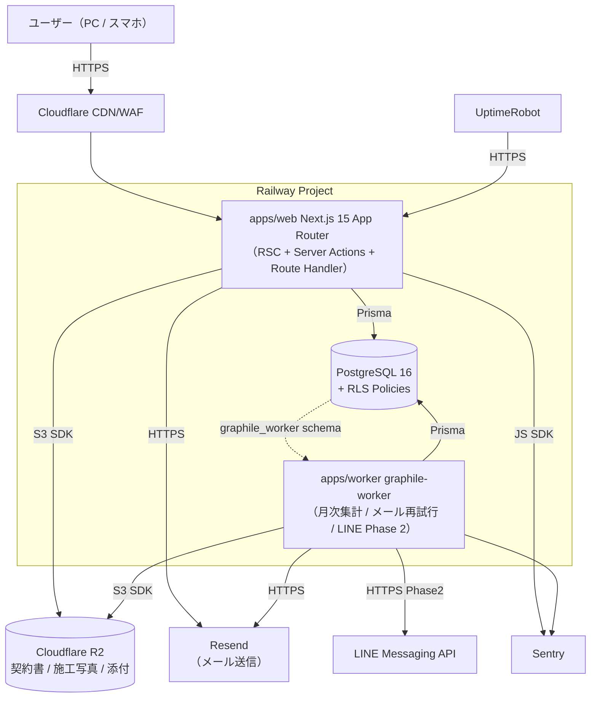
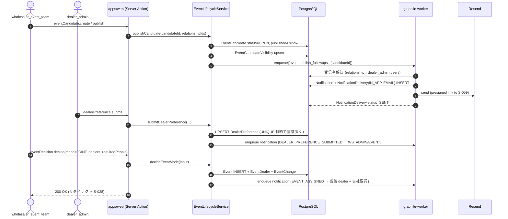
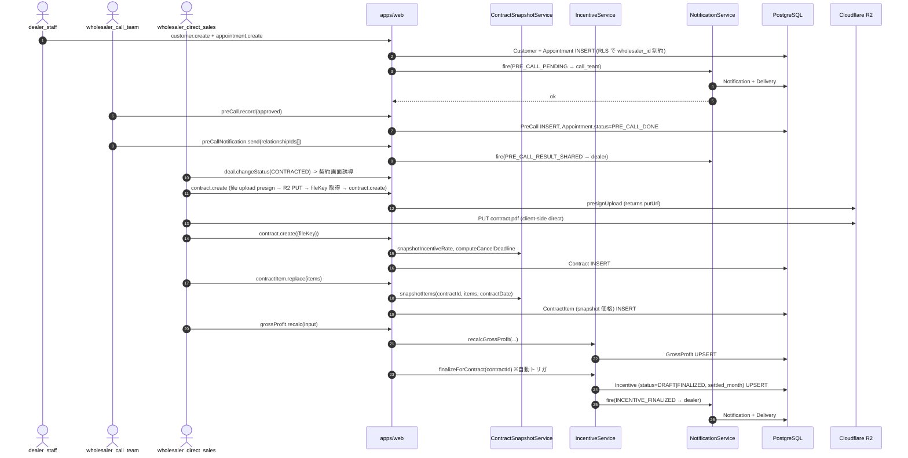
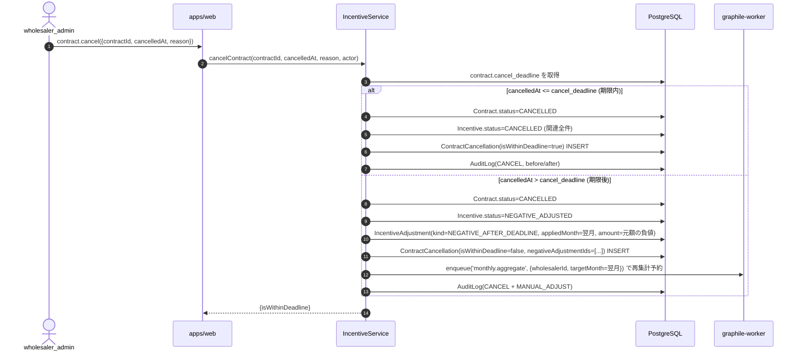
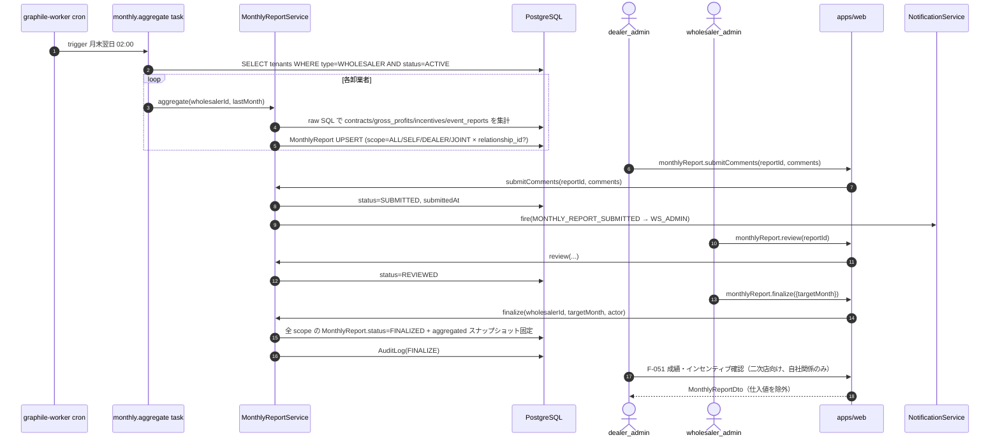

# プログラム設計書 — 太陽光卸・二次店営業管理 SaaS

本書は `docs/01-business-requirements.md`（業務要件 v2）/ `docs/02-functional-requirements.md`（機能要件 F-001〜F-058）/ `docs/03-tech-selection.md`（技術選定）/ `docs/04-ui-design.md`（画面 S-001〜S-085）を統合し、`programmer` エージェントが「再設計せずに実装できる」レベルの具体性で本 SaaS の実装ブループリントを定める。

> **読み替えメモ**: `.claude/agents/program-design.md` および `CLAUDE.md` は元 A2P（AI 駆動の出版ツール）向けに書かれている。本プロジェクトは「太陽光卸・二次店営業管理 SaaS」（マルチテナント、業務管理アプリ、AI 非使用）であるため、A2P 固有要素（Marketer/Writer 等のランタイム AI エージェント・token_usage・OpenAI 等）は **本書では採用しない**。§6 は AI エージェント仕様の代わりに **ドメインサービス層仕様** として記述する。R2 はファイル保存層として継承する。

---

## 0. 用語・略号

| 略号 | 内容 |
|---|---|
| `WS` | Wholesaler（卸業者テナント） |
| `DL` | Dealer（二次店テナント） |
| `REL` | Relationship（卸業者×二次店 関係。**主たるテナント分離キー**） |
| `RLS` | PostgreSQL Row-Level Security |
| RHF | react-hook-form |
| SA | Next.js Server Action |
| RH | Route Handler |
| PII | 個人情報（電話・住所・氏名等） |

---

## 1. アーキテクチャ概観

### 1.1 全体構成図



### 1.2 レイヤ責務

| レイヤ | 場所 | 責務 |
|---|---|---|
| Presentation | `apps/web/app/**` | RSC によるサーバ描画、Client Component の状態管理、shadcn/ui コンポジション |
| Action / RH | `apps/web/app/**/actions.ts` / `app/api/**/route.ts` | リクエスト受理、Zod バリデーション、認可、サービス層呼び出し、レスポンス整形（DTO 変換 + マスキング） |
| Domain Service | `apps/web/lib/**` + `packages/contracts/services/` | ビジネスロジック（粗利・インセンティブ・スコープ判定・スナップショット）。**純関数 + Prisma 依存に分離** |
| Persistence | `packages/db/prisma/` + テナント拡張 | Prisma Client。`$extends` でテナント条件を自動付与 |
| Storage | `packages/storage/` | R2 への pre-signed URL 発行・ダウンロード |
| Auth | `packages/auth/` | Auth.js v5 設定、TOTP、パスワード hash、招待トークン |
| Background | `apps/worker/jobs/**` | graphile-worker タスク本体。crontab 定義含む |
| Shared | `packages/contracts/` | Zod スキーマ・TS 型・列挙体・計算ロジックを Web/Worker 双方で共有 |
| UI Kit | `packages/ui/` | shadcn コンポーネント再利用、テーマトークン |

### 1.3 Phase ごとの差分

| Phase | 期間 | 増分 |
|---|---|---|
| Phase 1 (MVP, 〜2 か月) | 現在 | 本書のすべての構成（F-001〜F-053, F-055, F-056）を実装 |
| Phase 2 (〜6 か月) | 後続 | LINE 通知ジョブ (`notification.send_line`)、CSV インポートジョブ (`import.csv.*`)、PWA、BI 強化、画像サムネイル (`media.generate_thumbnail`) を追加。ジョブ層・通知ルータが拡張ポイント |
| Phase 3 | 後続 | 施工業者向け簡易画面、補助金 API 連携 |
| Phase 4 | 後続 | Stripe 課金、PDF 帳票（`@react-pdf/renderer`）、マルチクラウド |

Phase 2 以降は本書で「拡張ポイント」を明示する場所（通知ルータ / ジョブ登録 / Feature Flag）に追加するだけで取り込める設計とする。

---

## 2. モノレポ構成

### 2.1 ディレクトリツリー

```text
solar-saas/
├── .claude/                            # ハーネスエージェント（実装には含まれない）
├── docs/                               # 設計成果物（01〜05 + sprints + wireframes）
├── apps/
│   ├── web/                            # Next.js 15 (App Router)
│   │   ├── app/
│   │   │   ├── (auth)/                 # サインイン・2FA・パスワードリセット系
│   │   │   │   ├── login/page.tsx                 # S-001
│   │   │   │   ├── mfa/page.tsx                   # S-002, S-003
│   │   │   │   ├── reset/page.tsx                 # S-004, S-005
│   │   │   │   └── locked/page.tsx                # S-006
│   │   │   ├── (onboarding)/
│   │   │   │   ├── invite/[token]/page.tsx        # S-007
│   │   │   │   ├── signup/code/page.tsx           # S-008
│   │   │   │   ├── signup/company/page.tsx        # S-009
│   │   │   │   ├── signup/admin/page.tsx          # S-010
│   │   │   │   └── select-context/page.tsx        # S-011, S-012
│   │   │   ├── (saas-admin)/                      # B. 運営者 (S-013〜S-017, S-085)
│   │   │   ├── (wholesaler)/                      # C. 卸業者本部 (S-018〜S-052)
│   │   │   ├── (field)/                           # D. 現場要員 (S-053〜S-057)
│   │   │   ├── (dealer)/                          # E/F. 二次店 (S-058〜S-077)
│   │   │   ├── (common)/                          # G. 共通 (S-078〜S-084)
│   │   │   └── api/                               # Route Handler（プレサインド・Webhook 等）
│   │   │       ├── auth/[...nextauth]/route.ts    # Auth.js v5 ハンドラ
│   │   │       ├── files/presign/route.ts         # R2 pre-signed URL 発行
│   │   │       ├── files/download/[key]/route.ts  # ダウンロード（権限チェック付）
│   │   │       ├── webhooks/resend/route.ts       # メールイベント Webhook
│   │   │       └── health/route.ts                # ヘルスチェック
│   │   ├── components/                            # 画面共通の React コンポーネント
│   │   │   ├── layout/                            # AppShell, Sidebar, Header
│   │   │   ├── tables/                            # TanStack Table ラッパ
│   │   │   ├── forms/                             # RHF + zod resolver の共通ラッパ
│   │   │   ├── charts/                            # Recharts ラッパ
│   │   │   └── data/                              # サーバ取得 + Suspense 境界
│   │   ├── lib/
│   │   │   ├── auth/                              # auth.ts (Auth.js v5), totp.ts, password.ts, invite.ts
│   │   │   ├── permissions/                       # assertCan, RBAC マトリクス
│   │   │   ├── tenancy/                           # getTenantContext, RLS session helper
│   │   │   ├── masking/                           # maskPhone, maskAddress, maskName
│   │   │   ├── validators/                        # 共有 Zod schema（contracts へ再エクスポート）
│   │   │   ├── notifications/                     # NotificationService 実装
│   │   │   ├── audit/                             # recordAudit, AuditLogger
│   │   │   ├── domain/                            # 計算サービス（commission, gross-profit, scope, snapshot 等）
│   │   │   └── jobs/                              # ジョブを enqueue するクライアントラッパ
│   │   ├── middleware.ts                          # 認証・テナント・2FA ガード
│   │   ├── next.config.mjs
│   │   └── tests/                                 # Vitest unit / integration（web 内）
│   └── worker/                                    # graphile-worker プロセス
│       ├── src/
│       │   ├── index.ts                           # runner 起動
│       │   ├── crontab.ts                         # cron 定義
│       │   └── tasks/
│       │       ├── monthly.aggregate.ts
│       │       ├── monthly.finalize.ts
│       │       ├── incentive.calculate.ts
│       │       ├── incentive.cancel_or_negative_adjust.ts
│       │       ├── notification.send_email.ts
│       │       ├── notification.send_inapp.ts
│       │       ├── notification.send_line.ts      # Phase 2（feature flag）
│       │       ├── audit_log.flush.ts
│       │       ├── reminder.dispatch.ts           # 期限近接通知
│       │       └── media.generate_thumbnail.ts    # Phase 2
│       └── tests/
├── packages/
│   ├── db/                                        # Prisma スキーマ + Client
│   │   ├── prisma/
│   │   │   ├── schema.prisma
│   │   │   ├── migrations/
│   │   │   └── seed.ts
│   │   └── src/
│   │       ├── client.ts                          # PrismaClient + extensions 適用済みのシングルトン
│   │       ├── extensions/
│   │       │   ├── tenancy.ts                     # テナント条件強制注入
│   │       │   ├── soft-mask.ts                   # （非マスク権限なら通過）
│   │       │   └── audit.ts                       # ミューテーション after で recordAudit
│   │       └── rls.ts                             # SET LOCAL ヘルパ
│   ├── contracts/                                 # Web / Worker 共有
│   │   ├── src/
│   │   │   ├── schemas/                           # Zod スキーマ群（API 入出力）
│   │   │   ├── types/                             # 派生 TypeScript 型
│   │   │   ├── enums/                             # ステータス列挙
│   │   │   ├── services/                          # 純関数の計算ロジック（DB 非依存）
│   │   │   │   ├── gross-profit.ts
│   │   │   │   ├── incentive.ts
│   │   │   │   └── month-range.ts
│   │   │   └── jobs/                              # ジョブ payload zod スキーマ
│   │   └── package.json
│   ├── storage/                                   # R2 (S3 互換) クライアント
│   │   └── src/
│   │       ├── r2-client.ts
│   │       ├── presign.ts
│   │       └── keys.ts                            # キー設計を関数で集約
│   ├── auth/                                      # Auth.js v5 設定共有（web / worker から参照）
│   │   └── src/
│   │       ├── config.ts
│   │       ├── providers.ts
│   │       └── session.ts
│   ├── email/                                     # React Email + Resend クライアント
│   │   └── src/
│   │       ├── client.ts
│   │       └── templates/                         # *.tsx
│   └── ui/                                        # shadcn コンポーネント・テーマ・トークン
│       └── src/
├── tests/
│   └── e2e/                                       # Playwright spec（UC-01〜UC-05 を最低カバー）
├── .env.example
├── package.json                                   # pnpm workspaces
├── pnpm-workspace.yaml
├── turbo.json                                     # （任意）turborepo
└── tsconfig.base.json
```

CLAUDE.md / 提案書 §15 の推奨構成をモノレポ向けに展開している（提案書の `src/app/<feature>/` は `apps/web/app/(wholesaler)/<feature>/` 等にマップ）。

### 2.2 各パッケージの責務

| パッケージ | 公開する主な型・関数 | 依存 |
|---|---|---|
| `@solar/db` | `prisma`（拡張済み Client）、`withTenantContext(ctx, fn)`、`setRlsContext(tx, ctx)` | Prisma |
| `@solar/contracts` | `*Schema`（zod）、`*Dto` 型、`computeGrossProfit()`、`computeIncentive()`、`expandMonthRange()` | zod のみ（**DB 非依存**） |
| `@solar/storage` | `presignUpload({key, contentType, maxBytes})`、`presignDownload({key, ttlSec})`、`buildKey.*()` | `@aws-sdk/client-s3` |
| `@solar/auth` | `authConfig`、`getSession()`、`requireRole(role[])` | next-auth, argon2, otpauth |
| `@solar/email` | `sendEmail(template, props)`、テンプレート集 | resend, react-email |
| `@solar/ui` | `Button`, `Sheet`, `DataTable`, テーマ | tailwind, radix |
| `apps/web` | UI + API。サービス層 (`lib/domain/`) を経由してのみ DB を触る | 上記すべて |
| `apps/worker` | graphile-worker タスク。Web と同サービスを共有する | `@solar/contracts`, `@solar/db`, `@solar/email`, `@solar/storage` |

サービス層を **`packages/contracts/services/` の純関数** と **`apps/web/lib/domain/` の Prisma 依存ラッパ** に二分する。これにより Worker からは純関数を直接呼べ、Web ではトランザクション・監査ログを巻き取った形で呼べる。

---

## 3. DB スキーマ (Prisma)

### 3.1 共通方針

- **PK**: 基本 `id String @id @default(cuid())`。`audit_logs` 等は単調増加性を優先して BigInt も検討。
- **タイムスタンプ**: 全テーブル `createdAt DateTime @default(now())` / `updatedAt DateTime @updatedAt`。
- **テナント分離キー**:
  - 卸業者内マスタ → `wholesalerId`
  - 業務トランザクション（希望提出・契約・インセンティブ等）→ `relationshipId`（NULL 許容のものは「自社開催由来」を示す）
  - 二次店内マスタ → `dealerId`
- **金額・率**: `Decimal(14,2)`（金額）/ `Decimal(5,2)`（％ 0〜100、小数第 2 位まで）。**Float 禁止**。
- **ステータス**: すべて Prisma `enum` で型化。
- **ソフトデリート**: マスタ系（`venue_providers`, `installers`, `products`）は `isActive` で論理停止。トランザクション系は物理削除しない（監査要件 §11）。

### 3.2 認証・テナント

```prisma
enum TenantType { WHOLESALER DEALER }
enum TenantPlan { PILOT SMALL MEDIUM LARGE }
enum TenantStatus { ACTIVE SUSPENDED }
enum PiiMaskingMode { MASKED FULL PARTIAL }
//
// PiiMaskingMode の値 — `WholesalerSettings.piiMaskingMode` で参照（docs/03 §4.3 MVP デフォルトに対応）。
// 実際の文字列／表示制御は `MaskingService`（§6.5）と `ViewerContext` の組合せで決定する。
//
// | 値        | 意味                                                                                                  | 主な利用シーン                          |
// |-----------|-------------------------------------------------------------------------------------------------------|------------------------------------------|
// | MASKED    | 二次店メンバ向けに常時マスク。電話は下 4 桁のみ（例: `****-****-1234`）、住所は市区町村まで、氏名は姓のみ | 二次店ロール（DEALER_*）の既定動作        |
// | FULL      | 卸業者管理者向けデフォルト非マスク（フル表示）                                                          | 卸業者管理者（WHOLESALER_ADMIN 等）の既定 |
// | PARTIAL   | 電話下 4 桁のみ可視・住所と氏名はマスクの中間モード（卸業者がコール業務委託先に部分公開する用途）        | 卸業者運用ポリシーで任意指定              |

model Tenant {
  id            String        @id @default(cuid())
  type          TenantType
  name          String
  plan          TenantPlan?   // dealer は null
  status        TenantStatus  @default(ACTIVE)
  createdAt     DateTime      @default(now())
  updatedAt     DateTime      @updatedAt

  users         User[]
  wholesalerSetting   WholesalerSettings?
  asWholesaler  Relationship[] @relation("Wholesaler")
  asDealer      Relationship[] @relation("Dealer")
  inviteCodes   InviteCode[]

  @@index([type, status])
}

model WholesalerSettings {
  wholesalerId            String   @id
  cancelDeadlineDays      Int      @default(8)              // F-015
  fiscalYearStartMonth    Int      @default(4)              // F-016 (1..12)
  defaultIncentiveType    IncentiveTargetType @default(PROJECT_PROFIT)
  piiMaskingMode          PiiMaskingMode @default(MASKED)   // OQ-2 デフォルト
  createdAt               DateTime @default(now())
  updatedAt               DateTime @updatedAt

  tenant      Tenant @relation(fields: [wholesalerId], references: [id], onDelete: Cascade)
}

enum UserStatus { ACTIVE SUSPENDED INVITED }

model User {
  id              String      @id @default(cuid())
  tenantId        String
  email           String      @unique
  passwordHash    String?     // 招待中は null
  name            String
  status          UserStatus  @default(INVITED)
  twoFactorRequired Boolean   @default(false)
  sessionVersion  Int         @default(0)                   // 強制ログアウト時にインクリメント
  lastLoginAt     DateTime?
  createdAt       DateTime    @default(now())
  updatedAt       DateTime    @updatedAt

  tenant          Tenant      @relation(fields: [tenantId], references: [id], onDelete: Cascade)
  roles           UserRole[]
  totpSecret      TotpSecret?
  backupCodes     BackupCode[]
  loginAttempts   LoginAttempt[]
  sessions        Session[]
  notifications   Notification[]

  @@index([tenantId, status])
  @@index([email])
}

enum AppRole {
  SAAS_ADMIN
  WHOLESALER_ADMIN
  WHOLESALER_EVENT_TEAM
  WHOLESALER_CALL_TEAM
  WHOLESALER_DIRECT_SALES
  WHOLESALER_FIELD_STAFF
  DEALER_ADMIN
  DEALER_STAFF
}

model UserRole {
  userId      String
  role        AppRole
  assignedAt  DateTime @default(now())
  assignedBy  String?

  user        User @relation(fields: [userId], references: [id], onDelete: Cascade)

  @@id([userId, role])
  @@index([role])
}

enum RelationshipStatus { ACTIVE SUSPENDED }
enum DealerScope { APPOINTMENT_ONLY FIRST_VISIT FULL_CLOSING }

model Relationship {
  id            String      @id @default(cuid())
  wholesalerId  String
  dealerId      String
  status        RelationshipStatus @default(ACTIVE)
  defaultScope  DealerScope @default(FULL_CLOSING)
  note          String?
  createdAt     DateTime    @default(now())
  updatedAt     DateTime    @updatedAt

  wholesaler    Tenant @relation("Wholesaler", fields: [wholesalerId], references: [id])
  dealer        Tenant @relation("Dealer", fields: [dealerId], references: [id])
  incentiveRates IncentiveRate[]

  @@unique([wholesalerId, dealerId])
  @@index([wholesalerId, status])
  @@index([dealerId, status])
}

model InviteCode {
  id           String   @id @default(cuid())
  wholesalerId String
  codeHash     String   @unique                              // 平文は表示直後に破棄
  expiresAt    DateTime
  maxUses      Int      @default(1)
  usedCount    Int      @default(0)
  createdBy    String
  revokedAt    DateTime?
  createdAt    DateTime @default(now())

  wholesaler   Tenant @relation(fields: [wholesalerId], references: [id])

  @@index([wholesalerId, expiresAt])
}

model UserInvitation {
  id          String   @id @default(cuid())
  tenantId    String
  email       String
  role        AppRole
  tokenHash   String   @unique
  expiresAt   DateTime
  acceptedAt  DateTime?
  invitedBy   String
  createdAt   DateTime @default(now())

  @@index([tenantId, email])
}

model TotpSecret {
  userId      String   @id
  secretEnc   String                                          // KMS不要なら env 暗号化キーで symmetric encrypt
  activatedAt DateTime?
  createdAt   DateTime @default(now())

  user        User @relation(fields: [userId], references: [id], onDelete: Cascade)
}

model BackupCode {
  id          String   @id @default(cuid())
  userId      String
  codeHash    String                                          // argon2
  usedAt      DateTime?
  createdAt   DateTime @default(now())

  user        User @relation(fields: [userId], references: [id], onDelete: Cascade)

  @@unique([userId, codeHash])
}

model LoginAttempt {
  id          String   @id @default(cuid())
  userId      String?
  email       String
  ip          String
  success     Boolean
  reason      String?
  createdAt   DateTime @default(now())

  user        User? @relation(fields: [userId], references: [id])

  @@index([email, createdAt])
  @@index([ip, createdAt])
}

// Auth.js v5 セッション格納用（JWT 検証補助）
model Session {
  id             String   @id @default(cuid())
  userId         String
  sessionToken   String   @unique
  sessionVersion Int
  expiresAt      DateTime
  lastSeenAt     DateTime @default(now())
  createdAt      DateTime @default(now())

  user           User     @relation(fields: [userId], references: [id], onDelete: Cascade)

  @@index([userId])
}
```

### 3.3 マスタ

```prisma
enum VenueContractType { FIXED PERFORMANCE OTHER }

model VenueProvider {
  id              String   @id @default(cuid())
  wholesalerId    String
  name            String
  contactName     String?
  phone           String?
  email           String?
  postalCode      String?
  address         String?
  area            String?
  contractType    VenueContractType?
  fixedFee        Decimal? @db.Decimal(14,2)
  performanceRate Decimal? @db.Decimal(5,2)
  note            String?
  isActive        Boolean  @default(true)
  createdAt       DateTime @default(now())
  updatedAt       DateTime @updatedAt

  @@index([wholesalerId, isActive])
}

enum ProductCategory { PANEL BATTERY POWER_CONDITIONER MOUNT OTHER_PART SET }

model Product {
  id              String   @id @default(cuid())
  wholesalerId    String
  category        ProductCategory
  maker           String
  name            String
  modelNo         String?
  capacity        Decimal? @db.Decimal(10,2)
  unit            String
  purchasePrice   Decimal  @db.Decimal(14,2)
  dealerPrice     Decimal  @db.Decimal(14,2)
  listPrice       Decimal  @db.Decimal(14,2)
  effectiveFrom   DateTime
  effectiveTo     DateTime?
  isActive        Boolean  @default(true)
  note            String?
  createdAt       DateTime @default(now())
  updatedAt       DateTime @updatedAt
  createdBy       String

  priceHistory    ProductPriceHistory[]

  @@index([wholesalerId, category, isActive])
  @@index([wholesalerId, effectiveFrom, effectiveTo])
}

model ProductPriceHistory {
  id               String   @id @default(cuid())
  productId        String
  before           Json
  after            Json
  changedBy        String
  changedAt        DateTime @default(now())

  product          Product @relation(fields: [productId], references: [id])

  @@index([productId, changedAt])
}

model Installer {
  id            String   @id @default(cuid())
  wholesalerId  String
  name          String
  contactName   String?
  phone         String?
  email         String?
  area          String?
  isActive      Boolean  @default(true)
  createdAt     DateTime @default(now())
  updatedAt     DateTime @updatedAt

  @@index([wholesalerId, isActive])
}

enum IncentiveTargetType { PROJECT_PROFIT WHOLESALE_PROFIT MANUAL }

model IncentiveRate {
  id              String   @id @default(cuid())
  relationshipId  String
  targetType      IncentiveTargetType
  rate            Decimal  @db.Decimal(5,2)                  // % 0..100
  effectiveFrom   DateTime
  effectiveTo     DateTime?
  note            String?
  createdAt       DateTime @default(now())
  updatedAt       DateTime @updatedAt
  createdBy       String

  relationship    Relationship @relation(fields: [relationshipId], references: [id])

  @@index([relationshipId, effectiveFrom, effectiveTo])
}
```

### 3.4 場所取り・イベント

```prisma
enum VenueNegotiationStatus {
  NOT_CONTACTED CONTACTING CONDITION_REVIEW FEASIBLE INFEASIBLE FIXED CANCELLED
}

model VenueNegotiation {
  id                String   @id @default(cuid())
  wholesalerId      String
  venueProviderId   String
  candidateDates    Json                                       // ISO 日付配列
  decidedDate       DateTime?
  contractType      VenueContractType?
  fixedFee          Decimal? @db.Decimal(14,2)
  performanceRate   Decimal? @db.Decimal(5,2)
  conditionNote     String?
  status            VenueNegotiationStatus @default(NOT_CONTACTED)
  nextAction        String?
  assigneeId        String?
  note              String?
  createdAt         DateTime @default(now())
  updatedAt         DateTime @updatedAt

  venueProvider     VenueProvider @relation(fields: [venueProviderId], references: [id])

  @@index([wholesalerId, status])
}

enum EventCandidateStatus { DRAFT OPEN CLOSED DECIDED CANCELLED }

model EventCandidate {
  id                  String   @id @default(cuid())
  wholesalerId        String
  venueProviderId     String?
  venueNegotiationId  String?
  targetMonth         String                                   // 'YYYY-MM' 文字列
  scheduledDate       DateTime
  storeName           String
  address             String?
  area                String?
  deadlineAt          DateTime
  contractType        VenueContractType?
  fixedFee            Decimal? @db.Decimal(14,2)
  performanceRate     Decimal? @db.Decimal(5,2)
  internalNote        String?
  status              EventCandidateStatus @default(DRAFT)
  publishedAt         DateTime?
  createdBy           String
  createdAt           DateTime @default(now())
  updatedAt           DateTime @updatedAt

  visibilities        EventCandidateVisibility[]
  preferences         DealerPreference[]
  event               Event?

  @@index([wholesalerId, targetMonth, status])
  @@index([wholesalerId, scheduledDate])
}

model EventCandidateVisibility {
  eventCandidateId  String
  relationshipId    String
  isVisible         Boolean  @default(true)
  notifiedAt        DateTime?

  eventCandidate    EventCandidate @relation(fields: [eventCandidateId], references: [id], onDelete: Cascade)
  relationship      Relationship   @relation(fields: [relationshipId], references: [id])

  @@id([eventCandidateId, relationshipId])
  @@index([relationshipId, isVisible])
}

// F-059 レーンイベント — 懇意の場所提供元と月単位で複数開催日を契約するイベント。
// 単発の EventCandidate（1日1件・場所取り型）と異なり、1 行が対象月内の複数開催日
// (scheduledDates) を保持する。仕入値は扱わず、場所提供元との契約条件のみ持つ。
enum LineEventStatus { DRAFT CONFIRMED CANCELLED }  // 確認中 / 確定 / 中止

model LineEvent {
  id              String             @id @default(cuid())
  wholesalerId    String
  venueProviderId String?
  name            String                                       // レーン名
  targetMonth     String                                       // 'YYYY-MM' 文字列
  area            String?
  scheduledDates  Json                                         // 'YYYY-MM-DD' 配列（月内の開催日）
  contractType    VenueContractType?
  fixedFee        Decimal? @db.Decimal(14,2)                   // FIXED: 日当たり報酬額
  performanceRate Decimal? @db.Decimal(5,2)                    // PERFORMANCE: 成果報酬率%
  contractNote    String?
  status          LineEventStatus    @default(DRAFT)
  createdBy       String
  createdAt       DateTime           @default(now())
  updatedAt       DateTime           @updatedAt

  @@index([wholesalerId, targetMonth])
  @@index([wholesalerId, status])
}

// F-060 二次店レーン希望 — 二次店が月単位で、卸業者の作成したレーン(LineEvent)から
// 参加希望を優先順位付きで提出する。単発の DealerPreference が EventCandidate に
// 紐づくのに対し、こちらは既存レーンを優先順位で選ぶ。MVP は卸業者の一覧確認
// (S-089) のみ実装し、二次店側の提出フォームは Phase 2。
model LanePreference {
  id             String   @id @default(cuid())
  wholesalerId   String
  relationshipId String                                         // 二次店との関係
  targetMonth    String                                         // 'YYYY-MM'
  comment        String?
  submittedAt    DateTime @default(now())
  submittedBy    String

  items LanePreferenceItem[]

  @@unique([relationshipId, targetMonth])                       // 二次店×月で一意（再提出は更新扱い）
  @@index([wholesalerId, targetMonth])
}

// レーン希望の各選択（優先順位付き）。priority=1 が第一希望。
// LineEvent への参照は柔リンク（FK を張らず id で結合）— VenueProvider 解決と
// 同じく loader 層で findMany → Map で名称を結合する。
model LanePreferenceItem {
  id               String @id @default(cuid())
  lanePreferenceId String
  lineEventId      String                                       // 希望するレーン(LineEvent)の id
  priority         Int                                          // 1=第一希望, 2=第二希望, ...

  lanePreference LanePreference @relation(fields: [lanePreferenceId], references: [id], onDelete: Cascade)

  @@index([lanePreferenceId])
}

model DealerPreference {
  id                String   @id @default(cuid())
  eventCandidateId  String
  relationshipId    String
  targetMonth       String
  priority          Int?
  availableDates    Json?                                      // ISO 配列
  availablePeople   Int?
  comment           String?
  submittedAt       DateTime @default(now())
  submittedBy       String

  eventCandidate    EventCandidate @relation(fields: [eventCandidateId], references: [id])
  relationship      Relationship   @relation(fields: [relationshipId], references: [id])

  @@unique([eventCandidateId, relationshipId])
  @@index([relationshipId, targetMonth])
}

enum EventMode { SELF DEALER JOINT CANCELLED }
enum EventStatus { PLANNED ONGOING CLOSED CANCELLED }

model Event {
  id                  String      @id @default(cuid())
  wholesalerId        String
  eventCandidateId    String      @unique
  mode                EventMode
  requiredPeople      Int?
  decidedBy           String
  decidedAt           DateTime    @default(now())
  status              EventStatus @default(PLANNED)
  note                String?
  createdAt           DateTime    @default(now())
  updatedAt           DateTime    @updatedAt

  eventCandidate      EventCandidate @relation(fields: [eventCandidateId], references: [id])
  dealers             EventDealer[]
  shifts              EventShift[]
  reports             EventReport[]
  changes             EventChange[]
  appointments        Appointment[]

  @@index([wholesalerId, status])
}

model EventDealer {
  eventId         String
  relationshipId  String
  scopeOverride   DealerScope?                                 // null なら関係デフォルト適用
  assignedBy      String
  assignedAt      DateTime @default(now())

  event           Event @relation(fields: [eventId], references: [id], onDelete: Cascade)
  relationship    Relationship @relation(fields: [relationshipId], references: [id])

  @@id([eventId, relationshipId])
  @@index([relationshipId])
}

enum ShiftRole { LEAD CATCH RECEPTION PITCH OTHER }
enum ShiftStatus { ASSIGNED CHECKED_IN CHECKED_OUT NO_SHOW }

model EventShift {
  id            String      @id @default(cuid())
  eventId       String
  userId        String
  role          ShiftRole
  startPlanned  DateTime
  endPlanned    DateTime
  startActual   DateTime?
  endActual     DateTime?
  status        ShiftStatus @default(ASSIGNED)
  note          String?
  createdAt     DateTime    @default(now())
  updatedAt     DateTime    @updatedAt

  event         Event @relation(fields: [eventId], references: [id], onDelete: Cascade)

  @@index([eventId])
  @@index([userId, startPlanned, endPlanned])                  // 重複検出
}

enum EventReportType { START END RESULT }

model EventReport {
  id              String   @id @default(cuid())
  eventId         String
  type            EventReportType
  reporterUserId  String
  reporterOrgType TenantType
  payload         Json                                         // 種別ごとに異なる
  createdAt       DateTime @default(now())

  event           Event @relation(fields: [eventId], references: [id], onDelete: Cascade)

  @@index([eventId, type])
}

model EventChange {
  id            String   @id @default(cuid())
  eventId       String
  before        Json
  after         Json
  changedBy     String
  changedAt     DateTime @default(now())

  event         Event @relation(fields: [eventId], references: [id], onDelete: Cascade)

  @@index([eventId, changedAt])
}
```

### 3.5 顧客・アポ・マエカク

```prisma
enum CustomerStatus {
  NEW PRE_CALL_WAIT PRE_CALL_DONE VISIT_PLANNED IN_NEGOTIATION CONTRACTED LOST IN_CONSTRUCTION COMPLETED
}
enum AcquisitionChannel { EVENT WALK_IN TELE REFERRAL OTHER }

model Customer {
  id                    String   @id @default(cuid())
  wholesalerId          String
  ownerRelationshipId   String?                                // null = 自社直接
  name                  String
  kana                  String?
  phone                 String
  email                 String?
  postalCode            String?
  address               String?
  housingType           String?
  pvInstalled           Boolean?
  batteryInstalled      Boolean?
  electricBill          String?
  household             String?
  channel               AcquisitionChannel
  sourceEventId         String?
  registeredByUserId    String
  registeredByOrgType   TenantType
  registeredByRelationshipId String?
  status                CustomerStatus @default(NEW)
  note                  String?
  createdAt             DateTime @default(now())
  updatedAt             DateTime @updatedAt

  appointments          Appointment[]
  deals                 Deal[]
  contracts             Contract[]
  sourceEvent           Event? @relation(fields: [sourceEventId], references: [id])

  @@index([wholesalerId, phone])
  @@index([wholesalerId, status, createdAt])
  @@index([ownerRelationshipId])
}

enum AppointmentStatus { UNCONFIRMED PRE_CALL_DONE VISITED ABSENT CANCELLED RESCHEDULED }

model Appointment {
  id                    String   @id @default(cuid())
  customerId            String
  eventId               String?
  scheduledAt           DateTime
  location              String?
  acquiredByUserId      String
  acquiredOrgType       TenantType
  acquiredRelationshipId String?
  appointmentType       String?
  status                AppointmentStatus @default(UNCONFIRMED)
  note                  String?
  createdAt             DateTime @default(now())
  updatedAt             DateTime @updatedAt

  customer              Customer @relation(fields: [customerId], references: [id])
  event                 Event?   @relation(fields: [eventId], references: [id])
  preCall               PreCall?

  @@index([customerId])
  @@index([status, scheduledAt])
  @@index([acquiredRelationshipId])
}

enum PreCallResult { APPROVED ABSENT CALLBACK CANCELLED RESCHEDULED }

model PreCall {
  id                    String   @id @default(cuid())
  appointmentId         String   @unique
  calledAt              DateTime
  visitConfirmedAt      DateTime?
  visitConfirmedLocation String?
  personConfirmed       Boolean  @default(false)
  result                PreCallResult
  cancelRequested       Boolean  @default(false)
  rescheduleRequested   Boolean  @default(false)
  note                  String?
  nextAction            String?
  calledByUserId        String
  createdAt             DateTime @default(now())
  updatedAt             DateTime @updatedAt

  appointment           Appointment @relation(fields: [appointmentId], references: [id])
  notifications         PreCallNotification[]

  @@index([calledAt])
}

enum PreCallNotificationStatus { PENDING SENT ACKNOWLEDGED }

model PreCallNotification {
  id              String   @id @default(cuid())
  preCallId       String
  relationshipId  String
  status          PreCallNotificationStatus @default(PENDING)
  notifiedAt      DateTime?
  acknowledgedAt  DateTime?
  note            String?

  preCall         PreCall @relation(fields: [preCallId], references: [id])
  relationship    Relationship @relation(fields: [relationshipId], references: [id])

  @@index([relationshipId, status])
}
```

### 3.6 商談・契約・粗利・インセンティブ

```prisma
enum DealStatus {
  VISIT_PLANNED VISITED PROPOSING QUOTED CONSIDERING LIKELY_CONTRACT CONTRACTED LOST
}

model Deal {
  id                    String   @id @default(cuid())
  customerId            String
  ownerType             TenantType
  ownerUserId           String
  ownerRelationshipId   String?
  firstVisitAt          DateTime?
  status                DealStatus @default(VISIT_PLANNED)
  proposedProduct       String?
  proposedAmount        Decimal? @db.Decimal(14,2)
  expectedProfit        Decimal? @db.Decimal(14,2)
  expectedContractDate  DateTime?
  lostReason            String?
  nextAction            String?
  note                  String?
  createdAt             DateTime @default(now())
  updatedAt             DateTime @updatedAt

  customer              Customer @relation(fields: [customerId], references: [id])
  contract              Contract?

  @@index([customerId])
  @@index([status, createdAt])
  @@index([ownerRelationshipId])
}

enum ContractStatus { CONTRACTED CONSTRUCTING DONE CANCELLED }

model Contract {
  id                            String   @id @default(cuid())
  wholesalerId                  String
  dealId                        String   @unique
  customerId                    String
  ownerRelationshipId           String?                         // null = 自社開催由来
  eventModeAtContract           EventMode?                      // SELF/DEALER/JOINT/null
  contractDate                  DateTime
  contractAmount                Decimal  @db.Decimal(14,2)
  maker                         String?
  panelCapacity                 Decimal? @db.Decimal(10,2)
  hasBattery                    Boolean  @default(false)
  hasSubsidy                    Boolean  @default(false)
  fileKey                       String?                         // R2 のキー
  cancelDeadline                DateTime                        // F-040: 契約日 + wholesaler.cancelDeadlineDays
  incentiveRateSnapshot         Decimal? @db.Decimal(5,2)
  incentiveTargetTypeSnapshot   IncentiveTargetType?
  isSelfHosted                  Boolean  @default(false)        // 二次店インセンティブ対象外フラグ
  status                        ContractStatus @default(CONTRACTED)
  createdBy                     String
  createdAt                     DateTime @default(now())
  updatedAt                     DateTime @updatedAt

  deal              Deal @relation(fields: [dealId], references: [id])
  customer          Customer @relation(fields: [customerId], references: [id])
  items             ContractItem[]
  grossProfit       GrossProfit?
  incentives        Incentive[]
  cancellation      ContractCancellation?
  constructions     Construction[]
  applications      Application[]

  @@index([wholesalerId, status, contractDate])
  @@index([ownerRelationshipId, status])
}

model ContractItem {
  id                       String   @id @default(cuid())
  contractId               String
  productId                String                                 // 商品マスタへの参照は履歴目的のみ
  productName              String                                 // スナップショット
  maker                    String
  modelNo                  String?
  qty                      Decimal  @db.Decimal(10,2)
  unit                     String
  snapshotPurchasePrice    Decimal  @db.Decimal(14,2)
  snapshotDealerPrice      Decimal  @db.Decimal(14,2)
  snapshotListPrice        Decimal  @db.Decimal(14,2)
  createdAt                DateTime @default(now())

  contract                 Contract @relation(fields: [contractId], references: [id], onDelete: Cascade)

  @@index([contractId])
}

model GrossProfit {
  id                        String   @id @default(cuid())
  contractId                String   @unique
  salesPrice                Decimal  @db.Decimal(14,2)
  purchaseTotal             Decimal  @db.Decimal(14,2)
  dealerTotal               Decimal  @db.Decimal(14,2)
  constructionFee           Decimal  @db.Decimal(14,2)            @default(0)
  otherCost                 Decimal  @db.Decimal(14,2)            @default(0)
  discount                  Decimal  @db.Decimal(14,2)            @default(0)
  projectProfit             Decimal  @db.Decimal(14,2)
  wholesaleProfit           Decimal  @db.Decimal(14,2)
  profitRate                Decimal  @db.Decimal(5,4)
  incentiveTargetProfit     Decimal  @db.Decimal(14,2)
  incentiveTargetType       IncentiveTargetType
  manualAdjustedBy          String?
  manualAdjustedAt          DateTime?
  manualAdjustmentReason    String?
  createdAt                 DateTime @default(now())
  updatedAt                 DateTime @updatedAt

  contract                  Contract @relation(fields: [contractId], references: [id], onDelete: Cascade)
}

enum IncentiveStatus { DRAFT FINALIZED CANCELLED NEGATIVE_ADJUSTED }

model Incentive {
  id                  String   @id @default(cuid())
  contractId          String
  relationshipId      String
  targetProfit        Decimal  @db.Decimal(14,2)
  rate                Decimal  @db.Decimal(5,2)
  amount              Decimal  @db.Decimal(14,2)
  status              IncentiveStatus @default(DRAFT)
  settledMonth        String                                       // 'YYYY-MM' = 契約日が属する暦月
  finalizedAt         DateTime?
  cancelledAt         DateTime?
  note                String?
  createdAt           DateTime @default(now())
  updatedAt           DateTime @updatedAt

  contract            Contract @relation(fields: [contractId], references: [id])
  relationship        Relationship @relation(fields: [relationshipId], references: [id])
  adjustments         IncentiveAdjustment[]

  @@unique([contractId, relationshipId])
  @@index([relationshipId, settledMonth, status])
}

enum IncentiveAdjustmentKind { MANUAL JOINT_DISTRIBUTION NEGATIVE_AFTER_DEADLINE }

model IncentiveAdjustment {
  id              String   @id @default(cuid())
  incentiveId     String
  kind            IncentiveAdjustmentKind
  beforeAmount    Decimal  @db.Decimal(14,2)
  afterAmount     Decimal  @db.Decimal(14,2)
  reason          String
  adjustedBy      String
  adjustedAt      DateTime @default(now())
  appliedMonth    String?                                          // 'YYYY-MM' 負調整の反映月

  incentive       Incentive @relation(fields: [incentiveId], references: [id], onDelete: Cascade)

  @@index([incentiveId])
  @@index([appliedMonth])
}

model ContractCancellation {
  id                      String   @id @default(cuid())
  contractId              String   @unique
  cancelledAt             DateTime
  reason                  String?
  isWithinDeadline        Boolean
  negativeAdjustmentIds   String[]                                  // IncentiveAdjustment[] への参照
  recordedBy              String
  createdAt               DateTime @default(now())

  contract                Contract @relation(fields: [contractId], references: [id])
}

enum ConstructionStatus { REQUEST_PENDING REQUESTED SURVEYED CONSTRUCTING DONE PAUSED }

model Construction {
  id              String   @id @default(cuid())
  contractId      String
  installerId     String?
  surveyDate      DateTime?
  plannedDate     DateTime?
  completedDate   DateTime?
  status          ConstructionStatus @default(REQUEST_PENDING)
  fee             Decimal? @db.Decimal(14,2)
  note            String?
  fileKeys        String[]
  createdAt       DateTime @default(now())
  updatedAt       DateTime @updatedAt

  contract        Contract @relation(fields: [contractId], references: [id])
  installer       Installer? @relation(fields: [installerId], references: [id])

  @@index([contractId])
  @@index([plannedDate])
}

enum ApplicationStatus { DRAFT SUBMITTED APPROVED REJECTED CANCELLED }

model Application {
  id              String   @id @default(cuid())
  contractId      String
  type            String
  agency          String?
  plannedDate     DateTime?
  submittedDate   DateTime?
  approvedDate    DateTime?
  status          ApplicationStatus @default(DRAFT)
  expectedAmount  Decimal? @db.Decimal(14,2)
  grantedAmount   Decimal? @db.Decimal(14,2)
  note            String?
  fileKeys        String[]
  createdAt       DateTime @default(now())
  updatedAt       DateTime @updatedAt

  contract        Contract @relation(fields: [contractId], references: [id])

  @@index([contractId])
}
```

### 3.7 月次・通知・監査

```prisma
enum MonthlyReportStatus { DRAFT SUBMITTED REVIEWED FINALIZED }
enum MonthlyScope { ALL SELF DEALER JOINT }

model MonthlyReport {
  id              String   @id @default(cuid())
  wholesalerId    String
  targetMonth     String                                          // 'YYYY-MM'
  scope           MonthlyScope
  relationshipId  String?                                         // scope=DEALER のみ
  aggregated      Json                                            // 集計値スナップショット
  comments        Json?                                           // 成果・課題・翌月施策
  status          MonthlyReportStatus @default(DRAFT)
  submittedAt     DateTime?
  reviewedAt      DateTime?
  finalizedAt     DateTime?
  finalizedBy     String?
  createdAt       DateTime @default(now())
  updatedAt       DateTime @updatedAt

  @@unique([wholesalerId, targetMonth, scope, relationshipId])
  @@index([wholesalerId, targetMonth])
}

enum NotificationType {
  DEALER_PREFERENCE_SUBMITTED
  DEALER_PREFERENCE_MISSING
  EVENT_DECISION_PENDING
  EVENT_SHIFT_SHORTAGE
  EVENT_START_REPORTED
  EVENT_END_REPORTED
  EVENT_RESULT_REPORTED
  CUSTOMER_NEW
  PRE_CALL_PENDING
  PRE_CALL_NOTIFICATION_PENDING
  PRE_CALL_RESULT_SHARED
  DEAL_STATUS_TO_CONTRACT
  MONTHLY_REPORT_SUBMITTED
  MONTHLY_REPORT_REVIEW_PENDING
  GROSS_PROFIT_PENDING
  INCENTIVE_PENDING
  INCENTIVE_FINALIZED
  CONSTRUCTION_UPCOMING
  APPLICATION_DEADLINE
  EVENT_PUBLISHED
  EVENT_PREFERENCE_DEADLINE
  EVENT_ASSIGNED
  EVENT_DAY_BEFORE
  CONTRACT_CONTRACTED
  SHIFT_ASSIGNED
  SHIFT_CHANGED
  REPORT_PENDING
}

model Notification {
  id              String   @id @default(cuid())
  recipientUserId String
  tenantId        String                                          // 受信者テナント、フィルタ用
  type            NotificationType
  title           String
  body            String
  payload         Json
  readAt          DateTime?
  createdAt       DateTime @default(now())

  user            User @relation(fields: [recipientUserId], references: [id], onDelete: Cascade)
  deliveries      NotificationDelivery[]

  @@index([recipientUserId, readAt, createdAt])
}

enum DeliveryChannel { IN_APP EMAIL LINE }
enum DeliveryStatus { PENDING SENT FAILED CANCELLED }

model NotificationDelivery {
  id              String   @id @default(cuid())
  notificationId  String
  channel         DeliveryChannel
  status          DeliveryStatus @default(PENDING)
  attemptedCount  Int       @default(0)
  lastError       String?
  sentAt          DateTime?
  createdAt       DateTime  @default(now())
  updatedAt       DateTime  @updatedAt

  notification    Notification @relation(fields: [notificationId], references: [id], onDelete: Cascade)

  @@index([status, channel])
}

enum AuditAction {
  CREATE UPDATE DELETE
  STATUS_CHANGE
  PUBLISH UNPUBLISH
  CANCEL
  FINALIZE UNLOCK
  MANUAL_ADJUST
  REVEAL_PII
  ROLE_CHANGE
  RELATION_SUSPEND RELATION_RESUME
}

model AuditLog {
  id              BigInt   @id @default(autoincrement())
  actorUserId     String?
  tenantId        String
  targetType      String
  targetId        String
  action          AuditAction
  before          Json?
  after           Json?
  ip              String?
  userAgent       String?
  createdAt       DateTime @default(now())

  @@index([tenantId, createdAt])
  @@index([targetType, targetId])
  @@index([actorUserId, createdAt])
}
```

### 3.8 主要インデックス（再掲・追加）

| テーブル | インデックス | 目的 |
|---|---|---|
| `Customer` | `(wholesalerId, phone)` | F-031 重複チェック |
| `Customer` | `(wholesalerId, status, createdAt)` | F-032 顧客一覧 |
| `Contract` | `(wholesalerId, status, contractDate)` | F-040, F-048 月次集計 |
| `Incentive` | `(relationshipId, settledMonth, status)` | F-046, F-048, F-051 |
| `EventShift` | `(userId, startPlanned, endPlanned)` | F-025 重複検出 |
| `Notification` | `(recipientUserId, readAt, createdAt)` | F-052 一覧 |
| `AuditLog` | `(tenantId, createdAt)` / `(targetType, targetId)` | F-055 |
| `DealerPreference` | `(eventCandidateId, relationshipId)` UNIQUE | F-021 重複防止 |

### 3.9 RLS ポリシー（PostgreSQL 直書き）

Prisma 標準にない RLS は `prisma/migrations/<n>_rls.sql` でマイグレーションに含める。

| テーブル | ポリシー |
|---|---|
| 全テーブル（共通） | `ENABLE ROW LEVEL SECURITY`、`FORCE ROW LEVEL SECURITY` |
| `wholesaler_id` 列を持つ全テーブル | `USING (wholesaler_id = current_setting('app.current_wholesaler_id', true)::text OR current_setting('app.is_saas_admin', true)::text = 'true')` |
| `relationship_id` 列を持つテーブル | `USING (relationship_id = ANY(string_to_array(current_setting('app.current_relationship_ids', true), ','))` （二次店ロール時）または `wholesaler_id` 条件（卸業者ロール時） |
| `users` / `user_roles` / `sessions` | `USING (tenant_id = current_setting('app.current_tenant_id', true)::text)` |
| `audit_logs` | `INSERT` のみ許可（`UPDATE`/`DELETE` は `saas_admin` ロールでも禁止） |
| `app_admin` ロール（マイグレーション用） | RLS バイパス（`BYPASSRLS`） |

リクエスト処理冒頭で **`SET LOCAL`** を発行する（§4.4 にヘルパ）：

```sql
SET LOCAL app.current_tenant_id = $1;
SET LOCAL app.current_wholesaler_id = $2;
SET LOCAL app.current_relationship_ids = $3;  -- 'rel1,rel2'
SET LOCAL app.is_saas_admin = $4;             -- 'true' or 'false'
```

---

## 4. API 仕様

### 4.1 配置方針

- **画面遷移を伴うフォーム送信** → **Server Action** (`apps/web/app/**/actions.ts`)
- **外部からの呼び出し / Webhook / ファイル系** → **Route Handler** (`apps/web/app/api/**/route.ts`)
- 全 Server Action / Route Handler は冒頭で `getSession()` → `assertCan()` → `getTenantContext()` の三段を踏む。
- 入力は `@solar/contracts/schemas/*` の Zod スキーマで検証。出力 DTO は Zod から派生した型で固定。

### 4.2 共通レスポンス型

```typescript
type Ok<T>  = { ok: true;  data: T };
type Err    = { ok: false; error: { code: string; message: string; details?: unknown } };
type ApiResult<T> = Ok<T> | Err;
```

エラーコード一覧は §9.1。

### 4.3 認証・テナント・ユーザー (F-001〜F-010)

| Method | Path / Action | Auth | Schema (req → res) | 関連 |
|---|---|---|---|---|
| POST | `/api/auth/[...nextauth]` | - | Auth.js v5 標準 | F-001 |
| SA | `loginAction(input)` | - | `LoginInputSchema` → `LoginResultSchema` | F-001 |
| SA | `verifyTotpAction(input)` | pending2FA | `{code:string}` → `{ok:true}` | F-002 |
| SA | `setupTotpAction()` | session | `{}` → `{qrcodeDataUrl, secretMasked, backupCodes:string[]}` | F-002 / S-003 |
| SA | `regenerateBackupCodesAction()` | session | `{password:string}` → `{codes:string[]}` | S-083 |
| SA | `requestPasswordResetAction(input)` | - | `{email}` → `{ok:true}` | F-003 |
| SA | `resetPasswordAction(input)` | reset-token | `{token, newPassword}` → `{ok:true}` | F-003 |
| SA | `createTenantAction(input)` | SAAS_ADMIN | `CreateTenantSchema` → `{tenantId, inviteUrl}` | F-004 |
| SA | `updatePlanAction(input)` | SAAS_ADMIN | `{tenantId, plan, billingStatus}` → `{ok}` | F-005 |
| SA | `inviteUserAction(input)` | WHOLESALER_ADMIN / DEALER_ADMIN | `InviteUserSchema` → `{invitationId}` | F-006 / F-008 |
| SA | `acceptUserInviteAction(input)` | invite-token | `{token, name, password, totpEnable}` → `{ok}` | F-006 |
| SA | `signupDealerAction(input)` | - | `SignupDealerSchema` → `{tenantId, relationshipId}` | F-007 |
| SA | `revokeUserAction(input)` | admin | `{userId}` → `{ok}` | F-006 / F-008 |
| SA | `createRelationshipAction(input)` | WHOLESALER_ADMIN | `{dealerIdentifier, defaultScope}` → `{relationshipId}` | F-009 |
| SA | `suspendRelationshipAction(input)` | WHOLESALER_ADMIN | `{relationshipId}` → `{ok}` | F-009 |
| SA | `updateDealerDefaultScopeAction(input)` | WHOLESALER_ADMIN | `{relationshipId, defaultScope, appliedFrom}` → `{ok}` | F-010 |
| SA | `selectWholesalerContextAction(input)` | DEALER | `{relationshipId}` → `{ok}` | S-011 |

### 4.4 マスタ (F-011〜F-016)

| Method | Path / Action | Auth | Schema | 関連 |
|---|---|---|---|---|
| SA | `venueProvider.create/update/disable` | WHOLESALER_ADMIN/EVENT | `VenueProviderSchema` | F-011 |
| SA | `product.create/update/retire` | WHOLESALER_ADMIN | `ProductSchema`（`effectiveFrom < effectiveTo` を refine で強制） | F-012 |
| SA | `installer.create/update/disable` | WHOLESALER_ADMIN | `InstallerSchema` | F-013 |
| SA | `incentiveRate.create/update` | WHOLESALER_ADMIN | `IncentiveRateSchema` | F-014 |
| SA | `wholesalerSettings.update` | WHOLESALER_ADMIN | `WholesalerSettingsSchema` | F-015 / F-016 |
| GET | `/api/products/active?asOf=...` | wholesaler ロール | `?asOf=ISO` → `Product[]` | F-041（契約日時点で有効） |

### 4.5 場所取り・イベント・希望 (F-017〜F-024)

| Method | Path / Action | Auth | Schema | 関連 |
|---|---|---|---|---|
| SA | `venueNegotiation.{create,update,changeStatus,promoteToCandidate}` | WS_ADMIN/EVENT | `VenueNegotiationSchema` | F-017 |
| SA | `eventCandidate.{create,update,publish,close,cancel}` | WS_ADMIN/EVENT | `EventCandidateSchema` | F-018 / F-019 |
| SA | `eventCandidate.updateVisibility(input)` | WS_ADMIN/EVENT | `{eventCandidateId, relationshipIds:string[], visible:boolean}` | F-019 |
| GET | `/api/event-candidates/visible?targetMonth=YYYY-MM` | DEALER | → `EventCandidateDealerViewDto[]` （**仕入値・固定費・成果報酬率・他社二次店情報を含まない**） | F-020 |
| SA | `dealerPreference.{submit,update,withdraw}` | DEALER_ADMIN | `DealerPreferenceSchema`（**`withdraw` は `EventCandidate.status === 'OPEN'` かつ `deadlineAt > now()` のときのみ許容**。CLOSED 以降は卸業者が集計・配属確定済みのため不可 → `InvalidStateTransitionError`(422)、期限超過は `DealerPreferenceClosedError`(409, DEADLINE_PASSED)） | F-021 |
| GET | `/api/dealer-preferences?eventCandidateId=...` | WS_ADMIN/EVENT | → `DealerPreferenceSummary` | F-022 |
| SA | `eventDecision.decide(input)` | WS_ADMIN/EVENT | `EventDecisionSchema`（mode 別に refine） | F-023 |
| SA | `eventDecision.changeMode(input)` | WS_ADMIN/EVENT | （履歴を `EventChange` に保存） | F-023 |
| SA | `event.updateScopeOverride(input)` | WS_ADMIN/EVENT | `{eventId, relationshipId, scope, reason}` | F-024 |

### 4.6 シフト・イベント実施 (F-025〜F-030)

| Method | Path / Action | Auth | Schema | 関連 |
|---|---|---|---|---|
| SA | `shift.{assign,update,unassign}` | WS_ADMIN/EVENT | `ShiftSchema` (end > start を refine、`user×時間帯` 重複は DB UNIQUE + アプリ事前チェック) | F-025 |
| GET | `/api/me/shifts?from=&to=` | FIELD_STAFF/その他 | → `MyShift[]` | F-026 |
| GET | `/api/events?status=&from=&to=` | 全ロール（権限フィルタ） | → `EventListDto[]` | F-027 |
| GET | `/api/events/[id]` | 関係ロール | → `EventDetailDto` | F-027 |
| SA | `eventReport.start/end/result(input)` | 報告可能ロール | `EventReportSchema` | F-028/F-029/F-030 |
| POST | `/api/files/presign` | session | `{kind:"event_report"|"contract"|"construction"|"application"|"avatar", contextId, contentType, sizeBytes}` → `{key, putUrl, headers, expiresIn}` | F-028/F-040 等 |

### 4.7 顧客・アポ・マエカク (F-031〜F-037)

| Method | Path / Action | Auth | Schema | 関連 |
|---|---|---|---|---|
| SA | `customer.create/update` | 全営業 | `CustomerSchema`（`channel === EVENT` のとき `sourceEventId` 必須を refine） | F-031 |
| GET | `/api/customers?query=&status=&channel=&page=` | 全営業（権限フィルタ） | → `PagedCustomerDto`（電話・住所はロールに応じてマスク済み） | F-032 |
| GET | `/api/customers/[id]` | 同上 | → `CustomerDetailDto` | F-031/F-032 |
| SA | `customer.revealPii(input)` | WS_ADMIN | `{customerId, reason}` → `{phone, address}`（**REVEAL_PII** 監査ログ必須） | F-055 / OQ-2 |
| SA | `appointment.create/update/cancel` | 全営業 | `AppointmentSchema` | F-033 |
| GET | `/api/appointments?status=&page=` | 全営業 | → `PagedAppointmentDto` | F-034 |
| SA | `preCall.record(input)` | CALL_TEAM/WS_ADMIN | `PreCallSchema` | F-035 |
| SA | `preCallNotification.send/acknowledge(input)` | CALL_TEAM / DEALER | `PreCallNotificationSchema` | F-036 / F-037 |

### 4.8 商談・契約・粗利・インセンティブ (F-038〜F-047)

| Method | Path / Action | Auth | Schema | 関連 |
|---|---|---|---|---|
| SA | `deal.create/update/changeStatus` | DIRECT_SALES / DEALER（スコープ次第） | `DealSchema` | F-038 |
| GET | `/api/deals?status=&page=` | 同上 | → `PagedDealDto` | F-038 / F-039 |
| SA | `contract.create(input)` | DIRECT_SALES/WS_ADMIN/権限付き DEALER | `ContractCreateSchema` | F-040 |
| SA | `contract.update(input)` | 同上 | `ContractUpdateSchema` | F-040 |
| SA | `contractItem.replace(input)` | 同上 | `{contractId, items:ContractItemInput[]}`（**契約日時点で適用中の商品マスタからスナップショット**） | F-041 |
| SA | `grossProfit.recalc(input)` | 同上 | `{contractId, salesPrice, constructionFee, otherCost, discount, incentiveTargetType, manualValue?, reason?}` | F-042 |
| SA | `contract.cancel(input)` | WS_ADMIN | `{contractId, cancelledAt, reason}` → `{isWithinDeadline:boolean, negativeAdjustmentIds:string[]}` | F-043 |
| SA | `construction.create/update/changeStatus` | DIRECT_SALES/WS_ADMIN | `ConstructionSchema` | F-044 |
| SA | `application.create/update/changeStatus` | DIRECT_SALES/WS_ADMIN | `ApplicationSchema` | F-045 |
| SA | `incentive.recompute(input)` | WS_ADMIN | `{contractId}` → `Incentive[]` | F-046 |
| SA | `incentive.adjustJoint(input)` | WS_ADMIN | `{contractId, distributions:{relationshipId, amount, reason}[]}` | F-047 |

### 4.9 月次・通知・監査 (F-048〜F-058)

| Method | Path / Action | Auth | Schema | 関連 |
|---|---|---|---|---|
| GET | `/api/monthly-reports?targetMonth=YYYY-MM&scope=` | WS / DEALER（自社のみ） | → `MonthlyReportDto` | F-048 / F-051 |
| SA | `monthlyReport.runAggregate(input)` | WS_ADMIN | `{targetMonth}` → `{ok:true, reportIds:string[]}` | F-048 |
| SA | `monthlyReport.submitComment(input)` | DEALER_ADMIN | `{reportId, comments}` | F-049 |
| SA | `monthlyReport.review(input)` | WS_ADMIN | `{reportId}` | F-049 |
| SA | `monthlyReport.finalize(input)` | WS_ADMIN | `{wholesalerId, targetMonth, scopes:string[]}` | F-050 |
| SA | `monthlyReport.unlock(input)` | WS_ADMIN | `{reportId, reason}`（監査ログ） | F-050 / OQ-13 |
| GET | `/api/notifications?unreadOnly=&page=` | session | → `PagedNotificationDto` | F-052 |
| SA | `notification.markRead(input)` | session | `{ids?:string[], all?:true}` | F-052 |
| SA | `notification.updatePreferences(input)` | session | `{channels:{inApp,email,line}, types:NotificationType[]}` | S-080 |
| POST | `/api/webhooks/resend` | shared secret | Resend イベント JSON → 200 | F-053（再送・バウンス記録） |
| GET | `/api/audit-logs?actor=&action=&from=&to=&page=` | WS_ADMIN / SAAS_ADMIN | → `PagedAuditLogDto`（PII マスク済み） | F-055 |
| GET | `/api/bi/summary?from=&to=` | WS / DEALER（権限フィルタ） | → `BISummaryDto` | F-056 |
| POST | `/api/imports/csv` | WS_ADMIN | `multipart/form-data`（Phase 2） | F-057 |

### 4.10 認証要否マトリクス（要約）

| 対象 | 認証 | 2FA | 主たるロール |
|---|---|---|---|
| `/api/auth/*` | - | - | - |
| `(auth)`, `(onboarding)` | 部分的 | 段階対応 | 全ロール |
| `(saas-admin)/**` | 必須 | 必須 | SAAS_ADMIN |
| `(wholesaler)/**` | 必須 | WS_ADMIN は必須 | wholesaler_* |
| `(field)/**` | 必須 | 任意 | FIELD_STAFF |
| `(dealer)/**` | 必須 | DEALER_ADMIN は推奨（強制ではない） | dealer_* |
| `(common)/**` | 必須 | - | 全ロール |
| `/api/files/*` | 必須 | - | session のロールに応じてキー所有権検証 |
| `/api/webhooks/*` | 共有シークレット | - | システム |
| `/api/health` | - | - | システム |

---

## 5. ジョブ仕様（graphile-worker）

### 5.1 共通

- パッケージ: `graphile-worker ^0.16`（提案書・技術選定 §4.5）
- 配置: `apps/worker/src/tasks/*.ts`、cron は `apps/worker/src/crontab.ts`
- payload 検証: `@solar/contracts/jobs/*` の Zod スキーマで検証
- 再試行: `max_attempts` を payload ベースではなく **タスクごとに固定値**で設定（`addJob(name, payload, { maxAttempts })`）
- 冪等性: ジョブは **冪等性キー**（例: `monthly-aggregate-WS123-2026-05`）を `job_key` に設定し、二重発行を防止
- ログ: 各タスクは pino で `taskName / jobId / wholesalerId / durationMs` を出力

### 5.2 タスク一覧

| タスク名 | payload (Zod) | 実行内容 | max_attempts | リトライ間隔 | 想定実行時間 | 失敗時の挙動 |
|---|---|---|---|---|---|---|
| `monthly.aggregate` | `{wholesalerId, targetMonth, scopes?: MonthlyScope[]}` | F-048。`MonthlyReport` を全 scope × 関係単位で UPSERT。集計は `gross_profits` / `incentives` / `event_reports` を SQL 集約 | 3 | 1m → 5m → 30m | 100 二次店 / 1,000 契約で < 5s | 失敗時 `monthly_reports.status=DRAFT` のまま、`notification.send_inapp` で WS_ADMIN に通知 |
| `monthly.finalize` | `{wholesalerId, targetMonth}` | F-050。集計値スナップショットを `MonthlyReport.aggregated` に固定し `status=FINALIZED` に。当該月の手動調整ロック | 1 | - | < 2s | エラー時はロールバック、`AuditLog`(FINALIZE) を残さない |
| `incentive.calculate` | `{contractId}` | F-046。粗利・スコープ・関係率スナップショットを使い `Incentive` を UPSERT。共同開催は `status=DRAFT` で留める | 3 | 30s, 2m, 10m | < 200ms | `IncentiveCalculationError` をログし、`notification.send_inapp` を WS_ADMIN に発火、ジョブ自体は再試行 |
| `incentive.cancel_or_negative_adjust` | `{contractId, cancelledAt}` | F-043。`ContractCancellation` 作成、期限内なら関連 `Incentive.status=CANCELLED`、期限後なら `IncentiveAdjustment(kind=NEGATIVE_AFTER_DEADLINE, appliedMonth=翌月)` を生成 | 3 | 1m, 5m, 30m | < 200ms | 同上 |
| `notification.send_email` | `{deliveryId}` | F-053。`NotificationDelivery(channel=EMAIL)` を取り、Resend に送信。本文は React Email テンプレートをサーバ側でレンダリング | 3 | 1m, 5m, 30m | < 2s | 失敗時 `delivery.status=FAILED` + `last_error` 保存。30 分内 3 回失敗で WS_ADMIN へ通知 |
| `notification.send_inapp` | `{notificationId}` | F-052。実体は `Notification` 既に INSERT 済みなので、`NotificationDelivery(channel=IN_APP)` を `SENT` にする + 既読集計のキャッシュ無効化。バッチ済みなら no-op | 1 | - | < 50ms | エラー時はリトライなし、ログのみ |
| `notification.send_line` (Phase 2) | `{deliveryId}` | F-054。LINE Messaging API へ送信。Feature flag `FEATURE_LINE_NOTIFICATIONS=true` のときのみ enqueue | 3 | 1m, 5m, 30m | < 1s | 同 email |
| `audit_log.flush` | `{batchId}` | F-055。Web 側で in-memory バッチした `AuditLog` を一括 INSERT（メモリ pressure 防止用、MVP では未使用、Phase 2 で導入判断） | 3 | 30s, 2m | < 500ms | - |
| `reminder.dispatch` (cron) | - | 期限近接通知の発火: ① 希望提出期限 24h 前 (F-021)、② 配属イベント前日 (F-027)、③ 施工予定 7 日前 (F-044)、④ 申請期限 14 日前 (F-045)、⑤ マエカク未対応 (24h)、⑥ 月次未提出 | 1（cron） | - | < 30s | 失敗ログのみ |
| `media.generate_thumbnail` (Phase 2) | `{key}` | sharp でサムネ生成、`{key}.thumb.jpg` を R2 に保存 | 3 | 1m, 5m, 30m | < 3s | - |
| `event.publish_followups` | `{eventCandidateId}` | F-019。公開直後に対象二次店全員へ in-app + email を発火 | 3 | 30s, 2m | < 1s | - |

### 5.3 cron 定義（`crontab.ts`）

```text
# 月末翌日 2:00 JST に全テナント月次集計
0 2 1 * *    monthly.aggregate_all_tenants ?run_at_for_last_month=true
# 5 分おきにリマインダ
*/5 * * * *  reminder.dispatch
# 毎日 0:30 JST に LoginAttempt の古いレコードを掃除
30 0 * * *   security.purge_login_attempts ?retention_days=30
# 毎日 1:00 JST に Notification の既読 30 日超を物理削除
0 1 * * *    notification.purge ?retention_days=30
```

### 5.4 ジョブ enqueue API

Web 側から enqueue するときは `apps/web/lib/jobs/queue.ts` の薄ラッパを経由：

```typescript
export async function enqueue<T extends keyof JobPayloads>(
  taskName: T,
  payload: JobPayloads[T],
  opts?: { jobKey?: string; runAt?: Date; maxAttempts?: number }
): Promise<void>
```

冪等性キー (jobKey) の命名規約：

| ジョブ | jobKey |
|---|---|
| `monthly.aggregate` | `monthly.aggregate:{wholesalerId}:{targetMonth}` |
| `incentive.calculate` | `incentive.calculate:{contractId}` |
| `notification.send_email` | `notification.send_email:{deliveryId}` |
| `reminder.dispatch` | — (cron) |

---

## 6. ドメインサービス層仕様

A2P 由来の「ランタイム AI エージェント仕様（Marketer/Writer 等）」は本プロジェクトでは **不要** であり、代わりに業務ロジックを担う **ドメインサービス** を定義する。サービスは
（A）**純関数（`packages/contracts/services/`）** … Worker・テストから直接呼べる
（B）**Prisma 依存ラッパ（`apps/web/lib/domain/`）** … Server Action から呼び、トランザクション・監査ログ・通知発火を巻き取る
の二層で構成する。

### 6.1 `IncentiveService`

- **責務**: 粗利計算 (F-042) → インセンティブ確定 (F-046) → 共同開催調整 (F-047) → キャンセル時取消／負調整 (F-043)
- **依存**: `Contract`, `ContractItem`, `GrossProfit`, `Incentive`, `IncentiveRate`, `WholesalerSettings`, `Relationship`

```typescript
// (A) 純関数 — packages/contracts/services/incentive.ts
export type GrossProfitInput = {
  items: { qty: number; snapshotPurchasePrice: number; snapshotDealerPrice: number; snapshotListPrice: number }[];
  salesPrice: number; constructionFee: number; otherCost: number; discount: number;
  incentiveTargetType: 'PROJECT_PROFIT' | 'WHOLESALE_PROFIT' | 'MANUAL';
  manualValue?: number;
};
export function computeGrossProfit(input: GrossProfitInput): {
  purchaseTotal: number; dealerTotal: number; projectProfit: number;
  wholesaleProfit: number; profitRate: number; incentiveTargetProfit: number;
};

export function computeIncentiveAmount(input: {
  incentiveTargetProfit: number;   // gross profit を経て決まる
  rate: number;                    // %
  isSelfHosted: boolean;           // 自社開催のみ案件は 0
  isCancelled: boolean;
}): number;

// (B) Prisma 依存 — apps/web/lib/domain/incentive.ts
export class IncentiveService {
  recalcGrossProfit(contractId: string, input: GrossProfitRecalcInput, actor: ActorContext): Promise<GrossProfit>;
  finalizeForContract(contractId: string, actor: ActorContext): Promise<Incentive[]>;     // 契約成立時
  adjustJoint(contractId: string, distributions: JointDistribution[], actor: ActorContext): Promise<Incentive[]>;
  cancelContract(contractId: string, cancelledAt: Date, reason: string, actor: ActorContext): Promise<{
    isWithinDeadline: boolean;
    cancelledIncentives: Incentive[];
    negativeAdjustments: IncentiveAdjustment[];
  }>;
  applyNegativeAdjustmentsForMonth(wholesalerId: string, targetMonth: string): Promise<void>;
}
```

エラー：
- `IncentiveCalculationError`（粗利未確定で計算試行、率未設定で警告など）
- `IncentiveLockedError`（月次確定済みの月に対する書込）

### 6.2 `ContractSnapshotService`

- **責務**: F-041 契約明細スナップショット、F-040 インセンティブ率・キャンセル期限スナップショット
- **依存**: `Product`, `IncentiveRate`, `WholesalerSettings`

```typescript
export class ContractSnapshotService {
  // 契約日時点で適用中の Product を取得し、明細にコピーする
  snapshotItems(contractId: string, items: { productId: string; qty: number }[], contractDate: Date): Promise<ContractItem[]>;

  // 関係 + 契約日時点のインセンティブ率を契約にコピー
  snapshotIncentiveRate(contractId: string, relationshipId: string | null, contractDate: Date): Promise<{
    rate: number | null; targetType: IncentiveTargetType | null;
  }>;

  // 契約日 + wholesaler_settings.cancel_deadline_days を計算
  computeCancelDeadline(wholesalerId: string, contractDate: Date): Promise<Date>;
}
```

### 6.3 `EventLifecycleService`

- **責務**: 場所提供元対応 → イベント候補 → 公開 → 希望収集 → 開催体制決定 → シフト → 報告
- **依存**: `VenueNegotiation`, `EventCandidate`, `EventCandidateVisibility`, `DealerPreference`, `Event`, `EventDealer`, `EventShift`, `EventReport`, `EventChange`

```typescript
export class EventLifecycleService {
  promoteNegotiationToCandidate(input: PromoteInput, actor: ActorContext): Promise<EventCandidate>;
  publishCandidate(candidateId: string, relationshipIds: string[] | 'all', actor: ActorContext): Promise<void>;
  submitDealerPreference(input: DealerPreferenceInput, actor: ActorContext): Promise<DealerPreference>;
  decideEventMode(input: EventDecisionInput, actor: ActorContext): Promise<Event>;  // mode 別 refine
  assignShift(input: ShiftAssignInput, actor: ActorContext): Promise<EventShift>;
  recordReport(input: EventReportInput, actor: ActorContext): Promise<EventReport>;
}
```

- 重複シフト検出は事前 `findFirst` + DB UNIQUE 制約の二重チェック。
- 公開時に `enqueue('event.publish_followups', ...)`。

### 6.4 `DealerScopeService`

- **責務**: F-024 イベント単位スコープ上書きの解決。商談アクション許可判定。
- **依存**: `Relationship`, `EventDealer`

```typescript
export class DealerScopeService {
  resolveScope(input: { relationshipId: string; eventId?: string }): Promise<DealerScope>;
  canDealerCloseDeal(scope: DealerScope, action: 'visit'|'pitch'|'close'): boolean;   // 純関数
}
```

### 6.5 `MaskingService` (`apps/web/lib/masking/`)

- **責務**: F-031 顧客 PII の表示マスク、F-055 監査ログ表示マスク、F-053 メール本文マスク
- **依存**: なし（純関数群）

```typescript
export function maskPhone(phone: string, viewer: ViewerContext): string;       // '****-****-1234' or 'full' depending on viewer
export function maskAddress(address: string, viewer: ViewerContext): string;   // 都道府県+市区町村まで
export function maskName(name: string, viewer: ViewerContext): string;         // 姓のみ
export function revealPii(customerId: string, viewer: ViewerContext, reason: string): Promise<{phone:string;address:string;name:string}>;  // AuditLog(REVEAL_PII)
```

ViewerContext は `{role: AppRole, tenantType: TenantType, isSelfTenant: boolean}` で構成。

`MaskingService` は `WholesalerSettings.piiMaskingMode`（§3.2 `PiiMaskingMode` enum）を読み出し、`ViewerContext.role` と組み合わせて表示形態を決定する。基本ルール — SAAS_ADMIN は常時マスク、DEALER_* は `MASKED`／`PARTIAL` 設定値に従い、WHOLESALER_ADMIN は `FULL` がデフォルトで `MASKED` 設定時のみ電話下 4 桁・住所市区町村・姓のみへ縮約（docs/03 §4.3 MVP デフォルトに準拠）。`revealPii()` は設定にかかわらず `AuditLog(REVEAL_PII)` を残してフル開示を可能にする。

### 6.6 `TenantContextService` (`apps/web/lib/tenancy/`)

- **責務**: リクエストからテナント情報を抽出し、Prisma 拡張 + RLS に注入。
- **依存**: Auth.js セッション、`Relationship`

```typescript
export type TenantContext = {
  userId: string;
  tenantId: string;
  tenantType: TenantType;
  roles: AppRole[];
  wholesalerId: string | null;        // wholesaler ロールなら自テナント、dealer なら現在選択中の卸業者
  relationshipIds: string[];          // dealer の場合のみ非空
  isSaasAdmin: boolean;
};

export function getTenantContext(): Promise<TenantContext>;                    // Server Action / Route Handler 冒頭で
export function withTenant<T>(ctx: TenantContext, fn: (tx: PrismaClient) => Promise<T>): Promise<T>;
// withTenant 内では `SET LOCAL app.* = ...` を発行してから fn を実行
```

### 6.7 `NotificationService` (`apps/web/lib/notifications/`)

- **責務**: 通知種別 → 受信者解決 → in-app/email/line の各 delivery 作成 → ジョブ enqueue
- **依存**: `Notification`, `NotificationDelivery`, `UserRole`, `Relationship`

```typescript
export class NotificationService {
  fire(input: {
    type: NotificationType;
    audience: AudienceQuery;          // { role?: AppRole[], userIds?: string[], relationshipIds?: string[], wholesalerId?: string }
    title: string;
    body: string;
    payload?: unknown;
    channels?: DeliveryChannel[];     // 省略時はユーザー設定 + type デフォルト
    dedupKey?: string;                // 重複排除（1 時間以内）
  }): Promise<{notificationIds: string[]}>;
}
```

通知マトリクス（提案書 §9）：

| type | 受信者 | デフォルトチャネル |
|---|---|---|
| `DEALER_PREFERENCE_SUBMITTED` | 当該卸業者の WS_ADMIN/EVENT | in_app + email |
| `EVENT_PUBLISHED` | 公開対象の DEALER | in_app + email |
| `EVENT_ASSIGNED` | 該当 relationship の dealer + 該当シフトの user | in_app + email |
| `EVENT_DAY_BEFORE` | 上記同 | in_app + email |
| `PRE_CALL_RESULT_SHARED` | 関係 dealer | in_app + email |
| `INCENTIVE_FINALIZED` | 関係 dealer | in_app + email |
| `SHIFT_ASSIGNED` | 自社要員 | in_app + email |
| ...（提案書 §9 全種を実装、Phase 2 で LINE を追加） |  |  |

### 6.8 `MonthlyReportService` (`apps/web/lib/domain/monthly-report.ts`)

- **責務**: F-048 集計、F-049 提出、F-050 確定。raw SQL で集計（Prisma `$queryRawTyped`）。
- **依存**: `Contract`, `GrossProfit`, `Incentive`, `EventReport`, `MonthlyReport`

```typescript
export class MonthlyReportService {
  aggregate(wholesalerId: string, targetMonth: string): Promise<MonthlyReport[]>;     // ALL/SELF/DEALER/JOINT
  submitComments(reportId: string, comments: CommentsInput, actor: ActorContext): Promise<MonthlyReport>;
  review(reportId: string, actor: ActorContext): Promise<MonthlyReport>;
  finalize(wholesalerId: string, targetMonth: string, actor: ActorContext): Promise<MonthlyReport[]>;
  unlock(reportId: string, reason: string, actor: ActorContext): Promise<MonthlyReport>;
}
```

raw SQL のスケルトン（例: 契約集計）：

```sql
SELECT
  c.id, c.contract_amount, gp.project_profit,
  (CASE WHEN c.is_self_hosted THEN 'SELF'
        WHEN c.event_mode_at_contract = 'JOINT' THEN 'JOINT'
        ELSE 'DEALER' END) as scope
FROM contracts c
LEFT JOIN gross_profits gp ON gp.contract_id = c.id
WHERE c.wholesaler_id = $1
  AND to_char(c.contract_date, 'YYYY-MM') = $2
  AND c.status <> 'CANCELLED';
```

### 6.9 `AuditService` (`apps/web/lib/audit/`)

```typescript
export async function recordAudit(input: {
  actor: ActorContext; targetType: string; targetId: string;
  action: AuditAction; before?: unknown; after?: unknown;
}): Promise<void>;
```

`Prisma extension`（`packages/db/src/extensions/audit.ts`）で主要モデルの `update/delete/create` に before/after を取得して呼び出す。

### 6.10 `AuthService` / `InviteService` / `TotpService`

- `packages/auth/` 配下に集約。Auth.js v5 の Credentials Provider 内で `verifyPassword(email, password) → User|null` を呼ぶ。
- `InviteService.issueWholesalerInvite()` / `InviteService.issueDealerInviteCode()` で招待トークン or 招待コードを発行（DB に hash 保存）。
- `TotpService.setup(userId)` / `verify(userId, code)` / `regenerateBackupCodes(userId)`。

#### `AuthService.verifyPassword(email, password)` の処理ステップ（F-001 失敗 5 回 / 15 分ロック仕様, docs/02 §2.1 / §5.3）

1. **失敗回数 COUNT**: `LoginAttempt` から `email` = 入力メール **かつ** `createdAt >= now() - INTERVAL '15 minutes'` **かつ** `success = false` の行数を集計する（`@@index([email, createdAt])` を利用）。
2. **ロック判定**: 件数 >= 5 件なら `UnauthorizedError(code='LOCKED_TEMPORARILY', httpStatus=401, details={ lockedUntil })` を throw する。`lockedUntil` は「最古の失敗 `createdAt` + 15 分」を計算して返却し、UI（S-001）でカウントダウン表示に用いる。この時点では argon2 照合を**行わない**（タイミング攻撃緩和とコスト削減）。
3. **パスワード照合**: 件数が 0..4 件のとき、`User.passwordHash` を引いて argon2id で `password` を照合。ユーザーが存在しない場合も `success=false` 経路で記録（タイミング差を抑えるためダミー hash と比較する）。
4. **試行ログ INSERT**: 成否いずれの場合も `LoginAttempt` に `{ userId, email, ip, success, reason }` を INSERT する。成功時は `User.lastLoginAt` を更新。失敗が 5 件目に到達したらアラート用に `AuditLog(LOGIN_LOCKED)` を残す（§6.9）。

### 6.11 `StorageService`

`packages/storage/` の薄ラッパ。§8 のキー設計を関数で集約。

```typescript
export const buildKey = {
  contractPdf: (wholesalerId:string, contractId:string) => `${wholesalerId}/contracts/${contractId}/contract.pdf`,
  contractAttachment: (wholesalerId:string, contractId:string, uuid:string, ext:string) => `${wholesalerId}/contracts/${contractId}/attachments/${uuid}.${ext}`,
  constructionPhoto: (wholesalerId:string, constructionId:string, uuid:string, ext:string) => `${wholesalerId}/constructions/${constructionId}/photos/${uuid}.${ext}`,
  applicationFile: (wholesalerId:string, applicationId:string, uuid:string, ext:string) => `${wholesalerId}/applications/${applicationId}/${uuid}.${ext}`,
  eventReportPhoto: (wholesalerId:string, eventId:string, uuid:string, ext:string) => `${wholesalerId}/events/${eventId}/reports/${uuid}.${ext}`,
  avatar: (userId:string, ext:string) => `users/${userId}/avatar.${ext}`,
};

export async function presignUpload(input: {key:string; contentType:string; maxBytes:number; ttlSec?:number}): Promise<{putUrl:string; headers:Record<string,string>; expiresIn:number}>;
export async function presignDownload(input: {key:string; ttlSec?:number; ownershipCheck:(ctx:TenantContext)=>Promise<boolean>}): Promise<{getUrl:string; expiresIn:number}>;
```

---

## 7. 業務フローのシーケンス

docs/01 §5.2 理想フローをサービス層・DB 書込・通知・R2 まで含めて表現する。

### 7.1 イベント候補登録 → 二次店希望提出 → 開催体制決定 → 通知（UC-01 抜粋）



### 7.2 アポ獲得 → マエカク → 結果連絡 → 商談 → 契約成立 → 粗利 → インセンティブ確定（UC-02, UC-03）



### 7.3 契約キャンセル（期限内取消 vs 期限後負調整）（UC-04）



### 7.4 月次クローズ（自動集計 → 確定 → 二次店確認）（UC-05）



---

## 8. ファイルストレージ規約（R2）

### 8.1 バケット構成

- 本番: `solar-saas-prod`
- ステージング: `solar-saas-stg`
- リージョン: Auto（Phase 2 で APAC 固定を検討、OQ-4）

### 8.2 キー設計

| 用途 | キーパターン | サイズ上限 | 保存期間 |
|---|---|---|---|
| 契約書 PDF | `{wholesalerId}/contracts/{contractId}/contract.pdf` | 10 MB | 7 年（docs/02 §5.7） |
| 契約添付（その他） | `{wholesalerId}/contracts/{contractId}/attachments/{uuid}.{ext}` | 10 MB / 1 ファイル、契約全体 50 MB | 7 年 |
| 施工写真 | `{wholesalerId}/constructions/{constructionId}/photos/{uuid}.{ext}` | 10 MB | 契約と同期間 |
| 施工サムネ (Phase 2) | `{wholesalerId}/constructions/{constructionId}/photos/{uuid}.thumb.jpg` | < 200 KB | 同上 |
| 申請添付 | `{wholesalerId}/applications/{applicationId}/{uuid}.{ext}` | 10 MB | 7 年 |
| イベント報告写真 | `{wholesalerId}/events/{eventId}/reports/{uuid}.{ext}` | 10 MB / 1 枚、5 枚まで | 3 年 |
| ユーザーアバター | `users/{userId}/avatar.{ext}` | 2 MB | ユーザー削除まで |

### 8.3 プレサインド URL 発行方針

- **アップロード**: `POST /api/files/presign` でクライアント側に PUT URL を返す。
  - TTL: 15 分。
  - `Content-Type`, `Content-Length` をサーバが署名に含め、クライアントが偽装できないようにする。
  - サイズ上限はサーバ側で `kind` から決まる定数を `headers['x-amz-meta-max-bytes']` に埋め込み + クライアント検証 + R2 のオブジェクトサイズ制限。
- **ダウンロード**: `GET /api/files/download/[key]` で 1) RBAC → 2) リソース所有権 → 3) presign（TTL 5 分）してリダイレクト。所有権チェックは `MaskingService.revealPii` と同じ監査ログ対象（必要時のみ）。
- **削除**: 直接削除はせず、`Contract.fileKey` 等の参照解除でソフト削除扱い。R2 側のライフサイクル（バージョニング + 90 日後削除）は Phase 2 で設定。

### 8.4 セキュリティ

- バケットはプライベート。CDN 経由配信は MVP では行わない（presigned URL で十分）。
- `Public-Read` ACL は **絶対に付与しない**。
- 暗号化: R2 はストレージで自動 AES-256 暗号化（オプトイン不要）。

---

## 9. エラー処理方針

### 9.1 エラーコード一覧（API レイヤ）

| code | HTTP | 用途 | ユーザー向け文言（例） |
|---|---|---|---|
| `VALIDATION_FAILED` | 400 | Zod 検証エラー | "入力内容を確認してください" + フィールド別 |
| `BAD_REQUEST` | 400 | ドメインルール違反 | "リクエスト内容に問題があります" |
| `UNAUTHENTICATED` | 401 | セッションなし | "再ログインしてください" |
| `LOCKED_TEMPORARILY` | 401 | 連続ログイン失敗ロック（F-001: 15 分間に 5 回失敗） | "ログイン試行回数が上限に達しました。${lockedUntil} 以降に再試行してください" |
| `MFA_REQUIRED` | 401 | 2FA 未完了 | "二段階認証コードを入力してください" |
| `FORBIDDEN` | 403 | ロール権限不足 | "この操作を実行する権限がありません" |
| `TENANT_ISOLATION` | 403 | 他テナントデータへのアクセス | "この情報にアクセスできません" |
| `NOT_FOUND` | 404 | リソース未発見 | "対象が見つかりません" |
| `CONFLICT` | 409 | 状態競合（重複・期限超過編集等） | "他のユーザーが先に更新したか、編集期限を過ぎました" |
| `LOCKED` | 423 | 月次確定済み等のロック | "対象月は確定済みのため変更できません" |
| `INTERNAL` | 500 | 想定外 | "システムエラーが発生しました（${requestId}）" |
| `DEPENDENCY_UNAVAILABLE` | 503 | R2/Resend 等の外部依存停止 | "現在外部サービスに接続できません" |

### 9.2 例外型階層

```typescript
// apps/web/lib/errors.ts
export class AppError extends Error {
  code: string; httpStatus: number; details?: unknown;
  constructor(code: string, httpStatus: number, message: string, details?: unknown) { ... }
}
export class ValidationError    extends AppError {}    // VALIDATION_FAILED 400
export class BadRequestError    extends AppError {}    // BAD_REQUEST 400
export class UnauthorizedError  extends AppError {}    // UNAUTHENTICATED 401
export class MfaRequiredError   extends AppError {}    // MFA_REQUIRED 401
export class ForbiddenError     extends AppError {}    // FORBIDDEN 403
export class TenantIsolationError extends AppError {}  // TENANT_ISOLATION 403
export class NotFoundError      extends AppError {}    // NOT_FOUND 404
export class ConflictError      extends AppError {}    // CONFLICT 409
export class LockedError        extends AppError {}    // LOCKED 423

// ドメイン例外（lib/domain/errors.ts）
export class IncentiveCalculationError extends BadRequestError {}
export class IncentiveLockedError extends LockedError {}
export class ScopeViolationError extends ForbiddenError {}
export class SnapshotIntegrityError extends BadRequestError {}
export class ShiftConflictError extends ConflictError {}
export class DealerPreferenceClosedError extends ConflictError {}     // 期限超過編集
export class ContractCancelOutOfWindowError extends ConflictError {}  // 既にキャンセル済み 等
```

### 9.3 各層の取り扱い

**API 層 (Server Action / Route Handler)**

```typescript
export async function withErrorHandler<T>(fn: () => Promise<T>): Promise<ApiResult<T>> {
  try {
    return { ok: true, data: await fn() };
  } catch (e) {
    const requestId = getRequestId();
    if (e instanceof AppError) {
      logger.warn({ requestId, code: e.code, details: e.details }, e.message);
      return { ok: false, error: { code: e.code, message: e.message, details: e.details } };
    }
    Sentry.captureException(e, { tags: { requestId } });
    logger.error({ requestId, err: e }, 'unexpected');
    return { ok: false, error: { code: 'INTERNAL', message: `システムエラー (${requestId})` } };
  }
}
```

**Worker 層**

- 例外型を 2 種類に分けて再試行可否を決める：
  - `TransientError`（DB 接続瞬断、Resend 5xx、R2 503 等）→ `throw` してリトライさせる
  - `PermanentError`（payload 不正、削除済みリソース等）→ `worker.helpers.logger.error` + `worker.helpers.completeWithoutRetry()`
- 最終失敗時は `NotificationService.fire({type:..., audience:{role:[WHOLESALER_ADMIN]}})` で内部通知。

**Domain 層**

- `IncentiveCalculationError` のような **ドメイン固有例外** を throw。サービスは Prisma エラー（P2002 UNIQUE 違反等）を **適切な AppError に変換** してから上に投げる。

### 9.4 ユーザー向けメッセージ vs 内部ログ

| レイヤ | ログ内容 | ユーザー表示 |
|---|---|---|
| internal log (pino) | requestId, userId（取得可能なら）, code, stack, payload（PII マスク済み） | - |
| Sentry | `INTERNAL` のみ、PII フィルタを `beforeSend` で適用 | - |
| API response | エラー code + 短い汎用メッセージ | バックエンド詳細（stack 等）は **絶対に返さない** |
| UI (sonner toast) | code から **画面側で文言マッピング** | 上記表の「ユーザー向け文言」 |

---

## 10. オブザーバビリティ

### 10.1 ログ (`pino`)

- 出力先: stdout（Railway logs に集約）→ Phase 2 で BetterStack へ。
- フォーマット: JSON。共通フィールド `time, level, msg, requestId, userId?, tenantId?, wholesalerId?, durationMs?`。
- マスキング: pino の `redact` で `phone`, `address`, `email`, `password`, `tokenHash`, `*.snapshotPurchasePrice`（二次店ログ生成時）等のパスをマスク。
- 業務イベント: `logger.child({event: 'incentive.finalized', contractId, amount})` で「ビジネスイベント」を構造化出力。

### 10.2 メトリクス（最低限）

| メトリクス | 計測方法 | 用途 |
|---|---|---|
| API レスポンスタイム p95 | Sentry Performance / pino `durationMs` | docs/02 §5.1 一覧 < 800ms 担保 |
| ジョブ実行時間 / 失敗率 | `graphile_worker.jobs` テーブル + worker ログ | 月次集計 SLA |
| 二次店希望提出率 | `(dealer_preferences submitted) / (event_candidate_visibilities)` | KPI 6.2 |
| 月次集計レコード件数 | `MonthlyReportService.aggregate` 完了時のログ | パフォーマンス劣化検知 |
| メール再試行回数 | `NotificationDelivery.attemptedCount` | F-053 |
| 通知到達率 | Resend webhook → `NotificationDelivery.sentAt` 更新 | docs/02 §5.4 |
| ログイン失敗率 | `LoginAttempt.success=false` ratio | セキュリティ |
| RLS 違反検出 | RLS 違反による 0 件返却を Postgres logs で監視（Phase 2） | テナント分離健全性 |

### 10.3 エラー追跡 (Sentry)

- フロント + サーバ + worker の 3 環境で `@sentry/nextjs` を初期化。
- `beforeSend` で PII（`phone`, `address`, `email`）を文字列置換マスキング。
- リリースタグは `git sha`。
- 5xx > 1%/分、ジョブ失敗連続 3 回 で Slack/Email 通知（運営チーム）。

### 10.4 外形監視

- UptimeRobot（無料）→ Phase 2 で Better Uptime。
- 監視対象: `/api/health`, ログインページ, 主要画面 (S-018, S-058)。
- 業務時間帯（08:00–22:00 JST）を重点監視。

### 10.5 監査ログ (F-055)

- §6.9 `recordAudit` を Server Action 完了直前で呼ぶ。Prisma extension で `update/delete` の before/after を自動取得。
- 表示時は `MaskingService` を必ず通す。

---

## 11. テスト戦略

### 11.1 ユニットテスト (Vitest)

- **対象**: `packages/contracts/services/*`（純関数）、`apps/web/lib/domain/*`（mock Prisma）、`apps/web/lib/masking/*`
- **粒度**: 関数単位 + 異常系（境界値・例外）。
- **必須カバレッジ**:
  - 粗利・インセンティブ計算（`computeGrossProfit`, `computeIncentiveAmount`）の正常系 + 「粗利 ≤ 0 で 0 円」「自社開催のみ 0 円」「キャンセル 0 円」（F-046）
  - `ContractSnapshotService.snapshotItems` が **契約日時点で有効な Product** を選ぶ（F-041）→ Product を後で改定しても再呼び出ししなければ明細不変
  - キャンセル期限判定（期限内 / 期限後の分岐、`cancelDeadline` 境界 ±1 日）（F-043）
  - `MaskingService.maskPhone(phone, viewer)` がロール別に正しい桁数を出力
  - `DealerScopeService.resolveScope` でイベント上書きが関係デフォルトより優先される（F-024）
- **モック**: `vitest-mock-extended` で PrismaClient をモック。`packages/contracts/services/` は Prisma 非依存なので mock 不要。
- **実行**: `pnpm test`。CI で必須。

### 11.2 統合テスト (Vitest + テスト DB)

- **対象**: Prisma 拡張（テナント条件強制注入）、RLS ポリシー、サービス層のトランザクション境界
- **DB**: Docker Compose で Postgres を起動、テスト前に `prisma migrate deploy` + シード。テストは `pnpm test:integration`。
- **必須テスト**:
  - 卸業者 A のセッションで卸業者 B の `Contract` を読もうとすると **0 件** が返る（RLS）
  - 二次店 X の関係外データを読もうとすると **0 件**（Prisma extension）
  - `Audit` ログが UPDATE/DELETE できない（RLS）
  - `incentive.calculate` が冪等性キーで二重発行されない

### 11.3 E2E テスト (Playwright)

- **対象**: UC-01〜UC-05 を最低カバー。
- **配置**: `tests/e2e/*.spec.ts`。
- **フィクスチャ**: `tests/e2e/fixtures/` に「卸業者 A + 二次店 X, Y, Z + WS_ADMIN/EVENT/CALL/DIRECT/FIELD のユーザー一式 + 商品マスタ 5 件」を Prisma seed で作成（`pnpm db:seed -- --scenario e2e`）。
- **必須シナリオ**:
  - **UC-01**: WS_EVENT が場所提供元 → イベント候補登録 → 公開 → DL_ADMIN が希望提出 → WS_EVENT が開催体制決定（共同）→ シフト割当 → 当日報告 → 成果報告
  - **UC-02**: DL_STAFF が顧客 + アポ登録 → CT がマエカク → 結果連絡 → DSL が商談 → 契約 → 粗利 → インセンティブ確定
  - **UC-03**: 商品マスタ価格を後で改定しても、契約明細が不変であることを画面で確認
  - **UC-04A**: 期限内キャンセル → インセンティブが取消されたことを成績画面で確認
  - **UC-04B**: 期限後キャンセル → 翌月の月次集計で負調整が反映されることを確認
  - **UC-05**: 月次集計バッチ起動 → DL_ADMIN がコメント提出 → WS_ADMIN が確定 → DL が成績画面で確認（仕入値非表示）
- **テナント分離 / マスキング テスト**:
  - 二次店 X でログインしたまま二次店 Y の `relationshipId` を URL 直叩きしても 403/404
  - DL ロールの API レスポンスに `purchasePrice` が **含まれない** ことをアサート
  - 顧客一覧で電話番号が `****-****-1234` 形式で表示される
- **共同開催の手動調整**:
  - 共同開催由来の契約で `IncentiveAdjustment(kind=JOINT_DISTRIBUTION)` が記録され、月次確定に進めることを確認
- **シフト重複検出**:
  - 同一ユーザー × 重複時間帯で 409 エラーが返ることを確認
- **キャンセル負調整**:
  - 期限後キャンセル → `IncentiveAdjustment.kind=NEGATIVE_AFTER_DEADLINE` + `appliedMonth=翌月` → 翌月の `MonthlyReport.aggregated` に減算が反映

### 11.4 セキュリティテスト

- Phase 2 で `@axe-core/playwright` を導入し WCAG 自動チェック。
- MVP 中: Playwright スペックで「ロール別に隠れるべき要素が DOM に存在しない」ことをアサート（例: 二次店画面に `data-testid="purchase-price"` が存在しない）。

### 11.5 パフォーマンステスト

- MVP では k6 / Artillery は導入しない。Phase 2 で月次集計 5 秒 SLA を検証（docs/02 §5.1）。

---

## 12. 環境変数追補

`docs/03-tech-selection.md §7` のリストを基本とし、本書追加分のみ列挙：

```dotenv
# RLS
DB_RLS_ENABLED=true
DB_APP_ROLE_NAME=app_user          # RLS 対象ロール
DB_MIGRATION_ROLE_NAME=app_admin   # BYPASSRLS で migrate を流すロール

# Webhook
WEBHOOK_RESEND_SECRET=...

# PII Encryption（TOTP secret 暗号化）
PII_ENCRYPTION_KEY=base64:...      # 32 bytes, AES-256-GCM

# Phase 2 flags
FEATURE_MEDIA_THUMBNAIL=false
```

---

## 13. ロール × API 対応マトリクス（抜粋）

機能 ID と画面 ID のトレーサビリティ：

| 機能 | 画面 | 主要 Action/RH | ロール |
|---|---|---|---|
| F-001/F-002/F-003 | S-001〜S-006, S-082, S-083 | `loginAction`, `verifyTotpAction`, `requestPasswordResetAction` | 全 |
| F-004/F-005 | S-013〜S-017 | `createTenantAction`, `updatePlanAction` | SAAS_ADMIN |
| F-006〜F-010 | S-007〜S-012, S-071, S-072, S-052 | `inviteUserAction` 他 | WS_ADMIN / DEALER_ADMIN |
| F-011 | S-019, S-020 | `venueProvider.*` | WS_ADMIN/EVENT |
| F-012 | S-042, S-043 | `product.*` | WS_ADMIN |
| F-013/F-014/F-015/F-016 | S-052 | `installer.*`, `incentiveRate.*`, `wholesalerSettings.update` | WS_ADMIN |
| F-017 | S-021, S-022 | `venueNegotiation.*` | WS_ADMIN/EVENT |
| F-018/F-019 | S-023, S-024 | `eventCandidate.*` | WS_ADMIN/EVENT |
| F-020 | S-059, S-058 | `GET /api/event-candidates/visible` | DEALER |
| F-021 | S-060 | `dealerPreference.submit` | DEALER_ADMIN |
| F-022 | S-025, S-026 | `GET /api/dealer-preferences` | WS_ADMIN/EVENT |
| F-023 | S-027 | `eventDecision.decide` | WS_ADMIN/EVENT |
| F-024 | S-030, S-062 | `event.updateScopeOverride` | WS_ADMIN/EVENT |
| F-025 | S-028 | `shift.*` | WS_ADMIN/EVENT |
| F-026 | S-054, S-053 | `GET /api/me/shifts` | FIELD_STAFF 他 |
| F-027 | S-029, S-030, S-055, S-061, S-062, S-073 | `GET /api/events`, `[id]` | 全 |
| F-028/F-029/F-030 | S-030, S-031, S-056, S-063, S-076 | `eventReport.{start,end,result}` | 報告ロール |
| F-031/F-032 | S-032, S-033, S-064, S-065, S-074, S-057 | `customer.*`, `GET /api/customers` | 全営業 |
| F-033/F-034 | S-034, S-075 | `appointment.*` | 全営業 |
| F-035 | S-035 | `preCall.record` | CALL_TEAM / WS_ADMIN |
| F-036/F-037 | S-036, S-066, S-077 | `preCallNotification.*` | CALL_TEAM / DEALER |
| F-038 | S-037, S-038, S-067 | `deal.*` | DSL / DEALER（スコープ次第） |
| F-039 | S-039 | `GET /api/deals` | WS_ADMIN/DSL |
| F-040/F-041/F-042 | S-040, S-041, S-044, S-045 | `contract.*`, `contractItem.replace`, `grossProfit.recalc` | DSL / WS_ADMIN |
| F-043 | S-041 | `contract.cancel` | WS_ADMIN |
| F-044/F-045 | S-046, S-047 | `construction.*`, `application.*` | DSL / WS_ADMIN |
| F-046/F-047 | S-041, S-045, S-050 | `incentive.recompute`, `incentive.adjustJoint` | WS_ADMIN |
| F-048/F-049/F-050 | S-048, S-049, S-068 | `monthlyReport.*` | DEALER_ADMIN / WS_ADMIN |
| F-051 | S-069, S-070, S-050 | `GET /api/monthly-reports` | DEALER |
| F-052/F-053 | S-078, S-079, S-080 | `GET /api/notifications`, `notification.markRead` | 全 |
| F-054 | （Phase 2） | `notification.send_line` job | 全 |
| F-055 | S-084, S-085 | `GET /api/audit-logs` | WS_ADMIN / SAAS_ADMIN |
| F-056 | S-018, S-051, S-058 | `GET /api/bi/summary` | WS / DEALER（自社のみ） |
| F-057 | （Phase 2） | `POST /api/imports/csv` | WS_ADMIN |
| F-058 | （Phase 2 以降） | — | WS_ADMIN | docs/02 §2.8 で Phase 2 以降に実装。本書では具体化しない |

---

## 14. 実装順序の推奨（PM への申し送りの起点）

1. **Sprint 1 — 基盤**: Auth.js v5 + DB スキーマ初版 + RLS + テナント拡張 + 基本レイアウト + ヘルスチェック + Sentry + pino + graphile-worker 起動 + Resend / R2 接続確認 + シード（E2E フィクスチャ）。
2. **Sprint 2 — マスタ + 場所提供元 + イベント候補**: F-011/F-012/F-013/F-014/F-015/F-016/F-017/F-018/F-019。
3. **Sprint 3 — 希望収集 + 開催体制 + シフト**: F-020/F-021/F-022/F-023/F-024/F-025/F-026。
4. **Sprint 4 — イベント実施 + 顧客・アポ + マエカク**: F-027/F-028/F-029/F-030/F-031/F-032/F-033/F-034/F-035/F-036/F-037。
5. **Sprint 5 — 商談・契約・粗利**: F-038/F-039/F-040/F-041/F-042/F-044/F-045。
6. **Sprint 6 — インセンティブ + 月次 + ダッシュボード**: F-043/F-046/F-047/F-048/F-049/F-050/F-051/F-056。
7. **Sprint 7 — 通知 + 監査ログ + 仕上げ**: F-052/F-053/F-055 + UC-01〜UC-05 のE2E。

---

## 15. TBD

PM エージェントが優先度を判断する未確定事項。

1. **OQ-1（2FA 実装方式）**: TOTP 単一で MVP 投入を本書は前提とするが、`saas_admin` のみメールワンタイムも検討余地。
2. **OQ-3（負調整 UI）**: 期限後キャンセルの一覧画面（S-050 内のタブで十分か、独立画面が必要か）。
3. **OQ-6（共同開催の自動分配ロジック）**: MVP は手動。`IncentiveService.adjustJoint` のデフォルト下書きを「卸粗利 × 関係率」とするか「案件粗利 × 関係率 ÷ 担当数」とするか。
4. **OQ-13（月次アンロック権限）**: `WHOLESALER_ADMIN` 単独可とするか `SAAS_ADMIN` 共認が必要か。
5. **RLS と pgBouncer**: `transaction mode` の pgBouncer 下では `SET LOCAL` がトランザクション内のみ有効。Railway の標準が pgBouncer か直結かを検証次第、`DIRECT_URL` を使うかを確定する。
6. **NotificationService の dedupKey**: docs/02 Assumption 13「同一イベント × 同一受信者 × 同一種別の通知は 1 時間以内に重複しない」の dedupKey 命名を `${type}:${userId}:${targetId}` で固定するか、type 毎に許可する。
7. **`saas_admin` の RLS バイパス**: PostgreSQL ロールを分ける（`BYPASSRLS`）か、アプリ層で `is_saas_admin=true` を `SET LOCAL` するか。後者を本書は前提とするが、Phase 4 で複数の `saas_admin` を導入する段階で見直し。
8. **R2 リージョン**: Auto vs APAC 固定（OQ-4 から継続）。
9. **Auth.js v5 安定版リリース**: beta 採用のリスク残存。リリース時の追従コストを Sprint 後半で評価。
10. **暦月以外の集計**: docs/01 §7.8 では年度開始月の設定可だが、本書では月次表示順のみ反映する想定。BI ダッシュボード (F-056) で会計年度別の集計が必要か再確認。

---

## 16. 詳細顧客・案件管理データモデル（拡張設計）

> 運用要望（顧客 1 件あたり約 80 項目の管理）に対応するためのデータモデル拡張設計。
> 現行 §3.5 の `Customer` は「連絡先＋簡易ステータス」に留まるため、契約〜施工〜入金の
> ライフサイクル（案件）と設備明細を正規化して追加する。MVP のデモ反復で `Customer` に
> 暫定追加した列（`inflowRoute` / `tossUpUserId` / `closingUserId` / `maekakuStatus` /
> `nextAction` / `nextAppointmentAt` / `contractAmount` / `constructionVendor` /
> `CustomerActivity.amount` / `CustomerMessage`）は本設計に吸収する。

### 16.1 設計方針

1. **3 層に正規化する。**
   - `Customer`（個人・連絡先マスタ。1 顧客 = 1 レコード）
   - `CustomerProject`（案件。契約〜施工〜入金のライフサイクル。1 顧客 : N 案件、MVP は主に 1 件）
   - `ProjectEquipment`（設備明細。1 案件 : N 設備。PV / BT / EQ / IH / AC / 付帯 / プレゼント）
2. **設備はカテゴリ判別子 + 共通列 + `attributes Json?`** で表現する（型番②・住設安心サポート・発電量保証・オプション付帯・三菱鍋型番などの長尾属性を Json に逃がし、カラム爆発を避ける）。
3. **テナント分離**は `Customer.wholesalerId` 経由の相関 EXISTS（`CustomerActivity` と同方式、§3.9）。`CustomerProject` / `ProjectEquipment` も同じポリシーを敷く。
4. **金額の取り扱い**: `proposalAmount`（ご提案金額）/ 契約金額は提示・契約時点の値を保持（CLAUDE.md #4 のスナップショット思想に整合）。**仕入値は持たせない / DTO で除外**（#5）。
5. **担当の整理**: 既存の `tossUpUserId`（トスアップ担当）/ `closingUserId`（クロージング担当）に、要望の「アポ獲得者＝トスアップ」「営業担当者＝クロージング」を対応づけ、部署（`tossDept` / `belongDept`）を追加する。

### 16.2 項目マッピング（要望項目 → モデル.カラム）

| 要望項目 | 配置 | 備考 |
|---|---|---|
| お客様名 / フリガナ / 電話番号 / メールアドレス / 郵便番号 | `Customer.name/kana/phone/email/postalCode` | 既存 |
| 都道府県 / 市区町村 / 番地 | `Customer.prefecture/city/addressLine` | **新規**（現 `address` 単一を分割。移行で分解） |
| 生年月日 / 年齢 | `Customer.birthDate`（年齢は表示時に算出） | **新規** |
| 築年日 | `Customer.buildYear` | **新規** |
| アポ獲得者 / 営業担当者 | `Customer.tossUpUserId/closingUserId`（自社/二次店） | 既存（呼称対応） |
| トス部署 / 所属部署 | `Customer.tossDept/belongDept` | **新規** |
| 流入経路 | `Customer.inflowRoute` | 既存（暫定追加済） |
| 商談ログ | `CustomerActivity`（§3.5 拡張、`amount` 付） | 既存 |
| 備考 | `Customer.note` | 既存 |
| ご契約日 | `CustomerProject.contractDate` | **新規**（現 `contractExpectedDate` は予定日として併存） |
| ご提案金額（税込） | `CustomerProject.proposalAmount`（暫定 `Customer.contractAmount` を移設） | 既存→移設 |
| 契約書一式URL | `CustomerProject.contractDocsUrl` | **新規**（または `CustomerFile` 連携） |
| 設備ID | `CustomerProject.equipmentSerialId` | **新規** |
| ローン審査コール日時 / 現地調査日時(候補) / 現調日時 / 工事日時(候補) / 着工日 / 完工日 / 売電開始日 / サンキューコール日時 | `CustomerProject.loanReviewCallAt / siteSurveyCandidates(Json) / siteSurveyAt / constructionCandidates(Json) / constructionStartDate / completionDate / powerSaleStartDate / thankYouCallAt` | **新規**（完工日は暫定 `constructionCompletedDate` を移設） |
| 架電ステータス / 完工ステータス / 不備解消ステータス / 完工後ステータス / 認定申請ステータス / 支払いステータス | `CustomerProject.callStatus / completionStatus / defectStatus / postCompletionStatus / certApplicationStatus / paymentStatus`（各 enum） | **新規**（完工＝現 `constructionStatus`、認定申請＝現 `subsidyStatus` を移設・拡張） |
| 不備内容 | `CustomerProject.defectDetail` | **新規** |
| 支払い回数 / ローン会社 / 頭金 / 団体信用生命保険-契約有無 / ローン-備考 | `CustomerProject.paymentCount / loanCompany / downPayment / creditLifeInsurance / loanNote` | **新規** |
| 入金日 / 代理店支払日 | `CustomerProject.depositDate / dealerPayoutDate` | **新規** |
| PV/BT/EQ/IH/AC/付帯/プレゼント — 契約有無・メーカー・型番・容量・枚数/個数・設置場所・各種保証・導入状況・詳細 | `ProjectEquipment`（`category` で判別） | **新規（正規化）** |
| PV・BT 総合保証/発電量保証・PV延長保証・自然災害保証・住設安心サポート・オプション付帯・型番②・三菱鍋型番 | `ProjectEquipment.warranty* / attributes(Json)` | **新規**（長尾は Json） |
| パワコン設置場所(新設/交換) | `ProjectEquipment.installLocation`（PV 行の attributes で新設/交換区別） | **新規** |

> **未対応→対応** の差分: 上表の「新規」が現状未管理。約 65 項目を `Customer` 追加列・`CustomerProject`・`ProjectEquipment` に収容する。

### 16.3 Prisma スキーマ案

```prisma
// ── Customer 追加列（連絡先構造化・個人属性・担当組織） ──
// （既存列は §3.5 を参照。以下は本拡張で追加するもの）
model Customer {
  // ...既存...
  prefecture   String?   // 都道府県
  city         String?   // 市区町村
  addressLine  String?   // 番地以降（現 address を移行分解）
  birthDate    DateTime? // 生年月日（年齢は表示時に算出）
  buildYear    DateTime? // 築年日
  tossDept     String?   // トス部署
  belongDept   String?   // 所属部署
  // 既存（暫定追加済・本設計に吸収）: inflowRoute, tossUpUserId, tossUpRelationshipId,
  //   closingUserId, closingRelationshipId, maekakuStatus, nextAction, nextAppointmentAt
  projects     CustomerProject[]
}

// ── 案件（契約〜施工〜入金のライフサイクル） ──
enum CallStatus           { NONE SCHEDULED DONE NG }                 // 架電ステータス
enum CompletionStatus     { NOT_STARTED IN_PROGRESS DONE }           // 完工ステータス
enum DefectStatus         { NONE OPEN RESOLVED }                     // 不備解消ステータス
enum PostCompletionStatus { NONE IN_PROGRESS DONE }                  // 完工後ステータス
enum CertApplicationStatus{ NONE APPLYING APPROVED REJECTED }        // 認定申請ステータス
enum ProjectPaymentStatus { UNPAID PARTIAL PAID }                    // 支払いステータス

model CustomerProject {
  id                  String   @id @default(cuid())
  customerId          String
  // 契約
  contractDate        DateTime?   // ご契約日
  proposalAmount      Int?        // ご提案金額（税込）
  contractDocsUrl     String?     // 契約書一式URL
  equipmentSerialId   String?     // 設備ID
  // 工程日時
  loanReviewCallAt    DateTime?   // ローン審査コール日時
  siteSurveyCandidates Json?      // 現地調査日時（候補）
  siteSurveyAt        DateTime?   // 現調日時
  constructionCandidates Json?    // 工事日時（候補）
  constructionStartDate DateTime? // 着工日
  completionDate      DateTime?   // 完工日
  powerSaleStartDate  DateTime?   // 売電開始日
  thankYouCallAt      DateTime?   // サンキューコール日時
  // ステータス
  callStatus          CallStatus            @default(NONE)
  completionStatus    CompletionStatus      @default(NOT_STARTED)
  defectStatus        DefectStatus          @default(NONE)
  defectDetail        String?               // 不備内容
  postCompletionStatus PostCompletionStatus @default(NONE)
  certApplicationStatus CertApplicationStatus @default(NONE)
  // 入金・ローン
  paymentStatus       ProjectPaymentStatus  @default(UNPAID)
  paymentCount        Int?        // 支払い回数
  loanCompany         String?     // ローン会社
  downPayment         Int?        // 頭金
  creditLifeInsurance Boolean?    // 団体信用生命保険-契約有無
  loanNote            String?     // ローン-備考
  depositDate         DateTime?   // 入金日
  dealerPayoutDate    DateTime?   // 代理店支払日
  note                String?
  createdAt           DateTime @default(now())
  updatedAt           DateTime @updatedAt

  customer            Customer @relation(fields: [customerId], references: [id], onDelete: Cascade)
  equipment           ProjectEquipment[]

  @@index([customerId, createdAt])
}

// ── 設備明細（PV / BT / EQ / IH / AC / 付帯 / プレゼント） ──
enum EquipmentCategory { PV BT EQ IH AC ACCESSORY GIFT }

model ProjectEquipment {
  id              String   @id @default(cuid())
  projectId       String
  category        EquipmentCategory
  contracted      Boolean  @default(false) // 契約有無
  manufacturer    String?                  // メーカー
  model           String?                  // 型番①
  capacity        String?                  // 容量
  quantity        Int?                     // 枚数 / 個数
  installLocation String?                  // 設置場所（パワコン新設/交換含む）
  introducedStatus String?                 // 導入状況（EQ/IH）
  warrantyStandard Boolean?                // 総合保証 / 標準保証
  warrantyExtended Boolean?                // 延長保証
  warrantyDisaster Boolean?                // 自然災害保証（有償）
  detail          String?                  // 契約詳細
  // 長尾属性: 型番②, 住設安心サポート, 発電量保証, オプション付帯, 三菱鍋型番 など
  attributes      Json?
  createdAt       DateTime @default(now())
  updatedAt       DateTime @updatedAt

  project         CustomerProject @relation(fields: [projectId], references: [id], onDelete: Cascade)

  @@index([projectId, category])
}
```

### 16.4 RLS / インデックス / DTO

- **RLS**: `CustomerProject` は `Customer.wholesalerId` 経由、`ProjectEquipment` は `CustomerProject → Customer.wholesalerId` 経由の相関 EXISTS（2 段）でテナント分離。§3.9 のテンプレートに 2 モデルを追加。
- **インデックス**: `CustomerProject(customerId, createdAt)`、`ProjectEquipment(projectId, category)`。検索要件が固まり次第 `completionStatus` / `paymentStatus` の複合índ を追加。
- **DTO / マスキング**: 二次店ロールへは仕入関連を一切返さない（本モデルは仕入値を持たないが、原価派生値を追加する際は DTO 層で destructure-and-rest）。PII（生年月日・住所詳細）は `MaskingService`（§6.5）の対象に追加する。

### 16.5 段階移行プラン

| 段階 | 内容 | マイグレーション |
|---|---|---|
| 16-A | `Customer` 連絡先構造化（prefecture/city/addressLine/birthDate/buildYear/tossDept/belongDept）＋既存 `address` の分解バックフィル | `Customer` ALTER |
| 16-B | `CustomerProject` 新設。暫定 `Customer.contractAmount` → `proposalAmount`、`constructionCompletedDate` → `completionDate` 等を移設し、`Customer` 側の暫定列を段階的に廃止 | CREATE TABLE + データ移行 |
| 16-C | `ProjectEquipment` + `EquipmentCategory` 新設。PV/BT の有無（現 `pvInstalled`/`batteryInstalled`）を初期行へ移行 | CREATE TABLE + 移行 |
| 16-D | 顧客詳細 UI を案件タブ（工程・契約・入金）＋設備タブへ再編。一覧/検索フィルタの拡張 | UI のみ |

> 各段階は `/iterate` 単位でタスク化。16-A→16-B→16-C の順で、移行スクリプト（既存暫定列→新モデル）を伴う。実装前に本 §16 を `design-reviewer` でレビューする。

### 16.6 未確定事項（要確認）

1. **1 顧客 : 案件数** — MVP は 1 件想定で良いか（複数契約＝増設・買い替えを別案件にするか）。
2. **担当呼称の統一** — 「アポ獲得者/営業担当者」を既存「トスアップ/クロージング担当」に寄せるか、別項目として併存させるか。
3. **設備カテゴリの粒度** — `ACCESSORY`（付帯商材）と `GIFT`（プレゼント品）・三菱鍋を分けるか、`attributes` で吸収するか。
4. **ステータス enum の値** — 各ステータス（架電/不備/完工後/支払）の実運用上の選択肢を業務側で確定。

---

## 17. 変更履歴

| 日付 | 内容 | 著者 |
|---|---|---|
| 2026-05-23 | 初版作成。`docs/01`〜`docs/04` + `product-proposal.md` + `CLAUDE.md`（A2P 由来部分を Solar SaaS 向けに読み替え）に基づき、アーキテクチャ・モノレポ構成・DB スキーマ・API/ジョブ仕様・ドメインサービス層・業務シーケンス・R2 規約・エラー処理・観測性・テスト戦略を確定。F-001〜F-058 / S-001〜S-085 のトレーサビリティを §13 で集約。 | program-design |
| 2026-05-23 | T-01-03 実装中に検出: §3.2 `Session` モデルに `user User @relation(fields: [userId], references: [id], onDelete: Cascade)` を、逆リレーション `User.sessions Session[]` を明示。Prisma の relation 双方向宣言必須要件への形式的対応で、設計意図に変更なし。 | programmer |
| 2026-06-02 | §16 追加: 詳細顧客・案件管理データモデル（約 80 項目）の拡張設計。`Customer` 連絡先構造化 + `CustomerProject`（案件: 契約・工程・入金・ローン）+ `ProjectEquipment`（設備明細, `attributes Json`）+ 関連 enum を定義。要望項目→モデルのマッピングと段階移行プラン（16-A〜16-D）を明記。MVP デモで暫定追加した列の吸収方針を記載。 | claude |
