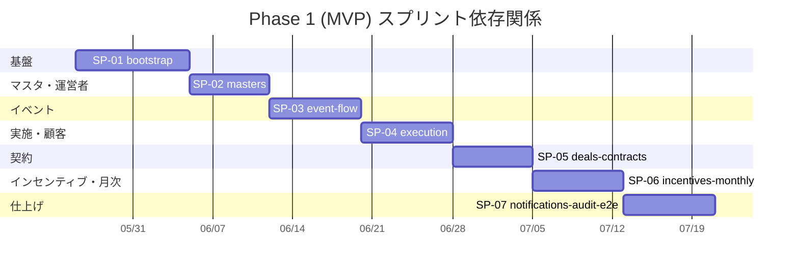

# 開発計画 — 太陽光卸・二次店営業管理 SaaS

本書は `docs/01-business-requirements.md`（業務要件）/ `docs/02-functional-requirements.md`（機能要件 F-001〜F-058）/ `docs/03-tech-selection.md`（技術選定）/ `docs/04-ui-design.md`（画面 S-001〜S-085）/ `docs/05-program-design.md`（プログラム設計）を統合し、Phase 1 (MVP) 〜 Phase 4 のロードマップ、スプリント分解、依存関係、リスク、意思決定ログを定める。`pm` エージェントの計画モード成果物。

---

## 1. 目的

このプランで達成すること：

- **MVP (Phase 1) を 1〜2 か月で本番投入** し、デザインパートナー卸業者 1 社で実運用に乗せる。
- **F-001〜F-053 + F-055 + F-056（P0/P1 = 55 機能、内訳: P0 52 機能 + P1 3 機能（F-005, F-016, F-056））** を 7 スプリントで実装する。
- **タスク粒度を programmer エージェントが 1〜2 ループで完了できるサイズ（1〜3 ファイル変更）** に分解し、`/iterate` ループを安定運用する。
- 各スプリント末に **pm 完了確認モード** で機械的に検証し、未消化を次スプリントへ持ち越さない。
- Phase 2 以降（LINE 連携 F-054 / CSV F-057 / 高度 BI F-058）は **MVP では明示的にスコープ外** とし、本書 §3.2 / §3.3 にロードマップを記載する。

---

## 2. マイルストーン

開発体制は「設計フェーズ完了済み + 実装担当 1〜数名」を想定。週単位で粗くマイルストーンを置く。

| フェーズ | 期間目安 | 終了条件 | 主要成果物 |
|---|---|---|---|
| **Phase 0** 設計 | 完了済み (2026-05-23) | docs/01〜05 + wireframes/ が APPROVED | `docs/01-05`, `docs/wireframes/`, `docs/dev-plan.md`, `docs/sprints/SP-01〜07` |
| **Phase 1** MVP 実装 | 2026-05-26 〜 2026-07-25 (約 8 週) | F-001〜F-053 + F-055 + F-056 が本番稼働、UC-01〜UC-05 が E2E green、パイロット卸業者 1 社が本番投入可能 | 動作する本番アプリ、Railway prod 環境、Playwright E2E スイート |
| **Phase 2** LINE / CSV / BI 強化 | 2026-07-28 〜 2026-11-21 (約 4 か月) | F-054 LINE / F-057 CSV / F-058 高度 BI 投入、PWA 化、画像サムネイル、Better Uptime | LINE 通知配信、CSV インポート UI、強化された BI ダッシュボード |
| **Phase 3** 機能拡張 | 〜 2027-05 | パイロット運用結果を反映した機能拡張、5〜10 社へ展開、施工業者向け簡易画面、補助金 API 連携 | プラン拡張、施工業者ポータル |
| **Phase 4** 課金・スケール | 2027-05 以降 | 規模別プラン制課金 (Stripe/Paddle)、請求書 PDF、メーカー発注、マルチクラウド検討 | Stripe 統合、`@react-pdf/renderer` 帳票 |

**Phase 1 の週次ブレークダウン（粗い目安、変動可）**：

| 週 | 主要スプリント | 主要マイルストーン |
|---|---|---|
| W1 | SP-01-bootstrap | モノレポ初期化、Prisma スキーマ初版、Auth.js v5 + 2FA、Railway 起動 |
| W2 | SP-01 完了 → SP-02 開始 | RLS + テナント拡張、シード、SaaS 運営者画面、マスタ管理着手 |
| W3 | SP-02 完了 → SP-03 開始 | マスタ全機能、場所提供元対応、イベント候補登録・公開 |
| W4 | SP-03 完了 → SP-04 開始 | 二次店希望提出、開催体制決定、シフト割当 |
| W5 | SP-04 完了 → SP-05 開始 | イベント実施・報告、顧客・アポ・マエカク |
| W6 | SP-05 完了 → SP-06 開始 | 商談・契約・契約明細スナップショット・粗利計算 |
| W7 | SP-06 完了 → SP-07 開始 | インセンティブ・キャンセル処理・月次集計・確定 |
| W8 | SP-07 完了 | 通知・監査ログ・E2E グリーン化・本番投入 |

---

## 3. スプリント一覧

`docs/05-program-design.md §14` の「実装順序の推奨」を踏襲しつつ、テナント基盤 (Auth + RLS) を Sprint 1 に固める方針（docs/03 §16 申し送り）。

### 3.1 Phase 1 (MVP) スプリント

| スプリント ID | 名前 | 期間目安 | 主要対応機能 ID | 成果物 |
|---|---|---|---|---|
| **SP-01** | bootstrap (基盤) | W1〜W2 (約 10 営業日) | F-001〜F-010 + 共通基盤 | モノレポ、Prisma スキーマ初版、Auth.js v5 + 2FA + 失敗ロック、RLS + Prisma extension、Railway デプロイ、Sentry/pino/UptimeRobot、シード、graphile-worker 起動 |
| **SP-02** | masters (マスタ管理 + SaaS 運営者) | W2〜W3 (約 7 営業日) | F-004, F-005, F-011〜F-016 | 場所提供元 / 商品（適用期間履歴）/ 施工業者 / インセンティブ率 / 卸業者設定 (キャンセル期限・年度開始月) / SaaS 運営者画面 |
| **SP-03** | event-flow (場所取り〜開催体制) | W3〜W4 (約 8 営業日) | F-017〜F-026 | 場所提供元対応、イベント候補登録・公開、二次店希望提出・状況確認、開催体制決定、イベント単位スコープ上書き、自社シフト |
| **SP-04** | execution (イベント実施 + 顧客 + マエカク) | W4〜W5 (約 8 営業日) | F-027〜F-037 | 配属イベント、開始/終了/成果報告、顧客登録（PII マスキング）、アポ管理、マエカク管理・結果連絡・二次店確認 |
| **SP-05** | deals-contracts (商談〜契約〜粗利) | W5〜W6 (約 7 営業日) | F-038〜F-042, F-044, F-045 | 商談・クロージング、契約登録、契約明細スナップショット、粗利計算、施工管理、補助金申請管理 |
| **SP-06** | incentives-monthly (インセンティブ〜月次) | W6〜W7 (約 8 営業日) | F-043, F-046〜F-051, F-056 | インセンティブ自動計算、共同開催手動調整、キャンセル取消／負調整、月次集計（graphile-worker cron）、月次報告コメント・確定、BI ダッシュボード |
| **SP-07** | notifications-audit-e2e (通知 + 監査ログ + 仕上げ) | W7〜W8 (約 8 営業日) | F-052, F-053, F-055 + 横断 | アプリ内通知 / メール通知 / 監査ログ、UC-01〜UC-05 の Playwright E2E、Sentry アラート、本番投入リハーサル |

**MVP スコープ機能 ID リスト**（55 機能、内訳: F-001〜F-010 = 10 + F-011〜F-016 = 6 + F-017〜F-026 = 10 + F-027〜F-037 = 11 + F-038〜F-051 = 14 + F-052/F-053/F-055/F-056 = 4、すべて P0 または P1）：
F-001, F-002, F-003, F-004, F-005, F-006, F-007, F-008, F-009, F-010,
F-011, F-012, F-013, F-014, F-015, F-016,
F-017, F-018, F-019, F-020, F-021, F-022, F-023, F-024, F-025, F-026,
F-027, F-028, F-029, F-030, F-031, F-032, F-033, F-034, F-035, F-036, F-037,
F-038, F-039, F-040, F-041, F-042, F-043, F-044, F-045, F-046, F-047,
F-048, F-049, F-050, F-051,
F-052, F-053, F-055, F-056

**Phase 2 以降スコープ（MVP 対象外）**：F-054 (LINE), F-057 (CSV インポート), F-058 (高度 BI)

### 3.2 Phase 2 想定タスク（粗いプレースホルダ）

- LINE Messaging API 連携 (F-054)、graphile-worker タスク `notification.send_line` を有効化
- CSV/Excel インポート (F-057): 顧客 / 関係 / 商品マスタ / 契約履歴
- 画像サムネイル `media.generate_thumbnail` (sharp)
- BI 強化 (F-056 / F-058): ピボット・ドリルダウン
- PWA 化（manifest + service worker）、Better Uptime / BetterStack Logs

Phase 2 のスプリント分解は MVP 完了後、パイロット運用フィードバックを反映してから別途分解する。

### 3.3 Phase 3 / 4 概要

- **Phase 3**: 施工業者向け簡易画面、補助金 API 連携（あれば）、外部 BI 連携、5〜10 社展開対応
- **Phase 4**: Stripe / Paddle 課金統合、`@react-pdf/renderer` 帳票、マルチクラウド (AWS App Runner / GCP Cloud Run) 移行検討

---

## 4. 依存関係

**主な依存ルール**：

- **SP-01 → 全後続**: テナント分離（Prisma extension + RLS）が完成しないと後続の RLS 検証が成立しない。
- **SP-02 → SP-03**: 場所提供元マスタ・商品マスタ・キャンセル期限設定が完成していないと、イベント候補や契約のフローを組み立てられない。
- **SP-03 → SP-04**: 開催体制決定とイベント生成が前提でないと、イベント実施・報告が紐付かない。
- **SP-04 → SP-05**: 顧客・アポ・商談が前提でないと、契約登録の起点が成立しない。
- **SP-05 → SP-06**: 契約明細スナップショットと粗利計算が完成していないと、インセンティブ計算 (F-046) が成立しない。
- **SP-06 → SP-07**: 通知・監査ログは横断機能だが、各業務機能のフックポイント（契約成立通知・キャンセル監査など）を最後に集約・検証する。
- **SP-07 末** で `pm` 完了確認モードを Phase 1 全体に対して走らせ、`## PHASE_COMPLETE` を確認してから本番投入する。

並列化の余地：UI コンポーネント実装と Server Action 実装は同一スプリント内で並列可能だが、**1 タスクは 1 イテレーションで完結** するため、タスク間の並列ではなく担当者間の並列で吸収する。

---

## 5. リスクと緩和策

docs/01 §10 のビジネスリスクに加え、Phase 1 実装フェーズ固有のリスクを列挙する。

| リスク | 影響 | 緩和策 | 担当スプリント |
|---|---|---|---|
| **Auth.js v5 が beta のため API 変更リスク** | 認証フローの再実装 | 固定版 (`5.0.0-beta.25` 等) を pin して採用、`packages/auth/` に薄ラッパで隔離（移行は 1 ファイル変更で完結） | SP-01 |
| **Prisma extension + PostgreSQL RLS の連携複雑性** | テナント分離崩壊リスク（漏洩 / 過剰フィルタ） | SP-01 で `getTenantContext` + `withTenant` + RLS ポリシーを完成し、Vitest で「他テナントデータが返らない」テストを 5 件以上書く | SP-01 / SP-07 |
| **pgBouncer × `SET LOCAL` の運用相性 (docs/05 §15-5)** | RLS が無効化される可能性 | Railway 標準は session mode を採用、transaction mode へ移行する場合は `directUrl` を使用。SP-01 で検証 | SP-01 |
| **MVP 期間 (8 週) で 55 機能完成のスケジュールリスク** | 後ろ倒し、品質低下 | 機能ごとミニマム実装に統一（一覧 + 検索 + ステータス + 詳細）。複雑画面は SP-06 / SP-07 でリファイン | 全スプリント |
| **共同開催インセンティブ手動調整の業務ヒアリング不足 (docs/01 §10)** | 計算不能、月次クローズ遅延 | SP-06 で「手動調整 UI + 下書き値（卸粗利 × 関係率）+ 監査ログ」のみ提供。規則化は Phase 2 へ送る | SP-06 |
| **個人情報マスキング仕様の運用ミス** | 法令違反、信用失墜 | SP-04 で `MaskingService` を純関数化、Vitest でロール × フィールドのマトリクステストを書く。メール本文・監査ログ表示は強制マスク | SP-04 / SP-07 |
| **graphile-worker の月次バッチが 5 秒を超える** | 月次集計タイムアウト | SP-06 で raw SQL 化、100 二次店 / 1,000 契約のシードデータで負荷検証 | SP-06 |
| **R2 + 契約書 PDF（7 年保持）の保管コスト不明** | 将来コスト増 | SP-05 で R2 アップロード経路を完成、ライフサイクルポリシーは Phase 2 で検討 | SP-05 |
| **Resend 無料枠 (3,000 通/月) を超過** | メール送信停止 | SP-07 で配信ボリュームを計測、Pro プラン ($20/月) への切替判断基準を Sentry / 監視ダッシュボードに組込 | SP-07 |
| **キャンセル後負調整ロジックのヒアリング不足 (docs/01 §10)** | 計算誤り | SP-06 で「期限内取消」は自動、「期限後負調整」は手動入力 + 監査ログとして MVP 実装。パイロット運用 1 件発生後に自動化判断 | SP-06 |
| **二次店ロールへの仕入値漏洩リスク** | 卸業者の機密情報流出 | SP-02 で Prisma `select omit` + DTO 変換を実装、SP-07 の E2E で「二次店 API レスポンスに `purchase_price` が含まれない」テスト | SP-02 / SP-07 |
| **設計フェーズ完了時 Open Questions 残置 (docs/05 §15)** | 仕様の揺れ | SP-01 開始時に意思決定ログ（本書 §6）に転記し、該当スプリント内で確定する。確定不能なら本書 §7 へ TBD として再登録 | 全スプリント |
| **E2E flakiness（並列実行下の Next.js dev cold-compile / seed spawn race / strict-mode violation）** | 完了確認モードで本来 green の機能が間欠的に赤化、リリースゲート遅延 | SP-02 完了時点で 7 spec が並列実行下で間欠失敗（Next.js dev server saturation、seed race、strict-mode violation）。SP-02 内で `workers: 1` + `globalSetup` seed + selector 改善で解消。今後 SP-03 以降の E2E 追加時は本ポリシーを継承し、並列 worker は 1 に固定する。 | SP-02 / 全スプリント |

---

## 6. 意思決定ログ

主要な判断と日付を時系列で記録。新たな決定が出るたびに追記。

| 日付 | 決定事項 | 根拠 | 担当 |
|---|---|---|---|
| 2026-05-23 | **MVP スコープを F-001〜F-053 + F-055 + F-056（55 機能（P0 52 + P1 3）、P0/P1）に固定**。F-054 / F-057 / F-058 は Phase 2 以降。 | docs/02 §9 申し送り、docs/01 §7.1 (1〜2 か月で本番投入) | pm |
| 2026-05-23 | **Sprint 1 (bootstrap) でテナント分離基盤 (Auth + RLS + Prisma extension) を完成させる**。後続スプリントが並列化できる前提条件。 | docs/03 §16 申し送り、docs/05 §14-1 | pm |
| 2026-05-23 | **共同開催インセンティブの規則化は MVP では行わない**。手動調整 UI + 監査ログのみ提供 (F-047)。 | docs/01 §9.7、docs/02 §7-Assumption 3、docs/05 §15-3 | pm |
| 2026-05-23 | **2FA は TOTP (Authenticator アプリ) のみで MVP 投入**。SMS / メールワンタイムは Phase 2 で再評価。 | docs/03 §4.1、docs/02 §8-OQ-1 | pm |
| 2026-05-23 | **個人情報マスキング MVP デフォルト: 電話下 4 桁・住所市区町村まで・氏名は姓のみ**。`WholesalerSettings.piiMaskingMode` で上書き可能。 | docs/03 §4.3、docs/05 §6.5 | pm |
| 2026-05-23 | **キャンセル期限デフォルト 8 日（特商法準拠）、卸業者ごとに `WholesalerSettings.cancelDeadlineDays` で上書き可**。契約に `cancelDeadline` をスナップショット、F-015 設定変更は遡及しない。 | docs/01 §9.2、docs/02 §F-015 受け入れ基準 | pm |
| 2026-05-23 | **スプリント順序を docs/05 §14 に準拠**: bootstrap → masters → event-flow → execution → deals-contracts → incentives-monthly → notifications-audit-e2e。 | docs/05 §14、docs/03 §16 申し送り | pm |
| 2026-05-23 | **Phase 1 期間目安を 8 週間 (W1〜W8) とし、各スプリント 7〜10 営業日**。実装担当 1〜数名想定。 | docs/01 §3.2 (MVP 1〜2 か月) | pm |
| 2026-05-23 | **E2E テストは UC-01〜UC-05 を最優先で SP-07 にて実装**。各スプリントでも該当機能の E2E スモークを作成。 | docs/05 §11.3、docs/02 §3 ユースケース | pm |
| 2026-05-23 | **graphile-worker は SP-01 で起動 + Resend / R2 接続確認 + Sentry 配線まで実施**。月次集計実装は SP-06。 | docs/05 §14-1 | pm |
| 2026-05-25 | **Playwright の並列 worker を 1 に固定（`workers: 1` + `fullyParallel: false`）**、`pnpm db:seed` は `globalSetup` で 1 回だけ実行する。SP-02 完了確認で 7 spec が並列実行下で間欠失敗（Next.js dev server cold-compile 飽和、seed spawn race、strict-mode violation）したため。SP-03 以降の新 spec も本ポリシーを継承する。 | SP-02 完了確認 E2E 出力、docs/sprints/SP-02-masters.md §7 申し送り | programmer |

---

## 7. TBD（次の判断ポイント）

設計フェーズで未確定だった事項のうち、実装フェーズ中に確定すべきもの。担当スプリントを明示する。

1. **RLS と pgBouncer の運用方式** (docs/05 §15-5) → SP-01 で検証。Railway デフォルト + `directUrl` 戦略を確定。
2. **負調整 UI の独立画面要否** (docs/05 §15-2) → SP-06 で S-050 内タブで十分か実装時判断。独立画面が必要なら本書を改訂し画面 ID を追加。
3. **共同開催インセンティブの自動分配ロジック** (docs/05 §15-3) → MVP は手動。Phase 2 でパイロット運用 2〜3 か月後に再評価。
4. **月次アンロック権限** (docs/05 §15-4) → SP-06 で `wholesaler_admin` 単独可とする方針で実装。`saas_admin` 共認が要件化されれば改訂。
5. **NotificationService の dedupKey 命名** (docs/05 §15-6) → SP-07 で `${type}:${userId}:${targetId}` を採用、必要に応じ type 毎に許可。
6. **Sentry の PII フィルタ** (docs/03 §14-6) → SP-07 で `beforeSend` 設定を実装、電話・住所を匿名化。
7. **データ保持期間** (docs/01 §11-10) → 監査ログ 3 年は仮置き、Phase 2 で法務確認後に確定。
8. **規模別プラン定義** (docs/01 §11-1) → MVP では未確定のままパイロット運用、Phase 2 で確定。
9. **Resend 配信ドメイン戦略** (docs/03 §14-3) → SP-07 でパイロット卸業者 1 社のみ運用、共通 `noreply@solar-saas.app` で開始。

---

## 8. 変更履歴

| 日付 | 変更内容 | 担当 |
|---|---|---|
| 2026-05-23 | 初版作成。Phase 0 完了に基づき Phase 1 (MVP) を 7 スプリントに分解。SP-01〜SP-07 のファイル群を `docs/sprints/` に生成。意思決定ログ 10 件、リスク 12 件、TBD 9 件を記録。 | pm |
